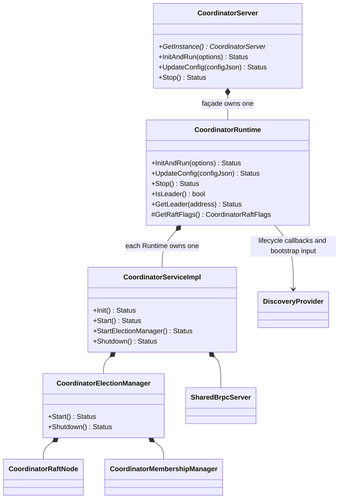
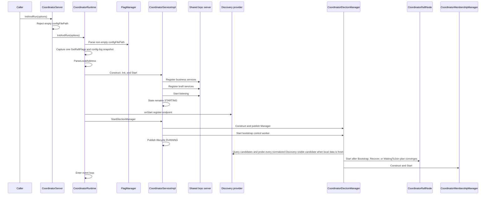

# Coordinator Election Product Lifecycle Design

## Status

The approved implementation consists of a non-singleton `CoordinatorRuntime`, a singleton `CoordinatorServer` façade, two-stage `CoordinatorServiceImpl` startup, Service-owned braft registration, and Manager-owned bootstrap/Node/Membership lifecycle. Dedicated single-Service, in-process multi-Runtime, and multi-process STs cover complementary integration boundaries.

## Goals

1. Allow independent Coordinator lifecycle instances in one process through `CoordinatorRuntime`.
2. Preserve the singleton `CoordinatorServer` public façade for compatibility.
3. Register business and braft services on one Service-owned brpc server before election startup.
4. Register the local endpoint through the Runtime callback before bootstrap Discovery is queried.
5. Keep Service lifecycle readiness distinct from Leader-only business readiness while bootstrap, recovery, or waiting-to-join remains active.
6. Keep Stop, event-loop wakeup, service ownership, and leader queries instance-local.
7. Drain Membership, Node, and shared-server resources in strict ownership order.
8. Keep bootstrap diagnostics wire-compatible and sanitized to phase plus stable numeric status code.
9. Keep default tests deterministic and below the repository's 8-second limit.

## Component Boundary



`CoordinatorRuntime` is the reusable internal lifecycle abstraction. `CoordinatorServer` is the production singleton façade and owns one Runtime. `CoordinatorOptions` contains a config file path, shared Discovery provider, expected member count, and paired lifecycle callbacks. The façade requires a non-empty path; file access, parsing, and flag validation belong to `FlagManager` and Runtime startup. The Runtime owns one `DynamicFlagConfig` and one `DynamicConfigUpdater`; its public `UpdateConfig` façade accepts string-valued JSON only after the Service, lifecycle callback, and election manager have started and serializes each update with `Stop()`. Its role-specific capability list contains only the three log-sampler rates because their consumers use atomically published `LogSampler` snapshots. Snapshot-only and unsynchronized flags such as `node_dead_timeout_s` are rejected rather than reporting a partially effective update. Local endpoint, exclusive Raft data root, user-facing Raft heartbeat/election/Discovery/member-failure timing, and internal membership timing come from one `GetRaftFlags()` snapshot per Runtime startup.

## Startup Sequence



The production façade validates only that `configFilePath` is non-empty, then delegates to its owned Runtime. Runtime passes a non-empty path directly to `FlagManager::ParseConfigFile`; parse failures return the `K_INVALID` error built from the configured path and parser message. After parsing succeeds, Runtime captures exactly one `GetRaftFlags()` snapshot and one config-log snapshot, then preserves the established `ParseLocalAddress -> Service construct/Init/Start -> publish Service -> callbacks -> StartElectionManager` order.

Direct empty-path Runtime startup is reserved for internal in-process tests. It skips parsing and consumes common process flags prepared by the fixture. The fixture sets those flags before launching any Runtime, never mutates them while a Runtime is active, and restores them only after every Runtime stops and joins. Each Runtime override supplies its endpoint, exclusive data root, and timing through `GetRaftFlags()`. Production supports one Coordinator Runtime per process. A `CoordinatorRuntime` instance is one-shot by interface contract; callers must create a new Runtime instance to retry after any return.

`CoordinatorServiceImpl::Start()` owns the shared-server generation. It registers the Coordinator business adapter and calls `RegisterCoordinatorRaftServices`, starts listening, and returns while the election-enabled Service remains `STARTING`. Node and Manager APIs do not expose registration.

`CoordinatorServiceImpl::StartElectionManager()` reserves one non-retryable attempt under its lifecycle mutex, constructs and publishes the Manager, releases the mutex while starting its background bootstrap control, then reacquires it to publish Service `RUNNING`. `RUNNING` therefore means the endpoint is active and the Manager worker is owned and started, not that election or business readiness has completed. The Manager can accept `ExchangeBootstrapObservation` while Raft startup is still waiting. Business RPCs remain `K_NOT_READY` until braft calls `onLeaderStart`; every follower or waiting node stays gated. On synchronous startup failure, the endpoint remains listening and the Manager is detached for ordered cleanup. Concurrent Shutdown waits for an in-progress attempt to publish completion before teardown.

## Bootstrap And Membership Policy

Fresh bootstrap has two explicit modes selected by `CoordinatorRuntime`, not inferred from the Discovery implementation.
SO-integrated startup through `CoordinatorOptions` uses `DISCOVERY_OBSERVATION`: it requires one complete, stable
`expectedMemberCount = N` view. Discovery supplies RPC targets only; it does not directly select the initial
configuration. Every Coordinator sends `ExchangeBootstrapObservation` every 100 ms with a 100 ms timeout. The receiver
timestamps valid requests with its local monotonic clock, and observations remain active for one second. RPC responses
do not refresh that inbound-observation timestamp.

Dscli startup with `coordinator_raft_initial_peers` uses `STATIC_INITIAL_PEERS`. The normalized complete static list is
the immutable `BootstrapPlan`; no observation Exchange is sent or accepted. All processes therefore derive the same
configuration without reachability-dependent selection. For five configured peers, any three started processes can
form the braft majority and elect a Leader even while the other two are absent.

`RaftBootstrapObservationPb` carries only sender, expected count, peers, phase, and committed peers. In `OBSERVING`,
`peers` is the sender's current active view. In `PROPOSED`, and in `STARTED` after fresh bootstrap, `peers` is the
immutable full bootstrap plan. A recovered `STARTED` process has no frozen fresh plan and leaves `peers` empty; its
possibly transient `N + 1` committed configuration remains in `committed_peers`. The receiver validates sender and
target identity, then stores only normalized decision fields plus local `lastSeen`; wire identity fields are not
duplicated in the stored value.

A fresh node may freeze a plan only when its active set contains exactly `N` peers, every remote record is active, and
every member reports that same complete set. The complete view must remain unchanged for one second. Discovery entries
are only outbound probe targets. Each round concurrently probes at most `N` targets, prioritizing active peers and
rotating through the remaining entries, so unreachable residual entries cannot make round latency proportional to the
Discovery list. Valid successful responses are recorded as observations as well as valid inbound requests. The node then
freezes the sorted full set, enters `PROPOSED`, and never recalculates or resets the plan. It starts braft only after all
`N` members have sent `PROPOSED` or fresh-bootstrap `STARTED` with exactly that plan. Plan conflict is fail-closed.

| Observation | Plan or action |
| --- | --- |
| valid local Raft metadata | `RecoverPlan` without first-bootstrap Discovery |
| corrupt or unknown local metadata | terminal fail-closed state with the endpoint diagnostic but non-serving |
| dscli static initial peers | start braft with the complete normalized static list; do not exchange observations |
| Discovery returns more than `N` endpoints, with unreachable residual entries | probe every endpoint; ignore individual probe failures and decide from active inbound observations |
| fewer or more than exactly `N` active inbound observations | retry; do not freeze a plan or create a Node |
| one or more members report a different view | reset only the pre-proposal stability timer and retry |
| one complete view remains unchanged for one second | freeze the sorted full `N`-peer plan and publish `PROPOSED` |
| fewer than all `N` members publish the same frozen plan | retry without changing the local frozen plan |
| all `N` active members publish the same frozen plan | start braft with the complete `N`-peer configuration |
| a different frozen plan is observed | fail closed; do not change proposal and do not call `reset_peers` |
| one quorum-confirmed valid non-empty committed configuration excludes local `ABSENT` endpoint | `WaitingToJoinPlan` |
| one quorum-confirmed valid non-empty committed configuration includes local `ABSENT` endpoint | `BootstrapPlan` with the full authoritative peer list to rebuild local election/membership metadata |
| observed committed configurations have no member quorum, or quorum-confirmed configurations conflict | retry with `K_NOT_READY` until one normalized configuration reaches its own member quorum |

After braft successfully initializes a non-empty `BootstrapPlan`, the Node publishes `STARTED`. Only braft configuration callbacks update the local committed-membership snapshot. Bootstrap observation state is process-local and ephemeral; durable Raft metadata and quorum-confirmed committed configuration remain authoritative across restart.

Committed configuration B is the only membership authority. Before reading B or generating policy, the Manager skips the reconciliation round while `CoordinatorRaftNode` reports an in-flight membership operation. The Node admits at most one Add/Remove through the same operation token used for shutdown drain; braft publishes committed configuration before completion releases that token, so the next admitted reconciliation rebuilds its decision from the new Leader/term, committed B, and follower health. A concurrent submission returns `K_TRY_AGAIN`, while `discoveryRetryInterval` bounds repeated Manager submissions after failed completion. Add/Remove completion callbacks remain diagnostic-only and capture no Manager state.

| Committed state | Membership action |
| --- | --- |
| `B.size() < N` | Discover and add one eligible candidate; remove no committed member. |
| `B.size() == N` without confirmed failure | Perform local health polling and do not call Discovery. |
| `B.size() == N` with confirmed failure | Discover and submit one replacement candidate. |
| `B.size() > N` with confirmed failure | Remove the exact confirmed failed peer. |
| `B.size() > N` after failed-peer recovery | Remove only the exact committed candidate proven to belong to the current replacement intent. |
| unexplained `B.size() > N` | Fail closed without removal. |

Candidate selection prefers candidates never attempted in the current Discovery set, then the candidate with the oldest Add-attempt timestamp, using normalized identity as the deterministic tie-break. Replacement intent records the failed peer, original committed peers, and candidates whose Add submission synchronously succeeded. A committed over-target difference is rollback-owned only when it is exactly one of those attempted candidates; rejected or throwing submissions establish no ownership.

Immediately before Add/Remove submission, the Manager fetches fresh status and requires unchanged leadership, term, configuration index, committed peers, known quorum, failed-peer policy, and rollback ownership. A stale decision returns `K_TRY_AGAIN` without submission. Lifecycle is rechecked before Discovery and before mutation submission, so shutdown cannot admit new external work after an in-flight status query returns.

In observation mode, `CoordinatorElectionManager` owns one `RaftBootstrapState` under `bootstrapMutex_`. It contains per-peer normalized observation plus local receive time, the current one-second consistent-view candidate, the optional frozen plan, local committed peers, and phase. The current active view is derived from unexpired map entries plus the local address rather than stored twice. No RPC, Discovery call, wait, Node lifecycle call, or external callback runs while `bootstrapMutex_` is held.

`GetRaftBootstrapState` is replaced in its service-method slot by `ExchangeBootstrapObservation`; old and new Coordinator binaries therefore cannot participate in a rolling mixed-version bootstrap. This change requires full-version Coordinator rollout. Existing later service method indexes remain unchanged.

## Shutdown Sequence

```mermaid
sequenceDiagram
    participant C as Caller
    participant R as CoordinatorRuntime
    participant D as Discovery provider
    participant S as CoordinatorServiceImpl
    participant E as CoordinatorElectionManager
    participant M as CoordinatorMembershipManager
    participant N as CoordinatorRaftNode
    participant P as Shared brpc server

    C->>R: Stop
    R->>R: Wake this instance's event loop
    R->>D: onStop schedules delayed unregister
    Note over D: Endpoint remains discoverable for 10 seconds
    R->>S: Shutdown
    S->>S: Lock; wait election startup completion
    S->>S: Become owner, release-store STOPPING, move Manager
    S->>E: Unlock Service; Shutdown
    E->>M: Stop and destroy
    E->>N: Drain and destroy
    S->>P: Stop and join without lifecycle mutex
    S->>S: Destroy adapter/components without lifecycle mutex
    S->>S: Reacquire lifecycle mutex; publish STOPPED/result and notify waiters
    R-->>C: InitAndRun returns
```

The Runtime invokes `onStop` once after an attempted `onStart` and before Service shutdown. Delayed unregister is provider callback semantics: the callback records expiry and returns without sleeping; a later provider query removes expired endpoints.

`ICoordinatorDiscovery::GetCoordinators` is synchronous and providers must return within a finite provider-controlled bound. Manager shutdown observes its stop request only between synchronous calls and joins after an in-flight call returns, so a provider that violates this contract can block Manager and Service shutdown.

Public Service shutdown has one cleanup owner. Under the lifecycle mutex it first waits for any election startup attempt to publish completion, then release-stores `STOPPING` and transfers `electionManager_` to owner-local storage. The owner releases the mutex before Manager shutdown requests and joins bootstrap control, then stops Membership and drains Node, so a Discovery callback reentering `GetLeader()` acquires the Service mutex and returns `K_SHUTTING_DOWN` without waiting for Manager completion. Still without the lifecycle mutex, the owner stops and joins the shared brpc server, destroys the adapter, and cleans up the remaining components. It reacquires the mutex only to publish `STOPPED`, save the first cleanup status, and notify waiters. Concurrent or repeated public shutdown callers wait for completion and return the same saved status; they never run an overlapping cleanup stage. Lock-held `Init()`/`Start()` failure cleanup may still use the internal Manager-capable path because no successful external Membership lifecycle is running there, and it preserves the initiating startup error.

## State And Concurrency Model

| State/resource | Owner | Protection and lifetime |
| --- | --- | --- |
| Runtime stop and lifecycle state | Each `CoordinatorRuntime` | Runtime mutex protects callbacks, Service ownership, and stop state; `Stop()` wakes only that instance. `InitAndRun` is one-shot by interface contract, so callers must not invoke it concurrently or more than once on the same Runtime. |
| Runtime dynamic-config state | Each `CoordinatorRuntime` | Dedicated config mutex protects `NOT_READY`/`READY`/`STOPPING`, the updater, and its referenced flag-config lifetime. The role filter admits only atomically published sampler configuration. Accepted updates finish before `Stop()` closes admission; later updates return `K_SHUTTING_DOWN`. Lifecycle failures are audited without request payloads. |
| Common process flags | Production caller or test fixture | Production starts one Runtime per process through `CoordinatorServer`. In-process tests set shared flags before launch, do not mutate them while any Runtime is active, and restore them only after every Runtime stops and joins. Concurrent flag mutation is outside the supported contract. |
| Per-instance Raft startup values | Each `CoordinatorRuntime` | One `GetRaftFlags()` snapshot per attempt isolates endpoint, data root, and election timing before local-address parsing and Service construction. |
| Lifecycle callbacks | Each Runtime | Moved exactly once from Runtime-owned `std::function`; invoked without the Runtime mutex. |
| Shared Discovery mock state | Discovery provider | One shared registration-state mutex protects the ordered endpoint set, generation ownership, pending expirations, virtual time, callback history, and barrier state. Each no-argument provider keeps its own failure/fixed-snapshot behavior and query count while optionally sharing registration state; caller-specific snapshots are digest-mismatch fault injection, not a normal convergence claim. |
| Service readiness and public shutdown result | `CoordinatorServiceImpl` | Lifecycle mutex protects startup/shutdown coordination, cleanup ownership, and the saved first cleanup status; atomic serving state release-publishes `STOPPING` before Manager drain begins and `STOPPED` after remaining cleanup. |
| Shared brpc server generation | `CoordinatorServiceImpl` | Outlives Manager destruction and its lock-free Membership/Node drain; the cleanup owner stops and joins it without the lifecycle mutex before adapter/component cleanup. |
| Bootstrap snapshot/worker, Node, and Membership | `CoordinatorElectionManager` | Bootstrap mutex protects the diagnostic snapshot and worker stop/wakeup state; lifecycle mutex protects published Node/Membership ownership. `TERMINAL` is one-way, and the final ownership/`STARTED` transition follows lifecycle mutex then bootstrap mutex. Neither lock is held while stopping or destroying components. Shutdown joins bootstrap control, then stops Membership before Node. |
| Runtime thread | Test fixture | Fixture owns Runtime, thread, promise/future, and always stops then joins. |

No Discovery callback is invoked while the Discovery mock mutex is held. Its registration barrier uses a bounded condition-variable wait. Unregister does not sleep; it records `now + 10s`. Test-only virtual time advances expiration without wall-clock waiting.

## Replication And Request Boundary

Coordinator braft currently governs election state and committed voting membership. The Raft state machine rejects management-log apply, and `CoordinatorRaftNode` exposes only `AddPeer` and `RemovePeer`; Coordinator business key/value and topology payloads are not replicated by this Raft group. `CoordinatorServiceImpl::CheckServing()` admits election-mode business RPCs only when the local `raftServing_` gate is open; braft leadership lifecycle callbacks open and close that gate. Consequently, `RUNNING` and bootstrap `STARTED` are lifecycle diagnostics rather than business-readiness signals.

## Identity And Persistence

Each Runtime uses a distinct numeric loopback endpoint and exclusive data root. The endpoint and data/timing values are immutable for that attempt because the Runtime calls virtual `GetRaftFlags()` and captures `CoordinatorRaftFlags` before constructing the Service, including across retries and independent Runtime instances. Production exposes only `coordinator_raft_heartbeat_interval_ms`, `coordinator_raft_election_timeout_ms`, `coordinator_discovery_retry_interval_ms`, and `coordinator_member_failure_grace_ms`; membership health-check and bootstrap retry-warning intervals are internal defaults that tests can override through `CoordinatorRaftFlags`. Fresh roots require a stable full-member observation and a unanimously published frozen plan; valid existing roots recover locally, and quorum-confirmed committed configuration remains authoritative. The persisted old-Leader and follower restart STs relaunch generation 2 with the same endpoint/data root and a generation-specific provider that shares registration semantics with the cluster provider; recovery reaches the valid committed configuration while that provider's Discovery query count remains zero, excluding queries from other running Managers from the assertion. During persisted-follower downtime the original Leader remains serving; after restart any unique Leader is valid if the observed Leader serves successfully, non-Leaders return only readiness-compatible business statuses, and all members expose the committed configuration. Deleting one member's braft data and restarting it in place is not a supported recovery path because an empty local log cannot catch up from a Leader whose first retained entry requires a nonzero previous-log term; see braft issue #340. Container recovery replaces the failed instance, allowing the existing Leader's membership manager to remove the failed peer and add the replacement.

## Validation Surface

| Test | Boundary |
| --- | --- |
| `CoordinatorElectionManagerTest` | Incomplete-view waiting, stable full-view confirmation, candidate-expansion reproduction, static full-peer startup without Exchange, committed-configuration priority, local recovery, and malformed observation rejection. |
| `CoordinatorServerOptionsTest` | Public empty-path rejection, direct Runtime empty-path process-flags startup, non-empty config parsing, malformed-config failure, independent per-instance Raft snapshots, one-shot Runtime contract, ZMQ indexes 7/8/9, and allocator-backed real brpc lifecycle. |
| `CoordinatorServiceElectionTest` | One real Service and one shared business/braft endpoint. |
| `CoordinatorRuntimeElectionTest` | Real Runtimes use empty config paths with stable fixture-owned common flags and per-generation endpoint/data/timing snapshots; covers full-view bootstrap, Discovery failures, observed-Leader serving readiness, persisted restart, bounded quorum-loss stepdown, teardown, and port release. |

`CoordinatorRuntimeElectionTest` starts only real `CoordinatorRuntime::InitAndRun(options)` lifecycles with empty config paths and observes Runtime methods plus real Coordinator business/bootstrap brpc RPCs; it does not construct or start `CoordinatorElectionManager` directly. The fixture owns stable common flags, while only `ICoordinatorDiscovery` views/failures and per-Runtime Raft snapshots are mocked. Each case body has one 6-second deadline; mandatory teardown joins are not claimed to be controlled by that deadline. The quorum-loss case records a separate monotonic deadline immediately after the second member's Stop/join and requires `IsLeader() == false`, `GetLeader() == K_NOT_READY` with an empty endpoint, and business RPC `K_NOT_READY` within at most twice the stopped Leader generation's configured election timeout. Each complete concrete case is bounded by the CTest 8-second timeout.

## Build Contract

- CMake excludes `coordinator_runtime_election_test.cpp` from generic `DS_TEST_ST_SRCS`, builds a dedicated executable, and registers discovered gtests with `TIMEOUT 8`.
- CMake links `test_port_allocator` into `coordinator_server_options_test`; the fixture retains process-safe leases through real brpc Stop/Join. Both focused Manager and Server-options UTs are registered with `TIMEOUT 8`.
- Bazel declares `//tests/st/common/raft:coordinator_runtime_election_test` as a dedicated `ds_cc_test` with `timeout = "short"`; the Manager and Server-options UTs also use `timeout = "short"`, and the latter directly depends on `//tests/st/cluster:test_port_allocator`.
- The focused CTest regex includes `CoordinatorRuntimeElectionTest` so the generated concrete gtest name is selected.
- Tests that call `RegisterCoordinatorRaftServices` directly depend on `coordinator_raft_service`.
