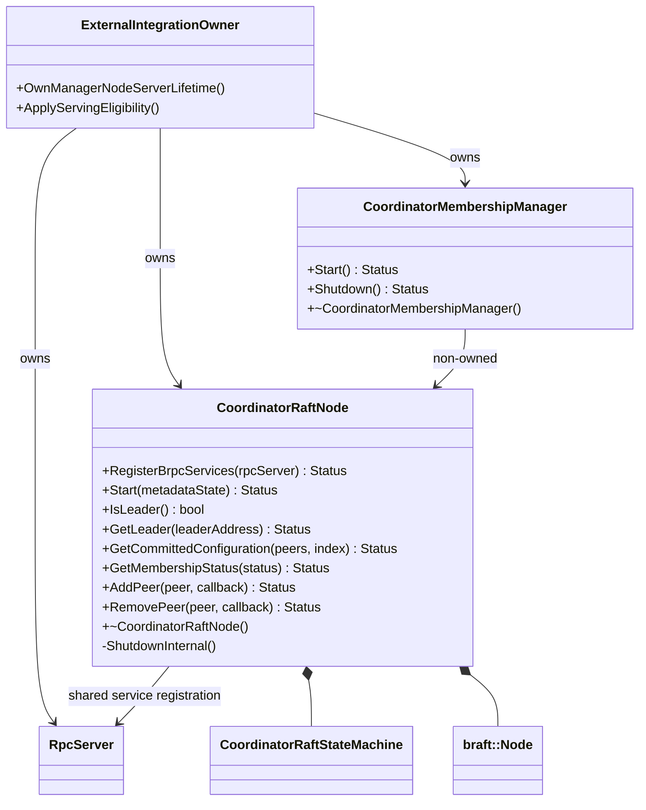
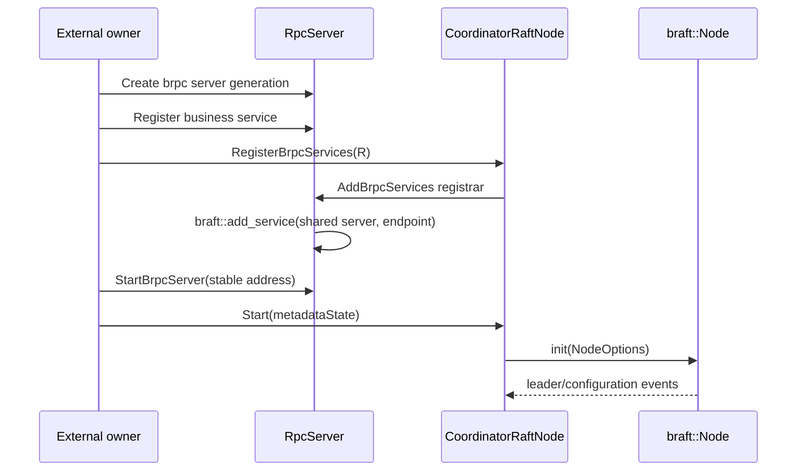
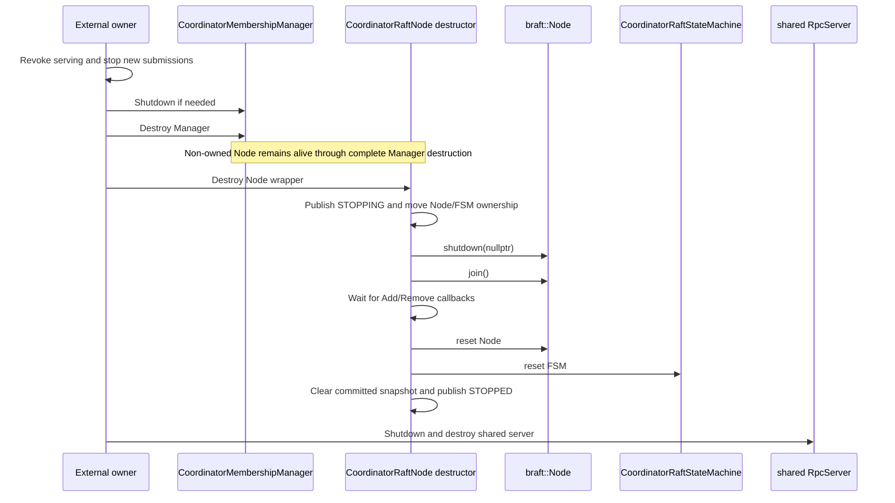
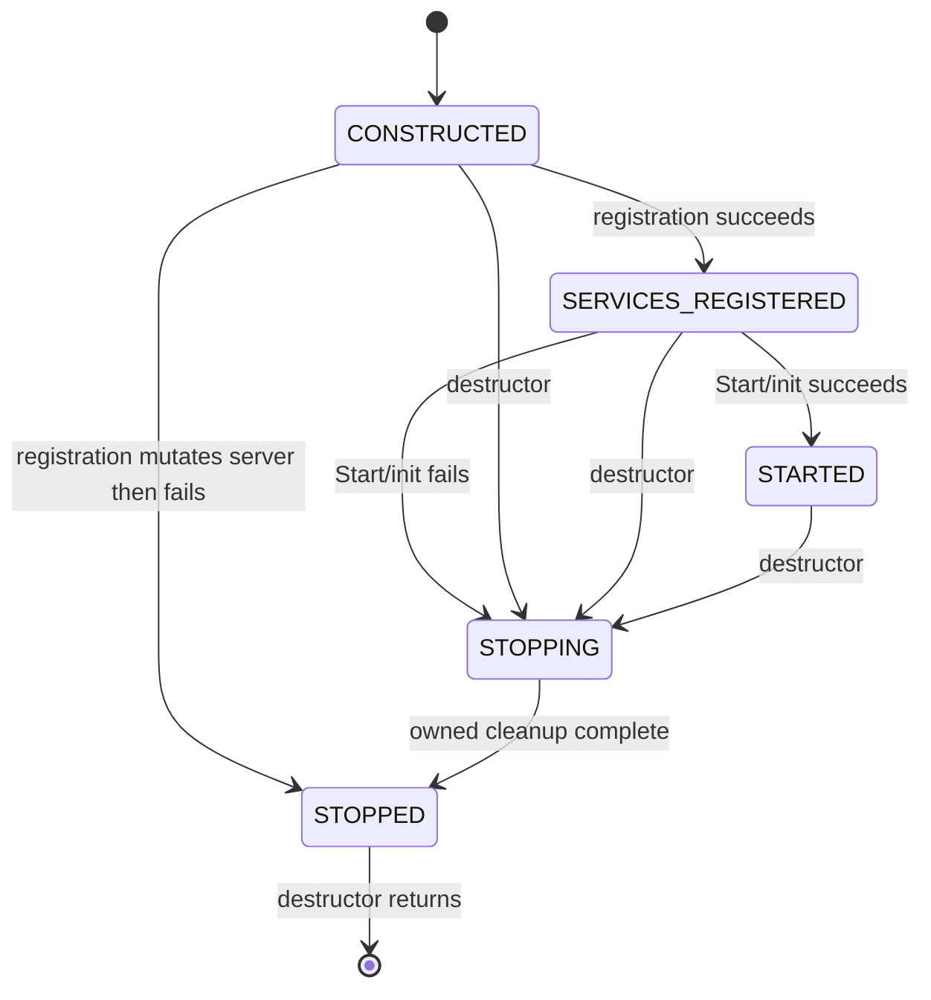

# Coordinator Raft Node And Membership Management Design

## Status

- `CoordinatorRaftNode`, `CoordinatorRaftStateMachine`, and standalone `CoordinatorMembershipManager` are implemented under `src/datasystem/coordinator/raft` with focused UT and real-braft ST coverage.
- Current identity support is stable numeric IPv4/VIP plus fixed port and braft index `0`. Domain-name support is deferred; IPv6 is unsupported.
- CMake keeps braft, the adapter, and Manager under `WITH_TESTS`. `CoordinatorServiceImpl` does not construct them, and there is no production install/package dependency.
- Serving eligibility, Worker reconciliation, product flags/options, and deployment integration remain later work.

## Goals

1. Encapsulate `braft::Node` and `braft::StateMachine` behind one Coordinator-owned Node wrapper.
2. Register braft services on the Coordinator's existing brpc server and stable listen address.
3. map explicit `BOOTSTRAP`, `RECOVER`, and `WAITING_TO_JOIN` plans into fail-closed braft startup.
4. Expose leader observation, committed configuration observation, health observation, and asynchronous single-peer membership operations.
5. Make one external owner solely responsible for Node lifetime, with destruction as the only synchronous close entry.
6. Drain braft and wrapper-owned Add/Remove completion callbacks before destroying borrowed resources in strict Node-before-FSM-before-server order.
7. Keep callbacks non-owning with respect to Node lifetime: callbacks notify the owner but never perform or retain final ownership for teardown.
8. Keep membership policy above the Node, refresh status immediately before submission, and verify every policy transition against committed configuration.

## Non-Goals

1. `CoordinatorRaftNode` does not call `ICoordinatorDiscovery`, choose replacement candidates, or expose equal-size replacement.
2. It does not open a business serving gate, reconcile Workers, or replicate the full `CoordinatorStore`.
3. It does not support planned online scale-out or scale-in.
4. It does not accept domain names or IPv6 as Raft peer identities in this phase.
5. The Node callback/Gate path does not add a callback executor, helper thread, or asynchronous handoff; FSM callbacks remain synchronous on braft's FSM queue. `CoordinatorMembershipManager` still owns one reconciliation thread.
6. It does not support destroying the Node concurrently with startup, queries, or membership submissions.

## Identity Contract

| Item | Contract |
| --- | --- |
| Raft GroupId | Fixed internally to `datasystem-coordinator`. |
| Peer input | Stable numeric `IPv4:port`. |
| braft peer index | Fixed to `0`; not configurable. |
| Public peer output | Normalized `IPv4:port`; internal `:0` is omitted. |
| Stable identity | `stable IPv4/VIP ↔ PeerId ↔ exclusive data directory/PVC`. |
| Domain names | Rejected with `K_INVALID`; compatibility work is deferred. |
| IPv6 | Rejected with `K_INVALID`. |
| Pod IP | Valid only when deployment guarantees stable identity across recovery. |

Recovery on another machine is valid only if the same stable address and exclusive persisted data move together. Resolving a name to a new Pod IP must not silently create a new voting identity.

## Component Boundary



`CoordinatorRaftNode` owns mechanism. `CoordinatorMembershipManager` owns dynamic membership policy and has a non-owned Node reference. `ExternalIntegrationOwner` is a conceptual follow-up integration role, not a currently implemented source class; it will own and order Manager, Node, and shared server lifetimes and apply product serving eligibility.

## Public Node API

```cpp
using RaftOperationCallback = std::function<void(Status)>;

class CoordinatorRaftNode final {
public:
    CoordinatorRaftNode(CoordinatorRaftOptions options, CoordinatorRaftEventCallbacks callbacks);
    ~CoordinatorRaftNode() noexcept;

    Status RegisterBrpcServices(RpcServer &rpcServer);
    Status Start(RaftMetadataState metadataState);

    bool IsLeader() const;
    Status GetLeader(std::string &leaderAddress) const;
    Status GetCommittedConfiguration(std::vector<std::string> &peers, int64_t &index) const;
    Status GetMembershipStatus(CoordinatorRaftMembershipStatus &status) const;

    Status AddPeer(const std::string &peer, RaftOperationCallback callback);
    Status RemovePeer(const std::string &peer, RaftOperationCallback callback);
};
```

API rules:

- `RegisterBrpcServices` is synchronous and valid only for a brpc-configured `RpcServer`.
- Validation errors before `RpcServer::AddBrpcServices` leave the Node `CONSTRUCTED`; an `AddBrpcServices` error is terminal for the Node and shared server generation.
- `Start` is valid only after registration and after the shared server starts listening.
- Failed `braft::Node::init` performs canonical partial-init Node reset, then FSM reset and snapshot cleanup, before leaving the Node terminally stopped.
- The destructor is the external owner's only synchronous Node close entry. It calls private `ShutdownInternal()` and does not throw.
- A stopped object cannot restart.
- Add/Remove callbacks own their payload, are invoked at most once, and retain a wrapper-owned drain token until callback return.
- Membership submissions validate lifecycle, callback, peer syntax, local leadership, and the sole-committed-voter guard before handing an owned closure to braft.

## Shared brpc Startup



`braft::add_service` is not assumed transactional. A failure from `RpcServer::AddBrpcServices` transitions the wrapper directly to `STOPPED` and preserves the underlying status in a diagnostic containing group and local peer. The owner discards the entire not-yet-listening server generation and creates a new one; there is no same-generation retry or registration rollback.

## Owner-Controlled Destruction



This order is mandatory:

1. `CoordinatorMembershipManager` completes and is destroyed;
2. `CoordinatorRaftNode` destructor synchronously drains and resets Node, then FSM;
3. the shared brpc server stops and is destroyed.

`braft::Node` borrows the FSM. The wrapped committed-configuration callback borrows the Node wrapper through `this`. The wrapper therefore remains alive until braft drain finishes, and Node reset must precede FSM reset.

All supplied callbacks—including `onLeaderStart`, `onLeaderStop`, `onConfigurationCommitted`, `onError`, braft's `onShutdown`, and Add/Remove completions—must not destroy the Node and must not retain a strong reference that can become the final owner. A callback may signal an event, queue a non-owning notification, or otherwise notify the external owner; only that owner performs later destruction.

Destroying the Node concurrently with `Start`, `IsLeader`, `GetLeader`, `GetCommittedConfiguration`, `GetMembershipStatus`, `AddPeer`, or `RemovePeer` is unsupported and is an owner-contract violation. The class mutexes protect internal state transitions and snapshots; they do not define a supported multi-owner teardown API.

## Lifecycle State Machine



| Operation | Invalid state | Result |
| --- | --- | --- |
| Register services | registered, started, stopping, stopped | `K_INVALID` |
| Start | constructed | `K_NOT_READY` |
| Start | started, stopping, stopped | `K_INVALID` |
| Query | constructed, registered, stopping, stopped | `K_NOT_READY` or `false` for `IsLeader` |
| Add/Remove | constructed, registered, stopping, stopped | `K_NOT_READY` |
| Start when braft init fails | services registered | publish `STOPPING`, reset local Node then FSM, clear snapshot, publish `STOPPED`, return `K_RUNTIME_ERROR` |
| Destructor | constructed, registered, or started | synchronously complete private close sequence and return only after cleanup |
| Destructor | stopped | no additional braft work |

For ordinary destruction, private `ShutdownInternal()` closes Add/Remove token admission and publishes `STOPPING` under `lifecycleMutex_`, moves `node_` and `stateMachine_` to local ownership, and releases the lifecycle lock. It then calls `shutdown` and `join`, waits until all previously admitted completion tokens are released after user callback return, resets the Node, resets the FSM, clears the committed snapshot under `committedConfigurationMutex_`, and finally publishes `STOPPED` under `lifecycleMutex_`.

A failed Start follows the same resource order for local partial-init ownership: local Node destruction is braft v1.1.2's canonical cleanup path, followed by local FSM reset and committed-snapshot cleanup. No public close call participates in or waits on that path.

## Locking And Lifetime Contract

| State/resource | Owner and protection |
| --- | --- |
| Lifecycle state and Node/FSM ownership | `CoordinatorRaftNode`, protected by `lifecycleMutex_` |
| Committed configuration snapshot | `CoordinatorRaftNode`, protected by `committedConfigurationMutex_` |
| braft Node → FSM | Node borrows FSM; Node drain/reset completes before FSM reset |
| FSM configuration wrapper → Node | callback borrows `this`; Node wrapper remains alive through braft drain |
| Add/Remove closure | owns operation strings and the Gate; captures no Node wrapper pointer |
| Gate | owns completion-order state, the tracked callback/drain token, and an optional pending result |
| Add/Remove drain state | Node wrapper owns admission/count state; each submitted callback owns one token through callback return; destructor closes admission and waits after braft `join` |
| Manager → Node | non-owned reference; Node outlives complete Manager destruction |
| shared server | external owner; outlives complete Node destruction |

When both Node mutexes are needed, order is `lifecycleMutex_` then `committedConfigurationMutex_`. `braft::Node::shutdown`, `join`, Node/FSM reset, and user callbacks execute without either Node mutex held. Configuration publication releases `committedConfigurationMutex_` before invoking user code. Gate callbacks execute without the Gate mutex and without `lifecycleMutex_`.

The external owner must serialize Node destruction against all Node API calls. A callback cannot serve as the serialization owner because braft may invoke it on work that the destructor must drain.

## Startup Plan Mapping

| Start plan | Required metadata state | `NodeOptions.initial_conf` | Behavior |
| --- | --- | --- | --- |
| `BootstrapPlan` | `ABSENT` | full normalized initial peers | Form the first configuration. |
| `RecoverPlan` | `VALID` | empty | Load term, vote, log, snapshot, and configuration from local storage. |
| `WaitingToJoinPlan` | `ABSENT` | empty | Start an addressable non-voter and wait for the current Leader to add it. |

Common braft options:

```text
log_uri       = local://<dataDir>/log
raft_meta_uri = local://<dataDir>/raft_meta
snapshot_uri  = local://<dataDir>/snapshot
snapshot_interval_s = 0
disable_cli   = true
peer index    = 0
election_timeout_ms = [100, INT_MAX / 2 - 1000]
```

`RECOVER` never receives bootstrap peers and never falls back to bootstrap. Periodic snapshots remain disabled until a management-record codec and snapshot implementation exist.

The election-timeout upper bound follows braft v1.1.2's `int` arithmetic. With the default `max_clock_drift_ms = 1000`, the vote timer uses `base = election_timeout_ms + 1000`; `random_timeout(base)` then adds `min(base, FLAGS_raft_max_election_delay_ms)`. The compile-time bound `base <= INT_MAX / 2` therefore guarantees both `base <= INT_MAX` and the flag-independent worst case `base + base <= INT_MAX` without modifying the global flag.

## Committed Configuration And Health

`braft::Node::list_peers()` is not committed-membership authority because it may expose an in-memory configuration while a change is in progress.

The StateMachine committed event is converted to a sorted normalized snapshot:

```cpp
struct CommittedConfigurationSnapshot {
    std::vector<std::string> peers;
    int64_t index;
};
```

Publication flow:

1. braft invokes the StateMachine committed-configuration event;
2. internal PeerIds are validated and normalized;
3. the Node publishes the immutable snapshot under `committedConfigurationMutex_`;
4. the mutex is released;
5. the user callback receives an owned copy;
6. readers return `K_NOT_READY` until the first valid snapshot exists.

`GetMembershipStatus` combines local `braft::NodeStatus` with that committed snapshot. It exposes only Coordinator-owned DTOs, intersects `stable_followers` with committed B, and ignores `unstable_followers` as voting authority.

## Callback Execution And Exceptions

FSM event callbacks execute synchronously on braft's FSM queue. Add/Remove completions execute on braft's completion bthread, with an inline fallback on an active braft submission or drain stack. Empty callbacks are no-ops.

Each StateMachine entry catches standard exceptions before its catch-all boundary:

| Callback | Exception behavior |
| --- | --- |
| `onLeaderStart` | log the fixed failure marker plus `exception.what()` for a standard exception, then convert to generic `K_RUNTIME_ERROR` and report through `onError` at most once; non-standard exceptions use the generic report |
| `onLeaderStop` | same |
| `onConfigurationCommitted` | same |
| `onShutdown` | same |
| `onError` | swallow and do not recurse; log the fixed failure marker plus `exception.what()` for a standard exception, or only the fixed marker for a non-standard exception |

Committed-configuration validation has its own standard-exception and catch-all report boundary. Invalid index, peer identity, or duplicate normalized identity does not invoke the user configuration callback. If user `onError` throws, the exception is swallowed; standard exceptions log `Coordinator raft callback failure` plus `exception.what()`, while non-standard exceptions log only the fixed marker.

Diagnostics include `exception.what()` for standard callback exceptions but omit callback payloads. Non-standard ordinary FSM callback exceptions use a generic fixed-marker `Status` when `onError` is configured; direct `onError` and operation-callback boundaries log the fixed marker. User callbacks execute with no Node or Gate mutex held. Regardless of exception behavior, callbacks remain notification-only for Node lifetime.

## Asynchronous Membership Operations

`AddPeer` and `RemovePeer` submit one braft operation and do not retry or compose replacement.

Validation before submission:

1. wrapper state is `STARTED`;
2. callback is non-empty;
3. target is a normalized stable numeric `IPv4:port`;
4. local node currently reports Leader state.

`RaftOperationSubmissionGate` guarantees:

- inline completion is retained until submission releases `lifecycleMutex_` and marks submission complete;
- completion after submission dispatches directly;
- the first result wins and duplicates are ignored;
- deferred and direct paths invoke user code outside the Gate mutex;
- callback exceptions are contained by a standard-exception catch followed by `catch (...)`; standard exceptions log the fixed marker plus `exception.what()`, while non-standard exceptions log only the fixed marker;
- the tracked callback releases its drain token only after user callback dispatch returns.

The braft closure owns the Gate, does not capture the Node wrapper, converts braft status to a DataSystem `Status`, deletes itself after moving retained state to locals, and then dispatches through the Gate. `RemovePeer` rejects an attempt to remove the only committed voter before braft submission.

## Membership Manager Policy

Committed configuration B is the only voting-membership authority. Discovery list A supplies candidates only. Fixed target N comes from the external owner and is not derived from Discovery.

| Observation | Policy |
| --- | --- |
| healthy full B | local health polling; Discovery call count remains zero |
| `B.size() < N` | discover and add one eligible candidate; remove no committed member |
| full B with confirmed failure | add candidate, verify committed `N+1`, then remove exact failed peer and verify final `N` |
| leader/term change | discard old continuation decisions, rebuild from committed B, restart complete failure grace |
| Discovery error/no candidate | leave B unchanged; removal is unauthorized |
| pre-submission status or policy changed | reject with `K_TRY_AGAIN`, clear the stale active operation, reconcile bounded replacement intent from fresh committed state, and submit nothing |
| unexplained `B.size() > N` | fail closed unless a confirmed failed peer or Manager-owned rollback target proves safe removal |

A follower becomes suspected only when `consecutive_error_times > 5`; the condition must remain continuously true for `memberFailureGrace`. The Manager permits one membership operation at a time and verifies callback outcomes against a later committed snapshot.

The Manager owns its background thread and exposes synchronous, idempotent `Shutdown()`. Calls from its own reconciliation thread are rejected before joining. Manager callbacks publish owned results to its mailbox and cannot chain a follow-up after Manager shutdown begins.

## Leader Failover With Managers On All Nodes

The real ST `CoordinatorRaftMembershipTest.ManagersOnAllNodesReplaceFailedLeaderWithDiscoveredCandidate` validates the production-like policy topology:

1. create three bootstrap voters plus one running waiting candidate;
2. start a Manager on all four Nodes with target `N=3`;
3. while membership is healthy and full, observe zero Discovery calls;
4. destroy the old Leader after stopping its Manager;
5. elect a new Leader from the surviving voters;
6. require the new Leader to observe errors above threshold and then accumulate a complete new failure grace before Discovery changes;
7. add the waiting candidate and observe committed `N+1`;
8. remove the destroyed old Leader and observe final committed `N`.

This test records committed history and requires ordered `N+1` then final `N`, not merely final-state convergence.

## Errors And Diagnostics

| Failure | DataSystem behavior |
| --- | --- |
| Empty/malformed/domain/IPv6 peer | `K_INVALID` |
| Invalid startup-plan/metadata pair | precise validation status |
| Lifecycle misuse | `K_INVALID` or `K_NOT_READY` according to state |
| braft service registration failure | preserve underlying status; Node becomes `STOPPED`; require new shared server generation |
| braft init/storage failure | `K_RUNTIME_ERROR` with group, peer, data root, and return code |
| Unknown leader/configuration | `K_NOT_READY` |
| `electionTimeoutMs` outside `[100, INT_MAX / 2 - 1000]` | `K_INVALID` including parameter name, supplied value, and inclusive range |
| Stale pre-submission snapshot or changed membership policy | `K_TRY_AGAIN`; no Add/Remove submission |
| Attempt to remove the sole committed voter | synchronous `K_INVALID`; no braft submission or callback |
| Not Leader/change in progress/catch-up failure | `K_RUNTIME_ERROR` retaining braft operation diagnostics |
| Unsupported management log | braft `ESTATEMACHINE`; recovered node remains fail closed |
| User callback throws | contain at callback boundary; standard exceptions log the fixed failure marker plus `exception.what()`, non-standard exceptions log only the fixed marker; no callback payload |
| Owner destroys Node from a callback | contract violation; unsupported |
| Owner overlaps destruction with Node API | contract violation; unsupported |

Routine diagnostics identify group, local peer, operation, and error code without business payloads. Callback-failure logs include `exception.what()` for standard exceptions and remain generic for non-standard exceptions.

## Performance, Persistence, And Recovery

- This control path is off the Coordinator request hot path.
- The destructor adds no helper thread or asynchronous handoff; it synchronously drains existing braft work.
- The Gate uses one mutex, one tracked callback/token, and at most one pending result per Add/Remove submission.
- The Node destructor and Gate add no persistent format, network protocol, executor, or thread. `CoordinatorMembershipManager` continues to own one reconciliation thread.
- braft remains owner of term, vote, log, and committed configuration.
- `RECOVER` never supplies initial peers or silently bootstraps.
- `BOOTSTRAP` fails when metadata is present, corrupt, or unknown.
- `WAITING_TO_JOIN` cannot reuse an old member's data directory.
- One PeerId/data root cannot be active in two processes; deployment must enforce exclusive address/PVC ownership.
- Healthy full membership performs local status reads and no Discovery traffic.

## Build Integration

`CoordinatorRaftNode` and `CoordinatorMembershipManager` remain test-gated CMake targets because there is no product consumer. CMake dependencies already match the implementation's direct includes, so no CMake declaration changes are required.

The Bazel Node target directly declares:

- peer, StateMachine, and Raft types targets;
- DataSystem status, logging, file, and string helpers;
- `RpcServer`;
- braft and brpc.

StateMachine and Node retain direct logging dependencies because both own callback-failure report boundaries.

## Implemented Validation Surface

| Source | Current behavior groups |
| --- | --- |
| `tests/ut/common/coordinator/coordinator_raft_types_test.cpp` | peer normalization/rejection, fixed identity, inclusive election-timeout bounds, startup/metadata validation |
| `tests/ut/common/coordinator/coordinator_raft_state_machine_test.cpp` | event forwarding, all five exception boundaries, standard-exception detail logging, non-standard exception fallback, empty callbacks |
| `tests/ut/common/coordinator/coordinator_raft_node_test.cpp` | Gate defer/direct/first-result/reentry/catch-all, registration lifecycle, committed validation |
| `tests/ut/common/coordinator/coordinator_membership_manager_test.cpp` | options, lifecycle, grace, Discovery cadence, fresh snapshot/policy revalidation, quorum, operation serialization, term recovery, shutdown races |
| `tests/st/common/raft/coordinator_raft_node_test.cpp` | election, wrapper callback drain, sole-voter guard and recovery, failed Start, waiting node, direct membership, health, vacancy/replacement, all-node Manager failover |
| `tests/st/common/raft/braft_cluster_test.cpp` | raw election and unsupported-log replay fail-closed behavior with one absolute case deadline for multi-stage waits |

Focused suite selection:

```bash
make -j30
ctest --output-on-failure --timeout 8 \
  -R 'RaftOperationSubmissionGateTest|CoordinatorRaftTypesTest|CoordinatorRaftStateMachineTest|CoordinatorRaftNodeTest|CoordinatorMembershipManagerTest|CoordinatorRaftMembershipTest|BraftReplayTest|BraftClusterTest'
```

The destructor ST `CoordinatorRaftNodeTest.DestructionWaitsForSharedDrainCompletion` blocks braft's `onShutdown` callback and proves destruction does not complete before drain is released. No Node test relies on a public close API.

## Follow-Up Integration

1. add Coordinator election flags and public options;
2. require brpc mode for product election;
3. construct Manager and Node under one explicit external owner in `CoordinatorServiceImpl`;
4. encode Manager → Node destructor → shared server order in that owner;
5. add business serving gates and Worker reconciliation;
6. add product deployment, packaging, observability, and scenario coverage;
7. evaluate domain-name PeerId support separately without weakening stable identity or recovery.
