# 概要设计文档模板

> 版本 vX，YYYY-MM-DD。基于 master `commit` 重新设计。
> 一句话说明本版本的核心变更。

---

## 使用说明（给 AI 阅读，用户跳过）

本模板用于"概要设计"文档——从需求到方案的桥梁，不涉及代码级实现细节。
n> **重要边界**：本文档是概要设计，只描述模块划分、对外接口、交互时序和关键机制。**不要描述内部模块细节**（如类继承体系、数据结构字段、算法步骤、锁实现等）——那是**详细设计文档**的职责。

### 各章节写作指导

| 章节 | 写什么 | 不写什么 | 深度 |
|---|---|---|---|
| §1 背景 | 现状是什么、缺什么、范式转变本质。每条结论带 `file_path:line` 证据 | 不写方案、不写目标 | 精简，每节 3-5 句 + 1 图 |
| §2 目标 | 用户可感知可验证的业务目标（RTT/亲和率/恢复时间）。从需求描述推导 | 不写技术约束（路由准确率/shm 决策等下沉 §4） | 每目标 1 图 + 2-3 句 |
| §3 UseCase | 用户调什么 API、期望什么结果、感知到什么。外部视角，黑盒 | 不画内部组件（filter/manager 等） | 每 UseCase 1 图 + 场景 + 感知 |
| §4 整体设计 | 模块划分 + 交互 + 关键机制 + 边界约束。**这是核心** | 不写代码实现（函数体/算法步骤） | 模块接口签名 + 性能规格 + 交互图 |
| §5 参数 | 因本特性变更/新增的参数，历史既有不加 | 不罗列所有现有参数 | 只列变更/新增 |

### 从需求推导目标的方法

1. 读需求描述，找出"用户能感知的变化"——性能（RTT/吞吐）、正确性（不丢数据/一致性）、可用性（故障恢复/不中断）
2. 每个感知变化写成一个 U 目标，格式：`动词 + 对象 + 可量化指标`
3. 技术实现方式（怎么路由/怎么选路/怎么重试）不是目标，是 §4 的设计机制
4. 正确性保证（不丢数据/写后读一致）不单列为用户目标，降为约束——除非用户能直接感知

### 判断是否需要独立 D 机制

- **是独立机制**：面对某场景需要新的设计应对（新增接口/新增流程/新增协议）→ 独立 D 编号
- **不是独立机制**：是范式转变后的自然结果或既有能力继承（如并发写汇聚到同一 owner）→ 归入相关 D 的说明，不单列

### Mermaid 语法约束（避免渲染失败）

- sequenceDiagram 消息文本里**不能有逗号**（`SDK->>W: Get(k1, k2)` 会 parse error）→ 用空格 `Get(k1 k2)`
- sequenceDiagram 消息文本里**不能有括号和分号**（旧版 Mermaid 敏感）→ 去掉 `写入(k1,v1)` → `写入 k1 v1`
- `par` 块里每个 `and` 分支必须包含完整的请求+响应对，不能请求在 par 内响应在 par 外
- flowchart 边标签里的逗号是安全的（不会触发 parse error）
- `Note over A,B` 里的逗号是语法的一部分，安全
- **图在前，文字在后**——读者先看到图建立认知，再用文字补充细节
- 现状/目标对比图用 `subgraph` + `~~~` 横向并排，不要纵向堆叠

### 自检清单（写完后逐项检查）

- [ ] §1 每条现状结论是否有 `file_path:line` 代码证据？
- [ ] §2 目标是否都是用户可感知的（不是技术指标）？
- [ ] §2 技术约束是否下沉到 §4（不在 §2 以目标形式出现）？
- [ ] §3 UseCase 是否从外部视角描述（不画内部组件）？
- [ ] §3 UseCase 与目标映射表是否一一对应（无遗漏无幽灵）？
- [ ] §4 模块接口是否只列对外 API（不暴露内部组件）？
- [ ] §4 性能规格是否可量化（不是行为描述）？
- [ ] §4.3 D 机制是否都是"设计应对"（不是现象/既有能力）？
- [ ] §4.3 需新增接口的机制是否标注"需新增"？
- [ ] §5 是否只列变更/新增参数（不罗列历史既有）？
- [ ] 所有 Mermaid 图是否通过语法约束检查（无逗号/括号/分号在消息文本）？
- [ ] 所有图是否在文字之前？
- [ ] 交叉引用的章节编号是否正确？
- [ ] 术语表是否覆盖全文使用的所有关键术语？

### 模块划分的"与现状代码关系"

在 §4.1 模块划分的职责表里，隐含标注每个模块是**新建**还是**改造**还是**扩展**已有代码：

| 模块 | 现状 | 改造方式 |
|---|---|---|
| 模块A | 不存在 | **新建** |
| 模块B | 已有代码 `path` | **改造**：剥离 X 逻辑 |
| 模块C | 已有代码 `path` | **扩展**：加 X 方法 |

### 术语表

关键术语定义（避免全文混用）：

| 术语 | 含义 | 主线 |
|---|---|---|
| **术语A** | 定义 | 主线一 |
| **术语B** | 定义 | 主线二 |
| 现有术语 | 定义 | — |

> 一句话说明现状与目标的差距。

---

## 1. 背景（现状）

### 1.1 当前访问拓扑

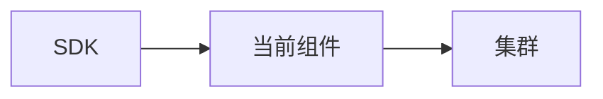

一段话说明当前整体交互方式。

### 1.2 内部实现现状

**证据**：关键代码路径，带 `file_path:line`。

### 1.3 主线一现状

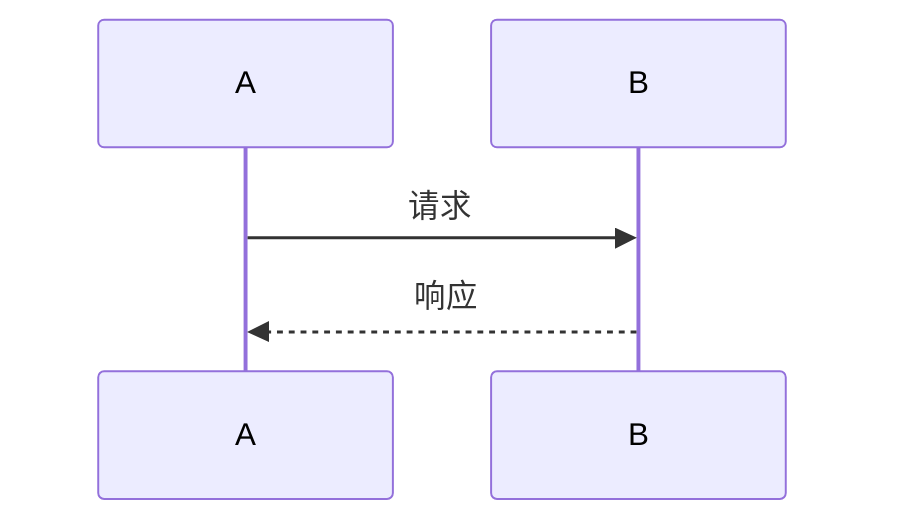

一段话说明当前路径和问题。

### 1.4 主线二现状


一段话说明当前路径和问题。

### 1.5 连接/资源模型现状

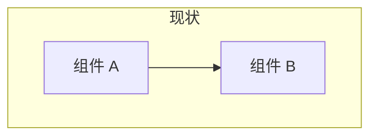

一段话说明当前资源约束。

### 1.6 现状总结

| 主线 | 现状 | 缺什么 |
|---|---|---|
| 一 | 现状描述 | 缺什么 |
| 二 | 现状描述 | 缺什么 |

**范式转变**：从"X"到"Y"，一段话说明。

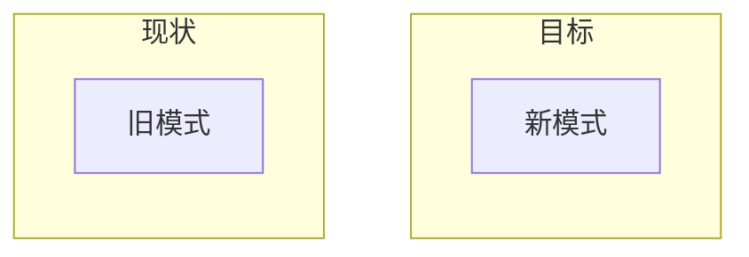

---

## 2. 目标

围绕主线定义用户可感知、可验证的业务目标。技术实现约束下沉到 §4。

### 2.1 目标一览

| ID | 目标 | 主线 | 用户如何感知 |
|---|---|---|---|
| **U1** | 目标描述 | 一 | 用户感知 |
| **U2** | 目标描述 | 二 | 用户感知 |

### 2.2 主线一 — 目标名（U1, ...）

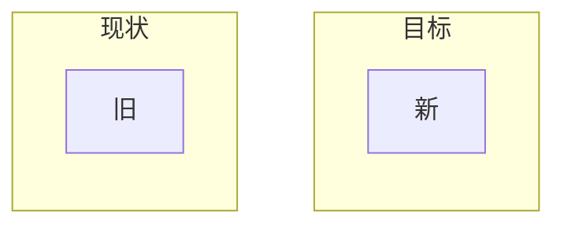

- **U1 目标名**：一段话说明。用户感知：...

### 2.3 主线二 — 目标名（U2, ...）

图 + 文字说明。

### 2.x 其余目标

每个目标独立一节，图 + 文字。

### 2.y 关键约束（非用户目标，但影响目标达成）

- **约束1**：说明
- **约束2**：说明

---

## 3. 用户 UseCase

本章从用户视角描述：用户调什么 API、期望什么结果、感知到什么。不涉及内部实现。

> 按场景维度归为六类，从日常高频到异常运维：
> - **A 正常读写**
> - **B 批量操作**
> - **C 部署拓扑**
> - **D 正确性语义**
> - **E 故障与变更**
> - **F 规模与运维**

### A. 正常读写

#### UseCase1 — 场景名

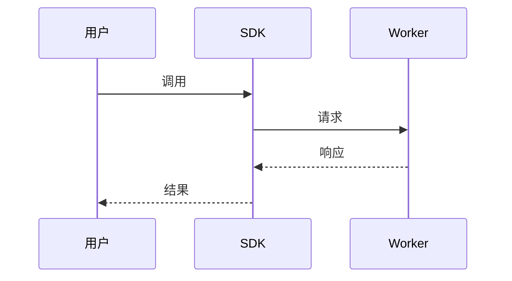

**场景**：一段话说明。
**用户感知**：
- 要点1
- 要点2

### B-F. 其余分类

（同上结构，每个 UseCase 配图 + 场景 + 用户感知）

### UseCase 与目标映射

| UseCase | 覆盖目标 |
|---|---|
| UseCase1 | U1 |
| UseCase2 | U2 |

---

## 4. 整体设计

### 4.1 模块划分

N 个模块 + worker 端配合：

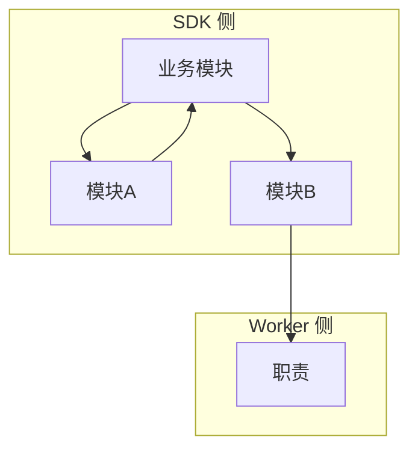

| 模块 | 职责 | 对应目标 |
|---|---|---|
| **模块A** | 职责 | U1, U2 |
| **模块B** | 职责 | U5, U7 |
| **worker 职责** | 职责 | 正确性 |

#### 模块A

```cpp
// 对外接口
class ModuleA {
public:
    Status Method1(params);
    Status Method2(params);
    void UpdateState(params);
    void Shutdown();
};
```

**性能规格**：

| 指标 | 设计目标 | 说明 |
|---|---|---|
| 操作延迟 | < Xμs | 说明 |
| 内存 | ~XMB | 说明 |

#### 模块B

```cpp
// 对外接口
class ModuleB {
public:
    Status Method1(params);
    Status Method2(params);
};
```

**性能规格**：

| 指标 | 设计目标 | 说明 |
|---|---|---|
| 带宽 | 目标 | 说明 |
| 连接数 | 目标 | 说明 |

#### worker 端职责

**性能规格**：

| 指标 | 设计目标 | 说明 |
|---|---|---|
| 校验延迟 | < Xμs | 说明 |

### 4.2 模块交互

#### 正常交互

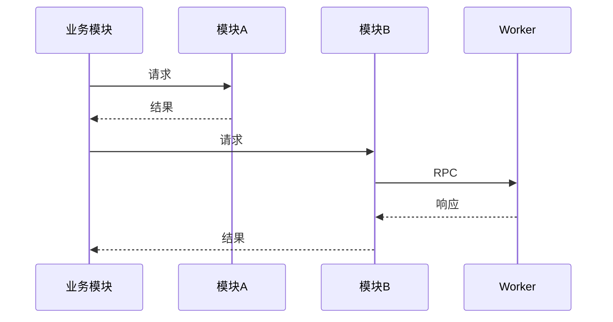

**交互要点**：
- 要点1
- 要点2

#### 多 key 分组交互

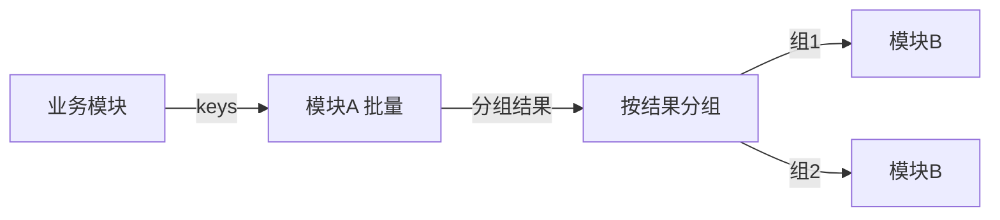

#### 故障切换交互

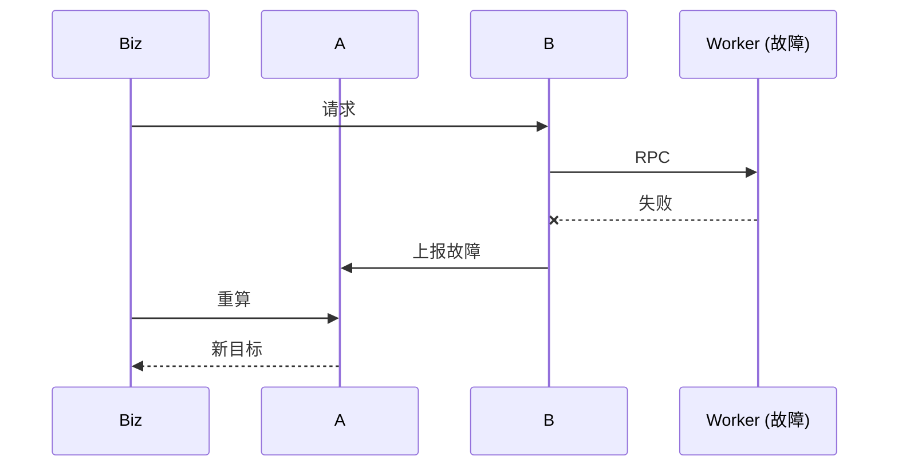

#### 扩缩容交互（含时间窗 + 分批）

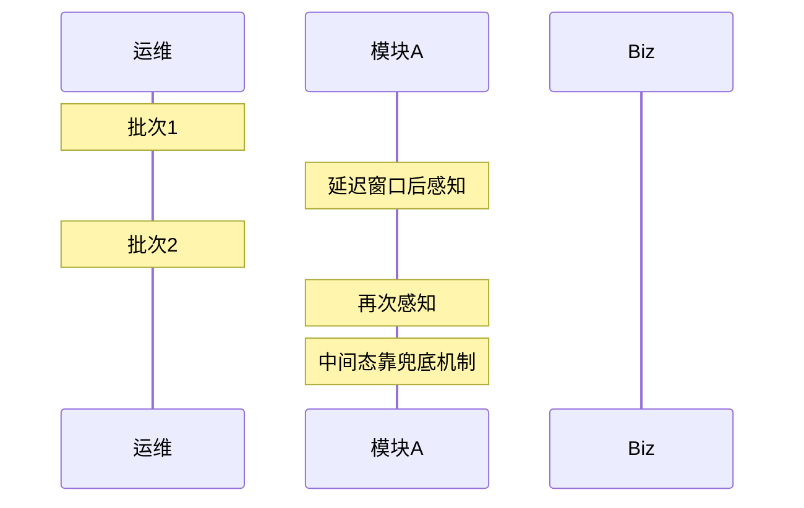

### 4.3 关键设计机制

#### D1. 机制名（UseCasex）

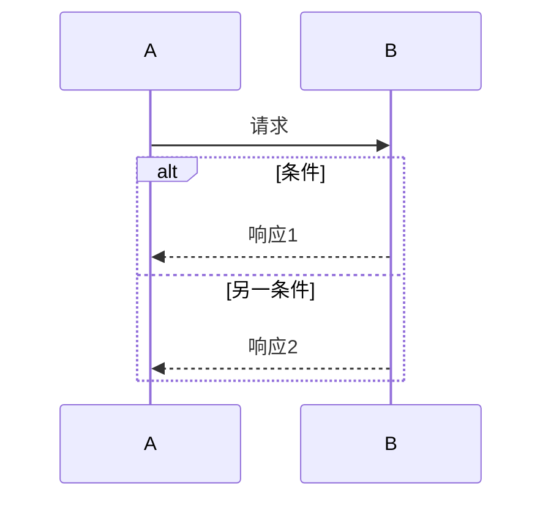

一段话说明机制。

> **注意**：如需新增接口，在此标注。

#### D2-Dx. 其余机制

（同上结构，每个机制配图 + 文字）

### 4.4 模块边界约束

| 约束 | 说明 | 反面（避免的） |
|---|---|---|
| 模块A与B解耦 | 说明 | 反面 |
| 职责归A | 说明 | 反面 |
| worker 最终态 | 说明 | 反面 |

---

## 5. 对外参数与接口汇总

本章只列因本特性而**变更或新增**的对外参数与接口，历史既有的不加。

### 5.1 变更的 SDK 初始化参数

| 参数 | 类型 | 原默认 | 变更后 | 说明 |
|---|---|---|---|---|
| param | bool | false | true | 说明 |

### 5.2 新增参数

| 参数 | 类型 | 默认 | 说明 |
|---|---|---|---|

### 5.3 变更的 Worker 部署参数

| 参数 | 原默认 | 变更后 | 说明 |
|---|---|---|---|

### 5.4 新增的 Worker 端行为

| 行为 | 触发条件 | 响应 | 关联 |
|---|---|---|---|

> **注意**：标注哪些需要新增接口。

### 5.5 新增的环境变量

（无新增则标注现有变量变必需）
