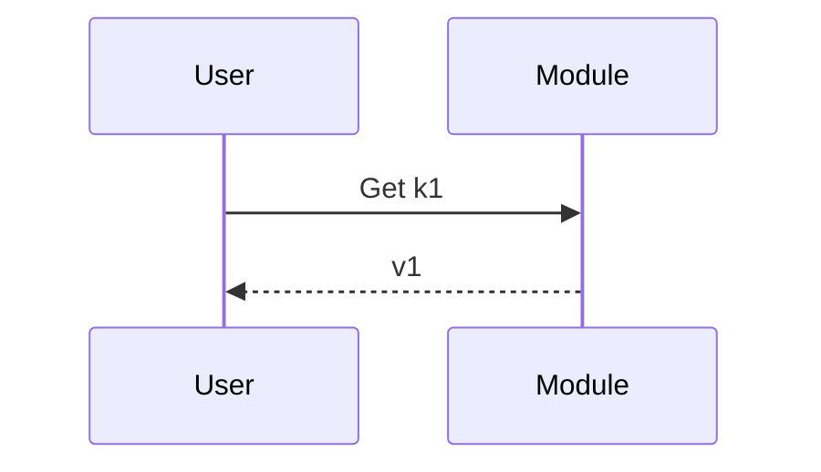

# 测试详细设计：合规样例

self_check --type detailed 应全 PASS。

## 3. UseCase



## 4. 方案设计

### 4.1 类图

```cpp
class HeartbeatManager {
public:
    Status Start(int interval);
    void Stop();
};
```

## 5. 对外接口

```cpp
Status Start(int interval);
void Stop();
```

| 接口 | 调用方 | 频率 | 说明 |
|---|---|---|---|
| Start(interval) | Worker | 启动时 | 启动心跳 |

## 6. 约束 + 风险

| # | 约束 | 违规后果 |
|---|---|---|
| 1 | 间隔必须 > 0 | 崩溃 |

## 7. 落地步骤

| PR | 内容 | 阶段 |
|---|---|---|
| 1 | 基础结构 | P1 |

## 8. 测试方案

- UT: heartbeat_test.cpp 覆盖 Start/Stop
- IT: 对应 UseCase1，验证间隔生效，断言 RTT
