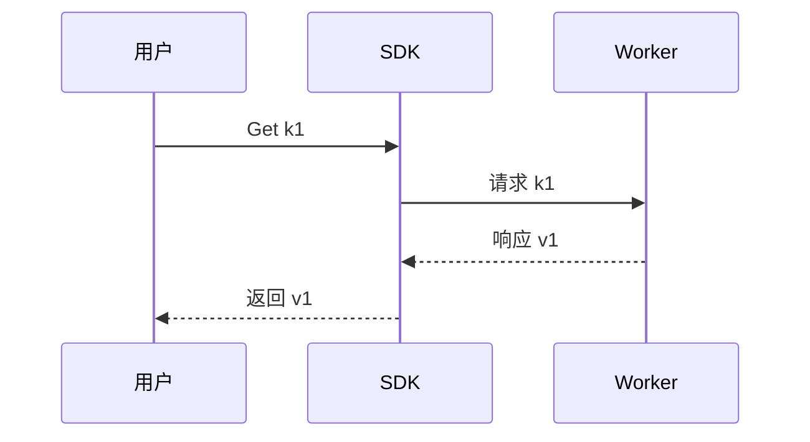

# 测试概要设计：合规样例

每项检查应 PASS。

## 1. 背景（现状）

### 1.1 当前实现

当前路由实现在 src/sdk/route.cpp:42，采用固定选路策略。证据见 src/sdk/route.cpp:58。

## 2. 目标

### 2.1 目标一览

| ID | 目标 | 用户感知 |
|---|---|---|
| U1 | 降低 Get RTT 至 50μs | 延迟下降 |

## 3. 用户 UseCase



### UseCase 与目标映射

| UseCase | 覆盖目标 |
|---|---|
| UseCase1 | U1 |

## 4. 整体设计

### 4.1 模块划分

```cpp
class Router {
public:
    Status Route(const Key& k);
};
```

性能规格：

| 指标 | 目标 |
|---|---|
| 延迟 | 50μs |

### 4.3 关键设计机制

#### D1. 新增亲和路由（UseCase1）

## 5. 对外参数

### 5.1 新增参数

| 参数 | 默认 | 说明 |
|---|---|---|
| enable_affinity | true | 说明 |
