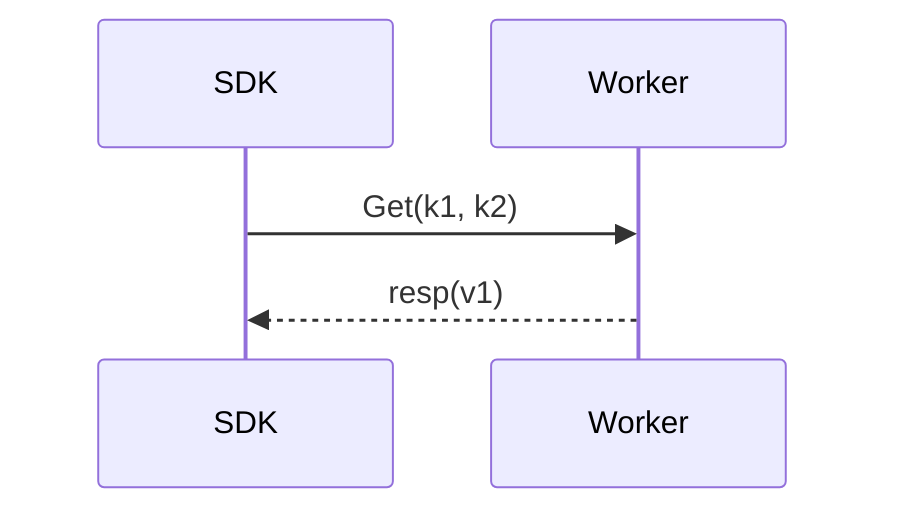

# 测试概要设计：Mermaid 语法违规样例

mermaid_lint 应报：消息含逗号、消息含括号。

## 3. 用户 UseCase

```mermaid
sequenceDiagram
    participant SDK
    participant W as Worker
    SDK->>W: Get(k1, k2)
    W-->>SDK: resp(v1)
```
