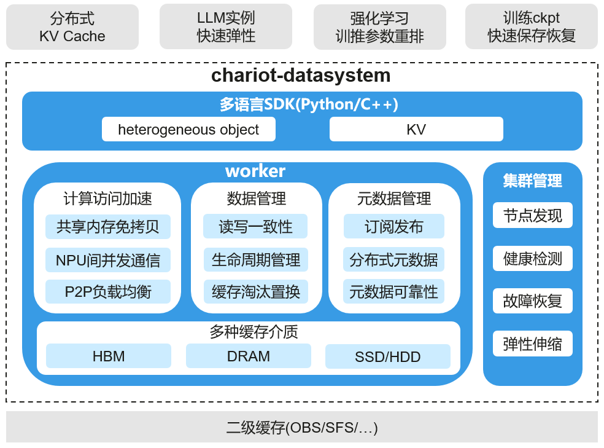
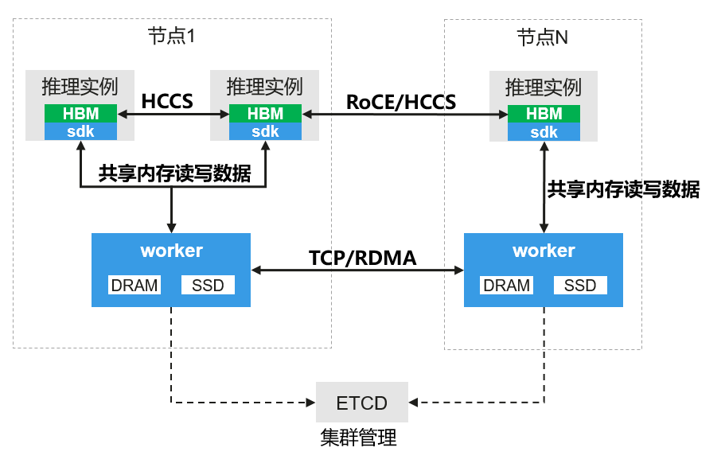

[View English](./README.md)

<!-- TOC -->

- [yr-datasystem 介绍](#yr-datasystem-介绍)
- [适用场景](#适用场景)
- [架构](#架构)
- [安装](#安装)
  - [pip 方式安装](#pip-方式安装)
  - [源码编译方式安装](#源码编译方式安装)
- [部署](#部署)
  - [进程部署](#进程部署)
  - [Kubernetes 部署](#kubernetes-部署)
- [快速入门](#快速入门)
- [文档](#文档)
- [许可证](#许可证)

<!-- /TOC -->

## yr-datasystem 介绍

yuanrong-datasystem 是一款专为 AI 训推场景设计的分布式异构缓存系统。支持 HBM/DDR/SSD 异构介质池化缓存及 NPU 间异步并发高效数据传输，用于分布式 KVCache 缓存、模型参数缓存、高性能 replaybuffer 等场景。

yuanrong-datasystem 的主要特性包括：

- **高性能分布式多级缓存**：基于 DRAM/SSD 构建分布式多级缓存，应用实例通过共享内存免拷贝读写 DRAM 数据，并提供高性能 H2D(host to device)/D2H(device to host) 接口，实现 HBM 与 DRAM 之间快速 swap。
- **NPU 间高效数据传输**：将 NPU 的 HBM 抽象为异构对象，自动协调 NPU 间 HCCL 收发顺序，实现简单易用的卡间数据异步并发传输。并支持P2P传输负载均衡策略，充分利用卡间链路带宽。
- **灵活的生命周期管理**：支持设置 TTL、LRU 缓存淘汰以及 delete 接口等多种生命周期管理策略，数据生命周期既可由数据系统管理，也可交由上层应用管理，提供更高的灵活性。
- **热点数据多副本**：数据跨节点读取时自动在本地保存副本，支撑热点数据高效访问。本地副本使用 LRU 策略自动淘汰。
- **多种数据可靠性策略**：支持 write_through、wirte_back 及 none 多种持久化策略，满足不同场景的数据可靠性需求。
- **数据一致性**：支持 Causal 及 PRAM 两种数据一致性模型，用户可按需选择，实现性能和数据一致性的平衡。
- **数据发布订阅**：支持数据订阅发布，解耦数据的生产者（发布者）和消费者（订阅者），实现数据的异步传输与共享。
- **高可靠高可用**：支持分布式元数据管理，实现系统水平线性扩展。支持元数据可靠性，支持动态资源伸缩自动迁移数据，实现系统高可用。

## 适用场景

- **LLM 长序列推理 KVCache**：基于异构对象提供分布式多级缓存 (HBM/DRAM/SSD) 和高吞吐 D2D/H2D/D2H 访问能力，构建分布式 KV Cache，实现 Prefill 阶段的 KVCache 缓存以及 Prefill/Decode 实例间 KV Cache 快速传递，提升推理吞吐。
- **模型推理实例 M->N 快速弹性**：利用异构对象的卡间直通及 P2P 数据分发能力实现模型参数快速复制。
- **强化学习模型参数重排**：利用异构对象的卡间直通传输能力，快速将模型参数从训练侧同步到推理侧。
- **训练场景 CheckPoint 快速保存及加载**：基于 KV 接口快速写 Checkpoint，并支持将数据持久化到二级缓存保证数据可靠性。Checkpoint恢复时各节点将 Checkpoint 分片快速加载到异构对象中，利用异构对象的卡间直通传输及 P2P 数据分发能力，快速将 Checkpoint 传递到各节点 HBM。

## 架构



yuanrong-datasystem 由三个部分组成：

- **多语言SDK**：提供 Python/C++ 语言接口，封装 heterogeneous object 及 KV 接口，支撑业务实现数据快速读写。提供两种类型接口：
  - **heterogeneous object**：基于 NPU 卡的 HBM 内存抽象异构对象接口，实现昇腾 NPU 卡间数据高速直通传输。同时提供 H2D/D2H 高速迁移接口，实现数据快速在 DRAM/HBM 之间传输。
  - **KV**：基于共享内存实现免拷贝的 KV 接口，实现高性能数据缓存，支持通过对接外部组件提供数据可靠性语义。

- **worker**：yuanrong-datasystem 的核心组件，用于分配管理 DRAM/SSD 资源以及元数据，提供分布式多级缓存能力。

- **集群管理**：依赖 ETCD，实现节点发现/健康检测，支持故障恢复及在线扩缩容。



yuanrong-datasystem 的部署视图如上图所示：

- 需部署 ETCD 用于集群管理。
- 每个节点需部署 worker 进程并注册到 ETCD。
- SDK 集成到用户进程中并与同节点的 worker 通信。

各组件间的数据传输协议如下：

- SDK 与 worker 之间通过共享内存读写数据。
- worker 和 worker 之间通过 TCP/RDMA 传输数据（当前版本仅支持 TCP，后续版本支持 RDMA ）。
- 异构对象 HBM 之间通过 HCCS/RoCE 卡间直通传输数据。

## 安装

### pip 方式安装

安装 PyPI 上的版本：
```bash
pip install yr-datasystem
```

安装自定义版本，可以参考文档：[安装 yr-datasystem 自定义版本](./docs/source_zh_cn/getting-started/install.md#安装自定义版本)

### 源码编译方式安装

使用源码编译方式安装 yr-datasystem 可以参考文档：[源码编译安装 yr-datasystem](./docs/source_zh_cn/getting-started/install.md#源码编译方式安装yr-datasystem版本)

## 部署

### 进程部署

yr-datasystem 可基于 dscli 工具快速部署集群，参考文档：[yr-datasystem 进程部署](./docs/source_zh_cn/getting-started/deploy.md#yr-datasystem进程部署)

### Kubernetes 部署

yr-datasystem 还提供了基于 Kubernetes 容器化部署方式，参考文档：[yr-datasystem Kubernetes 部署](./docs/source_zh_cn/getting-started/deploy.md#yr-datasystem-kubernetes部署)

## 快速入门

heterogeneous object、KV 和 object 语义的快速入门，可参考以下文档。
- [heterogeneous object 快速入门](./docs/source_zh_cn/getting-started/overview.md#异构对象)
- [KV 快速入门](./docs/source_zh_cn/getting-started/overview.md#kv)

## 文档
有关安装指南、教程和 API 的更多详细信息，请参阅[用户文档](docs)

## 许可证

[Apache License 2.0](LICENSE)