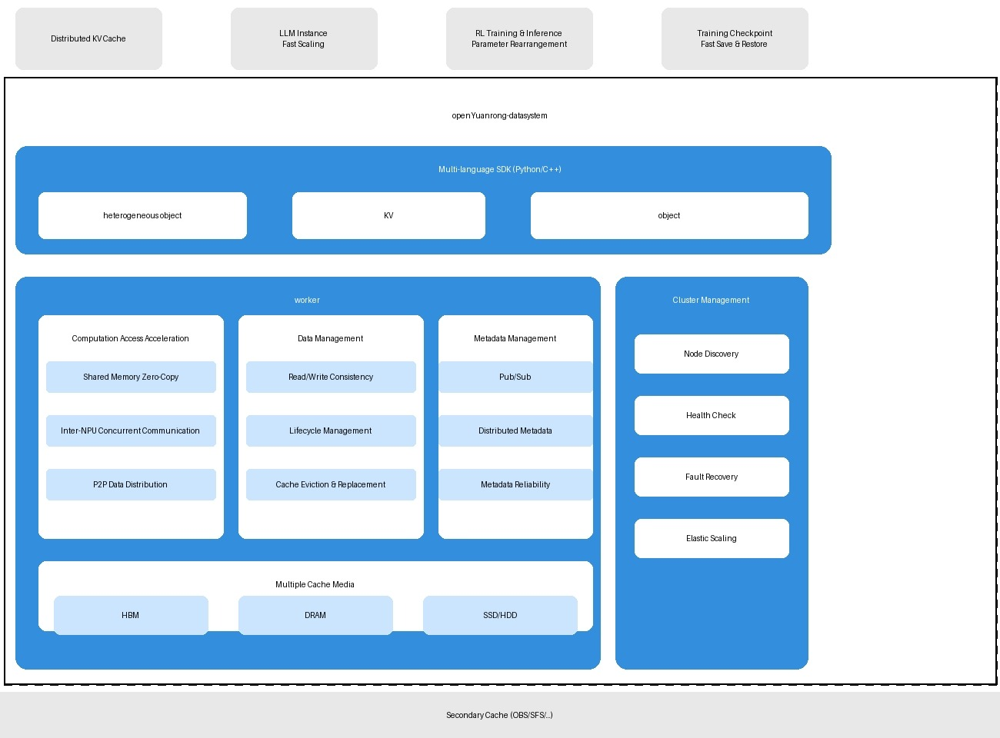
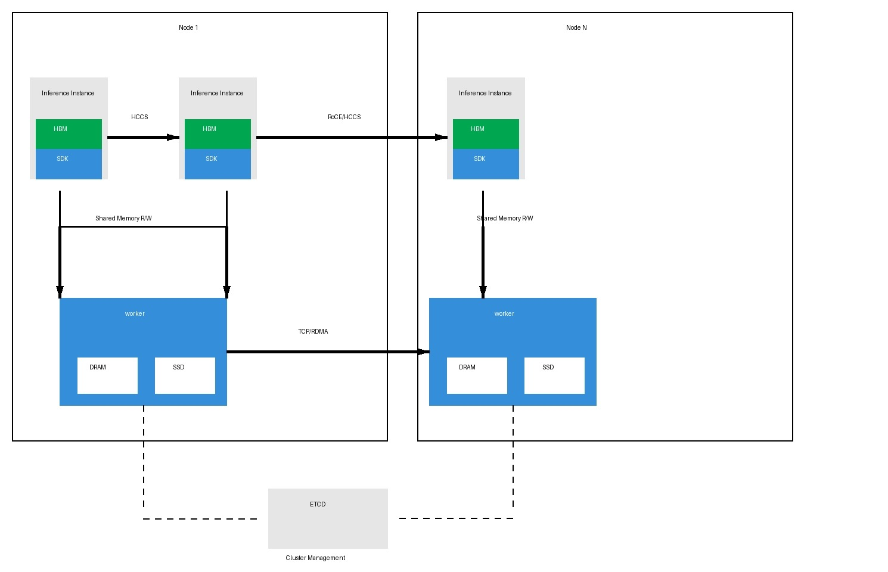

<div style="text-align: center;">
  

  [](LICENSE)
  [](https://gitcode.com/openeuler/yuanrong/releases)
  [](https://docs.openyuanrong.org/zh-cn/latest/index.html)

  English | [简体中文](README.md)

</div>

openYuanrong is a serverless distributed compute engine that unifies diverse workloads, from AI and big data to microservices, on a single, streamlined architecture. It provides multi-language function interfaces that simplify the development of complex distributed applications to feel just like writing a local program. Powered by dynamic scheduling and efficient data sharing, openYuanrong ensures high-performance execution and maximum cluster resource utilization.

## Overview

<div style="text-align: center;">
  
</div>

openYuanrong supports modular, on-demand usage of a multi-language function runtime, function system, and data system.

- **Multi-language Function Runtime**: Build powerful, distributed applications in Python, Java, and C++ as easily as you would write a program for a single machine.
- **Function System**: Maximize cluster resource utilization with dynamic scheduling, which seamlessly scales and migrates function instances across nodes.
- **Data System**: Accelerate data transfer between function instances using a multi-level distributed caching system that supports both object and stream semantics.

In openYuanrong, the function is a core abstraction that extends the serverless model. It behaves like a process in a single-machine OS, representing a running instance of a distributed application while offering native support for cross-function invocation.

openYuanrong consists of three code repositories:

- [yuanrong](https://gitcode.com/openeuler/yuanrong): Refers to the multi-language function runtime.
- [yuanrong-functionsystem](https://atomgit.com/openeuler/yuanrong-functionsystem): Refers to the function system repository.
- yuanrong-datasystem: The data system repository (current repository).

**openYuanrong DataSystem** is the core conceptual abstraction of openYuanrong, a distributed caching system that leverages HBM/DRAM/SSD resources from compute clusters to build near-compute multi-level caches, enhancing data access performance for model training and inference, big data, and microservices scenarios.

openYuanrong DataSystem features include:

- **High-performance distributed multi-level cache**: Built on DRAM/SSD to create a distributed multi-level cache. Application instances read/write DRAM data through shared memory without copying, and provide high-performance H2D (host to device)/D2H (device to host) interfaces for rapid swapping between HBM and DRAM.
- **Efficient inter-NPU data transmission**: Abstracts NPU HBM as heterogeneous objects, automatically coordinates HCCL send/receive sequences between NPUs to enable simple and easy inter-card data asynchronous concurrent transmission. Supports P2P transmission load balancing strategies to fully utilize inter-card link bandwidth.
- **Flexible lifecycle management**: Supports multiple lifecycle management strategies including TTL, LRU cache eviction, and delete interfaces. Data lifecycle can be managed by either the data system or the upper-layer application, providing greater flexibility.
- **Hot data multi-replication**: Automatically stores local copies when data is read across nodes, supporting efficient access to hot data. Local copies are automatically evicted using LRU policy.
- **Multiple data reliability strategies**: Supports write_through, write_back, and none persistence strategies to meet different scenarios' data reliability requirements.
- **Data consistency**: Supports Causal and PRAM consistency models, allowing users to select based on needs for balancing performance and data consistency.
- **Data publish-subscribe**: Supports data subscription and publication, decoupling data producers (publishers) and consumers (subscribers) to enable asynchronous data transmission and sharing.
- **High reliability and availability**: Supports distributed metadata management for horizontal linear scaling. Ensures metadata reliability, supports automatic data migration during dynamic resource scaling, achieving system high availability.

### Applicable Scenarios

- **LLM long-sequence inference KVCache**: Leverages heterogeneous objects to provide distributed multi-level cache (HBM/DRAM/SSD) and high-throughput D2D/H2D/D2H access capabilities, building distributed KVCache to cache KVCache during Prefill stage and enable rapid KVCache transfer between Prefill/Decode instances, improving inference throughput.
- **Model inference instance M→N rapid elasticity**: Utilizes direct inter-card transmission and P2P data distribution capabilities of heterogeneous objects to achieve rapid model parameter replication.
- **Reinforcement learning model parameter rearrangement**: Leverages direct inter-card transmission capability of heterogeneous objects to rapidly synchronize model parameters from training side to inference side.
- **Training scenario CheckPoint rapid save and load**: Uses KV interfaces for rapid Checkpoint writing with data persistence to secondary cache for reliability. During Checkpoint recovery, nodes rapidly load Checkpoint shards into heterogeneous objects, leveraging direct inter-card transmission and P2P data distribution for rapid Checkpoint delivery to all nodes' HBM.
- **Microservice state data rapid read/write**: Implements memory-level read/write of microservice state data via KV interfaces, supporting data persistence to secondary cache for reliability.

### openYuanrong DataSystem Architecture



openYuanrong DataSystem consists of three components:

- **Multi-language SDK**: Provides Python/C++ language interfaces, encapsulating heterogeneous object, KV, and object interfaces to support business data operations. Offers two interface types:
  - **heterogeneous object**: Abstracts NPU HBM memory into heterogeneous object interfaces, enabling high-speed direct inter-card data transmission. Also provides H2D/D2H high-speed migration interfaces for rapid data transfer between DRAM/HBM.
  - **KV**: Implements zero-copy KV interfaces via shared memory for high-performance data caching, supporting data reliability semantics through integration with external components.
  - **object**: Implements near-compute local object caching via shared memory for efficient inter-function data flow, supporting Distributed Futures programming model.

- **worker**: Core component of openYuanrong DataSystem, responsible for allocating and managing DRAM/SSD resources and metadata, providing distributed multi-level caching capabilities.

- **Cluster management**: Relies on ETCD for node discovery/health detection, supporting fault recovery and online scaling.



Deployment view of openYuanrong DataSystem is shown in the figure above:

- ETCD must be deployed for cluster management.
- A worker process must be deployed on each node and registered with ETCD.
- SDK is integrated into user processes and communicates with the local node's worker.

Data transmission protocols between components:

- SDK and worker communicate via shared memory for data read/write.
- Workers communicate via TCP/RDMA (current version supports TCP only, RDMA/UB coming soon).
- Heterogeneous object HBM communicates via HCCS/RoCE direct inter-card transmission.

Based on the provided documentation, here is the complete English translation of the **openYuanrong DataSystem** guide, including the installation, deployment, and code examples.

## Getting Started

### Install openYuanrong DataSystem

#### Install via pip

The openYuanrong DataSystem has been published to [PyPI](https://pypi.org/project/openyuanrong-datasystem/). You can install it directly via pip.

**Prerequisites**

Before installing openYuanrong DataSystem via pip, please ensure the following requirements are met:

- **Python Version**: Python 3.9, 3.10, or 3.11
- **Operating System**: Linux (glibc 2.34+ recommended)
- **Architecture**: x86-64

You can check these using the following commands:

```bash
# Python version
python --version
# Operating System
uname -s
# Architecture
uname -m
# glibc version
ldd --version
```

**Install the Full Distribution** (includes Python SDK, C++ SDK, and CLI tools):

```bash
pip install openyuanrong-datasystem
```

**Verify Installation**:

After installation, verify the installation was successful using the following commands:

```bash
python -c "import yr.datasystem; print('openYuanrong datasystem installed successfully')"

dscli --version
```

#### Install from Source Code

To install openYuanrong DataSystem via source code compilation, please refer to the documentation: [Build openYuanrong DataSystem from Source](./docs/source_zh_cn/installation/build_guide/bazel_build.md#build-from-source)

### Deploy openYuanrong DataSystem

#### Process Deployment

- Prepare ETCD

  The cluster management of openYuanrong DataSystem relies on ETCD. Please start a single-node ETCD instance in the background first (example port 2379):

  ```bash
  etcd --listen-client-urls http://0.0.0.0:2379 \
       --advertise-client-urls http://localhost:2379 &
  ```

- One-click Deployment

  After installing the full openYuanrong DataSystem distribution, you can use the bundled `dscli` command-line tool to complete the cluster deployment with one command. Start a server process listening on port 31501:

  ```bash
  dscli start -w --worker_address "127.0.0.1:31501" --etcd_address "127.0.0.1:2379"
  ```

- One-click Uninstall

  ```bash
  dscli stop --worker_address "127.0.0.1:31501"
  ```

For more deployment parameters and methods, please refer to the documentation: [openYuanrong DataSystem Process Deployment](./docs/source_zh_cn/deployment/deploy.md#process-deployment)

#### Kubernetes Deployment

openYuanrong DataSystem also provides a containerized deployment method based on Kubernetes. Before deployment, ensure the Kubernetes cluster, Helm, and an accessible ETCD cluster are ready.

- Obtain the Helm Chart Package

  After installing the full distribution, use the bundled `dscli` tool to quickly obtain the Helm chart package in the current directory:

  ```bash
  dscli generate_helm_chart -o ./
  ```

- Edit Cluster Configuration

  openYuanrong DataSystem uses the `./datasystem/values.yaml` file for cluster configuration. The required configuration items are as follows:

  ```yaml
  global:
    # Other configuration items...

    # Image repository address
    imageRegistry: ""
    # Image name and tag
    images:
      datasystem: "openyuanrong-datasystem:0.5.0"
      
    etcd:
      # ETCD cluster address
      etcdAddress: "127.0.0.1:2379"
  ```

- Cluster Deployment

  Helm will submit a DaemonSet to launch openYuanrong DataSystem instances per node:

  ```bash
  helm install openyuanrong_datasystem ./datasystem
  ```

- Cluster Uninstall

  ```bash
  helm uninstall openyuanrong_datasystem
  ```

For more advanced Kubernetes configuration parameters, please refer to the documentation: [openYuanrong DataSystem Kubernetes Deployment](./docs/source_zh_cn/deployment/deploy.md#kubernetes-deployment)

### Code Examples

- Heterogeneous Object

  Using the heterogeneous object interface to write arbitrary binary data to HBM in key-value form:

  ```python
  import acl
  import os
  from yr.datasystem import Blob, DsClient, DeviceBlobList

  # hetero_dev_mset and hetero_dev_mget must be executed in different processes
  # because they need to be bound to different NPUs.
  def hetero_dev_mset():
      client = DsClient("127.0.0.1", 31501)
      client.init()

      acl.init()
      device_idx = 1
      acl.rt.set_device(device_idx)

      key_list = [ 'key1', 'key2', 'key3' ]
      data_size = 1024 * 1024
      test_value = "value"

      in_data_blob_list = []
      for _ in key_list:
          tmp_batch_list = []
          for _ in range(4):
              dev_ptr, _ = acl.rt.malloc(data_size, 0)
              acl.rt.memcpy(dev_ptr, data_size,            acl.util.bytes_to_ptr(test_value.encode()), data_size, 1)
              blob = Blob(dev_ptr, data_size)
              tmp_batch_list.append(blob)
          blob_list = DeviceBlobList(device_idx, tmp_batch_list)
          in_data_blob_list.append(blob_list)
      client.hetero().dev_mset(key_list, in_data_blob_list)

  def hetero_dev_mget():
      client = DsClient("127.0.0.1", 31501)
      client.init()

      acl.init()
      device_idx = 2
      acl.rt.set_device(device_idx)

      key_list = [ 'key1', 'key2', 'key3' ]
      data_size = 1024 * 1024
      out_data_blob_list = []
      for _ in key_list:
          tmp_batch_list = []
          for _ in range(4):
              dev_ptr, _ = acl.rt.malloc(data_size, 0)
              blob = Blob(dev_ptr, data_size)
              tmp_batch_list.append(blob)
          blob_list = DeviceBlobList(device_idx, tmp_batch_list)
          out_data_blob_list.append(blob_list)
      client.hetero().dev_mget(key_list, out_data_blob_list, 60000)
      client.hetero().dev_delete(key_list)

  pid = os.fork()
  if pid == 0:
      hetero_dev_mset()
      os._exit(0)
  else:
      hetero_dev_mget()
      os.wait()
  ```

- KV

  Using the KV interface to write arbitrary binary data to DDR in key-value form:

  ```python
  from yr.datasystem.ds_client import DsClient

  client = DsClient("127.0.0.1", 31501)
  client.init()

  key = "key"
  expected_val = b"value"
  client.kv().set(key, expected_val)

  val = client.kv().get([key])
  assert val[0] == expected_val

  client.kv().delete([key])
  ```

- Object

  Using the object interface to implement cache data management based on reference counting:

  ```python
  from yr.datasystem.ds_client import DsClient

  client = DsClient("127.0.0.1", 31501)
  client.init()

  # Increase the key's global reference
  key = "key"
  client.object().g_increase_ref([key])

  # Create shared memory buffer for key.
  value = bytes("val", encoding="utf8")
  size = len(value)
  buf = client.object().create(key, size)

  # Copy data to shared memory buffer.
  buf.memory_copy(value)

  # Publish the key.
  buf.publish()

  # Get the key.
  buffer_list = client.get([key], True)

  # Decrease the key's global reference, the lifecycle of this key will end afterwards.
  client.g_decrease_ref([key])
  ```

## Documentation

For more details regarding the openYuanrong DataSystem installation guide, tutorials, and API, please refer to the [User Documentation](https://pages.openeuler.openatom.cn/openyuanrong-datasystem/docs/zh-cn/latest/index.html).

For more details regarding openYuanrong, please refer to the [openYuanrong Documentation](https://docs.openyuanrong.org/zh-cn/latest/index.html) to learn how to develop distributed applications using openYuanrong.

## Contributing

We welcome all forms of contributions to openYuanrong. Please refer to our [contributor guide](https://docs.openyuanrong.org/zh-cn/latest/contributor_guide/index.html).

## License

[Apache License 2.0](./LICENSE)