# CANN 运行时依赖隔离概要设计

> 版本 v0.1，2026-08-06。基于 master `6b23deca` 设计。
> 本文面向 Issue #971，描述 Datasystem 核心产物与可选 CANN HIXL/HCCS 能力之间的依赖隔离。

---

## 术语表

| 术语 | 含义 | 本文范围 |
|---|---|---|
| **核心产物** | 下游会直接链接或由服务进程直接加载的 `libdatasystem.so` 与 Worker 主体共享库 | 必须解除三个 CANN SO 的加载时依赖 |
| **CANN 运行时依赖** | `libascendcl.so`、`libcann_hixl.so`、`libmetadef.so` | 本次需要隔离的共享库集合 |
| **HCCS 传输** | Remote H2D 通过 HIXL 执行的 NPU 高速互联传输 | 可选能力 |
| **加载时依赖** | ELF `DT_NEEDED` 声明的依赖，动态加载器在主体 SO 装载阶段解析 | Issue #971 的直接触发条件 |
| **叶子插件** | 仅在对应可选能力被使用时才加载、允许直接依赖厂商运行时的共享库 | 现有 ACL 插件属于此类 |
| **Transfer Engine** | 仓库内独立构建和延迟导入的传输组件 | 不属于本次设计范围 |

当前核心矛盾是：HCCS 是可选能力，但它的厂商运行时依赖已经进入核心产物的 ELF 加载闭包。

---

## 1. 背景（现状）

### 1.1 当前构建与依赖拓扑

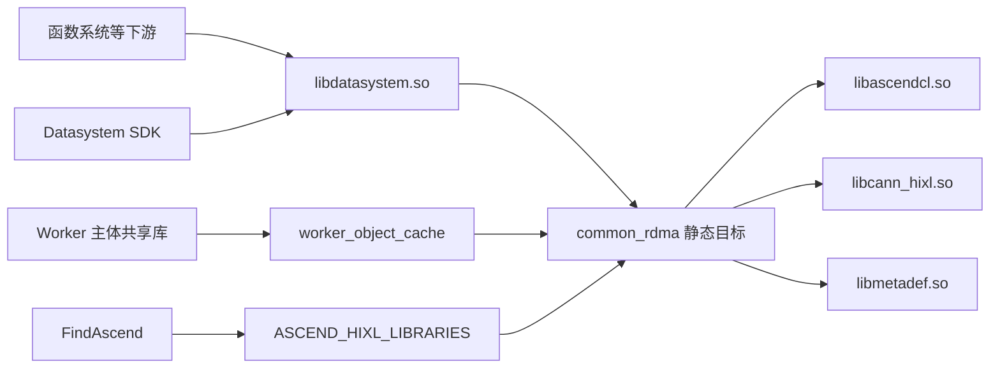
```mermaid
flowchart LR
    FS["函数系统等下游"] --> LDS["libdatasystem.so"]
    SDK["Datasystem SDK"] --> LDS
    Worker["Worker 主体共享库"] --> WOC["worker_object_cache"]
    LDS --> CR["common_rdma 静态目标"]
    WOC --> CR
    FA["FindAscend"] --> HL["ASCEND_HIXL_LIBRARIES"]
    HL --> CR
    CR --> ACL["libascendcl.so"]
    CR --> HIXL["libcann_hixl.so"]
    CR --> META["libmetadef.so"]
```

CMake 在检测到 HIXL 头文件、`libcann_hixl.so` 和 `libmetadef.so` 后，将三项 CANN 库合并为
`ASCEND_HIXL_LIBRARIES`。HIXL 版本不低于 8.5.2 时，`hixl_transport.cpp` 被编入静态目标
`common_rdma`，上述库又通过其链接接口传播给最终共享库。

`libdatasystem.so` 直接链接 `common_rdma`。Worker 侧的 `worker_transport_api` 和
`worker_object_cache` 同样依赖 `common_rdma`，再进入 Worker 主体共享库。因此这一依赖关系同时影响 SDK
与服务端主体产物，而不是仅存在于 HCCS 功能自己的实现文件中。

**证据**：

| 现状结论 | 代码证据 |
|---|---|
| 三个 CANN 库组成统一 HIXL 链接集合 | `cmake/modules/FindAscend.cmake:58-69` |
| HIXL 源码及链接库进入 `common_rdma` | `src/datasystem/common/rdma/CMakeLists.txt:53-69`、`src/datasystem/common/rdma/CMakeLists.txt:85-102` |
| `libdatasystem.so` 吸收 `common_rdma` | `src/datasystem/client/CMakeLists.txt:70-104`、`src/datasystem/client/CMakeLists.txt:126-133` |
| Worker 主体经 Object Cache 吸收 `common_rdma` | `src/datasystem/worker/object_cache/CMakeLists.txt:60-69`、`src/datasystem/worker/object_cache/CMakeLists.txt:103-110`、`src/datasystem/worker/CMakeLists.txt:97-105` |

### 1.2 HIXL 实现与主体代码的耦合现状

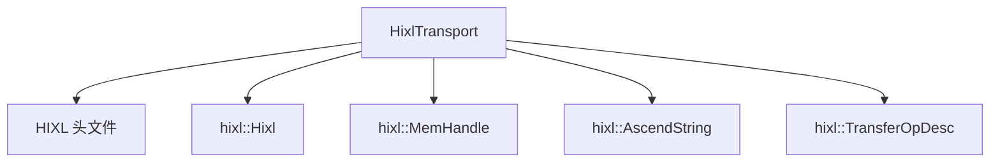
```mermaid
flowchart TB
    HT["HixlTransport"] --> Header["HIXL 头文件"]
    HT --> Engine["hixl::Hixl"]
    HT --> Handle["hixl::MemHandle"]
    HT --> Options["hixl::AscendString"]
    HT --> Desc["hixl::TransferOpDesc"]
```

`hixl_transport.h` 直接包含 HIXL 头文件，并在主体类成员中保存 `hixl::Hixl` 和
`hixl::MemHandle`。初始化过程构造厂商 engine 和 `AscendString` 参数；连接、注册内存、注销内存、
`TransferSync` 及 `Finalize` 也都由主体代码直接调用。

这种耦合不仅是链接配置问题：厂商 C++ 类型已经进入类布局、资源所有权和调用签名。HIXL 使用的 STL 容器、
字符串类型和 C++ 符号也构成编译器 ABI 与 CANN 版本耦合点。

**证据**：

| 现状结论 | 代码证据 |
|---|---|
| 主体头文件暴露 HIXL 类型 | `src/datasystem/common/rdma/npu/hixl_transport.h:20-32`、`src/datasystem/common/rdma/npu/hixl_transport.h:59-103` |
| 初始化直接构造并初始化 HIXL engine | `src/datasystem/common/rdma/npu/hixl_transport.cpp:139-180`、`src/datasystem/common/rdma/npu/hixl_transport.cpp:184-220` |
| 资源释放直接调用 HIXL Finalize 与 DeregisterMem | `src/datasystem/common/rdma/npu/hixl_transport.cpp:303-334`、`src/datasystem/common/rdma/npu/hixl_transport.cpp:517-554` |
| 数据热路径直接构造厂商描述符并调用 TransferSync | `src/datasystem/common/rdma/npu/hixl_transport.cpp:565-668` |

### 1.3 下游加载现状

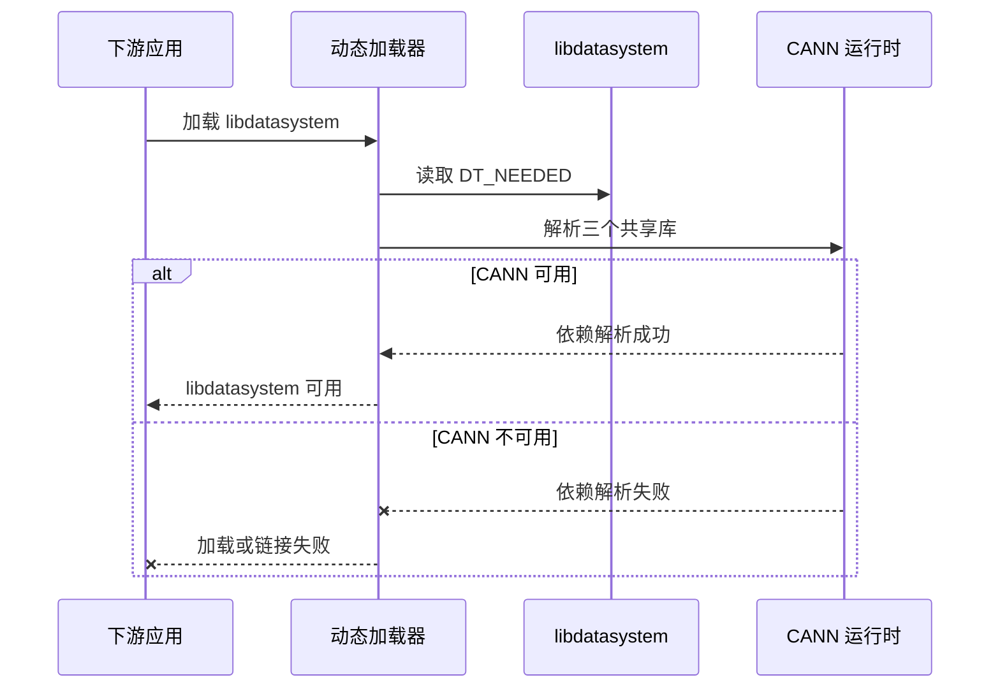
```mermaid
sequenceDiagram
    participant App as 下游应用
    participant Linker as 动态加载器
    participant DS as libdatasystem
    participant CANN as CANN 运行时

    App->>Linker: 加载 libdatasystem
    Linker->>DS: 读取 DT_NEEDED
    Linker->>CANN: 解析三个共享库
    alt CANN 可用
        CANN-->>Linker: 依赖解析成功
        Linker-->>App: libdatasystem 可用
    else CANN 不可用
        CANN--xLinker: 依赖解析失败
        Linker--xApp: 加载或链接失败
    end
```

Issue #971 报告的 `ldd libdatasystem.so` 结果包含三个 CANN SO。动态加载器会在应用真正选择 HCCS 之前
处理这些 `DT_NEEDED`，所以未安装 CANN 的函数系统构建或运行环境无法通过“不调用 HCCS”规避依赖。
问题发生在主体库装载边界，早于 Datasystem 业务 API 和传输策略选择。

**证据**：Issue #971 提供的 `ldd` 输出；`src/datasystem/client/CMakeLists.txt:131-133`；
`src/datasystem/common/rdma/CMakeLists.txt:96-98`。

### 1.4 Remote H2D 生命周期现状

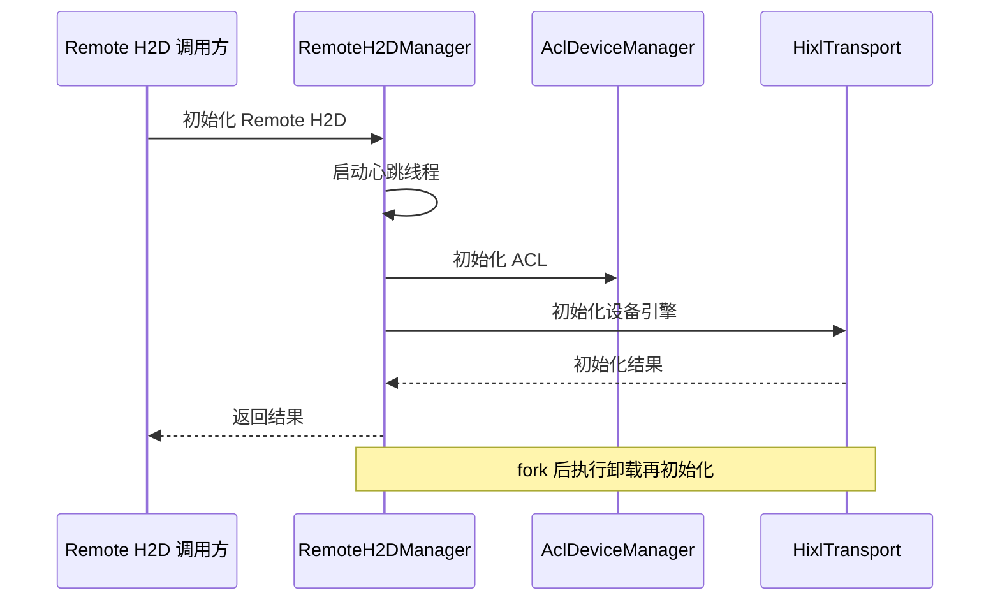
```mermaid
sequenceDiagram
    participant Caller as Remote H2D 调用方
    participant Manager as RemoteH2DManager
    participant ACL as AclDeviceManager
    participant Transport as HixlTransport

    Caller->>Manager: 初始化 Remote H2D
    Manager->>Manager: 启动心跳线程
    Manager->>ACL: 初始化 ACL
    Manager->>Transport: 初始化设备引擎
    Transport-->>Manager: 初始化结果
    Manager-->>Caller: 返回结果
    Note over Manager,Transport: fork 后执行卸载再初始化
```

`RemoteH2DManager` 根据 `remote_h2d_link_type` 选择 ROCE 或 HCCS。HCCS 编译可用时直接构造
`HixlTransport`；编译期不可用时使用 `LOG(FATAL)`。当前还没有“编译时包含 HCCS，但部署环境缺少 HIXL
运行时”的独立状态。

初始化流程先启动心跳线程，再初始化 ACL 和 transport。卸载流程停止线程、清理通信与内存映射、执行
`DisconnectAll`，最后执行 ACL finalize。fork 子进程复用同一套 `Uninit` 和 `Init` 流程。现有生命周期
已经包含并发线程、设备上下文、注册内存和重新初始化约束。

**证据**：`src/datasystem/common/rdma/npu/remote_h2d_manager.cpp:591-652`、
`src/datasystem/common/rdma/npu/remote_h2d_manager.cpp:723-767`、
`src/datasystem/common/rdma/npu/remote_h2d_manager.cpp:848-866`。

### 1.5 已有可选厂商能力加载现状


```mermaid
flowchart LR
    Main["主体代码 common_acl_device"] --> DL["dlopen 与 dlsym"]
    DL --> Verify["大小与 SHA256 校验"]
    Verify --> Plugin["libacl_plugin.so"]
    Plugin --> Vendor["AscendCL 与 HCCL"]
```

ACL 模块已经将厂商实现保留在 `libacl_plugin.so`：主体 `common_acl_device` 只链接 `common_util` 与
`dl`。首次设备调用通过 `call_once` 触发加载线程，加载器定位同目录或已加载共享库目录中的插件，完成文件
大小与 SHA256 校验后，以 `RTLD_LAZY | RTLD_LOCAL` 加载并解析函数。

插件构建阶段私有链接 AscendCL、HCCL 等厂商库，并在清理 RPATH、strip 后生成供主体校验的 hash 头文件。
当前 HIXL 路径尚未使用这一可选能力加载模型。

**证据**：`src/datasystem/common/device/ascend/acl_device_manager.cpp:58-81`、
`src/datasystem/common/device/ascend/acl_device_manager.cpp:90-132`、
`src/datasystem/common/device/ascend/acl_device_manager.cpp:202-255`、
`src/datasystem/common/device/ascend/plugin/CMakeLists.txt:1-30`、
`src/datasystem/common/device/ascend/CMakeLists.txt:1-20`。

### 1.6 构建与分发现状

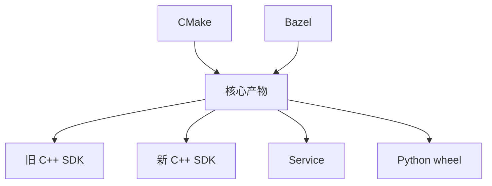
```mermaid
flowchart TB
    CMake["CMake"] --> Core["核心产物"]
    Bazel["Bazel"] --> Core
    Core --> SDK1["旧 C++ SDK"]
    Core --> SDK2["新 C++ SDK"]
    Core --> Service["Service"]
    Core --> Python["Python wheel"]
```

CMake 与 Bazel 都把 HIXL 源码、编译定义和厂商链接依赖放入主体依赖图。打包侧已经把 ACL 插件安装到
两个 C++ SDK 路径并加入 Python 目标；Worker 主体共享库还同时安装到 SDK 与 Service 路径。当前没有
HIXL 独立动态产物对应的目标、完整性文件和跨分发形态清单。

`-X on` 的 NPU 构建阶段仍会检测 CANN SDK。CMake 模式还会独立启用 Transfer Engine HIXL；该组件不
进入本次核心产物依赖隔离范围，其现有依赖也不属于 Issue #971 的 `libdatasystem.so` 链路。

**证据**：`bazel/ascend_configure.bzl:68-90`、`bazel/ascend_configure.bzl:110-160`、
`src/datasystem/common/rdma/npu/BUILD.bazel:43-75`、`cmake/package.cmake:56-69`、
`cmake/package.cmake:163-207`、`cmake/package.cmake:279-308`、`cmake/package.cmake:387-424`、
`build.sh:360-375`。

### 1.7 现状总结

| 主线 | 现状 | 缺什么 |
|---|---|---|
| 核心 ELF 依赖 | SDK 与 Worker 主体均经 `common_rdma` 直接依赖三个 CANN SO | 可选 HCCS 能力与核心加载闭包之间的边界 |
| HIXL 实现 | 厂商 C++ 类型进入主体类布局、资源生命周期和数据热路径 | 独立、稳定且不泄漏厂商 ABI 的调用边界 |
| 异常处理 | 部署期缺少 CANN 时在主体加载阶段失败 | 进入 HCCS 时才发生的可诊断能力检查 |
| 生命周期 | transport 与线程、ACL、注册内存和 fork 重建共同管理 | 动态能力在初始化、清理和 fork 中的一致状态语义 |
| 构建与分发 | CMake、Bazel、SDK、Service、Python 各自传播或安装现有目标 | 对核心产物和可选产物一致的依赖与分发约束 |
| 已有基础 | ACL 已有带完整性校验的动态插件机制 | HIXL 路径尚未形成等价边界 |

**问题本质**：当前构建图把“构建时可用的 HCCS 能力”直接转化成“所有核心产物使用者都必须满足的
加载时依赖”，导致可选能力的部署前提扩大为整个 Datasystem SDK 与 Worker 的部署前提。

---

## 2. 目标

本章只定义使用者能够感知和验证的结果。依赖拆分方式、动态加载协议及构建目标组织属于实现约束，将在
§4 中说明。

### 2.1 目标一览

| ID | 目标 | 使用者如何感知 | 验收指标 |
|---|---|---|---|
| **U1** | 不使用 NPU 能力的使用者不再被要求安装 CANN | 函数系统等下游可在无 CANN 环境链接、加载并使用不触发 NPU 的 Datasystem 核心能力 | 无 CANN 环境下，C++ 下游链接与非 NPU SDK 冒烟用例全部通过；核心产物中三个目标 SO 的 `DT_NEEDED` 数量为 0 |
| **U2** | HCCS 能力可用性明确且故障可诊断 | 配置 HCCS 的用户在依赖齐全时正常使用，依赖缺失时收到明确错误而不是进程装载失败、崩溃或静默切换链路 | 依赖齐全的 HCCS 回归全部通过；依赖缺失、产物不匹配和接口不兼容场景均返回非成功状态且错误指出失败对象 |
| **U3** | 现有 HCCS 传输能力与性能保持稳定 | 升级后连接、内存注册、批量传输、清理及 fork 重建行为保持一致 | 功能与异常回归全部通过；固定基准下 P99 时延回退不超过 3%，吞吐下降不超过 3%，无新增稳态资源泄漏 |

### 2.2 无 CANN 环境使用非 NPU 核心能力（U1）

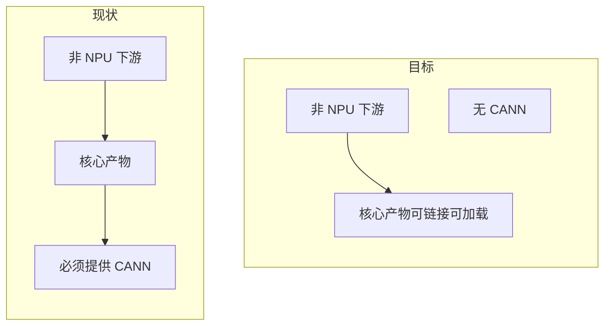
```mermaid
flowchart LR
    subgraph Now["现状"]
        NApp["非 NPU 下游"] --> NDS["核心产物"]
        NDS --> NCANN["必须提供 CANN"]
    end
    subgraph Target["目标"]
        TApp["非 NPU 下游"] --> TDS["核心产物可链接可加载"]
        TCANN["无 CANN"] ~~~ TDS
    end
    Now ~~~ Target
```

- **U1 非 NPU 使用不受 CANN 限制**：函数系统等下游只要不触发 NPU/CANN 能力，就可以在未安装 CANN、
  未配置 CANN 库搜索路径的环境中完成链接和启动，并正常使用 KV、Object、Stream 等核心能力。
- 这一目标同时适用于 `libdatasystem.so` 和 Worker 主体共享库；验收以真实下游链接、进程加载和非 HCCS
  冒烟用例为准。

### 2.3 HCCS 可用性与故障可诊断（U2）

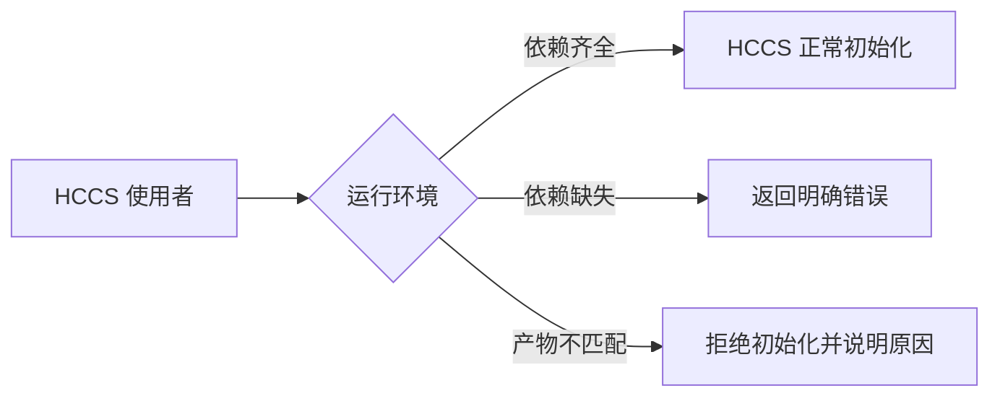
```mermaid
flowchart LR
    User["HCCS 使用者"] --> Check{"运行环境"}
    Check -->|依赖齐全| Ready["HCCS 正常初始化"]
    Check -->|依赖缺失| Error["返回明确错误"]
    Check -->|产物不匹配| Mismatch["拒绝初始化并说明原因"]
```

- **U2 HCCS 行为明确**：依赖齐全时，用户继续通过现有配置启用 HCCS，不需要改变业务 API；依赖不满足
  时，失败发生在 HCCS 初始化边界，并通过现有状态和日志渠道说明缺少的运行库、可选能力产物或兼容性条件。
- HCCS 初始化失败不得导致进程崩溃，也不得静默切换为 ROCE。未选择 HCCS 的用户不感知 HCCS 运行时
  是否存在。

### 2.4 HCCS 功能与性能稳定（U3）

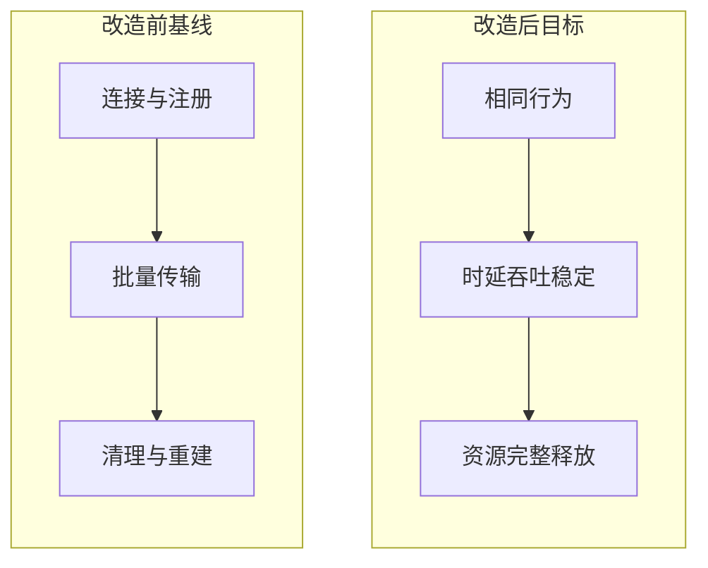
```mermaid
flowchart LR
    subgraph Before["改造前基线"]
        B1["连接与注册"] --> B2["批量传输"] --> B3["清理与重建"]
    end
    subgraph After["改造后目标"]
        A1["相同行为"] --> A2["时延吞吐稳定"] --> A3["资源完整释放"]
    end
    Before ~~~ After
```

- **U3 行为兼容**：HCCS 用户现有的多设备初始化、连接管理、预注册与临时注册、批量传输、断连清理和
  fork 后重建语义保持不变，公共 SDK 接口不发生不兼容变化。
- 在同一硬件、CANN 版本、数据规模和并发配置下，关键 HCCS 传输用例的 P99 时延回退不超过 3%，吞吐
  下降不超过 3%；初始化与反初始化后不新增共享库句柄、engine 或注册内存泄漏。

### 2.5 关键约束（非用户目标）

- `-X on` 的 NPU 构建机仍需提供 CANN SDK、头文件和链接库；本设计只改变核心产物的下游链接及运行时
  依赖语义。
- `libdatasystem.so` 和 Worker 主体共享库不得直接依赖 `libascendcl.so`、`libcann_hixl.so`、
  `libmetadef.so`；仅按需使用的叶子能力产物允许保留这些依赖。
- CMake、Bazel、旧版 C++ SDK、新版 C++ SDK、Service 和 Python wheel 对 U1、U2 的行为必须一致。
- `transfer_engine` 维持独立组件和现有延迟导入语义，不纳入本次核心产物依赖验收。
- 不新增 HCCS 到 ROCE 的自动降级，也不改变公开 SDK 接口、远端通信协议、持久化格式或恢复数据。

---

## 3. 用户 UseCase

本章以 Datasystem 核心产物为黑盒，只描述使用者的操作、预期结果和可感知异常，不展开内部依赖隔离方式。

### A. 正常集成与使用

#### UseCase1 — 无 CANN 环境集成 Datasystem SDK

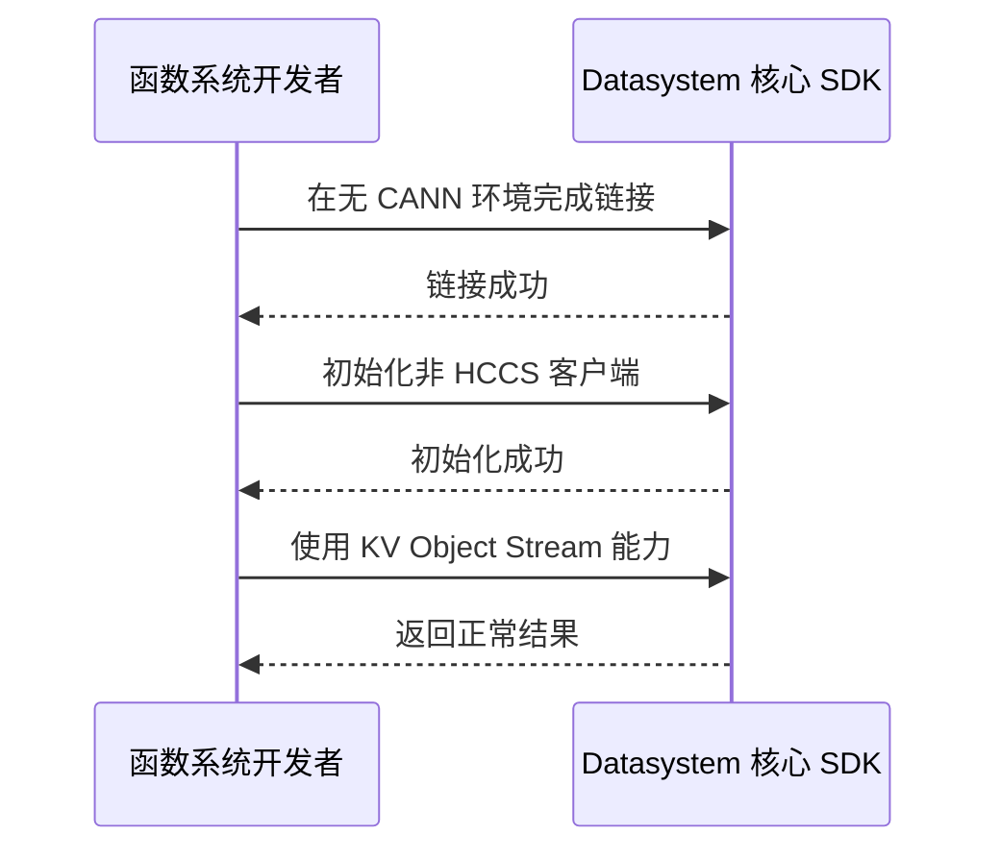
```mermaid
sequenceDiagram
    participant User as 函数系统开发者
    participant DS as Datasystem 核心 SDK

    User->>DS: 在无 CANN 环境完成链接
    DS-->>User: 链接成功
    User->>DS: 初始化非 HCCS 客户端
    DS-->>User: 初始化成功
    User->>DS: 使用 KV Object Stream 能力
    DS-->>User: 返回正常结果
```

**场景**：函数系统或其他下游组件使用 `-X on` 生成的 Datasystem SDK，但其构建和运行节点没有安装
CANN，也不启用 HCCS。

**用户感知**：

- 无须添加 CANN 库目录、链接选项或部署文件即可完成下游链接和程序启动。
- KV、Object、Stream 及非 HCCS 能力的接口和行为与改造前一致。

#### UseCase2 — 无 CANN 节点部署非 NPU Worker

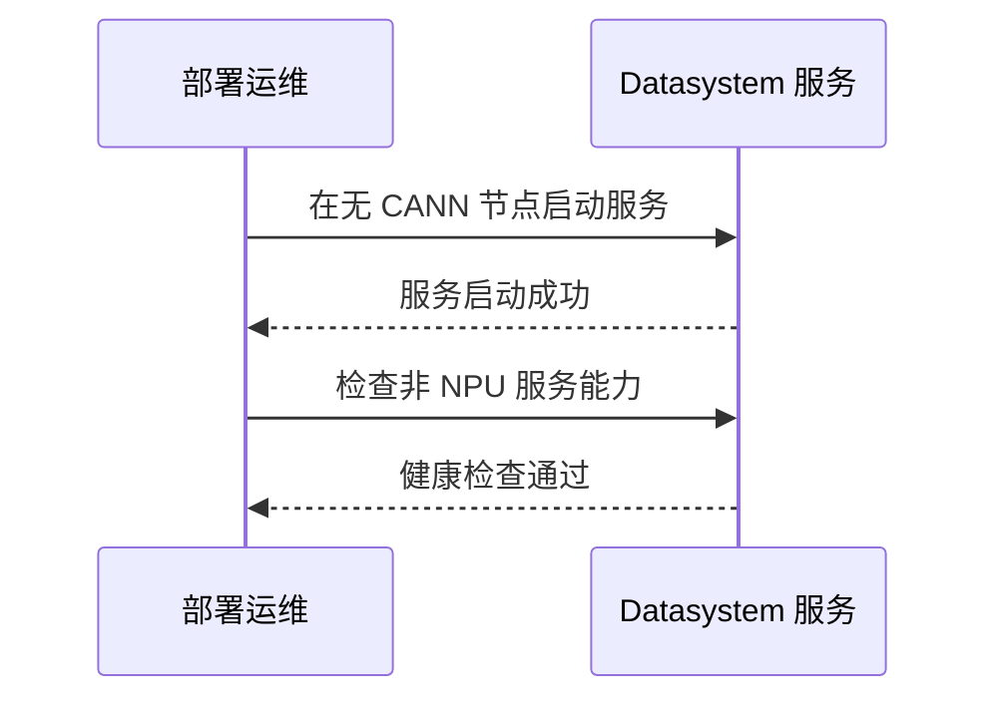
```mermaid
sequenceDiagram
    participant Ops as 部署运维
    participant DS as Datasystem 服务

    Ops->>DS: 在无 CANN 节点启动服务
    DS-->>Ops: 服务启动成功
    Ops->>DS: 检查非 NPU 服务能力
    DS-->>Ops: 健康检查通过
```

**场景**：同一份发布包部署到不启用 Remote H2D 和其他 NPU 能力的节点，该节点没有安装 CANN 运行时。

**用户感知**：

- Worker 主体不会因为未使用的 HCCS 能力缺少依赖而在进程装载阶段退出。
- 非 NPU 服务能够启动、通过健康检查并处理正常请求。

#### UseCase3 — 依赖齐全时使用 HCCS

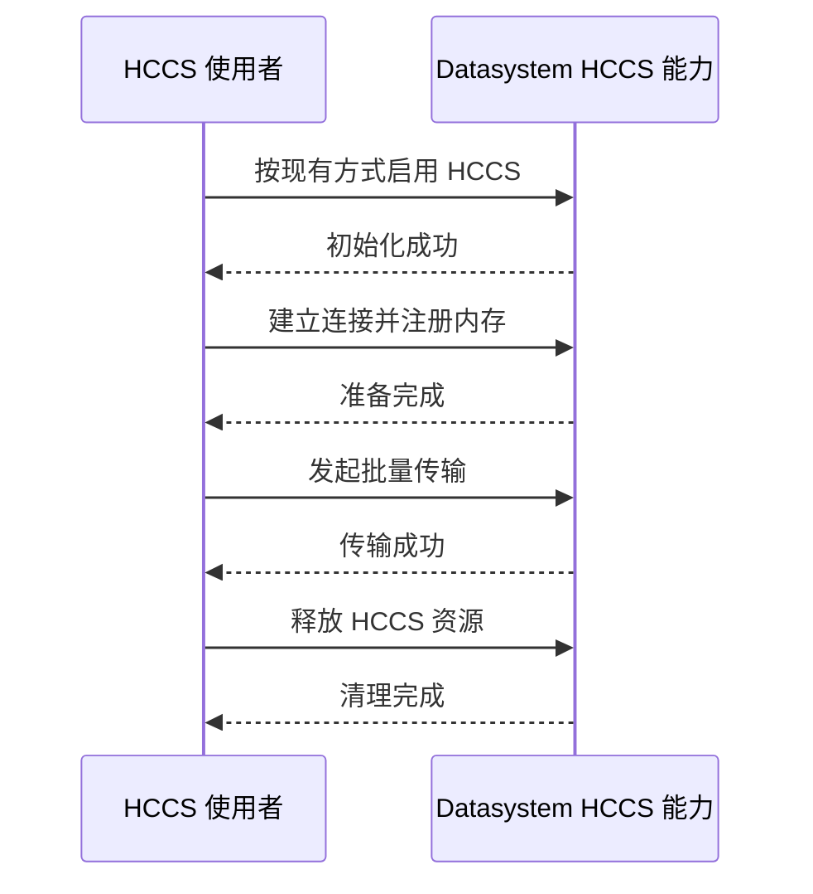
```mermaid
sequenceDiagram
    participant User as HCCS 使用者
    participant DS as Datasystem HCCS 能力

    User->>DS: 按现有方式启用 HCCS
    DS-->>User: 初始化成功
    User->>DS: 建立连接并注册内存
    DS-->>User: 准备完成
    User->>DS: 发起批量传输
    DS-->>User: 传输成功
    User->>DS: 释放 HCCS 资源
    DS-->>User: 清理完成
```

**场景**：运行环境已安装兼容的 CANN，发布包中的可选 HCCS 能力产物完整，用户沿用现有参数启用
Remote H2D HCCS。

**用户感知**：

- 不需要修改现有业务 API、配置入口和调用顺序。
- 多设备初始化、连接、内存注册、批量传输和清理结果保持一致。

### E. 故障与变更

#### UseCase4 — HCCS 运行依赖不可用

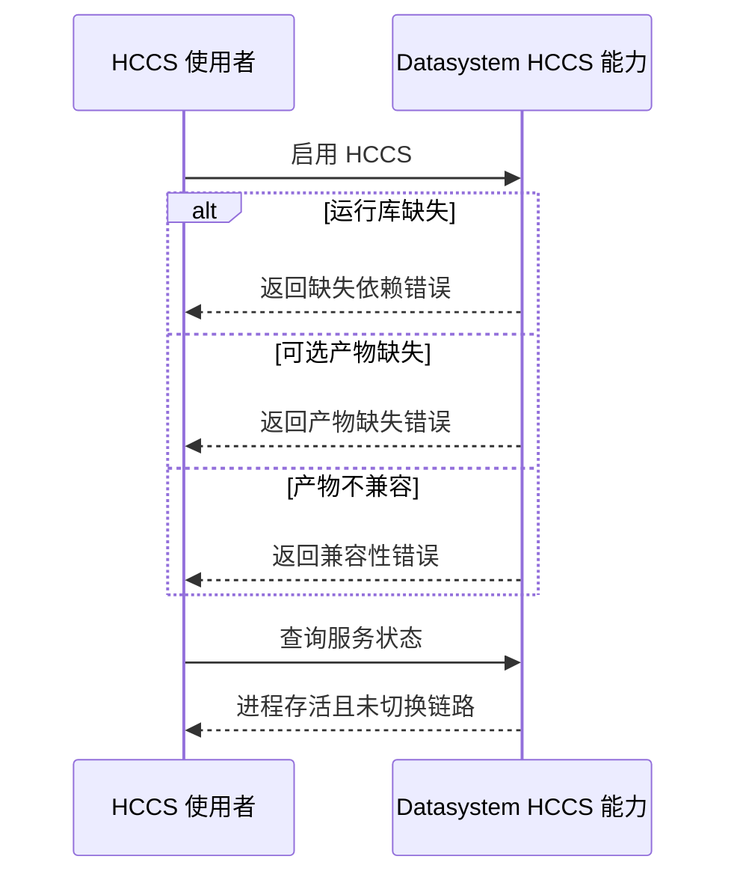
```mermaid
sequenceDiagram
    participant User as HCCS 使用者
    participant DS as Datasystem HCCS 能力

    User->>DS: 启用 HCCS
    alt 运行库缺失
        DS-->>User: 返回缺失依赖错误
    else 可选产物缺失
        DS-->>User: 返回产物缺失错误
    else 产物不兼容
        DS-->>User: 返回兼容性错误
    end
    User->>DS: 查询服务状态
    DS-->>User: 进程存活且未切换链路
```

**场景**：用户明确选择 HCCS，但部署环境缺少目标 CANN SO、缺少可选 HCCS 产物，或主体与可选产物
版本不匹配。

**用户感知**：

- 初始化返回非成功状态，日志指出失败对象和失败类别，进程不因依赖解析失败而崩溃。
- Datasystem 不把失败静默解释为 ROCE，也不产生部分可用但无法诊断的 HCCS 状态。

#### UseCase5 — 升级后运行现有 HCCS 负载

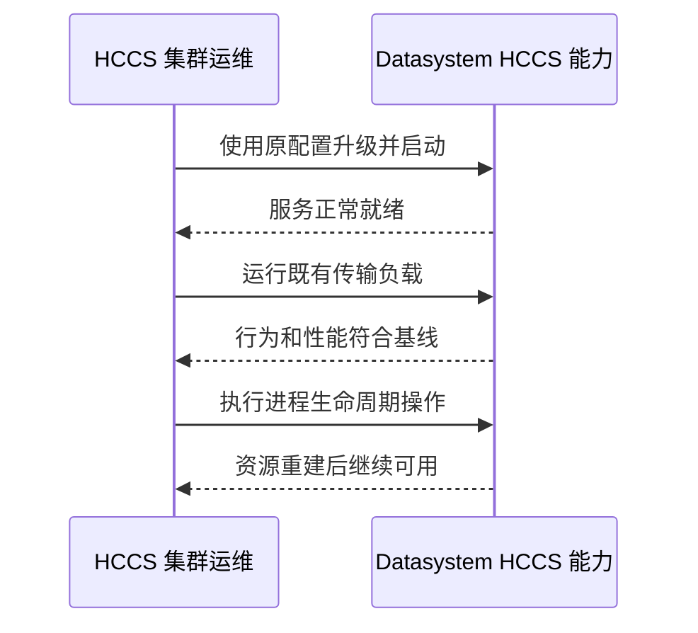
```mermaid
sequenceDiagram
    participant Ops as HCCS 集群运维
    participant DS as Datasystem HCCS 能力

    Ops->>DS: 使用原配置升级并启动
    DS-->>Ops: 服务正常就绪
    Ops->>DS: 运行既有传输负载
    DS-->>Ops: 行为和性能符合基线
    Ops->>DS: 执行进程生命周期操作
    DS-->>Ops: 资源重建后继续可用
```

**场景**：已有 HCCS 集群升级到新版本，继续使用原有配置、数据规模、并发度和进程生命周期模式。

**用户感知**：

- 功能、错误语义和资源清理结果不发生不兼容变化。
- 固定基准下 P99 时延回退不超过 3%，吞吐下降不超过 3%，长时间运行无新增资源泄漏。

### UseCase 与目标映射

| UseCase | 覆盖目标 |
|---|---|
| UseCase1 — 无 CANN 环境集成 Datasystem SDK | U1 |
| UseCase2 — 无 CANN 节点部署非 NPU Worker | U1 |
| UseCase3 — 依赖齐全时使用 HCCS | U2、U3 |
| UseCase4 — HCCS 运行依赖不可用 | U2 |
| UseCase5 — 升级后运行现有 HCCS 负载 | U3 |

---

## 4. 整体设计

### 4.1 模块划分

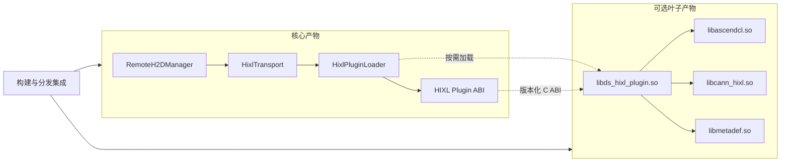
```mermaid
flowchart LR
    subgraph Core["核心产物"]
        Manager["RemoteH2DManager"] --> Transport["HixlTransport"]
        Transport --> Loader["HixlPluginLoader"]
        Loader --> ABI["HIXL Plugin ABI"]
    end
    subgraph Optional["可选叶子产物"]
        Plugin["libds_hixl_plugin.so"]
        Plugin --> ACL["libascendcl.so"]
        Plugin --> HIXL["libcann_hixl.so"]
        Plugin --> META["libmetadef.so"]
    end
    Loader -.->|按需加载| Plugin
    ABI -.->|版本化 C ABI| Plugin
    Build["构建与分发集成"] --> Core
    Build --> Optional
```

设计将 HCCS 传输语义保留在 Datasystem 核心侧，将所有 CANN/HIXL C++ 类型和直接链接依赖收敛到一个
可选叶子插件。核心侧只持有版本化 C ABI 定义和动态加载器，不直接解析厂商 C++ 符号。

| 模块 | 现状 | 职责与改造方式 | 对应目标 |
|---|---|---|---|
| **RemoteH2DManager** | 已有，位于 `src/datasystem/common/rdma/npu` | **改造**：保持 ROCE/HCCS 策略选择及既有生命周期；保存事务式初始化结果，并经客户端首次 HCCS 操作和 Worker 启动状态链传播；不直接感知 CANN 类型 | U1、U2、U3 |
| **HixlTransport** | 已有，直接调用 HIXL C++ API | **改造**：继续实现 `RH2DTransportStrategy` 和 Datasystem 侧 HCCS 语义；移除 HIXL 头文件、对象和句柄类型，改为使用插件 ABI | U1、U2、U3 |
| **HixlPluginLoader** | 不存在 | **新建**：负责插件定位、完整性校验、`dlopen`、入口解析、ABI 协商和加载状态缓存；复用 `dlutils.h`、文件与 hash 工具，不抽取跨设备通用框架 | U1、U2 |
| **HIXL Plugin ABI** | 不存在 | **新建**：定义主体与插件唯一共享的版本化 C 接口；只允许定长整数、POD 描述符和不透明句柄，不出现 STL、Datasystem `Status` 或厂商类型 | U1、U2、U3 |
| **libds_hixl_plugin.so** | 不存在 | **新建**：封装 HIXL C++ API、engine、注册句柄和厂商数据结构；作为唯一直接链接三个 CANN SO 的 HIXL 产物 | U1、U2、U3 |
| **构建与分发集成** | CMake/Bazel 将 HIXL 链接依赖传播给主体；现有打包只认识 ACL/CUDA 插件 | **改造**：拆分核心目标与插件目标，并将插件、hash 和依赖审计规则一致地覆盖 CMake、Bazel、SDK、Service、Python | U1、U2 |

#### RemoteH2DManager

`RemoteH2DManager` 不改变公开 SDK；内部增加只读初始化结果接口，使当前构造阶段被日志吞掉的错误能够沿既有
`Status` 链返回：

```cpp
class RemoteH2DManager {
public:
    Status Init();
    Status Uninit();
    Status GetInitStatus() const;
    Status ScatterBatch(P2pScatterEntry *entries, uint32_t size,
                        std::shared_ptr<RemoteH2DContext> context);
    static Status SetRH2DLocalEndpointIp(const std::string &localIp);
    static Status SetClientRemoteH2DConfig(bool enableRemoteH2D, uint32_t devId,
                                           const std::string &localIp = "");
};
```

`GetInitStatus` 只供 Common/RDMA 内部 wrapper 和 Worker 初始化代码使用，不属于公开 SDK。该模块不新增公开
SDK 参数，也不承担插件路径、符号和厂商错误码解析。HCCS transport 初始化失败继续通过 `Status` 边界向
调用方报告。

**性能规格**：

| 指标 | 设计目标 | 说明 |
|---|---|---|
| 新增线程 | 0 | 不为插件加载新增后台线程 |
| 新增热路径锁 | 0 | 保持现有 Manager 与 transport 并发边界 |
| 非 HCCS 路径插件访问 | 0 次 | ROCE 和未启用 Remote H2D 时不访问 HIXL 插件 |

#### HixlTransport

`HixlTransport` 继续实现现有策略接口，调用方不感知插件存在：

```cpp
class HixlTransport final : public RH2DTransportStrategy {
public:
    Status Init(const std::vector<int32_t> &deviceIds) override;
    Status Connect(const std::string &remoteIdentity, P2pKind kind,
                   std::function<int()> *heartbeatCallback) override;
    Status Disconnect(const std::string &remoteIdentity) override;
    Status DisconnectAll() override;
    Status RegisterMemory(void *addr, uint64_t size, P2pSegmentInfo *segInfo) override;
    Status PreRegisterDeviceMemory(const std::vector<void *> &addrs,
                                   const std::vector<uint64_t> &sizes) override;
    Status UnregisterDeviceMemory(const std::vector<void *> &addrs) override;
    Status ScatterBatch(P2pScatterEntry *entries, uint32_t count,
                        const std::string &remoteEndpoint,
                        std::shared_ptr<aclrtStream> stream) override;
};
```

模块继续负责 Datasystem 地址语义、批次切分、注册预算以及厂商结果到 `Status` 的上下文映射，但不保存或
传递任何 HIXL C++ 类型。

**性能规格**：

| 指标 | 设计目标 | 说明 |
|---|---|---|
| HIXL 操作间接调用 | 每次厂商操作最多 1 次 | 通过已缓存函数表调用，不在热路径执行 `dlsym` |
| 单次函数表分发增量 | < 1 μs | 单机基准测量 ABI 间接调用与元数据转换开销 |
| 数据载荷额外复制 | 0 字节 | 插件边界只传地址和长度，不复制用户数据 |
| 描述符稳态分配 | 不高于改造前 | 已知批量大小时预留并复用容量 |

#### HixlPluginLoader

```cpp
class HixlPluginLoader {
public:
    static HixlPluginLoader &Instance();
    Status GetApi(const DsHixlApi *&api);
};
```

`GetApi` 是加载器唯一模块级接口：首次 HCCS 初始化时执行定位、校验、加载和 ABI 协商，后续调用返回缓存
结果。加载句柄保持到进程结束，不向业务模块暴露 `dlopen` handle，也不提供请求路径卸载接口。

**性能规格**：

| 指标 | 设计目标 | 说明 |
|---|---|---|
| 插件加载次数 | 每进程最多 1 次 | 线程安全地缓存成功或失败状态 |
| `dlsym` 次数 | 每进程 1 次 | 只解析统一入口 `DsHixlGetApi` |
| 非 HCCS 初始化开销 | 0 | 不触发文件访问、hash 或动态加载 |

#### HIXL Plugin ABI 与 libds_hixl_plugin.so

插件只导出一个 C 入口；函数表中的具体操作集合在 §4.6 定义：

```c
int32_t DsHixlGetApi(uint32_t requestedAbiVersion, const DsHixlApi **api);
```

入口返回静态、只读的函数表。插件内部承担 C ABI 数据与 HIXL C++ 数据之间的转换，并拥有所有 engine、
注册句柄和厂商临时对象。核心产物不直接对三个 CANN SO 执行 `dlopen` 或 `dlsym`，而是加载插件，由动态
加载器根据插件的 `DT_NEEDED` 在该时刻装载三个厂商 SO。

**性能规格**：

| 指标 | 设计目标 | 说明 |
|---|---|---|
| 导出符号 | 1 个 | 降低 ABI 面积和符号误用风险 |
| HCCS P99 时延回退 | 不超过 3% | 与 §2 U3 一致 |
| HCCS 吞吐下降 | 不超过 3% | 与 §2 U3 一致 |
| engine 与注册句柄泄漏 | 0 | 资源必须在 transport 清理阶段释放 |

#### 构建与分发集成

该模块没有运行时 C++ 接口。它负责形成以下目标边界：核心目标只链接 `dl` 和 ABI 定义；插件目标私有链接
`libascendcl.so`、`libcann_hixl.so`、`libmetadef.so`。CMake 与 Bazel 产物语义保持一致，插件安装到与
实际加载主体相邻的 SDK、Service 和 Python 库目录，并纳入 hash、strip 顺序及依赖闭包检查。

**产物规格**：

| 指标 | 设计目标 | 说明 |
|---|---|---|
| 核心产物目标 CANN `DT_NEEDED` | 0 | 检查 `libdatasystem.so` 与 Worker 主体共享库 |
| HIXL 插件目标 CANN `DT_NEEDED` | 3 | 仅插件保留三个厂商加载依赖 |
| 构建系统覆盖 | 2 | CMake 与 Bazel |
| 分发形态覆盖 | 4 | 两套 C++ SDK、Service、Python |

### 4.2 模块交互

#### 非 NPU 路径

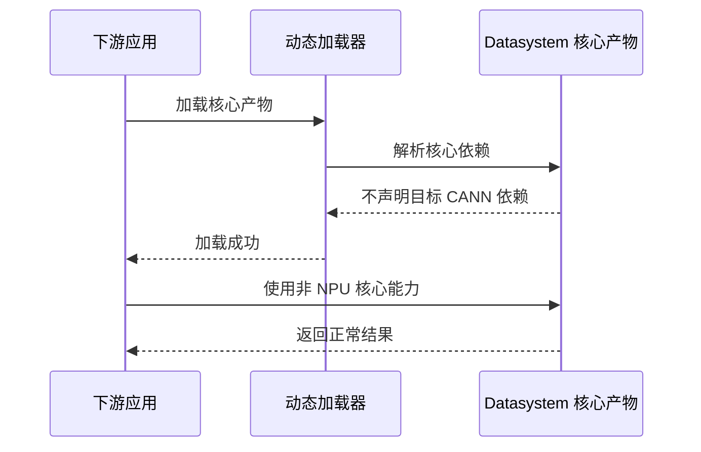
```mermaid
sequenceDiagram
    participant App as 下游应用
    participant Runtime as 动态加载器
    participant Core as Datasystem 核心产物

    App->>Runtime: 加载核心产物
    Runtime->>Core: 解析核心依赖
    Core-->>Runtime: 不声明目标 CANN 依赖
    Runtime-->>App: 加载成功
    App->>Core: 使用非 NPU 核心能力
    Core-->>App: 返回正常结果
```

未启用 Remote H2D 或未触发其他 NPU 能力时，核心产物的装载、初始化和请求路径都不查找 HIXL 插件，
也不访问 CANN 文件。插件是否随包分发、目标节点是否安装 CANN，都不影响该路径。

#### 首次 HCCS 初始化

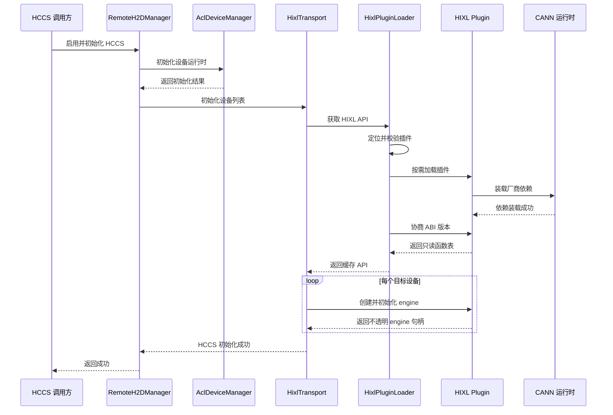
```mermaid
sequenceDiagram
    participant Caller as HCCS 调用方
    participant Manager as RemoteH2DManager
    participant ACL as AclDeviceManager
    participant Transport as HixlTransport
    participant Loader as HixlPluginLoader
    participant Plugin as HIXL Plugin
    participant CANN as CANN 运行时

    Caller->>Manager: 启用并初始化 HCCS
    Manager->>ACL: 初始化设备运行时
    ACL-->>Manager: 返回初始化结果
    Manager->>Transport: 初始化设备列表
    Transport->>Loader: 获取 HIXL API
    Loader->>Loader: 定位并校验插件
    Loader->>Plugin: 按需加载插件
    Plugin->>CANN: 装载厂商依赖
    CANN-->>Plugin: 依赖装载成功
    Loader->>Plugin: 协商 ABI 版本
    Plugin-->>Loader: 返回只读函数表
    Loader-->>Transport: 返回缓存 API
    loop 每个目标设备
        Transport->>Plugin: 创建并初始化 engine
        Plugin-->>Transport: 返回不透明 engine 句柄
    end
    Transport-->>Manager: HCCS 初始化成功
    Manager-->>Caller: 返回成功
```

插件加载发生在 `HixlTransport::Init`，且位于 HCCS 策略已经确定之后。加载器只解析统一入口，插件通过
自身 `DT_NEEDED` 触发三个 CANN SO 的装载。函数表成功协商后作为不可变数据缓存，engine 则按现有
设备列表逐个创建，生命周期归属 `HixlTransport`。

ACL 初始化顺序保持不变。若 `libascendcl.so` 已由 ACL 插件装载，系统动态加载器按 SONAME 复用已加载
实例；HIXL 插件不承担 ACL 全局初始化职责。

#### HCCS 批量传输热路径

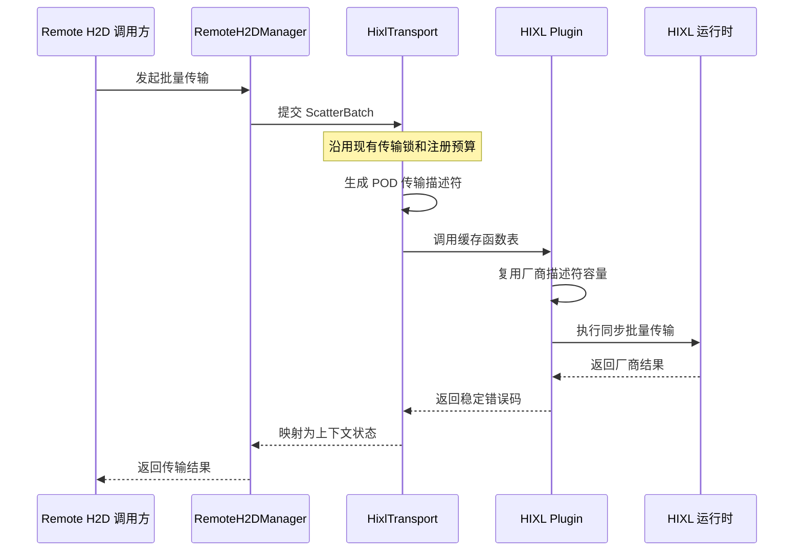
```mermaid
sequenceDiagram
    participant Caller as Remote H2D 调用方
    participant Manager as RemoteH2DManager
    participant Transport as HixlTransport
    participant Plugin as HIXL Plugin
    participant HIXL as HIXL 运行时

    Caller->>Manager: 发起批量传输
    Manager->>Transport: 提交 ScatterBatch
    Note over Transport: 沿用现有传输锁和注册预算
    Transport->>Transport: 生成 POD 传输描述符
    Transport->>Plugin: 调用缓存函数表
    Plugin->>Plugin: 复用厂商描述符容量
    Plugin->>HIXL: 执行同步批量传输
    HIXL-->>Plugin: 返回厂商结果
    Plugin-->>Transport: 返回稳定错误码
    Transport-->>Manager: 映射为上下文状态
    Manager-->>Caller: 返回传输结果
```

热路径不执行文件访问、hash、`dlopen` 或 `dlsym`。主体向插件传递地址、长度和数量，不跨边界复制数据
载荷。插件复用 engine 所属的厂商描述符缓冲，避免在现有 `vector<hixl::TransferOpDesc>` 分配之外增加
稳态堆分配；现有 `transferMutex_` 继续覆盖传输与临时注册句柄生命周期。

#### 插件或运行时不可用

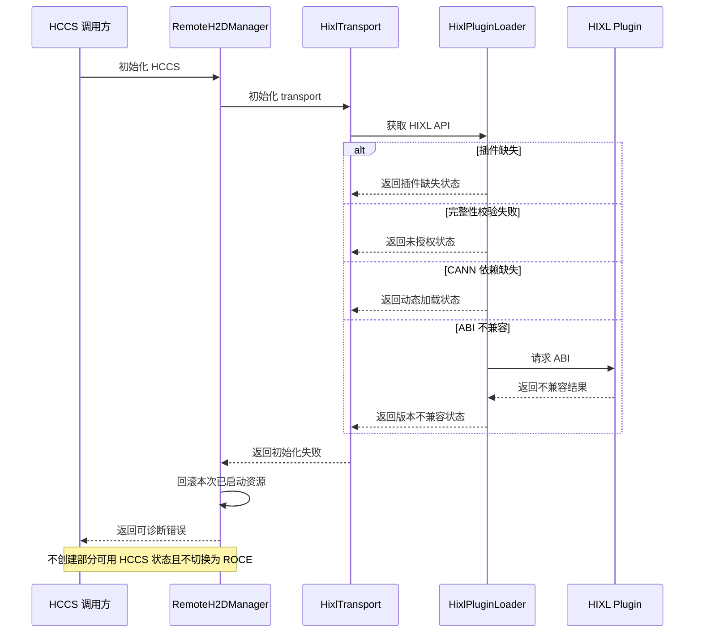
```mermaid
sequenceDiagram
    participant Caller as HCCS 调用方
    participant Manager as RemoteH2DManager
    participant Transport as HixlTransport
    participant Loader as HixlPluginLoader
    participant Plugin as HIXL Plugin

    Caller->>Manager: 初始化 HCCS
    Manager->>Transport: 初始化 transport
    Transport->>Loader: 获取 HIXL API
    alt 插件缺失
        Loader-->>Transport: 返回插件缺失状态
    else 完整性校验失败
        Loader-->>Transport: 返回未授权状态
    else CANN 依赖缺失
        Loader-->>Transport: 返回动态加载状态
    else ABI 不兼容
        Loader->>Plugin: 请求 ABI
        Plugin-->>Loader: 返回不兼容结果
        Loader-->>Transport: 返回版本不兼容状态
    end
    Transport-->>Manager: 返回初始化失败
    Manager->>Manager: 回滚本次已启动资源
    Manager-->>Caller: 返回可诊断错误
    Note over Caller,Manager: 不创建部分可用 HCCS 状态且不切换为 ROCE
```

加载器将插件缺失、完整性失败、厂商依赖缺失、入口缺失和 ABI 不兼容区分为可诊断状态，并缓存首次
加载结果。若失败发生在部分设备 engine 已创建之后，`HixlTransport` 先销毁本次已创建的 engine；
`RemoteH2DManager` 再停止本次启动的线程并撤销 ACL 和通信资源，确保 `Init` 对调用方呈现全成功或全失败。

错误传播不依赖构造函数返回值。Manager 构造函数把 `Init` 结果保存为进程内生命周期状态；启用 Remote H2D
的客户端在首次获得设备号并调用 `SetClientRemoteH2DConfig` 后立即读取该状态，因此 `MGetH2D`、
`PreRegisterDeviceMemory` 等首次 HCCS 操作直接返回初始化错误。Worker 在设置 HCCS 本地地址后、初始化共享
内存前通过 Common/RDMA 内部 wrapper 显式读取该状态，失败则终止本次 Worker 启动。Manager 的 HCCS 公开
操作入口还必须先检查该状态，作为遗漏初始化检查时的防御边界。普通 `HeteroClient::Init`、未启用 NPU 的
Worker 和 ROCE 路径不触发 HIXL 插件加载。

失败缓存与现有 ACL 插件 `call_once` 语义一致。进程运行期间替换插件或补装运行库不会触发原地重试，恢复
方式是修复部署后重启进程，避免同一进程出现混合版本函数表。

#### 正常卸载与 fork 重建

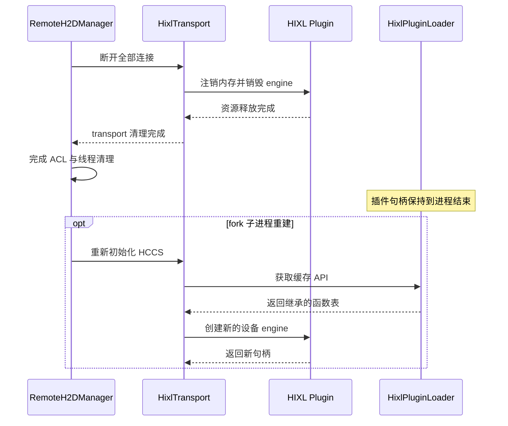
```mermaid
sequenceDiagram
    participant Manager as RemoteH2DManager
    participant Transport as HixlTransport
    participant Plugin as HIXL Plugin
    participant Loader as HixlPluginLoader

    Manager->>Transport: 断开全部连接
    Transport->>Plugin: 注销内存并销毁 engine
    Plugin-->>Transport: 资源释放完成
    Transport-->>Manager: transport 清理完成
    Manager->>Manager: 完成 ACL 与线程清理
    Note over Loader: 插件句柄保持到进程结束
    opt fork 子进程重建
        Manager->>Transport: 重新初始化 HCCS
        Transport->>Loader: 获取缓存 API
        Loader-->>Transport: 返回继承的函数表
        Transport->>Plugin: 创建新的设备 engine
        Plugin-->>Transport: 返回新句柄
    end
```

transport 卸载必须先释放连接、注册句柄和 engine，再完成 ACL 清理。加载器不在 `Uninit`、析构或 fork
回调中执行 `dlclose`，避免厂商后台状态、静态析构和并发调用与代码段卸载竞争。

fork 子进程继承插件映射和只读函数表，但不复用父进程 engine 或注册句柄。现有 `AfterFork` 流程继续执行
transport 清理与重新初始化，并通过缓存函数表创建子进程自己的 HIXL 资源。

### 4.3 关键设计机制

#### D1. 拆分核心 ELF 与 HIXL 插件依赖（UseCase1、UseCase2）

```mermaid
flowchart LR
    subgraph Core["核心链接闭包"]
        LDS["libdatasystem.so"] --> CR["common_rdma"]
        Worker["Worker 主体共享库"] --> CR
        CR --> DL["libdl"]
    end
    subgraph Leaf["可选链接闭包"]
        Plugin["libds_hixl_plugin.so"] --> ACL["libascendcl.so"]
        Plugin --> HIXL["libcann_hixl.so"]
        Plugin --> META["libmetadef.so"]
    end
    CR -.->|运行期加载| Plugin
```

HIXL 实现源码不再以直接使用厂商 API 的形态编入 `common_rdma`。`common_rdma` 只包含 Datasystem 侧
transport、加载器和 ABI 定义，并只新增对 `libdl` 的链接；三个 CANN 库全部从其链接接口移除。

`libds_hixl_plugin.so` 是独立共享目标，私有链接三个 CANN SO。由此，CANN 依赖只存在于插件自己的
`DT_NEEDED`，不进入 `libdatasystem.so` 或 Worker 主体共享库。该机制同时约束 CMake 和 Bazel，不能只在
一种构建系统中修复。

> **需新增产物**：`libds_hixl_plugin.so`。

#### D2. 新增版本化 C ABI 函数表（UseCase3、UseCase4、UseCase5）

```mermaid
flowchart LR
    Core["核心 C++ 代码"] --> POD["定长 POD 与不透明句柄"]
    POD --> Entry["DsHixlGetApi"]
    Entry --> Table["只读函数表"]
    Table --> Adapter["插件 C++ 适配层"]
    Adapter --> Vendor["HIXL C++ API"]
```

主体不直接 `dlsym` HIXL 的 C++ 方法。HIXL 方法包含 C++ 名字修饰、STL 容器和 `AscendString`，直接解析
这些符号会把编译器 ABI、libstdc++ ABI 和 CANN 版本差异扩散到核心产物。

插件只导出 `DsHixlGetApi`。调用方提交所支持的 ABI 版本，插件返回包含 `abiVersion`、`structSize` 和操作
函数指针的静态只读表。主版本必须匹配，返回结构长度必须覆盖调用方所需字段；新增尾部字段可以通过
`structSize` 保持向前扩展能力。

共享头文件只允许以下类型：

- `int32_t`、`uint32_t`、`uint64_t`、`uintptr_t` 等定长标量；
- 指针加长度表达的只读字符串、选项和传输描述符数组；
- engine、注册内存等资源的不透明句柄；
- 稳定的插件结果码和可选厂商原始错误码。

共享头文件禁止出现 `std::string`、`std::vector`、`std::map`、Datasystem `Status`、protobuf、
`hixl::*`、`ge::*` 或 ACL/HCCL 类型。所有导出函数均为 C linkage，插件其他符号默认隐藏。

> **需新增接口**：`DsHixlGetApi` 及 `DsHixlApi` 版本化函数表。

#### D3. 新增确定且可信的插件加载（UseCase3、UseCase4）

```mermaid
flowchart TB
    Trigger["首次 HCCS 初始化"] --> Locate["定位核心产物同目录"]
    Locate --> Size["检查文件类型与大小"]
    Size --> Hash["校验构建期 SHA256"]
    Hash --> Load["RTLD_NOW 与 RTLD_LOCAL"]
    Load --> Symbol["解析唯一入口"]
    Symbol --> ABI["校验 ABI 版本与长度"]
    ABI --> Cache["缓存不可变结果"]
```

加载器通过 `dladdr` 获取自身所在核心共享库的真实路径，只接受同目录下固定名称
`libds_hixl_plugin.so`。不根据当前工作目录查找，不提供环境变量覆盖路径，也不遍历任意
`LD_LIBRARY_PATH` 目录，避免加载到其他 Datasystem 版本的同名插件。SDK、Service 和 Python 分发必须把
插件安装到对应主体旁边。

加载前复用现有文件读取、大小限制、SHA256 和构建期 hash 生成能力。hash 对最终 strip 后的插件计算；SDK、
Service 和 Python 分发按 `acl_plugin` 同类 hash 校验产物处理，hash 生成后不得在后续打包阶段再次 strip 或
修改插件内容。hash 不匹配返回 `K_NOT_AUTHORIZED`，其余能力不可用场景返回
`K_NOT_SUPPORTED` 并保留具体失败阶段。

插件以 `RTLD_NOW | RTLD_LOCAL` 打开。与现有 ACL 插件的 `RTLD_LAZY` 不同，HIXL 插件在初始化阶段解析
全部必需符号，使不兼容的 CANN 运行时在 HCCS 对外可用前确定失败，而不是延迟到首次数据传输。

加载状态通过每进程一次性初始化保护。成功状态缓存函数表；失败状态缓存错误，防止并发初始化重复读取文件
或反复装载不兼容依赖。

#### D4. 改造为事务式初始化与错误闭环（UseCase3、UseCase4）

```mermaid
flowchart TB
    Start["开始 HCCS 初始化"] --> Load["获得插件 API"]
    Load --> Devices["逐设备创建 engine"]
    Devices --> Complete{"全部成功"}
    Complete -->|是| Commit["提交 initialized 状态"]
    Complete -->|否| Rollback["逆序销毁本次资源"]
    Rollback --> Manager["撤销 Manager 启动资源"]
    Manager --> Error["向调用方返回错误"]
```

`HixlTransport::Init` 在本地临时集合中创建 engine。只有插件加载、ABI 校验和全部目标设备初始化成功后，
才提交 engine 集合并设置 `initialized_`。任一步骤失败都逆序销毁本次创建的资源，原有 transport 状态不被
部分覆盖。

`RemoteH2DManager::Init` 将线程启动、ACL 初始化、设备准备和 transport 初始化视为一个初始化事务。
后续步骤失败时，只回滚本次成功启动的资源并返回原始错误。现有构造阶段“只记录初始化错误”的行为需要
调整为保存 `initStatus_`。客户端的 `SetClientRemoteH2DConfig` 在配置提交后返回该状态；Worker 在共享内存
初始化前通过内部 wrapper 返回该状态；所有 HCCS 操作入口先检查该状态。这样调用方可以感知 HCCS 不可用，
且后台线程不会停留在半初始化状态。fork 子进程重建后覆盖 `initStatus_`，重建失败时后续操作一致失败。

错误语义如下：

| 失败类别 | Datasystem 状态 | 用户可见信息 |
|---|---|---|
| 插件不存在或目标 CANN SO 不可装载 | `K_NOT_SUPPORTED` | 插件名称、缺失依赖或 `dlopen` 阶段 |
| 插件入口不存在或 ABI 不兼容 | `K_NOT_SUPPORTED` | 请求版本、实际版本或缺失入口 |
| 插件完整性校验失败 | `K_NOT_AUTHORIZED` | 主体与插件不匹配或文件被修改 |
| HIXL 初始化和运行操作失败 | `K_RUNTIME_ERROR` | 操作名、设备或远端上下文、厂商错误码 |
| 调用参数不合法 | `K_INVALID` | 参数类别和合法范围 |

任何 HCCS 初始化失败都不修改 `remote_h2d_link_type`，不创建部分可用状态，也不触发 ROCE 自动降级。

#### D5. 改造资源所有权与热路径边界（UseCase3、UseCase5）

```mermaid
flowchart TB
    Loader["进程级 Loader"] -->|持有| Handle["插件 handle 与函数表"]
    Transport["HixlTransport"] -->|持有| Engines["不透明 engine 句柄"]
    Transport -->|持有| Registrations["不透明注册句柄"]
    Engines -->|插件内部拥有| VendorEngine["HIXL engine"]
    Registrations -->|插件内部拥有| VendorMem["HIXL MemHandle"]
    VendorEngine --> Scratch["可复用描述符缓冲"]
```

所有权与并发约束如下：

| 对象 | 所有者与生命周期 | 并发保护 |
|---|---|---|
| 插件 handle 与 API 表 | `HixlPluginLoader` 进程级持有，进程结束前不卸载 | 一次性初始化；成功后只读 |
| engine 句柄 | `HixlTransport` 按设备持有，初始化提交后到 `DisconnectAll` | 沿用 transport 生命周期边界 |
| 连接集合 | `HixlTransport` 持有 | 沿用 `connMutex_` |
| 长期与临时注册句柄 | `HixlTransport` 记录令牌，插件拥有厂商对象 | 沿用 `transferMutex_` |
| 厂商传输描述符缓冲 | 插件按 engine 持有并复用 | 由调用侧现有 `transferMutex_` 串行保护 |

`connMutex_` 与 `transferMutex_` 保持不嵌套：断连阶段先结束连接临界区，再进入注册资源清理。插件不得在
持有内部锁时回调主体，也不得增加覆盖连接和传输两条路径的全局锁。

每个厂商操作只经过一次已缓存函数指针调用。跨 ABI 传递的只是描述符元数据，不复制数据载荷；插件侧为
厂商描述符预留并复用容量。性能验收采用 §2 U3 的 P99 和吞吐阈值。

#### D6. 新增构建分发一致性与 ELF 守卫（UseCase1、UseCase2、UseCase3）

```mermaid
flowchart LR
    Source["同一 ABI 与插件源码"] --> CMake["CMake 产物"]
    Source --> Bazel["Bazel 产物"]
    CMake --> Audit["ELF 与符号审计"]
    Bazel --> Audit
    Audit --> SDK["两套 C++ SDK"]
    Audit --> Service["Service"]
    Audit --> Python["Python wheel"]
```

CMake 与 Bazel 均建立独立插件共享目标，核心目标只能依赖 ABI 头、加载器和 `libdl`。分发阶段将最终插件
和对应 hash 安装到两个 C++ SDK、Service 与 Python 主体所在目录，并把插件加入 Python 依赖保留白名单
与安装后 strip 排除清单。

构建和发布流水线增加以下不可回退守卫：

- `libdatasystem.so` 与 Worker 主体共享库的 `DT_NEEDED` 不含三个目标 CANN SO；
- 核心产物的未定义符号中不含 `hixl::`、`ge::AscendString` 等厂商 C++ 符号；
- `libds_hixl_plugin.so` 的 `DT_NEEDED` 包含且仅由插件承担三个目标 CANN SO；
- 插件完成最终 strip 后生成 hash，打包过程不再改变文件；
- 无 CANN 环境能够链接和加载核心 SDK，并启动未启用 NPU 的 Worker；
- `transfer_engine` 产物从本次审计集合中明确排除，避免将独立组件的既有依赖误判为本设计回归。

#### 方案决策对比

| 候选方式 | 结论 | 原因 |
|---|---|---|
| 将 `common_rdma` 的 CANN 链接从 `PUBLIC` 改为 `PRIVATE` | 不采用 | 静态目标中的 HIXL 未解析符号仍需最终共享库解析，不能消除 `DT_NEEDED` |
| 在主体中直接 `dlsym` HIXL C++ 方法 | 不采用 | 依赖名字修饰、STL 和厂商 C++ ABI，跨版本兼容与诊断不可控 |
| 把 HIXL 适配加入现有 `libacl_plugin.so` | 不采用 | 会让普通 ACL 和 ROCE 使用也承担 HIXL 版本与依赖要求，扩大可选能力边界 |
| 静态链接三个 CANN 库 | 不采用 | 无法保证厂商静态产物与授权条件，且会扩大核心体积和版本耦合 |
| 仅使用 `-X off` 生成无 CANN SDK | 不采用 | 不能让同一份具备 NPU 能力的发布包被无 CANN 下游安全消费 |
| 独立 HIXL 插件加版本化 C ABI | 采用 | 同时隔离 ELF 依赖与厂商 C++ ABI，并保持 HCCS 按需可用 |

### 4.4 模块边界约束

| 约束 | 说明 | 反面（必须避免） |
|---|---|---|
| 核心依赖单向流向 ABI | 核心只能依赖稳定 ABI 头和 `libdl`，插件依赖 ABI 头与 CANN | 核心链接插件目标或任一目标 CANN SO |
| 厂商类型只存在于插件 | HIXL、GE、ACL 头及其 C++ 类型不得进入核心源文件、头文件和符号表 | 在 `HixlTransport` 成员、参数或返回值中保留 `hixl::*` 类型 |
| 插件不反向依赖核心实现 | 插件使用 C ABI 输入输出，不链接 `libdatasystem.so`，不调用核心日志、Status 或 protobuf | 形成核心与插件循环 `DT_NEEDED` 或跨边界 C++ ABI |
| 插件位置与主体版本绑定 | 只加载主体同目录固定名称插件，并在加载前验证最终产物 hash | 从当前目录或任意搜索路径接受未知同名插件 |
| 可用性在初始化期确定 | `RTLD_NOW`、入口和 ABI 校验必须在 HCCS 可用前完成 | 把符号缺失延迟到首次传输或资源清理阶段 |
| 函数表加载后不可变 | 每进程只协商一次，成功或失败结果均缓存到进程结束 | 运行中替换插件、重新协商或混用不同版本函数表 |
| 资源先于能力清理 | 连接、注册句柄、engine 必须先销毁；插件映射保持到进程结束 | 资源仍在使用时 `dlclose` 或先执行 ACL finalize |
| transport 锁边界不扩大 | 连接与传输继续使用各自现有锁且不嵌套，加载只发生在初始化路径 | 新增覆盖所有 engine 的全局热路径锁或插件回调核心 |
| 初始化全成或全败 | 任一设备或加载步骤失败必须回滚本次资源，不发布部分状态 | 部分 engine 可用、后台线程残留或自动切换 ROCE |
| 构建与分发语义一致 | CMake、Bazel 以及四类分发位置必须使用同一 ABI、插件名称和 ELF 守卫 | 只修 CMake 或只安装到 SDK 导致其他产物继续直链或找不到插件 |
| 公共协议保持兼容 | 不修改公开 SDK、RPC/protobuf、远端身份和传输数据语义 | 为插件加载新增业务参数或改变跨节点协议 |
| 独立组件不越界 | `transfer_engine` 保持现状并从本次核心产物审计集合排除 | 借本改造重构 Transfer Engine 或宣称整个发布包无任何 CANN 依赖 |

---

## 5. 对外参数与接口汇总

本特性不新增或修改公开 SDK 接口、RPC/protobuf、Worker 命令行参数及用户环境变量。现有
`remote_h2d_link_type=HCCS`、`DS_RH2D_LINK_TYPE` 和 `DS_HIXL_CS_ENABLE` 的配置入口与默认行为保持不变，
因此不在本章重复列为变更项。

### 5.1 SDK 初始化参数

无新增或变更。未使用 NPU 能力的 SDK 初始化不再受目标 CANN SO 是否存在影响；明确启用 HCCS 时仍通过
现有 Remote H2D 配置触发能力检查。

### 5.2 Worker 部署参数

无新增或变更。运维不需要配置插件路径，插件必须由发布包安装到核心主体同目录。

### 5.3 环境变量

无新增或变更。不提供覆盖插件路径、关闭完整性校验或切换 ABI 版本的环境变量。

### 5.4 新增分发产物

| 产物 | 分发位置 | 用户可见行为 |
|---|---|---|
| `libds_hixl_plugin.so` | 两套 C++ SDK、Service、Python 对应主体库目录 | 仅在 HCCS 初始化时加载 |
| HIXL 插件构建期 hash | 编译进对应核心主体，不作为独立用户文件发布 | 主体与插件不匹配时拒绝 HCCS 初始化 |

### 5.5 新增错误行为

| 触发条件 | 对外状态 | 行为 |
|---|---|---|
| HCCS 插件或目标 CANN SO 缺失 | `K_NOT_SUPPORTED` | HCCS 初始化失败，非 NPU 能力和进程本身不崩溃 |
| 插件入口或 ABI 不兼容 | `K_NOT_SUPPORTED` | 指出接口阶段和版本信息，要求部署匹配产物后重启 |
| 插件 hash 不匹配 | `K_NOT_AUTHORIZED` | 拒绝加载被修改或与主体版本不匹配的插件 |

> **需新增内部接口**：`DsHixlGetApi` 和 `DsHixlApi`。它们不是公开 SDK API，不承诺跨 Datasystem 发布
> 版本兼容，只保证同一发布物内主体与插件的显式版本协商。
