# 子模块：HIXL 动态加载（CANN 运行时依赖隔离）

| 属性 | 值 |
|---|---|
| 创建 | 2026-08-06（Issue #971 与概要设计） |
| 修改 | 2026-08-06（初版完整详细设计） |
| 阶段 | P1 ABI 与插件 / P2 构建分发 / P3 集成性能 |
| 前置 | `cann_dynamic_loading.md` / CANN HIXL 8.5.2+ / Remote H2D HCCS |
| 源码基线 | `origin/master@6b23deca` |

本文是《CANN 运行时依赖隔离概要设计》的子模块详细设计。设计范围限于 `libdatasystem.so`、Worker 主体、
Common/RDMA/HIXL 及其 CMake、Bazel、SDK、Service、Python 分发链路；`transfer_engine` 不在范围内。

## 1. 需求背景与目标

启用 HIXL/HCCS 后，`common_rdma` 将 HIXL C++ 实现和 `libascendcl.so`、`libcann_hixl.so`、
`libmetadef.so` 一并传播到核心共享库。函数系统等不使用 NPU 的下游也必须满足 CANN 的链接和加载条件，
而厂商 C++ 类型还进入了 `HixlTransport` 的成员布局和热路径。

本子模块将厂商实现隔离到按需加载的 `libds_hixl_plugin.so`，核心侧通过版本化 C ABI 调用插件，同时保持
现有 HCCS 接口、语义、并发边界和性能基线。

| # | 目标 | 验收 | 阶段 |
|---|---|---|---|
| G1 | 核心产物解除目标 CANN 加载依赖 | `libdatasystem.so` 与 Worker 主体的三个目标 `DT_NEEDED` 均为 0 | P1 |
| G2 | HCCS 运行时按需加载 | 未触发 NPU 时不访问插件或 CANN；首次 HCCS 初始化才加载 | P1 |
| G3 | 厂商 C++ ABI 不进入核心 | 核心源码、头文件和未定义符号均不含 `hixl::*`、`ge::*` | P1 |
| G4 | 故障可诊断且初始化闭合 | 缺插件、缺依赖、hash 失败、ABI 不兼容均返回确定状态且无资源残留 | P1、P3 |
| G5 | HCCS 行为与性能稳定 | 现有回归通过；P99 回退不超过 3%，吞吐下降不超过 3%，载荷额外复制为 0 | P3 |
| G6 | 构建和分发语义一致 | CMake、Bazel、两套 C++ SDK、Service、Python 全部通过产物审计 | P2 |

## 2. 需求边界

本模块是核心 Remote H2D HCCS 逻辑与 CANN HIXL C++ 实现之间的运行时适配层，不改变用户业务 API 和
远端传输协议。

### 2.1 关键概念

| 概念 | 定义 |
|---|---|
| 核心侧 | 编入 `libdatasystem.so` 和 Worker 主体的加载器、ABI 头与 `HixlTransport` |
| 插件侧 | 独立共享库 `libds_hixl_plugin.so` 及其 HIXL C++ 适配实现 |
| ABI v1 | 主体与插件共享的首版 C 函数表协议 |
| 不透明句柄 | 核心只保存和回传、不得解引用的 engine 或内存注册令牌 |
| 能力不可用 | 插件、目标 CANN SO、入口或兼容 ABI 任一条件不满足 |
| 核心产物审计集 | `libdatasystem.so` 与 Worker 主体共享库，不包含叶子插件和 `transfer_engine` |

### 2.2 做什么

| 端/组件 | 职责 |
|---|---|
| SDK 与 Worker 核心侧 | 使用相同的 HIXL 加载器和 ABI；不链接目标 CANN SO |
| `HixlTransport` | 保留 HCCS 业务语义、输入校验、注册预算、错误上下文和现有锁边界 |
| `HixlPluginLoader` | 固定路径定位、hash 校验、`dlopen`、入口解析、ABI 校验和结果缓存 |
| HIXL 插件 | 封装 HIXL C++ 对象、类型转换、厂商调用、异常捕获和描述符缓冲 |
| 构建系统 | 分离核心与插件目标，并生成与消费插件 hash |
| 打包系统 | 将插件安装到每个核心主体同目录并保持 hash 对应关系 |
| 测试与流水线 | 验证 ABI、错误分支、ELF 依赖、无 CANN 使用、HCCS 功能和性能 |

### 2.3 不做什么

| 事项 | 归属 |
|---|---|
| `transfer_engine` 的 HIXL 动态加载 | 独立后续设计 |
| 无 CANN SDK 的 NPU 编译 | 构建环境管理；`-X on` 仍要求 CANN SDK |
| ACL/HCCL/CUDA 插件重构 | 既有设备插件模块 |
| HCCS 失败后自动切换 ROCE | Remote H2D 策略语义，不在本次新增 |
| 修改公开 SDK、RPC 或 protobuf | 明确禁止 |
| 支持运行中替换插件或补装 CANN 后热重试 | **P3+ 暂不实现**；通过进程重启恢复 |
| 跨 Datasystem 发布版本混用主体与插件 | 不支持；由 hash 与 ABI 双重拒绝 |

## 3. UseCase

UseCase 仅将 Datasystem 视为黑盒，不描述内部 loader、transport 或插件。

### 3.1 非 NPU 集成与部署


| UseCase | 使用者 | 场景 | 需要什么 | 设计响应 | 验收 |
|---|---|---|---|---|---|
| UC1 | 下游开发者 | 无 CANN 环境链接 SDK | 不引入 CANN 链接配置 | 核心产物不声明目标 CANN `DT_NEEDED` | 下游 CMake 链接和程序加载成功 |
| UC2 | 部署运维 | 无 CANN 节点启动非 NPU Worker | 同一发布包可用于普通节点 | 未启用 NPU 时不加载可选能力 | Worker 启动和健康检查通过 |

### 3.2 正常 HCCS 使用

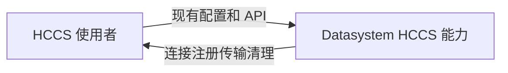

| UseCase | 使用者 | 场景 | 需要什么 | 设计响应 | 验收 |
|---|---|---|---|---|---|
| UC3 | HCCS 使用者 | 兼容 CANN 与完整发布包 | 原配置无修改且功能稳定 | 初始化期确定能力并保持原传输语义 | 现有 HCCS 回归全部通过 |

### 3.3 故障与升级

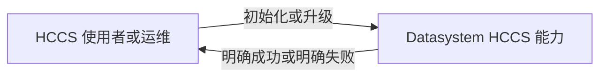

| UseCase | 使用者 | 场景 | 需要什么 | 设计响应 | 验收 |
|---|---|---|---|---|---|
| UC4 | HCCS 使用者 | 插件、CANN、hash 或 ABI 异常 | 不崩溃、不降级、错误可定位 | 初始化事务回滚并返回分类状态 | 四类故障注入均无资源残留 |
| UC5 | 集群运维 | 升级后运行既有负载和 fork 生命周期 | 行为、性能、资源释放保持稳定 | 保持现有锁与生命周期且不卸载插件 | 性能阈值、长稳和 fork 回归通过 |

### 3.4 UseCase 总表

| UseCase | 使用者 | 场景 | 需要什么 | 设计响应 | 验收 |
|---|---|---|---|---|---|
| UC1 | 下游开发者 | 无 CANN 链接 SDK | 核心 SDK 可独立消费 | 隔离核心 ELF 依赖 | 覆盖 G1、G2 |
| UC2 | 部署运维 | 无 CANN 启动普通 Worker | 非 NPU 服务可用 | 不触发可选能力 | 覆盖 G1、G2、G6 |
| UC3 | HCCS 使用者 | 正常 HCCS | 原接口和能力不变 | 按需加载并调用 ABI | 覆盖 G2、G3、G5 |
| UC4 | HCCS 使用者 | 依赖或版本异常 | 确定失败 | 分类错误与事务回滚 | 覆盖 G4 |
| UC5 | 集群运维 | 升级、长稳与 fork | 无性能和资源回归 | 稳定所有权与生命周期 | 覆盖 G5、G6 |

## 4. 方案设计

### 4.1 类图

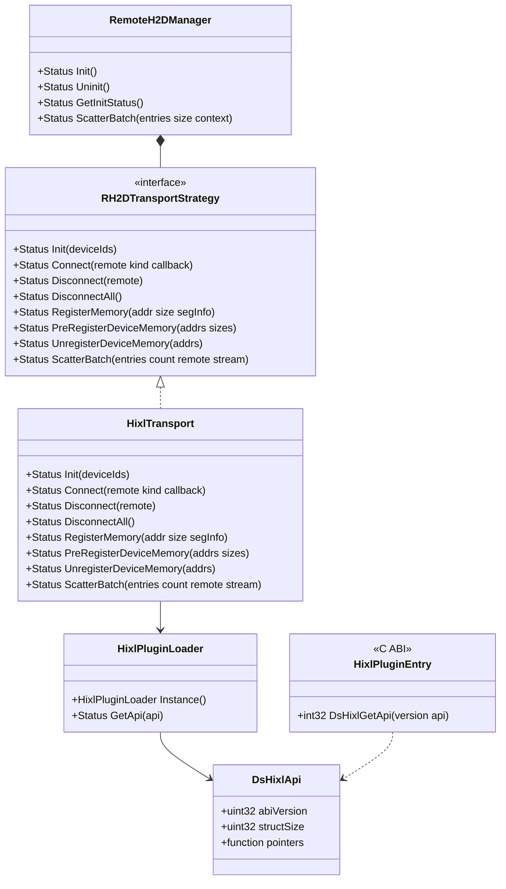

模块对外签名如下；未列出私有辅助函数和字段。

```cpp
class RemoteH2DManager {
public:
    Status GetInitStatus() const;
};
```

该接口是 Common/RDMA 内部生命周期接口，不进入公开 SDK。Worker 通过
`Status InitializeRemoteH2DManager()` wrapper 调用它，使非 NPU 构建保持 no-op。

```cpp
class HixlPluginLoader {
public:
    static HixlPluginLoader &Instance();
    Status GetApi(const DsHixlApi *&api);
};
```

```c
int32_t DsHixlGetApi(uint32_t requestedAbiVersion, const DsHixlApi **api);
```

`HixlTransport` 继续实现既有 `RH2DTransportStrategy`，不增加调用方可见方法。插件只暴露一个 C 入口，
函数表中的完整签名见 §4.5 与 §4.6。

### 4.2 开发视图

```text
src/datasystem/common/rdma/npu/
├── hixl_transport.h                         # 改造：移除 HIXL 头和厂商成员类型
├── hixl_transport.cpp                       # 改造：通过 DsHixlApi 执行 HCCS 操作
├── hixl_plugin_api.h                        # 新增：核心与插件共享的纯 C ABI v1
├── hixl_plugin_loader.h                     # 新增：加载器模块接口
├── hixl_plugin_loader.cpp                   # 新增：定位 校验 dlopen ABI 协商
├── plugin/                                  # HIXL 动态插件实现目录
│   ├── CMakeLists.txt                       # 新增：插件目标与 hash 生成
│   ├── BUILD.bazel                          # 新增：Bazel 插件共享目标
│   └── hixl_plugin.cpp                      # 新增：HIXL C++ 适配与唯一导出入口
├── CMakeLists.txt                           # 改造：核心依赖拆分
└── BUILD.bazel                              # 改造：主体只依赖 loader 与 ABI

cmake/modules/FindAscend.cmake               # 改造：区分 HIXL 编译信息与插件链接库
cmake/package.cmake                          # 改造：SDK Service Python 安装插件
scripts/build_cmake.sh                       # 改造：插件 strip 与符号文件顺序
setup.py                                     # 改造：完整包依赖保留白名单
python/setup.py                              # 改造：Python SDK 依赖保留白名单
bazel/ascend_configure.bzl                   # 改造：主体不再继承 HIXL linkopts

tests/ut/common/rdma/
├── hixl_plugin_loader_test.cpp              # 新增：加载状态 完整性 ABI 错误
├── hixl_transport_plugin_test.cpp            # 新增：假函数表 生命周期 回滚 并发
└── fake_hixl_plugin.cpp                     # 新增：可控 ABI 与错误注入共享库

tests/ut/device/ascend/hixl_rh2d_smoke_test.cpp  # 扩展：真实 HCCS 回归
cmake/tests/check_datasystem_cann_needed.cmake   # 新增：核心与插件 ELF 守卫
```

文件归属遵循以下规则：ABI 头与 loader 位于 Common/RDMA/NPU；只有 `plugin/` 能包含 CANN HIXL 头。
构建、打包和测试文件只做该边界所需的窄改动，不抽取全仓通用插件框架。

### 4.3 关键交互

#### 4.3.1 非 NPU 进程加载（UC1、UC2）

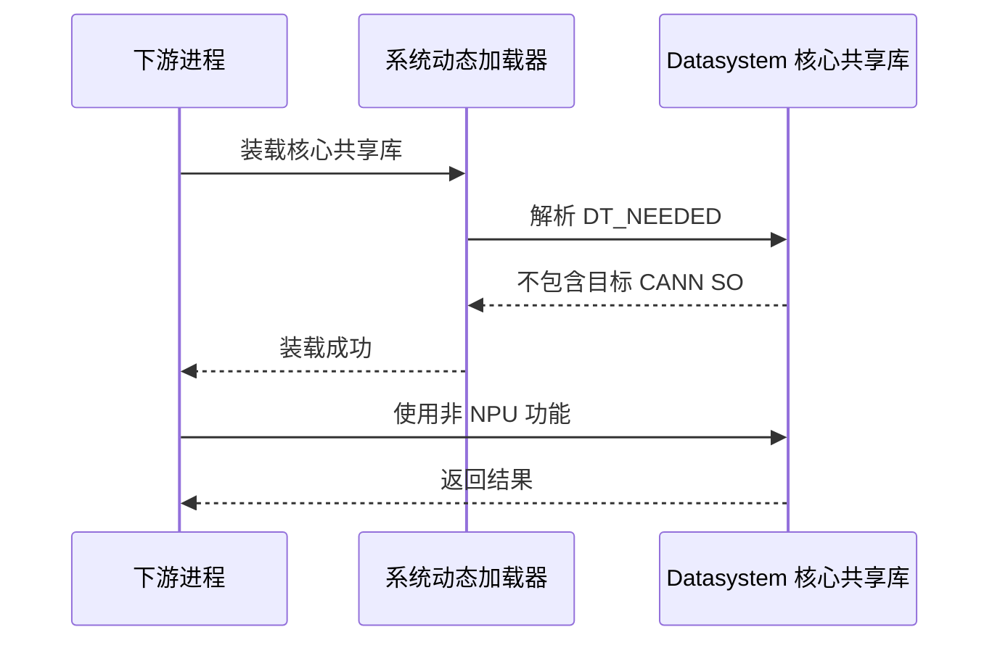

该路径不构造 `HixlPluginLoader` 之外的运行状态，不调用 `GetApi`，不执行插件 stat、读文件、hash、
`dlopen` 或 `dlsym`。核心共享库中允许保留 `libdl` 依赖。

#### 4.3.2 HCCS 初始化提交（UC3）

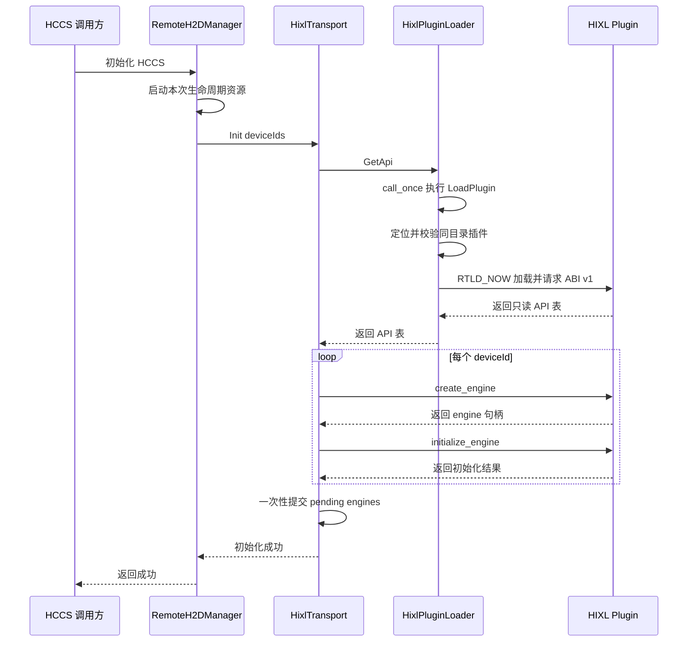

`HixlTransport::Init` 使用局部 `pendingEngines` 和 `pendingEndpoints`。每个 engine 的创建与初始化成功后才进入
局部集合；全部设备成功后通过 move 一次性提交到成员并设置 `initialized_`。提交前，其他公开方法仍看到未
初始化状态。

插件 `create_engine` 创建 `HixlEngineContext`，其中持有一个 `hixl::Hixl` 和可复用描述符缓冲；
`initialize_engine` 将字符串视图和 option 数组转换为 `AscendString` 与 map。任何 C++ 异常都在插件导出
函数内捕获，不得越过 C ABI。

#### 4.3.3 初始化失败与回滚（UC4）

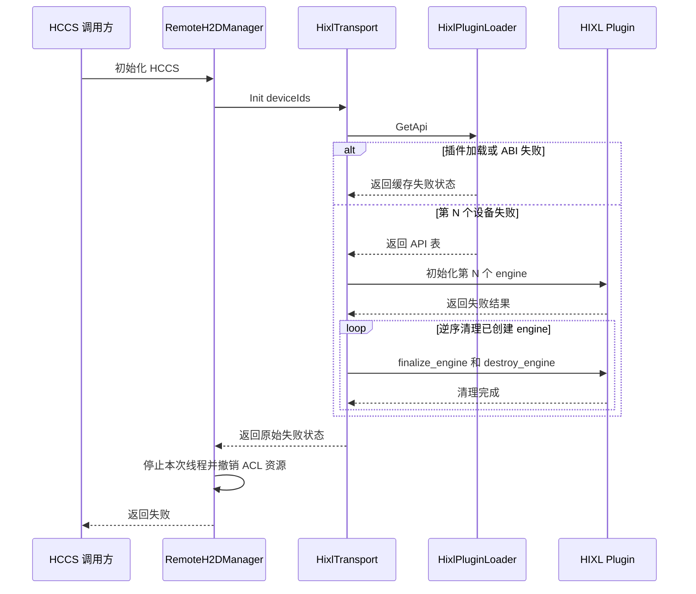

回滚保存首个业务失败作为返回值，后续清理错误只记录警告并附带操作上下文，不覆盖首错。回滚完成后满足：

- `initialized_ == false`；
- engine、endpoint、连接和注册集合为空；
- 本次创建的心跳线程已停止；
- 本次成功执行的 ACL 初始化已对称撤销；
- loader 的插件映射和失败或成功缓存保持不变；
- transport 类型仍是 HCCS，不修改为 ROCE。

`RemoteH2DManager` 构造函数不能返回 `Status`，因此不再使用 `LOG_IF_ERROR(Init())` 吞掉失败，而是把事务结果
保存到 `initStatus_`。错误传播链固定如下：

1. 客户端先写入 `enableRemoteH2D_`、device ID 和 HCCS 本地地址；当 Remote H2D 已启用时，
   `SetClientRemoteH2DConfig` 随即构造 Manager 并返回 `GetInitStatus()`。当前 `ObjectClientImpl` 已在
   `MGetH2D`、`PreRegisterDeviceMemory` 等首次需要设备号的操作中传播该返回值，因此不要求无设备上下文的
   `HeteroClient::Init()` 提前加载插件。
2. Worker 在 `WorkerOCServer::InitRpcAndMemoryRuntime` 设置本地 HCCS 地址后、调用共享内存 allocator 前，调用
   Common/RDMA 内部 `InitializeRemoteH2DManager()`；它在非 NPU 或 Remote H2D 未启用时直接成功，否则返回
   `RemoteH2DManager::Instance().GetInitStatus()`。初始化失败终止本次 Worker 启动。
3. `SetDeviceIdx`、连接、注册、导入和传输等 Manager 操作在 Remote H2D 已启用时先返回 `initStatus_` 中的
   错误，防止未来调用方漏掉显式初始化检查后访问半初始化 transport。
4. `AfterFork` 先使继承状态失效，再执行清理和重建；它以重建结果覆盖 `initStatus_`。pthread callback 无法
   返回错误，子进程后续首个 Manager 操作负责把该缓存错误返回业务侧。

上述链路不改变公开 SDK 签名。普通 `HeteroClient::Init()`、未启用 NPU 的 Worker、Remote H2D 关闭及 ROCE
路径不加载 HIXL 插件。

#### 4.3.4 连接与内存注册（UC3）

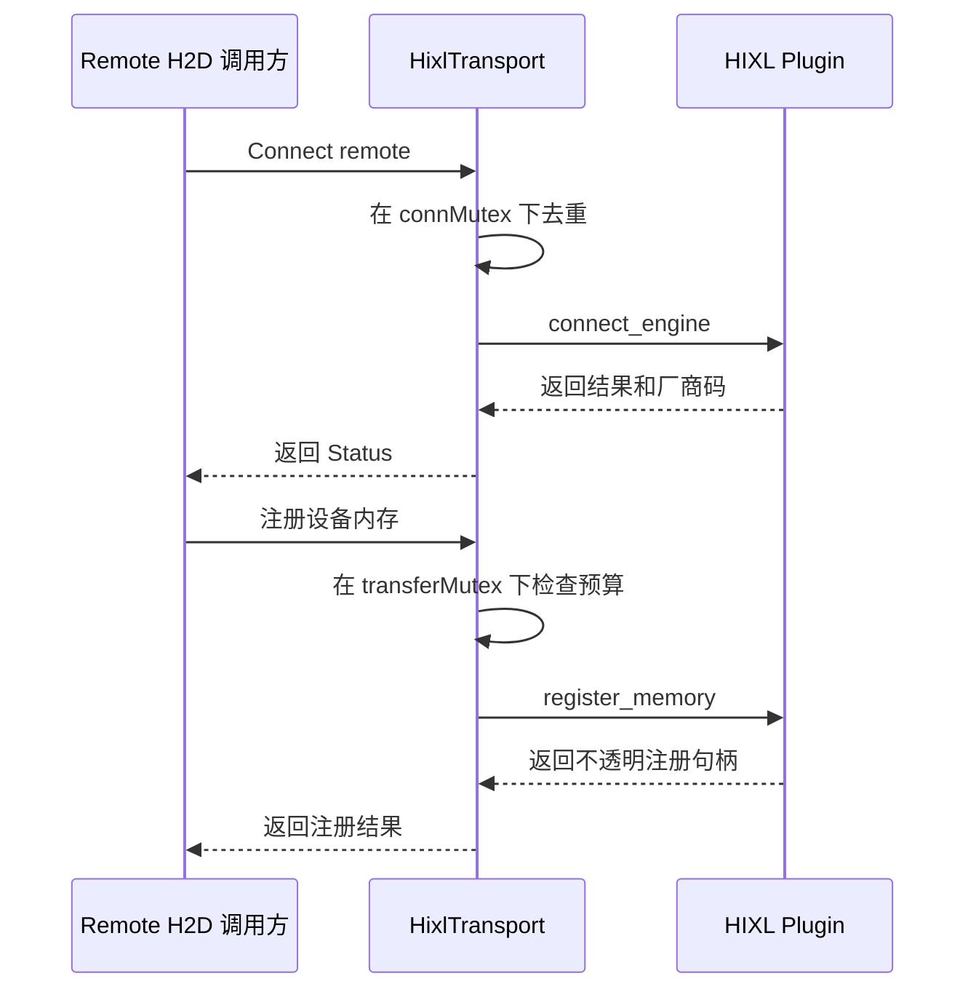

连接集合、地址覆盖判断、253 个长期与临时注册共享预算仍属于 `HixlTransport`。插件不维护 Datasystem 的
连接去重集合和注册预算，只把一个 engine 上的原子厂商操作转换成稳定 ABI。注册句柄作为 opaque token
保存，核心不得比较其内部内容或跨 engine 使用。

#### 4.3.5 ScatterBatch 热路径（UC3、UC5）

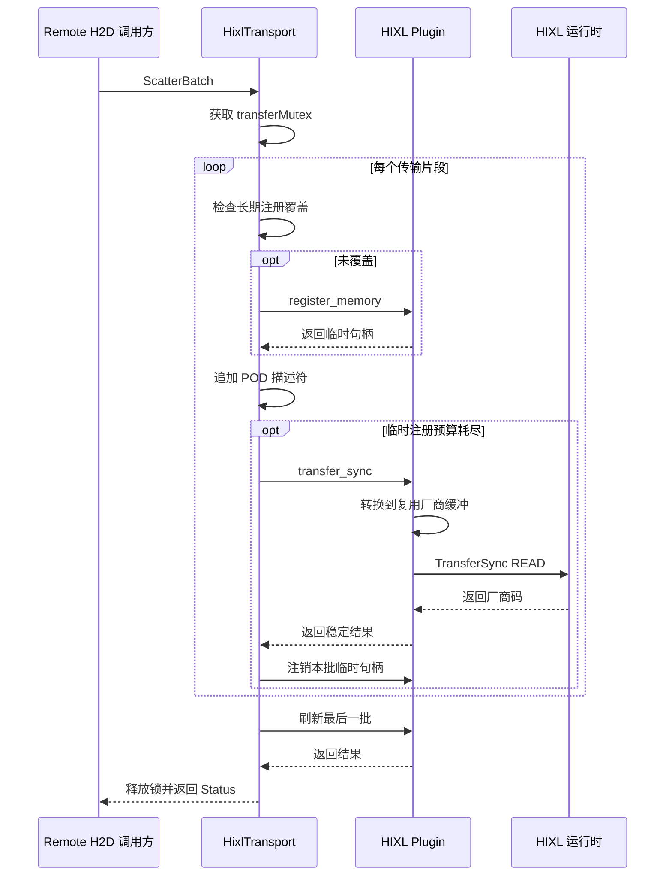

核心继续依据临时注册预算切批，POD 描述符按已知数量 `reserve`。插件将 POD 字段复制到 engine 自己的
`vector<hixl::TransferOpDesc>`，该 vector 只增长不缩容并在调用后 `clear`，从而复用容量。这里新增的是
描述符元数据复制，不复制用户数据；必须纳入微基准和真实 HCCS P99/吞吐验证。

临时句柄使用 RAII 批次守卫，传输成功或任意中途错误都逐一注销。首个传输或注册错误优先返回，注销错误
记录为清理告警。

#### 4.3.6 Uninit 与 fork（UC5）

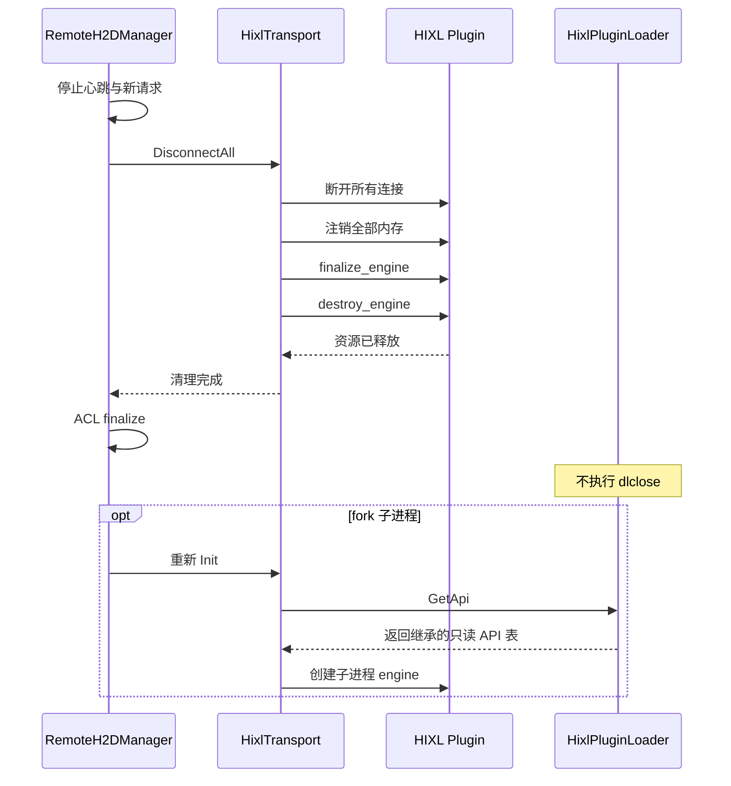

`DisconnectAll` 先在 `connMutex_` 下完成连接清理并释放锁，再在 `transferMutex_` 下清理注册资源，保持两个锁
不嵌套。engine finalize 和 destroy 在所有句柄释放后执行。Manager 只有在 transport 清理结束后才能执行
ACL finalize。

loader 不定义主动卸载接口，单例析构也不调用 `dlclose`。fork 子进程继承映射和函数表；现有
`AfterFork` 先清理继承的 transport 资源，再创建子进程 engine。若厂商明确不支持 fork 后 finalize，实际
实现需通过设备验证决定是否在子进程跳过 inherited engine 的厂商清理并直接丢弃句柄，该分支必须以测试
证据更新本文后才能启用。

#### 4.3.7 错误码映射

| ABI 结果 | Datasystem 状态 | 适用场景 |
|---|---|---|
| `DS_HIXL_OK` | `K_OK` | 操作成功 |
| `DS_HIXL_INVALID_ARGUMENT` | `K_INVALID` | 空句柄、非法枚举、空地址、长度为 0 |
| `DS_HIXL_NOT_SUPPORTED` | `K_NOT_SUPPORTED` | ABI、操作或运行能力不可用 |
| `DS_HIXL_RUNTIME_ERROR` | `K_RUNTIME_ERROR` | 厂商返回失败或插件内部异常 |
| loader hash 失败 | `K_NOT_AUTHORIZED` | 插件内容或版本不匹配 |

每个 ABI 操作同时输出 `vendorStatus`。核心日志包含 ABI 操作名、设备或远端上下文和数值厂商码，不在插件
中依赖 Datasystem 日志库。错误消息不得记录传输数据、密钥或完整用户地址列表。

### 4.4 模块依赖图

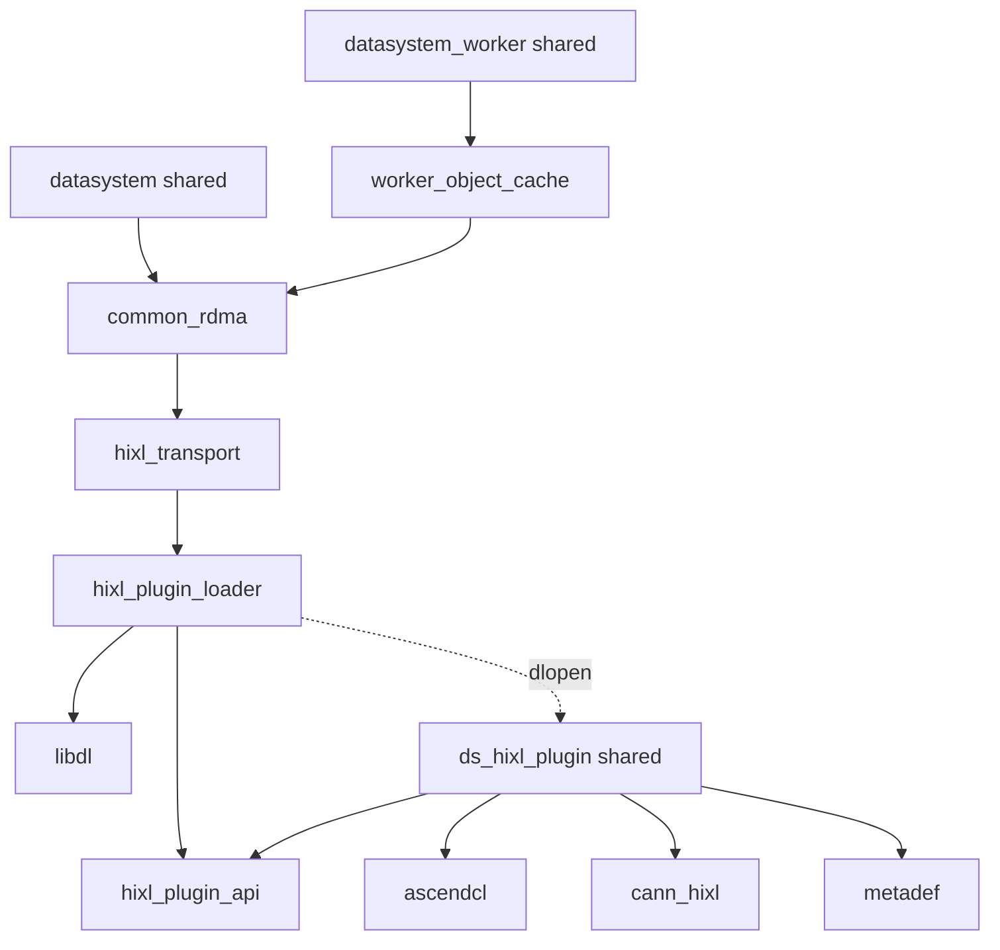

依赖规则：

1. `common_rdma` 不再消费 `${ASCEND_HIXL_LIBRARIES}` 或 Bazel 的 `@local_ascend//:hixl`。
2. `hixl_transport` 和 loader 可以依赖 ABI 头、Datasystem util、Status、日志与 `libdl`，不能包含 HIXL 头。
3. 插件只依赖 ABI 头、C++ 标准库和三个目标 CANN 库，不依赖 `common_rdma`、`libdatasystem.so`、
   Datasystem `Status`、日志或 protobuf。
4. CMake 插件 target 使用 `PRIVATE` 厂商链接；Bazel 使用独立 `linkshared` 目标，厂商 linkopts 不传播给
   `remote_h2d_manager`。
5. 插件 hash 生成目标依赖最终插件，核心 loader 目标依赖生成的 hash 头；插件不依赖 loader，因此无环。
6. `ASCEND_HIXL_AVAILABLE` 表示构建时生成了 HIXL transport 和插件，不表示部署节点一定具备 CANN。

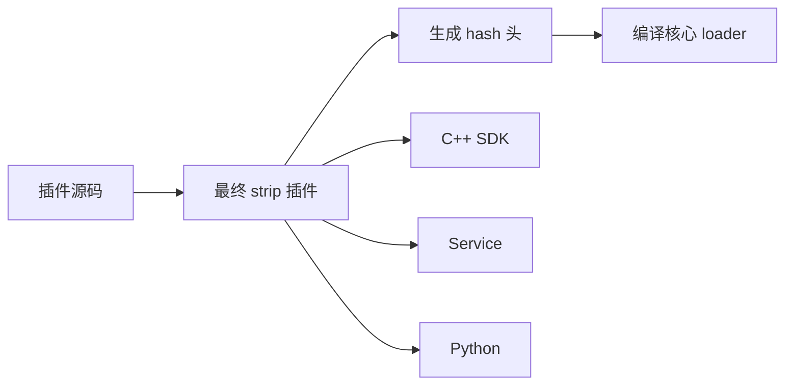

构建顺序必须先完成插件的 RPATH 清理和最终 strip，再计算 hash 并编译引用 hash 的核心目标。安装和 wheel
组装只复制最终插件，不得再次 strip。CMake 和 Bazel 都必须形成同一顺序；如果 Bazel 当前发布流程不支持
构建期 hash 依赖，P2 必须先补齐对应 genrule，不能降级为跳过完整性校验。

### 4.5 关键数据结构

#### 4.5.1 ABI 基础类型

`hixl_plugin_api.h` 必须可以被 C 和 C++ 编译器共同包含。下列定义为 v1 的规范骨架，具体命名在实现时
保持一致，不使用 `#pragma pack`，通过字段顺序维持自然对齐。

```c
#define DS_HIXL_ABI_VERSION_1 1U
#define DS_HIXL_MAX_OPTION_COUNT 16U
#define DS_HIXL_MAX_STRING_LENGTH 4096U

typedef enum DsHixlResult {
    DS_HIXL_OK = 0,
    DS_HIXL_INVALID_ARGUMENT = 1,
    DS_HIXL_NOT_SUPPORTED = 2,
    DS_HIXL_RUNTIME_ERROR = 3,
} DsHixlResult;

typedef struct DsHixlEngine *DsHixlEngineHandle;
typedef struct DsHixlMemory *DsHixlMemHandle;

typedef struct DsHixlStringView {
    const char *data;
    uint64_t size;
} DsHixlStringView;

typedef struct DsHixlOption {
    DsHixlStringView key;
    DsHixlStringView value;
} DsHixlOption;

typedef struct DsHixlTransferDesc {
    uintptr_t localAddr;
    uintptr_t remoteAddr;
    uint64_t length;
} DsHixlTransferDesc;

typedef struct DsHixlRegisterMemoryRequest {
    uintptr_t address;
    uint64_t length;
    uint32_t memoryType;
} DsHixlRegisterMemoryRequest;

typedef struct DsHixlTransferRequest {
    DsHixlStringView remoteEndpoint;
    uint32_t operation;
    const DsHixlTransferDesc *descriptors;
    uint32_t descriptorCount;
    int32_t timeoutMs;
} DsHixlTransferRequest;
```

约束：

- `DsHixlStringView` 不要求 NUL 结尾；插件按长度构造本地字符串。
- `data == NULL` 只允许与 `size == 0` 同时出现；endpoint 和 option key 不允许为空。
- option 数量不超过 `DS_HIXL_MAX_OPTION_COUNT`，单个字符串不超过
  `DS_HIXL_MAX_STRING_LENGTH`，避免错误输入导致无界分配。
- 地址字段仅作为数值透传，插件与核心均不得读写指向的数据载荷。
- `length` 必须大于 0；从 `uint64_t` 转换到厂商 `size_t` 前检查不溢出。
- 不透明句柄只在创建它的插件与 engine 生命周期内有效。

#### 4.5.2 ABI 函数表

```c
typedef struct DsHixlApi {
    uint32_t abiVersion;
    uint32_t structSize;

    DsHixlResult (*create_engine)(DsHixlEngineHandle *engine);
    DsHixlResult (*finalize_engine)(DsHixlEngineHandle engine);
    DsHixlResult (*destroy_engine)(DsHixlEngineHandle engine);

    DsHixlResult (*initialize_engine)(
        DsHixlEngineHandle engine,
        DsHixlStringView localEndpoint,
        const DsHixlOption *options,
        uint32_t optionCount,
        uint32_t *vendorStatus);

    DsHixlResult (*connect_engine)(
        DsHixlEngineHandle engine,
        DsHixlStringView remoteEndpoint,
        int32_t timeoutMs,
        uint32_t *vendorStatus);

    DsHixlResult (*disconnect_engine)(
        DsHixlEngineHandle engine,
        DsHixlStringView remoteEndpoint,
        int32_t timeoutMs,
        uint32_t *vendorStatus);

    DsHixlResult (*register_memory)(
        DsHixlEngineHandle engine,
        const DsHixlRegisterMemoryRequest *request,
        DsHixlMemHandle *memoryHandle,
        uint32_t *vendorStatus);

    DsHixlResult (*deregister_memory)(
        DsHixlEngineHandle engine,
        DsHixlMemHandle memoryHandle,
        uint32_t *vendorStatus);

    DsHixlResult (*transfer_sync)(
        DsHixlEngineHandle engine,
        const DsHixlTransferRequest *request,
        uint32_t *vendorStatus);
} DsHixlApi;
```

ABI v1 固定枚举值：`memoryType` 的 DEVICE 为 0、HOST 为 1；`operation` 的 READ 为 0、WRITE 为 1。
这些数值由共享 ABI 头定义具名常量，插件显式转换为 HIXL 枚举，不能依赖两个枚举碰巧同值。

`structSize` 覆盖到 `transfer_sync` 字段末尾。loader 验证：版本等于 v1、长度不小于 v1 所需长度、所有
必需函数指针非空。未来版本只能在结构尾部追加字段；删除、重排或改变已有签名必须提升 ABI 主版本。

#### 4.5.3 核心 engine 与注册记录

```cpp
struct HixlEngineRecord {
    int32_t deviceId;
    DsHixlEngineHandle handle;
    std::string localEndpoint;
};

struct RegisteredDeviceMemory {
    uintptr_t addr;
    uint64_t size;
    DsHixlMemHandle handle;
};

struct RegisteredHostMemory {
    int32_t deviceId;
    uintptr_t addr;
    uint64_t size;
    DsHixlMemHandle handle;
};
```

核心记录只保存 Datasystem 查找所需的地址、大小、设备和不透明句柄。`HixlEngineRecord` 按 device ID 存入
有序 map，保持现有 identity 轮询与 engine 选择语义。注册记录仍受 `transferMutex_` 保护。

#### 4.5.4 Loader 状态

```cpp
enum class HixlPluginLoadState {
    UNINITIALIZED,
    LOADED,
    FAILED
};

struct HixlPluginLoadResult {
    HixlPluginLoadState state;
    void *pluginHandle;
    const DsHixlApi *api;
    Status status;
};
```

该结果由 `std::call_once` 发布，之后只读。初始状态不允许被业务线程直接观察；所有读取均通过 `GetApi`。
成功时 `pluginHandle` 与 `api` 非空、`status` 成功；失败时二者为空、`status` 保存分类错误。loader 不暴露
reset 或 unload。

#### 4.5.5 Manager 初始化状态

Manager 新增如下生命周期字段；这里只描述逻辑结构，具体 `Status` 初始化方式遵循项目
既有实现：

```cpp
struct RemoteH2DInitState {
    Status status;
    bool heartbeatStarted;
    bool aclInitialized;
    bool transportInitialized;
};
```

实际成员可以拆分存放，但必须表达同一状态。构造线程在静态局部单例发布前完成写入，正常业务线程只读
`status`；`Init`、`Uninit` 与 `AfterFork` 仍是串行生命周期操作。事务提交后 `status` 为成功；失败回滚仅清理
标记为成功的阶段并保存首错。每个 Manager 操作必须在读取 map、engine 或注册记录前检查该状态。子进程只
有 fork 调用线程，`AfterFork` 重建完成后再覆盖状态，不引入新的热路径锁。

#### 4.5.6 插件 engine 上下文

```cpp
struct HixlEngineContext {
    std::unique_ptr<hixl::Hixl> engine;
    bool initialized;
    std::vector<hixl::TransferOpDesc> transferDescriptors;
};
```

该结构只存在于插件 `.cpp`，不出现在共享头。`create_engine` 分配上下文，`initialize_engine` 成功后设置
`initialized`；`finalize_engine` 幂等清理并清零状态；`destroy_engine` 在必要时先 finalize，再删除上下文。
描述符 vector 仅由 `transfer_sync` 使用，调用侧 `transferMutex_` 保证同一 transport 的串行访问。

插件不得维护另一份连接集合或内存注册表，避免与核心所有权产生双重真相。厂商 `MemHandle` 作为 opaque
token 返回，生命周期仍由核心注册记录驱动。

#### 4.5.7 并发与所有权总表

| 状态 | 唯一所有者 | 保护方式 | 销毁点 |
|---|---|---|---|
| loader 结果 | 进程级 `HixlPluginLoader` | `std::call_once` 发布后只读 | 进程退出由 OS 回收映射 |
| engine 记录 | `HixlTransport` | Init/Uninit 生命周期；不与请求并发提交 | `DisconnectAll` |
| active endpoints | `HixlTransport` | `connMutex_` | 单端断连或 `DisconnectAll` |
| 注册记录 | `HixlTransport` | `transferMutex_` | 显式注销或 `DisconnectAll` |
| 临时批次句柄 | 单次 ScatterBatch RAII 守卫 | `transferMutex_` | 每批 flush 或异常退出 |
| 厂商描述符缓冲 | 插件 engine context | 调用侧 `transferMutex_` | engine destroy |

锁顺序规则是“不嵌套”：`connMutex_` 临界区结束后才能进入 `transferMutex_`。loader 不获取 transport 锁，
插件不回调核心，因此不存在 loader 锁与 transport 锁的顺序关系。

### 4.6 组件接口设计

#### 4.6.1 接口总览

| 接口 | 调用方 | 实现方 | 数据载体 | 频率 |
|---|---|---|---|---|
| `HixlPluginLoader::GetApi` | `HixlTransport::Init` | 核心 loader | `Status` 与只读 `DsHixlApi*` | 每次 transport Init 一次 |
| `DsHixlGetApi` | 核心 loader | HIXL 插件 | ABI 版本与函数表指针 | 每进程最多一次 |
| engine 生命周期函数 | `HixlTransport` | HIXL 插件 | engine 句柄、option 数组、厂商码 | 每设备初始化与清理 |
| connect/disconnect | `HixlTransport` | HIXL 插件 | endpoint 视图、timeout、厂商码 | 每连接生命周期 |
| register/deregister | `HixlTransport` | HIXL 插件 | 地址、长度、类型、opaque handle | 每注册生命周期 |
| `transfer_sync` | `HixlTransport` | HIXL 插件 | endpoint 与 POD 描述符数组 | 每个 HCCS 批次 |

#### 4.6.2 `HixlPluginLoader::GetApi`

```cpp
Status HixlPluginLoader::GetApi(const DsHixlApi *&api);
```

前置：仅在 HCCS transport 初始化阶段调用。输出引用进入函数时由实现置空。

成功：返回 `K_OK`，`api` 指向进程生命周期有效的只读函数表。

失败：`api == nullptr`，返回缓存的 `K_NOT_SUPPORTED` 或 `K_NOT_AUTHORIZED`。错误文本至少包含插件固定名称
和 `locate`、`verify`、`dlopen`、`dlsym`、`abi` 中的阶段名；`dlopen` 错误保留系统给出的缺失 SONAME。

并发：多线程可同时调用，只有一个线程执行实际加载，其余线程等待 `call_once` 完成。函数返回后不持有任何
loader 锁。

#### 4.6.3 `DsHixlGetApi`

```c
DsHixlResult DsHixlGetApi(uint32_t requestedAbiVersion, const DsHixlApi **api);
```

输入版本不是 v1 或 `api == NULL` 时返回 `DS_HIXL_NOT_SUPPORTED` 或
`DS_HIXL_INVALID_ARGUMENT`。成功时返回插件静态常量表地址；函数不分配内存、不初始化 HIXL、不记录
调用方指针。

入口使用显式默认可见性，插件其余符号使用 hidden visibility。符号名称大小写固定，不能导出版本相关的
C++ 重载入口。

#### 4.6.4 engine 生命周期接口

```c
DsHixlResult create_engine(DsHixlEngineHandle *engine);
DsHixlResult initialize_engine(DsHixlEngineHandle engine,
                               DsHixlStringView localEndpoint,
                               const DsHixlOption *options,
                               uint32_t optionCount,
                               uint32_t *vendorStatus);
DsHixlResult finalize_engine(DsHixlEngineHandle engine);
DsHixlResult destroy_engine(DsHixlEngineHandle engine);
```

`create_engine` 只分配上下文，不访问设备。`initialize_engine` 每个上下文最多成功一次；重复初始化返回
`DS_HIXL_INVALID_ARGUMENT`。`finalize_engine` 对已 finalize 上下文幂等。`destroy_engine` 必须且只能调用一次，
并保证已初始化资源先 finalize。

option key/value 在调用期间有效，插件同步复制为厂商字符串，不保留输入指针。所有导出函数清零
`vendorStatus` 后再调用厂商接口，厂商调用完成后写入原始返回值。

#### 4.6.5 连接接口

```c
DsHixlResult connect_engine(DsHixlEngineHandle engine,
                            DsHixlStringView remoteEndpoint,
                            int32_t timeoutMs,
                            uint32_t *vendorStatus);
DsHixlResult disconnect_engine(DsHixlEngineHandle engine,
                               DsHixlStringView remoteEndpoint,
                               int32_t timeoutMs,
                               uint32_t *vendorStatus);
```

插件只负责一次厂商调用。连接幂等语义由核心保留：核心在调用前检查 `activeEndpoints_`，并将厂商
`ALREADY_CONNECTED` 视为成功。timeout 必须大于 0；连接当前沿用 30000 ms，断连沿用 1000 ms，数值以
核心具名常量定义，不写入 ABI。

#### 4.6.6 内存注册接口

```c
DsHixlResult register_memory(DsHixlEngineHandle engine,
                             const DsHixlRegisterMemoryRequest *request,
                             DsHixlMemHandle *memoryHandle,
                             uint32_t *vendorStatus);
DsHixlResult deregister_memory(DsHixlEngineHandle engine,
                               DsHixlMemHandle memoryHandle,
                               uint32_t *vendorStatus);
```

核心负责地址覆盖、重复注册幂等和 253 个 MEM_DEVICE 预算；插件验证基本参数并转换为厂商 `MemDesc`。
成功注册返回非空 opaque token。注销成功后 token 立即失效，重复注销属于调用方错误，不由插件吞掉。

#### 4.6.7 同步传输接口

```c
DsHixlResult transfer_sync(DsHixlEngineHandle engine,
                           const DsHixlTransferRequest *request,
                           uint32_t *vendorStatus);
```

v1 只接受 READ，但保留 WRITE 枚举以与厂商模型一致；核心当前固定传 READ。descriptorCount 为 0 时直接成功，
非 0 时 descriptors 必须非空。插件检查每项长度和 `size_t` 转换，复用 engine 描述符 vector，调用
`TransferSync` 后清空逻辑长度但保留容量。输入数组只在同步调用期间有效。

#### 4.6.8 异常边界

所有插件导出函数都采用 `noexcept` 等价实现策略：捕获 `std::bad_alloc`、`std::exception` 和未知异常，返回
`DS_HIXL_RUNTIME_ERROR`，不得让 C++ 异常穿越共享库 C ABI。插件不把异常字符串跨 ABI 返回，核心根据
操作名和稳定结果码记录错误；敏感信息卫生要求见 §6。

## 5. 对外接口

### 5.1 SDK 接口

本设计不新增或修改公开 SDK 签名。下列现有接口是用户感知 HCCS 初始化和传输结果的边界：

```cpp
class HeteroClient {
public:
    Status Init();
};
```

| 接口 | 调用方 | 频率 | 说明 |
|---|---|---|---|
| `Status HeteroClient::Init()` | 异构客户端 | 每客户端一次 | 不要求设备上下文，不提前加载 HIXL 插件；现有初始化语义不变 |
| `Status HeteroClient::PreRegisterDeviceMemory(const std::vector<void *> &, const std::vector<uint64_t> &)` | HCCS 客户端 | 每内存池生命周期 | 注册语义不变，内部句柄改为 opaque token |
| `Status HeteroClient::MGetH2D(...)` | HCCS 客户端 | 请求路径 | 首次 HCCS 配置阶段可返回插件加载或 ABI 错误；传输行为保持兼容 |

内部配置边界 `Status RemoteH2DManager::SetClientRemoteH2DConfig(bool, uint32_t, const std::string &)` 的签名和
调用顺序不变，但启用 Remote H2D 时增加 `GetInitStatus()` 返回。新增内部 wrapper
`Status InitializeRemoteH2DManager()` 供 Worker 启动使用，在非 NPU 构建中返回成功。`DsHixlGetApi` 属于同一
发行物内部 ABI，不属于公开 SDK。

### 5.2 部署参数

无新增或变更。现有 HCCS 选择参数继续决定是否进入插件加载路径；未选择 HCCS 时不读取插件。

| 参数变化 | 默认值 | 说明 |
|---|---|---|
| 无 | 不变 | 不提供插件路径、ABI 版本或跳过 hash 的用户参数 |

### 5.3 环境变量

无新增或变更。

| 变量变化 | 默认值 | 说明 |
|---|---|---|
| 无 | 不变 | 现有 `DS_RH2D_LINK_TYPE` 与 `DS_HIXL_CS_ENABLE` 语义不变 |

### 5.4 发布产物约定

`libds_hixl_plugin.so` 是新增的可选叶子产物，但在 `-X on` 且构建支持 HIXL 时必须随核心发布包安装。
它不是下游链接接口，不进入导出的 Datasystem CMake target 链接库列表。
核心库嵌入的 SHA256 必须对应发布目录和 whl 中实际加载的插件文件；发布脚本按 `acl_plugin` 同类 hash 校验
产物处理，hash 生成后不能在 Python 打包阶段再次 strip。

## 6. 约束与风险

### 6.1 约束

| # | 约束 | 违规后果 |
|---|---|---|
| C1 | 核心源码和目标不得包含或链接 HIXL/GE 厂商 C++ ABI | Issue #971 复现，核心重新出现 CANN `DT_NEEDED` 或版本耦合 |
| C2 | 插件只能导出 `DsHixlGetApi`，共享头只能使用 C ABI 安全类型 | ABI 面扩大，编译器或 CANN 升级可能使主体崩溃 |
| C3 | 插件必须与主体同目录且 hash 匹配 | 加载错误版本或被修改文件，产生不可预测调用 |
| C4 | loader 结果每进程只初始化一次且不 `dlclose` | 并发获得不同函数表，或资源仍活跃时代码段被卸载 |
| C5 | 所有插件 C 函数捕获 C++ 异常 | 异常跨共享库边界导致未定义行为或进程终止 |
| C6 | engine、注册句柄必须先于 ACL finalize 释放 | 厂商资源清理访问已关闭设备上下文 |
| C7 | `connMutex_` 与 `transferMutex_` 不嵌套，插件不回调核心 | 引入锁反转、死锁或热路径全局串行 |
| C8 | 初始化必须全成功后提交，失败逆序回滚 | 暴露部分 engine、残留线程或不可重试状态 |
| C9 | ABI 描述符只复制元数据，不复制用户载荷 | HCCS 带宽和时延显著回退，破坏 U3 |
| C10 | CMake 与 Bazel 同时满足核心和插件依赖边界 | 不同构建产物行为分叉，某一路径继续直链 CANN |
| C11 | 插件最终 strip 后再生成 hash，后续发布和 Python 打包阶段不再修改文件内容 | 发布插件与核心内置 hash 永久不匹配 |
| C12 | 两套 SDK、Service、Python 均把插件放在实际主体同目录 | 构建成功但 HCCS 部署稳定报插件缺失 |
| C13 | 不改变公开 SDK、RPC/protobuf 和 HCCS 远端身份格式 | 产生跨版本互通或用户代码兼容问题 |
| C14 | 不把 `transfer_engine` 纳入核心 ELF 审计结论 | 验收口径失真，错误宣称完整发布包没有 CANN 依赖 |
| C15 | 插件目录不得由非授权运行用户写入 | hash 检查与 `dlopen` 之间的文件替换风险上升 |

该功能只管理进程内临时资源，不新增持久化数据、恢复记录或远端协议状态，因此无持久化、崩溃一致性、
compaction 或数据迁移影响。

### 6.2 风险

| # | 风险 | 缓解 |
|---|---|---|
| R1 | 部署 CANN 与构建 CANN 的 HIXL ABI 或语义不兼容 | `RTLD_NOW`、ABI 插件隔离、受支持 CANN 矩阵和真实设备回归；错误在初始化期暴露 |
| R2 | 主体与插件来自不同构建 | 最终产物 SHA256 校验加 ABI 版本校验；禁止只替换单个文件 |
| R3 | hash 校验后文件被替换 | 固定同目录、插件权限 0440、目录归受信任用户；实现时评估 open/fstat 前后 inode 校验以缩小 TOCTOU 窗口 |
| R4 | POD 到厂商 vector 的元数据复制影响小包延迟 | engine 级容量复用、无载荷复制；微基准和真实 P99 阈值阻断发布 |
| R5 | Manager 当前初始化失败仅日志记录，错误无法到达用户 | P1 保存 `initStatus_`；客户端首次 HCCS 操作和 Worker allocator 前显式检查；Manager 操作入口防御检查 |
| R6 | 部分设备初始化失败泄漏已成功 engine | 局部 pending 集合和逆序 RAII 回滚；逐设备失败 UT |
| R7 | fork 后厂商不支持 inherited engine finalize | 真实设备 fork 测试；若不支持，只在有证据时设计子进程丢弃 inherited token 的专用路径 |
| R8 | 插件失败被永久缓存，修复文件后进程仍不可用 | 错误明确提示重启；不支持运行中混用版本，换取确定性 |
| R9 | Bazel 缺少现成插件 hash 规则 | P2 新增无环 genrule，并用同一 ELF 与 hash 测试阻断 Bazel 合入 |
| R10 | 某个分发位置遗漏插件或再次 strip | 打包清单测试覆盖四类位置，逐文件复算 hash 并执行 HCCS 加载冒烟 |
| R11 | 插件直接使用 Datasystem 日志或 Status 形成反向依赖 | 链接图与未定义符号审计禁止 `libdatasystem` 反向依赖，错误只用 ABI 数值返回 |
| R12 | `libascendcl.so` 已由 ACL 插件加载时出现重复实例 | 使用相同 SONAME 和系统 loader 复用规则；验证 `/proc/<pid>/maps` 仅出现预期映射 |

## 7. 落地步骤

本改造作为一个可原子回滚的 PR 交付，P1–P3 是同一 PR 内的提交和验证阶段；全部门禁通过前不合入，避免
核心代码、插件和打包规则在 master 上短暂不一致。

### 7.1 Common/RDMA 与插件

| PR 编号 | 内容 | 阶段 |
|---|---|---|
| PR1 | 新增 `hixl_plugin_api.h`、ABI 静态断言和 fake plugin | P1 |
| PR1 | 新增 `HixlPluginLoader` 的固定路径、hash、`RTLD_NOW`、唯一入口和 ABI 校验 | P1 |
| PR1 | 新增 `libds_hixl_plugin.so`，实现 engine、连接、注册和同步传输适配 | P1 |
| PR1 | 改造 `HixlTransport` 为 opaque handle 与函数表调用，保持预算、锁和批次语义 | P1 |
| PR1 | 改造 `RemoteH2DManager::Init`：保存 `initStatus_`、分阶段回滚，并在客户端配置、Worker allocator 前及各 HCCS 操作入口传播 | P1 |

### 7.2 构建与分发

| PR 编号 | 内容 | 阶段 |
|---|---|---|
| PR1 | CMake 移除 `common_rdma` 的三个 CANN 链接项并建立插件 hash 依赖 | P2 |
| PR1 | Bazel 拆分主体与插件目标并新增最终产物 hash genrule | P2 |
| PR1 | 更新两套 C++ SDK、Service 和两条 Python 打包路径 | P2 |
| PR1 | 更新 `setup.py`、`python/setup.py` 白名单与 `build_cmake.sh` strip 例外 | P2 |
| PR1 | 增加核心和插件 ELF、符号、hash、安装位置自动审计 | P2 |

### 7.3 测试、性能与文档

| PR 编号 | 内容 | 阶段 |
|---|---|---|
| PR1 | 完成 loader、ABI、transport 回滚和并发 UT | P3 |
| PR1 | 完成无 CANN 下游链接、Worker 启动和四类加载失败 IT | P3 |
| PR1 | 在 CANN 9.x 环境运行 HCCS 连接、注册、传输、清理和 fork 回归 | P3 |
| PR1 | 对比小包 P50/P99、批量吞吐、分配次数和长稳资源 | P3 |
| PR1 | 更新 `.repo_context` 构建、Common/RDMA 和测试说明 | P3 |

### 7.4 发布与回滚

- 发布：主体与插件必须来自同一个构建包；先在 CANN 节点验证 HCCS，再在无 CANN 节点验证非 NPU 服务，
  随后扩大部署。
- 兼容：公开 SDK、配置和远端协议不变；新版本不支持搭配旧版本插件。
- 回滚：整体回滚 Datasystem 发布包，不单独替换主体或插件。删除插件只可作为临时禁用 HCCS 的诊断手段，
  不能视为完整回滚。
- 观测：初始化日志记录加载阶段、ABI 版本和失败类别；不在请求热路径增加逐请求成功日志。

## 8. 测试方案

### 8.1 单元测试

| 文件 | 覆盖点 | 覆盖率目标 |
|---|---|---|
| `tests/ut/common/rdma/hixl_plugin_loader_test.cpp` | 并发一次加载、固定路径、缺文件、hash 失败、dlopen 失败、缺入口、版本与长度错误、失败缓存 | 新增分支 ≥ 90% |
| `tests/ut/common/rdma/hixl_transport_plugin_test.cpp` | 多设备提交、逐设备失败回滚、连接幂等、注册预算、临时句柄 RAII、错误映射、Uninit 幂等 | 新增分支 ≥ 90% |
| `tests/ut/common/rdma/fake_hixl_plugin.cpp` | v1 正常表、空函数指针、错误版本、可控厂商码和异常捕获 | 所有 fake 模式被用例覆盖 |
| ABI C 编译测试 | `hixl_plugin_api.h` 可由 C11 和 C++17 编译，结构大小与 offset 固定 | 100% ABI 字段断言 |
| 构建脚本测试 | hash 顺序、安装路径、strip 例外和白名单 | 所有新增分支覆盖 |

测试不得依赖真实 CANN 的 loader 与 transport 逻辑使用 fake plugin 和 fake API 表；真实厂商行为放入设备测试。

### 8.2 集成与系统测试

| IT | 对应 UseCase | 场景 | 断言 |
|---|---|---|---|
| IT1 | UC1 | CANN 9.x 构建产物复制到无 CANN 容器，下游 CMake 链接并加载 `libdatasystem.so` | 链接、启动成功；loader 未访问 HIXL 插件 |
| IT2 | UC2 | 无 CANN 容器启动未启用 NPU 的 Worker | 进程存活、健康检查通过、普通 KV/Object 冒烟成功 |
| IT3 | UC3 | CANN 9.x 与完整插件执行多设备 HCCS smoke | Init、Connect、Register、ScatterBatch、Disconnect、Finalize 全成功 |
| IT4 | UC4 | 删除 HIXL 插件 | HCCS Init 返回 `K_NOT_SUPPORTED`，进程存活且无 ROCE 降级 |
| IT5 | UC4 | 保留插件但隐藏任一目标 CANN SO | Init 在 `dlopen` 阶段返回 `K_NOT_SUPPORTED` 并指出 SONAME |
| IT6 | UC4 | 修改插件单字节或混用另一构建插件 | 返回 `K_NOT_AUTHORIZED`，厂商代码不执行 |
| IT7 | UC4 | fake plugin 返回错误 ABI 或短结构 | 返回 `K_NOT_SUPPORTED`，无 engine 创建 |
| IT8 | UC5 | HCCS 运行期间执行既有 fork 生命周期 | 子进程重建新 engine；无父进程句柄继续用于传输 |
| IT9 | UC5 | 重复 Init/Uninit 与长稳传输 | 无 engine、注册内存、线程或 fd 泄漏 |
| IT10 | UC1、UC2、UC3 | CMake 与 Bazel、四类分发包逐项审计 | 插件位置、hash 和依赖闭包一致 |
| IT11 | UC4 | 客户端首次 `MGetH2D`/预注册及 Worker allocator 前注入插件加载失败 | 客户端操作返回原始状态；Worker 启动失败；Manager 后续入口不访问半初始化资源 |

### 8.3 ELF 与符号守卫

对 CMake 与 Bazel 产物执行等价检查：

```bash
readelf -d libdatasystem.so
readelf -d libdatasystem_worker.so
readelf -d libds_hixl_plugin.so
readelf -Ws libdatasystem.so | c++filt
readelf -Ws libdatasystem_worker.so | c++filt
```

断言：

- 两个核心共享库不含 `libascendcl.so`、`libcann_hixl.so`、`libmetadef.so` 的 `NEEDED`；
- 两个核心共享库没有未定义 `hixl::`、`ge::AscendString` 符号；
- HIXL 插件包含三个目标 `NEEDED`；
- HIXL 插件动态导出表只包含允许的 `DsHixlGetApi` 项目级符号；
- SDK、Service、Python 分发目录中的 `libds_hixl_plugin.so` hash 与核心库内置 hash 一致；
- `transfer_engine` 不进入本测试的核心审计集合。

### 8.4 性能测试

| 指标 | 场景 | 通过标准 |
|---|---|---|
| 插件首次加载耗时 | 首次 HCCS Init | 单独记录，不进入请求 P99；无重复加载 |
| 函数表分发与描述符转换 | fake API 微基准 | 单次增量 < 1 μs，稳态无新增堆分配 |
| 小包 P50/P99 | 固定设备、连接、并发和数据规模 | P99 回退 ≤ 3% |
| 批量吞吐 | 固定 batch 分布和注册模式 | 吞吐下降 ≤ 3% |
| 注册路径 | 长期注册、临时注册、预算切批 | 分配次数不高于设计预算且无泄漏 |
| 长稳资源 | 持续传输加周期性 Init/Uninit | RSS、fd、engine 和注册句柄无持续增长 |

如果测试环境自然抖动超过 3%，使用不少于 5 轮独立运行和置信区间比较；不能以单轮最好值替代基线。

### 8.5 验收矩阵

| 目标 | 证据 |
|---|---|
| G1 | ELF 守卫、IT1、IT2 |
| G2 | loader 调用计数、IT1、IT3 |
| G3 | 核心符号审计、ABI C/C++ 编译测试 |
| G4 | loader/transport UT、IT4–IT7、资源检查 |
| G5 | IT3、IT8、IT9、性能测试 |
| G6 | IT10、四类分发路径和 hash 复算 |
