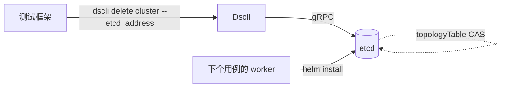
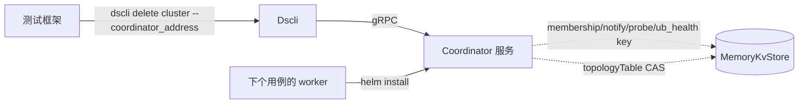
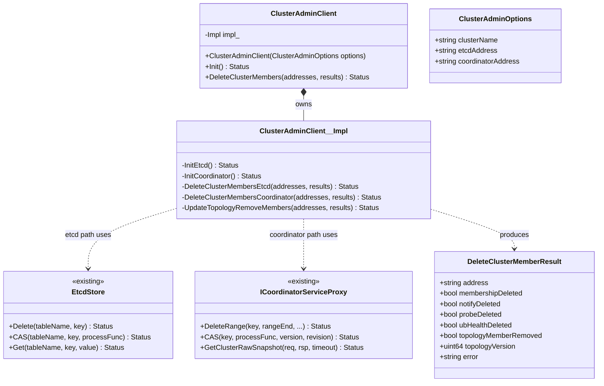
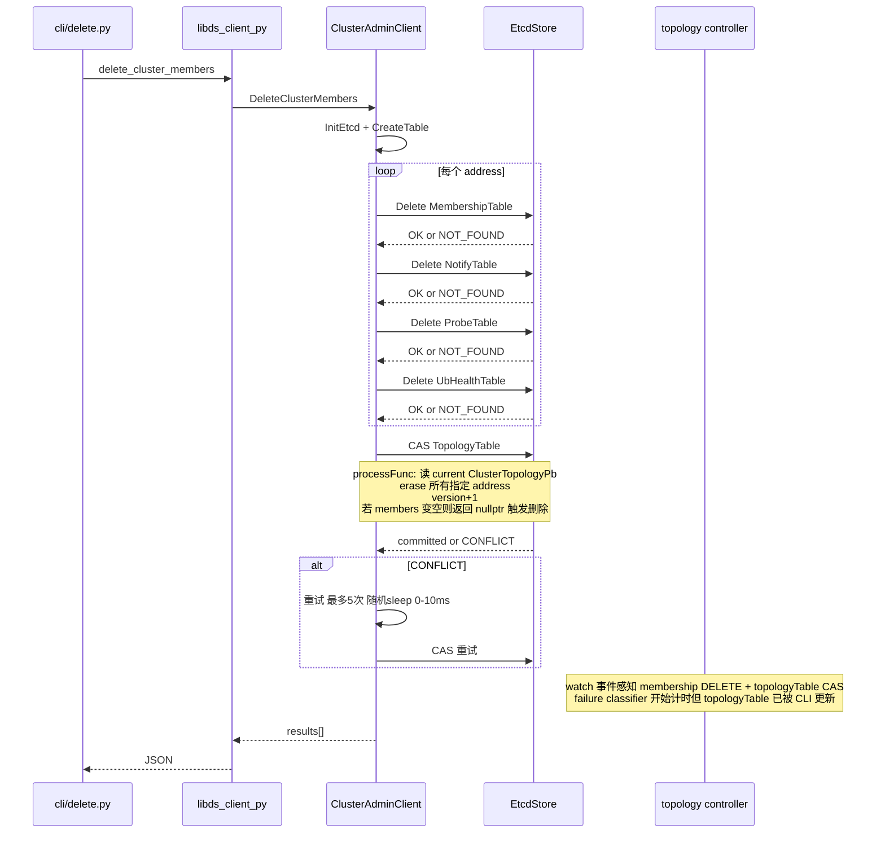
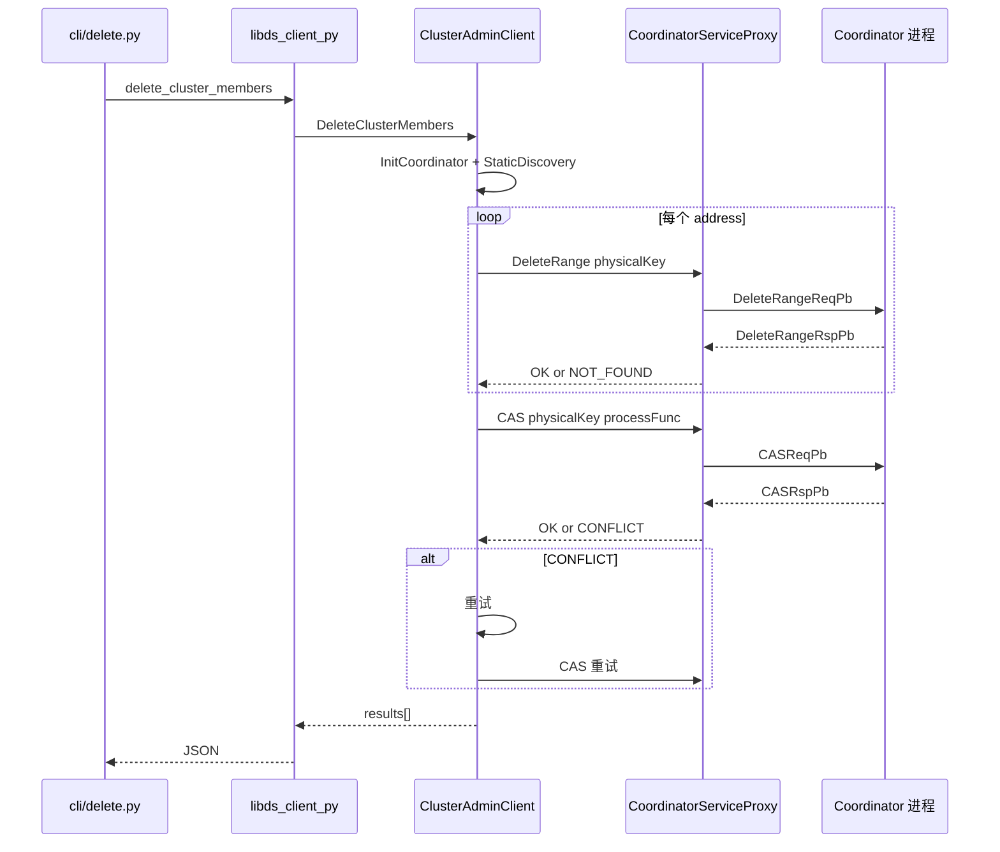
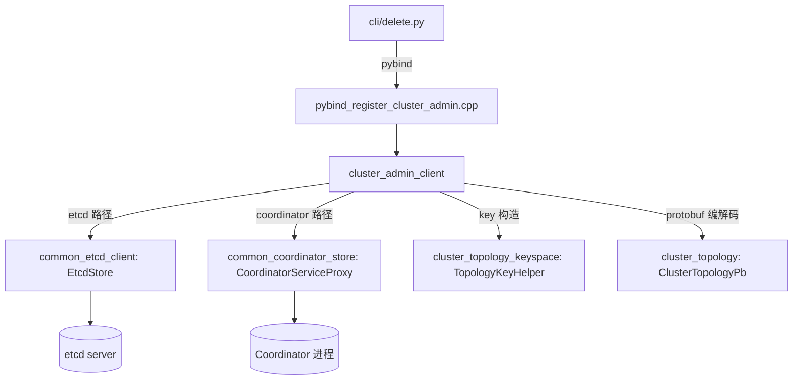

# 子模块：dscli 集群成员清理命令（按 worker 地址精确清理拓扑残留）

| 属性 | 值 |
|---|---|
| 创建 | 2026-09-23（来源：etcd 后端下 DaemonSet 地址复用导致拓扑残留的延迟删除问题分析） |
| 修改 | 2026-09-23 |
| 阶段 | P1 dscli delete cluster 命令 + cluster_admin_client 后端抽象 |
| 前置 | 已有 dscli query cluster（只读查询）、cluster_query_client（etcd/coordinator 双后端只读客户端） |

---

## §1 需求背景与目标

### 背景

当前 datasystem worker 退出时不会主动删除自己在协调后端（etcd 或 Coordinator）中的 membership key，也不主动 revoke lease，完全依赖 lease TTL 过期（默认 60s）+ topology controller 的 failure 确认（默认 300s）兜底清理。

在 DaemonSet 部署、地址复用场景下，新 worker 用新 lease 覆盖同一 membership key，controller 看不到 member 缺席，topologyTable 里的死 worker token 不会被及时移除，导致路由持续指向异常节点。实测 4 个测试用例跨 4 分钟，membership key 全程存在，最后一个 worker 死亡后还要等 60s lease 过期才清理。

现状代码证据：

- worker 退出时不主动删 membership key：`src/datasystem/cluster/runtime/topology_engine.cpp:1002-1052` 的 `TopologyEngine::Shutdown` 注释明确写道"lease expiry removes any READY write that raced the STOPPING transition"，依赖 lease 过期兜底
- worker 退出时不主动 revoke lease：`src/datasystem/common/kvstore/etcd/etcd_keep_alive.cpp:68-132` 的 `EtcdKeepAlive::Shutdown` 只做 gRPC stream 的 `WritesDone`+`Finish`，无 `LeaseRevoke` 调用；全仓库 grep `RevokeLease|LeaseRevoke` 0 命中
- helm uninstall 场景不走 graceful exit：`src/datasystem/worker/worker_oc_server.cpp:3449-3472` 的 `IsScaleIn()` 在 `enable_lossless_data_exit_mode=false`（默认，`k8s/helm_chart/datasystem/values.yaml:418`）且无 `worker-status` 文件时返回 false，`PreShutDown`（`:3559-3588`）跳过 `PublishExitingMembershipAndWaitForTopologyRemoval`
- topologyTable 是持久 key 不绑 lease：`src/datasystem/cluster/repository/topology_repository.cpp:228-256` 的 `CompareAndSwapTopology` 用普通 CAS 写入，不传 leaseId
- controller 的 failure 确认要等 300s：`src/datasystem/cluster/control/topology_failure_classifier.cpp:56-65`，`node_dead_timeout_s` 默认 300（`k8s/helm_chart/datasystem/values.yaml:399`）
- 现有 `datasystem_worker --get/set_cluster_topology`（`src/datasystem/worker/worker_cli.cpp:100-128`）只支持 etcd 直连，不支持 Coordinator 后端
- 现有 `dscli query cluster`（`cli/query.py`）只读，无写能力

### 目标

| # | 目标 | 验收 | 阶段 |
|---|---|---|---|
| 1 | 提供 dscli 子命令，按 worker 地址精确清理其在协调后端中的所有拓扑残留 | 删除指定 address 的 membership/notify/probe/ub_health key + 从 topologyTable 的 members map 中移除该 address | P1 |
| 2 | 同时支持 etcd/metastore 后端和 Coordinator 后端 | `--etcd_address` 和 `--coordinator_address` 二选一，两种后端行为一致 | P1 |
| 3 | topologyTable 更新走 CAS，与 topology controller 无竞争 | CAS 冲突时 CLI 重试，不直接 Put 覆盖 | P1 |
| 4 | tasks / scale-in-metadata-done 不由 CLI 直接删，交给 controller janitor 自动清理 | CLI 执行后 topologyTable version 推进，janitor 下一周期自动清理 stale tasks | P1 |
| 5 | 输出结构化 JSON，与现有 dscli query 风格一致 | 每个被清理的 address 输出各 key 的删除结果 + topologyTable version | P1 |

## §2 需求边界

本模块是一个 dscli 管理子命令，用于在 worker 异常退出后、controller 自动清理完成前，手动按 worker 地址精确清理协调后端中的拓扑残留记录，使后续用例不会路由到异常节点。

### 关键概念定义

| 术语 | 含义 |
|---|---|
| 协调后端 | etcd、metastore 或 Coordinator，存储拓扑元数据的外部系统 |
| topologyTable | 协调后端中的 `/datasystem/topology/` key，持久存储 `ClusterTopologyPb`（含 members map + hash ring token 分配） |
| membershipTable | 协调后端中的 `/datasystem/cluster/<addr>` key，lease-bound，存储 `MembershipValue`（worker 心跳/状态） |
| per-address table | notify（`/datasystem/notify/<addr>`）、probe（`/datasystem/probe/<addr>`）、ub_health（`/datasystem/ub_health/<addr>`），均以 address 为 key |
| janitor | topology controller 内的 `TopologyTaskJanitor`（`src/datasystem/cluster/control/topology_task_janitor.cpp`），周期扫描 stale tasks/notify/markers 并自动清理 |

### 做什么

| 组件名 | 职责 |
|---|---|
| `dscli delete cluster` | dscli 子命令，接收 `--worker_address` 列表，调用 native 层清理 |
| `ClusterAdminClient`（C++） | 后端抽象客户端，内部按 options 选择 etcd 或 Coordinator 路径，执行 per-address key 删除 + topologyTable CAS 更新 |
| pybind 暴露层 | 将 `ClusterAdminClient` 暴露给 Python，供 `cli/delete.py` 调用 |

### 不做什么

| 事项 | 归属 |
|---|---|
| tasks 表（migrate/delete）的清理 | controller `TopologyTaskJanitor` 自动清理（CLI 推进 topologyTable version 后，janitor 下一周期扫描自动删 stale tasks） |
| scale-in-metadata-done 表的清理 | 同上，janitor 自动清理 |
| rollout 表（`/datasystem/control/eviction-policy-rollout`）的清理 | 全局单 key，不是 per-address，不在此命令职责内 |
| worker 数据迁移（scale-in 时 object 搬迁） | 不在 CLI 职责内，CLI 只清拓扑元数据 |
| 替代 topology controller 的正常运行路径 | 健康集群下拓扑变更仍由 controller 通过 CAS 管理 |

## §3 UseCase

### 场景 1：测试用例间清理残留 worker（etcd 后端）



| 操作 | 行为 |
|---|---|
| 测试框架卸载 worker（helm uninstall）后 | 调用 `dscli delete cluster --etcd_address <addr> --worker_address <addr1> --worker_address <addr2>` |
| dscli 执行 | 对每个 address：删 4 个 per-address key + CAS 更新 topologyTable 移除 member |
| 下个用例 helm install | 新 worker 启动，controller 发现 topologyTable 里没有这个 address → 走 ScaleOut 加入 |

### 场景 2：测试用例间清理残留 worker（Coordinator 后端）



| 操作 | 行为 |
|---|---|
| 测试框架卸载 worker 后 | 调用 `dscli delete cluster --coordinator_address <addr> --worker_address <addr1>` |
| dscli 执行 | 通过 `CoordinatorServiceProxy` 调 `DeleteRange` 删 per-address key + `CAS` 更新 topologyTable |
| Coordinator 处理 | `MemoryKvStore` 删 key + `TtlManager` 清理过期定时器 + `mutationCallback_` 发 watch 事件 |

### UseCase 总表

| UseCase | 使用者 | 场景 | 需要什么 | 设计响应 | 验收 |
|---|---|---|---|---|---|
| UC1 清理残留 worker | 测试框架/运维 | worker 异常退出后，controller 自动清理完成前 | 按 address 精确删 membership/notify/probe/ub_health + topologyTable member 条目 | `dscli delete cluster --worker_address` 命令 | 指定 address 的 4 个 key 被删 + topologyTable 不含该 member |
| UC2 支持两种后端 | 测试框架/运维 | etcd 部署或 Coordinator 部署 | `--etcd_address` 和 `--coordinator_address` 二选一 | `ClusterAdminClient` 内部按 options 分支 | 两种后端行为一致，输出格式一致 |
| UC3 多 address 批量清理 | 测试框架/运维 | 多节点 DaemonSet 一次清理多个残留 worker | `--worker_address` 可重复 | 命令接受 `action=append` | 多个 address 在一次 CAS 中一起从 topologyTable 移除 |
| UC4 结构化输出 | 测试框架/运维 | 脚本化判断清理结果 | JSON 输出每个 address 的清理详情 | 输出 `deleted_members` 数组，每项含各 key 删除结果 + topology version | 输出可被 `jq` 解析，字段与 `dscli query` 风格一致 |

## §4 方案设计

### §4.1 类图



### §4.2 开发视图

```
cli/
├── delete.py                          # dscli delete 子命令（新增）
├── command.py                         # COMMAND_MODULES 加 "delete"（修改）

src/datasystem/client/cluster_admin/   # 新增目录
├── CMakeLists.txt                     # 构建配置（新增）
├── cluster_admin_client.h             # 客户端头文件（新增）
├── cluster_admin_client.cpp           # 实现：etcd + coordinator 双路径（新增）

src/datasystem/pybind_api/
├── CMakeLists.txt                     # 加源文件 + link cluster_admin_client（修改）
├── BUILD.bazel                        # 对应 Bazel 改动（修改）
├── pybind_register_cluster_admin.cpp  # pybind 暴露（新增）

tests/python/
└── test_cli_delete.py                 # Python 单元测试（新增）
```

### §4.3 关键交互

#### 场景：dscli delete cluster 执行流程（etcd 后端）



#### 场景：dscli delete cluster 执行流程（Coordinator 后端）



#### 错误码映射

| 错误码 | 含义 | CLI 处理 |
|---|---|---|
| `K_NOT_FOUND` | per-address key 不存在（lease 过期已删 / 从未注册） | 记录 `deleted=false`，继续下一个，不中断 |
| `K_TRY_AGAIN` | topologyTable CAS 版本冲突 | 重试（最多 5 次） |
| `K_RPC_UNAVAILABLE` | 协调后端不可达 | 整体失败，返回 JSON 错误 |
| `K_NOT_READY` | Coordinator 未初始化 / lease 未建立 | 整体失败，返回 JSON 错误 |

### §4.4 模块依赖图



### §4.5 关键数据结构

#### `ClusterAdminOptions`

```cpp
struct ClusterAdminOptions {
    std::string clusterName;        // 控制 /datasystem[/cluster_name]/... 前缀
    std::string etcdAddress;        // 互斥于 coordinatorAddress
    std::string coordinatorAddress;
};
```

与 `cluster_query_client.h:28-32` 的 `ClusterQueryOptions` 结构一致。并发安全：构造后只读，无需锁。

#### `DeleteClusterMemberResult`

```cpp
struct DeleteClusterMemberResult {
    std::string address;
    bool membershipDeleted = false;
    bool notifyDeleted = false;
    bool probeDeleted = false;
    bool ubHealthDeleted = false;
    bool topologyMemberRemoved = false;
    uint64_t topologyVersion = 0;   // CAS 写入后的 version，0 表示 topologyTable 已删除
    std::string error;              // 非空表示该 address 清理失败
};
```

并发安全：每个 address 的 result 独立，无共享状态。

#### topologyTable 的 `ClusterTopologyPb`

来自 `src/datasystem/protos/cluster_topology.proto:78-85`，CLI 操作的核心字段是 `map<string, MembershipPb> members`，以 address 为键。CLI 从 members 中 erase 指定 address，version+1 后 CAS 写回。

### §4.6 组件接口设计

#### 总览

| 接口 | 调用方 | 被调方 | 数据载体 |
|---|---|---|---|
| Python `delete_cluster_members(options, addresses)` | `cli/delete.py` | pybind 层 | `ClusterAdminOptions` + `list[str]` |
| C++ `ClusterAdminClient::DeleteClusterMembers(addresses, results)` | pybind 层 | `ClusterAdminClient` | `vector<string>` + `vector<DeleteClusterMemberResult>` |
| C++ `EtcdStore::Delete(tableName, key)` | `ClusterAdminClient::Impl` | `EtcdStore`（已有） | `string tableName, string key` |
| C++ `EtcdStore::CAS(tableName, key, processFunc)` | `ClusterAdminClient::Impl` | `EtcdStore`（已有） | `string tableName, string key, ProcessFunction` |
| C++ `proxy_->DeleteRange(key, rangeEnd, ...)` | `ClusterAdminClient::Impl` | `ICoordinatorServiceProxy`（已有） | `string key, string rangeEnd` |
| C++ `proxy_->CAS(key, processFunc, version, revision)` | `ClusterAdminClient::Impl` | `ICoordinatorServiceProxy`（已有） | `string key, CasProcessFunc` |

所有后端接口都是已有的，不需要新增 RPC。

## §5 对外接口

### §5.1 SDK 接口

本模块不提供 SDK 接口，只提供 CLI 命令。

### §5.2 部署参数

| 参数名 | 类型 | 默认值 | 说明 |
|---|---|---|---|
| `--etcd_address` | string | 无 | etcd/metastore 后端地址，互斥于 `--coordinator_address` |
| `--coordinator_address` | string | 无 | Coordinator 后端地址，互斥于 `--etcd_address` |
| `--cluster_name` | string | "" | 控制拓扑 key 前缀，默认 "" 对应 `/datasystem/...` |
| `--worker_address` | string（可重复） | 无（必填） | 要清理的 worker 地址，如 `7.218.76.39:20010` |

### §5.3 环境变量

无新增环境变量。pybind 库加载复用 `query.py` 的 `_load_native()` 机制。

## §6 约束 + 风险

### 约束

| # | 约束 | 违规后果 |
|---|---|---|
| C1 | topologyTable 更新必须走 CAS，不能直接 Put 覆盖 | 与 topology controller 的 CAS 竞争，CLI 的修改被 controller 覆盖，导致死 member token 残留在 hash ring |
| C2 | 执行顺序必须先删 per-address key，再 CAS topologyTable | 若先改 topologyTable，controller 的 failure classifier 观察到 member 缺席后可能并发 CAS，导致 CLI CAS 冲突 |
| C3 | per-address key 的 `K_NOT_FOUND` 不能中断流程 | key 可能已被 lease 过期自动删除，`K_NOT_FOUND` 是正常情况 |
| C4 | topologyTable members 变空时必须删除 key，不能写空 protobuf | 下个 worker 启动时 controller 需要检测到 key 不存在才能走 `BuildBootstrap` 重建拓扑 |
| C5 | `--worker_address` 必须通过 `TopologyKeyHelper::ValidateAddress` 校验 | 非法 address 会构造出错误的 etcd key，可能误删其它数据 |
| C6 | cluster_name 隔离必须通过 `TopologyKeyHelper` 构造 key | 直接拼字符串可能跨集群误删 |

### 风险

| # | 风险 | 缓解 |
|---|---|---|
| R1 | CLI CAS 和 controller CAS 竞争导致饥饿 | 最多 5 次重试 + 随机 sleep 0-10ms，与 `EtcdStore::CAS` 的 `CAS_ERROR_MAX_RETRY_NUM` 一致 |
| R2 | CLI 在删 per-address key 后、CAS topologyTable 前崩溃 | eventual consistent：membership key 已删 → lease 不再续约 → 60s 后 controller 自动确认缺席 → 300s 后清理 topologyTable |
| R3 | DaemonSet 地址复用导致新 worker 在 CLI 操作期间启动 | CLI 操作幂等：key 删除后新 worker 用新 lease 重建，topologyTable CAS 后 controller 通过 watch 事件感知 |
| R4 | tasks 残留 | janitor 在下一周期（默认几十秒）自动清理，不需要 CLI 等待 |
| R5 | 删错 address | `--worker_address` 指定的 address 如果不在 topologyTable 的 members 里，CAS processFunc 发现 erase 0 个 member → 不写回 → 输出 `topology_member_removed=false`，用户可审计 |
| R6 | Coordinator `DeleteRange` 的 fence | CLI 不传 `expectedCoordinatorId`/`expectedModRevision`（置零禁用 fence），因为 CLI 不是 membership incarnation 持有者 |

## §7 落地步骤

### dscli 端

| PR | 内容 | 阶段 |
|---|---|---|
| PR1 | 新增 `src/datasystem/client/cluster_admin/cluster_admin_client.{h,cpp}` + `CMakeLists.txt`，实现 etcd + Coordinator 双路径 | P1 |
| PR2 | 新增 `src/datasystem/pybind_api/pybind_register_cluster_admin.cpp`，更新 `CMakeLists.txt` 和 `BUILD.bazel` | P1 |
| PR3 | 新增 `cli/delete.py`，更新 `cli/command.py` 的 `COMMAND_MODULES` | P1 |
| PR4 | 新增 `tests/python/test_cli_delete.py`（mock native，仿 `test_cli_query.py`） | P1 |

### 服务端

无服务端改动。所有后端接口（`EtcdStore::Delete/CAS/Get`、`ICoordinatorServiceProxy::DeleteRange/CAS/GetClusterRawSnapshot`）都是已有的。

## §8 测试方案

### UT

| 文件 | 覆盖点 | 覆盖率 |
|---|---|---|
| `tests/python/test_cli_delete.py` | mock native 层，验证 CLI 输出格式、多 address、后端互斥、RPC 失败、空 address 列表 | ≥90% |

### IT

| IT | 对应 UseCase | 场景 | 断言 |
|---|---|---|---|
| IT1 | UC1 | etcd 后端，启动 2 worker 集群 → `DeleteClusterMembers([worker1])` → 验证 4 个 per-address key 消失 + topologyTable 不含 worker1 | `etcdctl get /datasystem/cluster/<addr1>` 返回 NOT_FOUND；`dscli query cluster` 不含 worker1 |
| IT2 | UC2 | Coordinator 后端，同 IT1 流程 | `dscli query cluster --coordinator_address` 不含 worker1 |
| IT3 | UC3 | 多 address 批量清理 | 一次 CAS 中两个 member 都被移除 |
| IT4 | C1 | CAS 冲突重试：CLI 操作期间人为触发 controller CAS | CLI 重试成功，最终 topologyTable 不含目标 member |
| IT5 | C4 | topologyTable 变空：删所有 member | topologyTable key 被删除，`dscli query cluster` 返回 topology unavailable |
| IT6 | C3 | per-address key 不存在：先手动 `etcdctl del` membership key，再跑 CLI | CLI 不报错，输出 `membership_deleted=false` |
