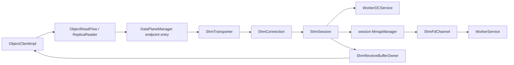

# 同节点多 Worker SHM Get fd-passing 方案设计

## 1. 文档信息

| 属性 | 值 |
| --- | --- |
| 设计范围 | `enableLocalCache=false` 时，同节点任意数据 Worker 的 Get/BatchGet |
| 问题来源 | 非绑定同节点 Worker 的 SHM Get 进入 Worker-to-Worker payload 路径，可能出现空 payload，且没有实现零拷贝 |
| 源码基线 | `origin/master@1c2928c3e97e98a777d09bd469722fae59bfd98c` |
| 状态 | 已完成设计自检、实现和 rebase，正在执行代码检视及远端验证 |
| 兼容范围 | SDK 公共接口和 protobuf 不变；跨节点 UB/TCP 策略不变 |

本文从问题背景、目标和 Use Case 重新推导方案。设计不复用旧的
`ShmConnectionPool`，而是在 `DataPlaneManager` 已有的 per-endpoint entry 内维护轻量 SHM session。

## 2. 问题背景

### 2.1 期望行为

SDK 已通过 Routing 获得对象的数据 Worker。访问同一主机上的任意 Worker 时，SDK 应：

1. 与目标 Worker 建立独立 fd-passing 通道并注册目标 Worker 的 `clientId`；
2. 通过 `WorkerOCService.Get` 获取 SHM metadata；
3. 根据 `store_fd/mmap_size/offset` 调用 `GetClientFd` 接收 SCM_RIGHTS fd；
4. mmap 后直接构造 SDK `Buffer`，不复制对象数据；
5. `Buffer` 释放时，通过目标 Worker 的 `WorkerOCService.DecreaseReference` 释放引用。

### 2.2 当前问题

旧实现只允许 SDK 绑定 Worker 使用 `IClientWorkerApi` 的 SHM 通道。对象位于同节点其他 Worker 时，
`TransportLayer` 虽然选择 `ShmTransporter`，但其 Get 实际调用
`WorkerWorkerOCService.GetObjectRemote/BatchGetObjectRemote`：

- “SHM”只体现在 transporter 标签，数据仍经 brpc attachment 复制；
- 该服务面是 Worker-to-Worker，不是 Client-to-Worker；
- payload fallback 状态判断错误时，可能返回成功 metadata 和空 payload；
- 返回 Buffer 的引用仍绑定 SDK 初始 Worker，无法安全释放到真实数据 Worker。

### 2.3 关键约束

| 约束 | 设计影响 |
| --- | --- |
| `DataPlaneManager` 已按 Worker endpoint 缓存 transporter/RPC | 不再建立第二套地址索引连接池 |
| `WorkerOCService.Get` 对 SHM client 增加引用 | Get transport error 具有不确定副作用，禁止同 session 盲重试 |
| `GetClientFd` 通过注册 clientId 找到 fd socket | 每个目标 Worker 必须有独立 session |
| SDK 初始绑定 Worker 的 SHM 状态不代表目标 Worker | 不使用绑定 Worker 的 `IsShmEnable()` 做全局 gate；首次请求携带鉴权上下文后，由目标 Worker 的 `GetSocketPath/RegisterClient` 判定 fd-passing 能力 |
| Worker fd 仅在对应进程内有意义 | 每个 session 必须有独立 `MmapManager` namespace |
| Worker 重启后 clientId/fd/mmap 全部失效 | session 必须可换代，旧 Buffer 必须持有自己的 generation |
| fd-passing socket 是单消费者字节流 | 首次 FD 获取在 endpoint 内串行 |
| protobuf 不能新增字段 | 复用现有 WorkerService 和 WorkerOCService 协议 |

## 3. 目标与非目标

### 3.1 目标

| 编号 | 目标 | 验收条件 |
| --- | --- | --- |
| G1 | 非绑定同节点 Worker 走 fd-passing | WorkerOC Get 一次、RPC payload 为 0、GetClientFd/mmap 成功 |
| G2 | Client-to-Worker 服务边界正确 | SHM Get/BatchGet/Decrease 只走 WorkerOCService |
| G3 | 支持 Get 和 BatchGet | Batch 一个 endpoint 只发一个 Get RPC，按 object_index 还原 |
| G4 | Buffer 生命周期正确 | mmap entry 和 Worker 引用由 Buffer owner 保活并幂等释放 |
| G5 | 并发和关闭安全 | 建链 single-flight；FD 串行；Shutdown 可打断阻塞接收 |
| G6 | Worker 重启/连接故障可恢复 | 旧 session 退役，新请求重建；旧 Buffer 不引用新 generation |
| G7 | 不破坏跨节点传输 | 同节点 SHM；跨节点仍按现有规则选择 UB/TCP |
| G8 | 可诊断、可验证 | 注入点可证明 WorkerOC 被调用且 WorkerWorker Get 未调用 |
| G9 | 目标 Worker 能力独立判断 | 绑定 Worker 与目标 Worker 的 SHM 开关无论哪一侧关闭，都只以目标 Worker 的 bootstrap 结果为准 |

### 3.2 非目标

- 不修改公开 `Create/Publish(Buffer)` 的数据放置语义。
- Routed Create/MCreate 不复用初始绑定 Worker 的 fd channel 或 mmap namespace；本次只为
  Get/BatchGet 建立目标 Worker session，写路径继续使用本地 payload buffer。
- 不重写 `enableLocalCache=true` 的绑定 Worker SHM Get。
- 不修改跨节点 UB 协议。
- 不新增 Worker protobuf 或 Worker 端 Get 实现。
- Embedded Client 不接入跨进程 fd-passing。

## 4. 服务边界

这是本方案的强约束。

| 操作 | 服务 | 原因 |
| --- | --- | --- |
| Get/BatchGet metadata 和引用增加 | `WorkerOCService.Get` | Client-to-Worker 对象服务 |
| Buffer 引用释放 | `WorkerOCService.DecreaseReference` | 与 Get 的引用表属于同一对象服务 |
| GetSocketPath | `WorkerService.GetSocketPath` | fd 会话 bootstrap，不承载对象数据 |
| RegisterClient | `WorkerService.RegisterClient` | 注册 socket/clientId |
| GetClientFd | `WorkerService.GetClientFd` | SCM_RIGHTS 控制面 |
| Heartbeat | `WorkerService.Heartbeat` | session 续租及 expired fd 回收 |
| DisconnectClient | `WorkerService.DisconnectClient` | session 控制面 |
| SHM 候选路径的 GetObjectRemote | 禁止 | 该接口属于 Worker-to-Worker 数据服务 |

因此，fd-passing 失败时 `ShmTransporter` 返回明确错误，由副本调度或上层重试决定下一步；它不在内部
降级为 `WorkerWorkerOCService.GetObjectRemote`。这避免以“降级”名义破坏服务边界，也避免空 payload
问题重新进入新路径。

## 5. Use Cases

### UC1：首次访问非绑定同节点 Worker

SDK 绑定 Worker0，对象位于同节点 Worker1：

1. 为 Worker1 建立 socket 并注册新 clientId；
2. `WorkerOCService.Get(clientId, key)` 返回 SHM metadata；
3. 首次 worker fd 触发 `WorkerService.GetClientFd`；
4. SDK 接收 fd、mmap，并返回零拷贝 Buffer。

验收：Register=1、WorkerOC Get=1、GetClientFd=1、GetObjectRemote=0。

### UC2：复用 session 和 mmap

再次读取 Worker1 的对象：

- 不重复 RegisterClient；
- 已 mmap 的 worker fd 不重复 GetClientFd；
- 只新增 WorkerOC Get metadata RPC。

### UC3：并发首次访问

多个线程同时首次访问同一 Worker：

- 只有一个线程建链；
- 其他线程等待同一个 attempt，等待受 API deadline 限制；
- 建链失败后缓存 10ms 起、最大 1s 的指数退避结果，避免故障风暴；
- 不同 Worker 的建链和 FD 获取互不阻塞。

### UC4：BatchGet

同一 endpoint 的多个 key 合并为一个 `WorkerOCService.Get`：

- 请求设置 `return_object_index=true`；
- 每个 response index 必须唯一、未越界且全集完整；
- 某个对象不存在时只返回该 item 失败，不退役健康 session；
- 任一已返回 SHM metadata 的对象 mmap/协议校验失败时，整批失败并退役 session，避免返回引用已被
  client-lost 清理的半成功 Buffer。

### UC5：Worker 重启或 RPC 连接失效

- endpoint entry 被 Teardown 后不再接收新请求；
- socket shutdown 打断阻塞中的 `SockRecvFd`；
- 新请求通过新 RPC entry 建立新 session；
- mmap table 是 session 私有的，相同数值的 worker fd 不会命中旧 Worker 映射。
- mmap table/entry 基类使用 virtual destructor，session 换代通过基类 owner 销毁派生表时行为确定。

### UC6：Buffer 晚于 endpoint 退役

Buffer 持有：

- `ShmSession`；
- `IMmapTableEntry`；
- `shm_id`；
- tenant/token 快照；
- release pool 弱引用。

session 活着时 Buffer 使用目标 session 做存活检查。session 已退役时 Buffer 返回
`K_BUFFER_DEPRECATED`，不再错误检查 SDK 初始绑定 Worker。

### UC7：释放与 Shutdown 并发

- Buffer Release 使用 atomic flag 保证幂等；
- release pool 可用时异步调用 WorkerOC DecreaseReference；
- 队列已关闭或 Decrease 失败时关闭 fd session；
- Worker 的 socket-heartbeat/client-lost 路径批量清理剩余引用；
- 不回退为 Shutdown 路径上的同步长 RPC。

### UC8：旧 Worker 不支持多 SHM 引用计数

RegisterClient 协商 `support_multi_shm_ref_count`：

- 支持时每个成功 Get 对应一次 Decrease；
- 不支持时 session 本地按 `shm_id` 合并计数，只在最后一个 Buffer 释放时调用一次 Decrease；
- session 关闭时 Worker client-lost 仍是最终清理兜底。

### UC9：跨节点

TransportAdvisor 不为跨节点返回 SHM candidate，继续使用现有 UB/TCP 路径。本方案不在跨节点建立
WorkerService fd session。同节点目标 Worker 始终先构造 endpoint-scoped `ShmTransporter`，首次请求再
通过目标 Worker 的 `GetSocketPath/RegisterClient` 探测并协商 fd-passing；SDK 初始绑定 Worker 的
`IsShmEnable()` 不参与该目标 Worker 的能力判断。若目标 Worker 未提供 fd-passing endpoint，
`ShmTransporter` 返回 `K_NOT_SUPPORTED`，由上层在同一 Worker 内做 UB/TCP 降级，且不回退到
WorkerWorker Get。

### UC10：初始绑定 Worker 与目标 Worker 的 SHM 能力不同

SDK 初始绑定 Worker1 且 Worker1 关闭 SHM，对象路由到同节点、开启 SHM 的 Worker0：

- `DataPlaneManager` 根据同节点 routing hint 为 Worker0 创建 `ShmTransporter`；
- 不读取 Worker1 的 `IsShmEnable()` 判断 Worker0；
- 首次 Get 通过 Worker0 的 `GetSocketPath/RegisterClient` 建立 session；
- Get 和 DecreaseReference 仍只走 Worker0 的 `WorkerOCService`。

### UC11：绑定 Worker 开启 SHM、目标 Worker 关闭 SHM

SDK 初始绑定 Worker1 且 Worker1 开启 SHM，对象路由到同节点、关闭 SHM 的 Worker0：

- routing 的同节点信息只产生 `SHM_CANDIDATE`，不代表目标 Worker 已支持 fd-passing；
- 首次 Get 必须查询 Worker0 的 `GetSocketPath`，不得复用 Worker1 的 SHM 能力或 fd channel；
- Worker0 未返回 fd-passing endpoint 时，`ShmTransporter` 返回 `K_NOT_SUPPORTED`，上层按 UB/TCP 降级；
- 不调用 Worker0 的 `WorkerOCService.Get/RegisterClient/GetClientFd`，也不回退到
  `WorkerWorkerOCService.GetObjectRemote`。

### UC12：主动缩容期间 SHM 注册被拒绝

`enableLocalCache=false` 的 Get 已从 `QueryAndGet` 获得同节点数据 Worker，但该 Worker 在数据读取前进入
主动缩容。数据尚未迁移完成，而新的 SHM session 会在 `RegisterClient` 被
`K_NOT_READY: Worker is draining for ScaleIn` 拒绝。

该错误只表示退出 Worker 不再接收新的本地 Client session，不表示 Worker 上的存量数据已经不可读。
Client 已收到 `PRE_LEAVING/LEAVING` 拓扑状态时，同节点 Worker 不再进入 SHM candidate 集合：URMA
可用时直接走 UB，否则直接走 TCP。若请求选路后 Worker 才进入 draining，或 Client 尚未收到新拓扑，
Get 在同一 API deadline 内按以下有界顺序读取同一数据 Worker：

1. SHM candidate；
2. SHM 因 draining 或目标不支持 fd-passing 失败后，尝试 UB candidate；
3. UB 建连或数据传输失败后，最终尝试 TCP；
4. UB/TCP 返回对象级错误时直接返回，不以更换传输方式掩盖 `K_NOT_FOUND` 等业务结果。

未启用 URMA 时保持 `SHM -> TCP`。该方案不重查元数据、不切换数据 Worker，也不新增 Worker 协议；
`DataPlaneExecutor` 负责 endpoint 内的传输降级，`ReplicaReader` 继续负责副本和元数据位置级重试。

SHM 返回 draining 后，Client 立即将该 Worker 从本地 SHM candidate 集合摘除，使后续 Get 直接复用
fallback 建立的 UB 连接；即使 UB/TCP fallback 成功，也异步触发一次 `Routing::ForceRefresh()`，缩短旧
`ACTIVE` 快照的驻留时间。触发前按已发布 transport snapshot 做全局门禁：同一 snapshot 下所有 endpoint
和并发 Get 最多触发一次；新 snapshot 发布时重建 SHM candidate 并重新放行。该门禁避免重复 Get 持续
延长 HashRingRefresher 的强制刷新窗口，同时保留其窗口内的合并与有限重试能力。

## 6. 总体架构



### 6.1 所有权

```text
DataPlaneManager::WorkerTransportEntry
  └─ ShmTransporter
      └─ ShmConnection
          └─ current ShmSession
              ├─ WorkerRpcClient (shared endpoint channel)
              ├─ ShmFdChannel (owns fd socket)
              └─ MmapManager (worker-fd namespace)

Buffer
  └─ ShmReceiveBufferOwner
      ├─ ShmSession
      └─ IMmapTableEntry
```

entry 被删除只禁止新 Get。只要 Buffer 存活，session 和 mmap entry 仍有引用；session 被主动退役后 Buffer
检查为 deprecated，Worker 引用由 session Disconnect 或 client-lost 清理。

## 7. 建链协议

`ShmSession::Create` 的步骤：

1. `WorkerService.GetSocketPath(token, tenant)`；
2. 若 Worker 返回 `shm_worker_port>0`，连接 `tcp://workerHost:port`，否则连接 `ipc://path`；
3. 接收 Worker 分配的 server fd；
4. SCMTCP 模式先接收 locality probe fd 并立即关闭；
5. `WorkerService.RegisterClient`，请求：
   - `heartbeat_enabled=true`
   - `socket_heartbeat=true`
   - `shm_enabled=true`
   - `support_multi_shm_ref_count=true`
   - 当前 version/git hash/compatibility/token/tenant/server fd
6. 保存 response 的 `client_id/worker_start_id/enable_huge_tlb/support_multi_shm_ref_count`；
   同时保存目标 Worker 分配的 `lock_id`，供返回 Buffer 的 SHM latch 使用；
7. 构造 session 私有 `MmapManager(IShmFdProvider)`；
8. 在进程级 `TimerQueue` 注册 session maintenance timer；
9. 只有全部成功后才由 `ShmConnection` 发布 session。

失败的 candidate 不发布；已注册 candidate 通过关闭 socket 和 DisconnectClient 清理。

### 7.1 Session maintenance 与 expired fd 闭环

`socket_heartbeat=true` 负责通过 fd HUP 快速发现连接断开，但 Worker 的时间兜底仍依赖
`lastHeartbeat`，expired worker fd 也通过现有 `HeartbeatRspPb.expired_worker_fds` 返回。因此每个活跃
session 使用进程已有的 `TimerQueue` 定时触发 maintenance：

1. 间隔取 `min(client_dead_timeout_s, 5s)`，且至少 1s；
2. timer 回调把任务提交到已有 release pool，不阻塞 TimerQueue 线程；
3. 调用 `WorkerService.Heartbeat(clientId, released_worker_fds)`；
4. 校验 `worker_start_id/client_removed/unhealthy/is_voluntary_scale_down`；
5. 从 session 私有 mmap table 摘除 `expired_worker_fds`。旧 Buffer 持有 `IMmapTableEntry`，所以摘表不会
   提前 `munmap`；
6. 下一次 maintenance 回报已摘除 fd，允许 Worker 回收并复用 fd number。

maintenance 不创建 per-session 常驻线程，也不进入 Get 热路径。RPC 超时上限为 1s；失败时关闭 session，
依靠 socket client-lost 清理并让后续请求重建。

## 8. Get 数据流

### 8.1 请求上下文

`TransportReadContext` 从 SDK Get 参数一路传到 transporter，包含：

- token、tenant、client identity；
- `subTimeoutMs`；
- `queryL2Cache`。

`ShmSession::Get` 构造：

- `client_id=session.clientId`
- `object_keys`
- `return_object_index=true`
- `sub_timeout`
- `no_query_l2cache`
- `request_timeout=当前 API 剩余时间`

请求签名后调用 `WorkerOCService.Get`，不做 transport 层自动重试。

### 8.2 响应校验

必须满足：

- payload 和 `payload_info` 均为空；
- `objects_size == request_count`；
- object index 唯一、未越界且完整；
- 成功项 `store_fd>0`、`shm_id` 非空；
- offset/data/metadata/mmap size 非负；
- `offset + metadata_size + data_size <= mmap_size`；
- mmap hit 时，响应 `mmap_size` 必须与缓存 entry 的实际映射大小一致，禁止复用同一 fd 构造越界指针。

`store_fd<=0` 表示未获得对象，返回 `last_rc`；若 `last_rc=K_OK`，归一化为 `K_NOT_FOUND`。

### 8.3 FD 获取

`MmapManager` 先查 session 私有 mmap table。miss 时：

1. 使用 `fdTransferMutex` 串行同 endpoint 的首次 FD 获取；
2. 二次检查 mmap table，避免并发重复请求；
3. `WorkerService.GetClientFd(clientId, workerFds, requestId)`；
4. RPC 成功后同步调用 `SockRecvFd`；
5. 校验 requestId 和 fd 数量；
6. mmap，并以 worker fd 存入 session table。

这里不需要常驻 FD receiver 线程：Worker 在 GetClientFd RPC 返回前已完成 `SockSendFd`，因此同步接收不会
丢失关联；每个 endpoint 的冷路径本就需要串行。Shutdown 先对 socket 调用 `shutdown`，可唤醒阻塞接收。

### 8.4 Buffer 构造

成功项返回：

- `externalData = mmap_base + offset`
- `externalSize = data_size`
- `ExternalBufferMeta(metadataSize, shmId, mode, seal, workerAddr)`
- `externalOwner = ShmReceiveBufferOwner`
- `sessionLockId = RegisterClientRsp.lock_id`

`ObjectClientImpl::MaterializeTransportItem` 检测 `externalMeta` 后直接构造 SHM `Buffer`，不再伪装成 UB
payload。`ObjectBufferInfo.receiveBufferOwner` 接管目标 Worker 引用，因此 `Buffer::Release` 不调用初始绑定
Worker 的 legacy `DecreaseReferenceCnt`；`Buffer::Init` 也使用目标 session 的 `lock_id`，不使用初始绑定
Worker 的锁编号。

## 9. 并发模型

| 共享状态 | 所有者 | 保护方式 |
| --- | --- | --- |
| 当前 session / connecting / closed | ShmConnection | `bthread::Mutex` + `bthread::ConditionVariable` |
| endpoint entry / topology admission | DataPlaneManager / TransportAdvisor | bthread RWLock |
| 建链失败退避 | ShmConnection | 同一 bthread mutex |
| FD socket requestId/auth | ShmFdChannel | bthread mutex，FD transfer 单消费者 |
| socket 关闭 | ShmFdChannel | atomic fd/alive；shutdown 后 try-lock，事务退出兜底 close |
| mmap table | MmapManager | bthread RWLock；cold FD transfer 使用 bthread mutex |
| 当前 auth | ShmSession | bthread mutex |
| 旧协议本地 shm ref count | ShmSession | bthread mutex |
| expired/released fd maintenance | ShmSession | 单个 timer 自调度，任一时刻最多一个任务 |
| Buffer release | ShmReceiveBufferOwner | atomic exchange |

稳态已 mmap Get 不持有全局锁；只执行 WorkerOC metadata RPC、mmap table shared lookup 和 Buffer owner 构造。
transport 选择、session/FD 建链及 mmap 状态可能从 brpc/bthread 请求路径进入，因此该调用栈不使用
`std::mutex`、`std::shared_mutex` 或 `std::condition_variable`，避免 bthread 被 pthread 同步原语阻塞。

## 10. 失败与恢复

| 失败点 | 是否可能已增加引用 | 处理 |
| --- | --- | --- |
| GetSocketPath/connect/Register | 否 | candidate 失败并进入建链退避 |
| WorkerOC Get 明确 missing | 否 | 返回 item 业务错误，保留 session |
| WorkerOC Get transport error | 是 | 退役 session，不在同 session 重试 |
| 响应协议错误 | 可能 | 退役 session，client-lost 清理 |
| GetClientFd/SCM 校验失败 | 是 | 关闭收到的 fd，退役 session |
| mmap/边界校验失败 | 是 | 整批失败，退役 session |
| Create/MCreate 后本地 Buffer 构造失败 | 是 | 按响应 shm_id 调用 WorkerOC DecreaseReference；批量场景回收全部已分配对象 |
| routed Create 本地 payload Buffer 析构 | 否 | 本地内存所有权与 Worker shm_id 解耦；释放 malloc 内存，Worker 引用仍按 shm_id 管理 |
| DecreaseReference 失败 | 是 | 关闭 session，client-lost 批量清理 |
| release pool 已关闭 | 是 | 不同步 RPC，关闭 session |
| maintenance/restart 检查失败 | 可能 | 关闭 session，旧 Buffer deprecated，后续请求重建 |
| endpoint Teardown | 可能 | shutdown fd、DisconnectClient，禁止新请求 |

已感知主动缩容状态时不再建立 SHM session；拓扑传播竞态由 `SHM -> UB -> TCP`（URMA 可用）或
`SHM -> TCP`（URMA 不可用）降级兜底。总尝试次数由候选链长度限制，不增加无界重试或退避循环。只有
SHM capability/draining 和 UB 传输类错误允许切换 transport。对象不存在、鉴权失败、参数错误等
非传输错误保持原状态码，交给现有副本或外层 metadata retry 策略处理。

关闭 socket 是清理不确定引用的关键机制：Worker 已为 socket-heartbeat client 注册 lost handler，连接断开后
执行 `RefreshMeta(clientId)` 和引用表清理。

## 11. 性能评估

### 11.1 热路径

- 数据字节不进入 brpc payload；
- 不分配对象大小的中间 buffer；
- 不新增常驻 receiver/reconcile 线程；复用进程 TimerQueue 和 release pool；
- mmap hit 不调用 GetClientFd；
- endpoint 之间完全并行。

后台每个活跃 endpoint 最多每 1～5 秒执行一次轻量 WorkerService Heartbeat，不占用 Get 调用线程。它同时
防止 socket-heartbeat 时间兜底误判，并闭合 expired fd 回收协议。

### 11.2 冷路径

首次 endpoint 访问增加 GetSocketPath、socket handshake、RegisterClient；首次 worker fd 增加 GetClientFd 和
mmap。以上成本均按 session/fd 摊销。

### 11.3 风险控制

- 建链 single-flight；
- 失败退避最大 1s；
- fd transfer 只串行冷路径；
- BatchGet 合并 metadata RPC；
- session Disconnect 和异步 DecreaseReference 的单次 RPC 预算上限为 1s，避免异常节点拖长 Shutdown；
- 所有范围计算使用减法式边界检查，避免整数溢出。

## 12. 安全与兼容

- 所有 WorkerService/WorkerOC 请求均使用现有 Signature 签名；
- token 不进入日志、metric label 或 endpoint key；
- tenant 从当前 RequestContext 优先获取；
- Register 发送 version、git hash 和 compatibility version；
- protobuf 不变；
- Worker 不支持多引用计数时使用本地合并兼容。

## 13. 测试与验证设计

### 13.1 单元测试

目标：`//tests/ut/client:transport_test`

- WorkerOC Get 请求签名、clientId/tenant 透传；
- unary/batch 响应 object index 越界、重复和缺失校验；
- session Disconnect 签名及 1s 超时上限；
- SHM candidate 不依赖初始绑定 Worker 的 `IsShmEnable()`；
- routed Create/MCreate 不读取初始绑定 Worker 的 SHM 能力，也不使用其 mmap manager；
- Create/MCreate 在 Worker 分配成功但本地 Buffer 构造失败时回收全部 Worker 引用；
- routed Create 即使携带 Worker shm_id，也会释放客户端本地 payload 内存；
- 断言 WorkerOC 调用不触发 GetObjectRemote/BatchGetObjectRemote；
- routed SHM Buffer 使用目标 session 的 lockId，而非初始绑定 Worker 的 lockId；
- ObjectRead context 在 unary/batch/线程调度后保持一致；
- 现有 TCP/UB、DataPlaneManager、Buffer owner、Set/MSet 回归；
- 编译覆盖 session、FD provider、mmap 和 Buffer 所有权接口。
- URMA mock 构建模拟退出 Worker 拒绝 SHM 注册，并让 UB 尝试返回连接失败；断言同一 Get 依次使用
  SHM、UB、TCP，最终由 TCP 成功，且每个候选只执行一次。

### 13.2 集成测试

目标：`//tests/st/client/kv_cache:kv_client_transport_get_test`

新增 `NonBoundSameHostWorkerUsesWorkerOcFdPassing`：

1. 三 Worker 同节点，目标 Worker0 开启 shared memory，reader 初始绑定的 Worker1 关闭 shared memory；
2. writer 绑定 Worker0，reader 绑定 Worker1，证明 Worker1 的 `IsShmEnable()` 不会 gate Worker0；
3. key 明确路由到 Worker0，写入大对象避免 inline；
4. reader 并发执行 8 次首次 Get，校验完整内容并覆盖建链 single-flight；
5. 注入计数断言：
   - WorkerOC Get `+8`
   - RegisterClient `+1`
   - GetClientFd `+1`
   - GetObjectRemote/BatchGetObjectRemote `+0`
6. 第二次读取断言：
   - WorkerOC Get 再 `+1`
   - RegisterClient 不变
   - GetClientFd 不变
7. 同一 Worker 的三个 key 执行 BatchGet，断言 WorkerOC Get 只增加一次、结果顺序和内容正确，且
   GetObjectRemote/RegisterClient 不增加；
8. 等待一个 maintenance 周期，断言 WorkerService Heartbeat 已执行；再次 Get 内容正确且
   RegisterClient/GetClientFd 不增加，证明 session 续租后继续复用。

新增 `BoundWorkerShmDoesNotEnableTargetWorkerShm`：

1. 三 Worker 同节点，reader 初始绑定的 Worker1 开启 shared memory，目标 Worker0 关闭 shared memory；
2. key 明确路由到 Worker0，写入大对象避免 inline；
3. reader Get 由目标 Worker0 的 bootstrap 返回 `K_NOT_SUPPORTED` 后，通过 UB/TCP 从同一 Worker 读取成功；
4. 注入计数断言 WorkerOC Get/RegisterClient/GetClientFd 不增加，证明没有错误复用 Worker1 的 SHM 能力。

保留真实 URMA 环境专项用例 `DrainingTargetUsesUb`：

1. `enableLocalCache=false`，目标 Worker 与 Client 同节点且 SHM、URMA 均启用；
2. 写入明确位于目标 Worker 的对象，阻塞其主动缩容数据迁移；
3. 触发主动缩容并等待退出门禁生效，确保对象仍在目标 Worker；
4. 连续两次 Get 根据拓扑传播时序直接使用 UB，或首次在 SHM draining 后降级到 UB；
5. 断言两次内容正确、最终 transport 均为 UB，且新增 SHM 注册次数总计不超过一次。

该用例依赖真实 URMA 设备和运行时，只保留在 ST 中供具备硬件的环境显式执行；普通 CI 和 URMA mock
验证不运行它。

### 13.3 远端验证

1. 必须构建 `//bazel:datasystem_wheel`；
2. 执行 level0 测试；
3. 执行上述 SHM 集成测试；
4. 使用 `dscli start -w` 部署至少两个同节点 Worker；
5. 安装本次 wheel，用 Python `yr.datasystem.KVClient` 做 Set/Get/BatchGet；
6. 验证大对象内容、重复 Get、Buffer 释放、Worker 日志中的 Register/GetClientFd/Decrease；
7. 保持 session 超过一个 maintenance 周期，确认 Heartbeat 成功且 expired fd 可摘表/回报；
8. 停止或重启目标 Worker，确认旧 Buffer deprecated、新请求可重建或返回明确错误；
9. 保存构建、测试、部署和日志证据。

## 14. 验收矩阵

| 目标 | 主要证据 |
| --- | --- |
| G1/G2 | ST 注入计数和 Worker 日志 |
| G3 | Batch 顺序/缺失 slot 测试 |
| G4 | Buffer 内容、重复引用释放、ASan/单测 |
| G5 | 并发首次建链、Shutdown/FD socket 关闭测试 |
| G6 | Worker restart/endpoint teardown 验证 |
| G7 | 原有 UB/TCP level0 回归 |
| G8 | 指标、注入计数、远端结果文件 |
| G9 | 两个对称专项 ST：绑定关/目标开时成功 fd-passing；绑定开/目标关时通过 UB/TCP 读取成功且不建立 SHM session |
| 主动缩容降级 | URMA mock 验证已感知 draining 时直接 UB/TCP，并验证传播竞态下 `SHM -> UB -> TCP`；真实 URMA ST 验证最终通过 UB 读取 |

## 15. 实现落点

| 模块 | 变更 |
| --- | --- |
| `WorkerRpcClient` | 新增 WorkerService stub、WorkerOC Client Get 和 session maintenance Heartbeat |
| `ShmConnection/ShmSession/ShmFdChannel` | endpoint session、single-flight、fd socket、引用所有权 |
| `MmapManager` | 抽象 `IShmFdProvider`，支持 session 私有 fd namespace |
| `ShmTransporter` | Get/BatchGet 改走 WorkerOCService，禁止 WorkerWorker fallback |
| `ObjectReadFlow/ReplicaReader` | 透传 token/tenant/sub-timeout/L2 查询上下文 |
| `DataGetResult/ObjectBufferInfo` | 透传 SHM metadata 和 receive owner |
| `Buffer` | owner 管理目标 Worker 引用和 session 存活检查 |
| `DataPlaneManager/TransportLayer` | 注入 release pool，Teardown SHM data plane |

## 16. 设计自检结论

| 检视项 | 结论 |
| --- | --- |
| 问题与方案对应 | 空 payload/伪 SHM 的根因由 WorkerWorker payload 路径切换为 WorkerOC metadata + fd-passing 直接消除 |
| 服务边界 | 对象 Get/BatchGet/Decrease 全部属于 WorkerOCService；WorkerService 仅承担 session 控制面 |
| 所有权与并发 | session、mmap entry、Worker ref、lockId 和 fd socket 均有明确 owner、锁及退役顺序 |
| 故障与恢复 | 不确定增引用通过关闭 socket 触发 client-lost 清理；重建使用新 clientId/generation |
| 性能 | 稳态零拷贝、mmap hit 无 FD RPC、无 per-session 常驻线程，endpoint 间并行 |
| 兼容与回滚 | 公共 API/protobuf/Worker 端实现不变，跨节点路径不变；同节点目标能力由目标 Worker bootstrap 明确返回 |
| 可开发性 | 实现落点、接口输入输出、校验规则、锁和生命周期规则完整 |
| 可测试性 | unit、专项 ST、Level0、wheel + Python 双 Worker 部署均有可执行验收条件 |

结论：设计足以支撑实现、代码审查、集成测试和部署验证；不需要新增协议或 Worker 端对象服务逻辑。

## 17. 回滚

变更限定在 routed same-host SHM candidate。回滚时恢复 `ShmTransporter` 原 Get 实现并删除 session 接线即可；
Worker 协议和服务端无变更。若上线后发现异常，可通过路由/配置不发布 SHM candidate，使跨节点 UB/TCP 和
绑定 Worker 原 SHM 路径保持不变。

主动缩容降级只改变 Get 的错误恢复顺序。若需回滚，可恢复 `DataPlaneExecutor` 原有单次重建和
`SHM -> TCP` 行为；公共 API、Worker 协议、数据格式和持久化状态均无需回滚。
