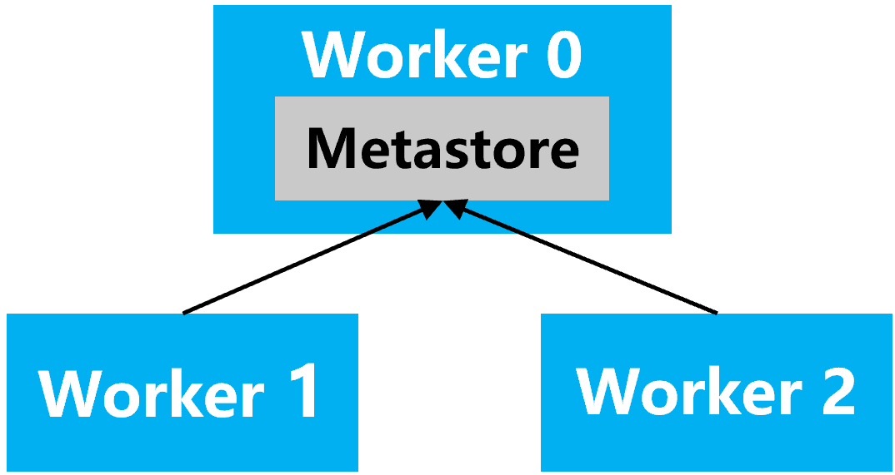

# 集群管理

## 概述

集群管理是 openYuanrong datasystem 的核心能力之一，负责实现节点发现、健康检测、故障恢复及在线扩缩容等功能。通过集群管理，datasystem worker 能够注册到集群中，实现元数据的分布式管理，支持系统水平线性扩展和高可用。

openYuanrong datasystem 目前支持两种集群管理方式：

- **ETCD**：基于外部 ETCD 服务的分布式元数据存储方案
- **Metastore**：内置在 datasystem worker 中的元数据存储服务，无需部署外部 ETCD

## 集群管理方式对比
### 基于 ETCD 的集群管理

ETCD 是一个高可用的键值存储系统，专门用于配置共享和服务发现。在 ETCD 架构中：

- **外部依赖**：需要单独部署和管理 ETCD 集群
- **架构分离**：ETCD 作为独立组件运行，datasystem worker 通过 gRPC 与 ETCD 通信
- **功能完整**：ETCD 提供完整的分布式键值存储、Watch、Lease 等功能
- **运维复杂**：需要额外维护 ETCD 集群的健康性和可用性

**部署架构**：


**适用场景**：
- **已有 ETCD 集群**：环境中已经部署了 ETCD 集群，可以复用现有基础设施
- **多集群共享元数据**：多个 datasystem 集群需要共享同一个 ETCD 作为元数据中心
- **高可用要求高**：需要跨数据中心的高可用部署，ETCD 提供更成熟的高可用方案
- **独立运维需求**：希望将元数据存储与业务组件解耦，便于独立运维和监控

### 基于 Metastore 的集群管理

Metastore 是集成在 datasystem worker 中的元数据存储服务，提供与 ETCD 兼容的 gRPC 接口。在 Metastore 架构中：

- **内置服务**：Metastore 作为 worker 进程的一部分启动
- **架构简化**：无需外部依赖，worker 自管理元数据
- **接口兼容**：完全兼容 ETCD 的 gRPC 接口协议
- **运维简化**：减少了组件数量，降低了部署复杂度

**部署架构**：




其中 `Worker 0` 作为主节点，启动 Metastore 服务，其他 worker 通过 `metastore_address` 连接到主节点的 Metastore 服务。

**适用场景**：
- **快速部署**：需要快速搭建 datasystem 集群，不想额外部署 ETCD
- **资源受限**：生产环境资源有限，希望减少组件数量
- **简化运维**：减少组件数量，降低运维复杂度


## 部署方式

### 基于 ETCD 部署

ETCD 的部署需要先部署外部 ETCD 服务。ETCD 的安装部署可参考：[安装并部署ETCD](../deployment/deploy.md#安装并部署etcd)。

**快速部署**：

```bash
dscli start -w --worker_address "127.0.0.1:31501" --etcd_address "127.0.0.1:2379"
# [INFO] [  OK  ] Start worker service @ 127.0.0.1:31501 success, PID: 38100
```

**集群部署**：

1. 生成配置文件：

```bash
dscli generate_config -o ./
# [INFO] Cluster configuration file has been generated to /home/user
# [INFO] Worker configuration file has been generated to /home/user
# [INFO] Configuration generation completed successfully
```

2. 编辑 `cluster_config.json`，配置集群节点信息：

```json
{
    "ssh_auth": {
        "ssh_private_key": "~/.ssh/id_rsa",
        "ssh_user_name": "root"
    },
    "worker_config_path": "./worker_config.json",
    "worker_nodes": [
        "192.168.1.1",
        "192.168.1.2"
    ],
    "worker_port": 31501
}
```

> **注意事项**：
>
> - 多机集群部署依赖多机之间配置 SSH 互信，SSH 互信配置可参考：[SSH互信配置](../deployment/deploy.md#ssh互信配置)
> - 所有待部署的机器上都需要安装 dscli，dscli 安装可参考：[dscli安装教程](../deployment/dscli.md#dscli安装教程)

3. 编辑 `worker_config.json`，配置 ETCD 地址：

```json
{
    "etcd_address": {
        "value": "127.0.0.1:2379"
    }
}
```

4. 部署集群：

```bash
dscli up -f ./cluster_config.json
# [INFO] Start worker service @ 192.168.1.1:31501 success.
# [INFO] Start worker service @ 192.168.1.2:31501 success.
```

### 基于 Metastore 部署

Metastore 部署无需外部 ETCD 服务，由 worker 内置提供元数据存储功能。多机部署时需要指定主节点，主节点的 worker 启动 Metastore 服务，其他 worker 连接到主节点的 Metastore 服务。

**配置说明**：

| 配置项 | 类型 | 默认值 | 描述 |
|-----|------|---------|-------------|
| metastore_head_node | string | "" | 指定启动 Metastore 服务的主节点 IP，必须在集群配置文件 `cluster_config.json` 的 `worker_nodes` 中（仅 `dscli up` 使用） |
| start_metastore_service | bool | `false` | 是否启用 Metastore 代替ETCD，若需要启用，仅需主节点worker设为`true`，从节点worker设为`false` |
| metastore_address | string | `""` | 主节点worker的Metastore Service访问地址，与 `start_metastore_service` 搭配一起使用，主从节点均需填写，格式为：ip:port，例如：127.0.0.1:2379 |

**快速部署**：

```bash
# 主节点
dscli start -w --worker_address "192.168.1.1:31501" \
               --start_metastore_service true \
               --metastore_address "192.168.1.1:2379"
# [INFO] [  OK  ] Start worker service @ 192.168.1.1:31501 success

# 从节点
dscli start -w --worker_address "192.168.1.2:31501" \
               --start_metastore_service false \
               --metastore_address "192.168.1.1:2379"
# [INFO] [  OK  ] Start worker service @ 192.168.1.2:31501 success
```

**集群部署**：

1. 生成配置文件：

```bash
dscli generate_config -o ./
```

2. 编辑 `cluster_config.json`，指定 `metastore_head_node`：

```json
{
    "ssh_auth": {
        "ssh_private_key": "~/.ssh/id_rsa",
        "ssh_user_name": "root"
    },
    "worker_config_path": "./worker_config.json",
    "worker_nodes": [
        "192.168.1.1",
        "192.168.1.2"
    ],
    "worker_port": 31501,
    "metastore_head_node": "192.168.1.1"
}
```

> **注意事项**：
>
> - 多机集群部署依赖多机之间配置 SSH 互信，SSH 互信配置可参考：[SSH互信配置](../deployment/deploy.md#ssh互信配置)
> - 所有待部署的机器上都需要安装 dscli，dscli 安装可参考：[dscli安装教程](../deployment/dscli.md#dscli安装教程)

3. 编辑 `worker_config.json`，配置 Metastore 相关参数：

```json
{
    "etcd_address": {
        "value": ""
    },
    "metastore_address": {
        "value": "192.168.1.1:2379"
    }
}
```

4. 部署集群：

```bash
dscli up -f ./cluster_config.json

# [INFO] Modifed config - metastore_address
# [INFO] Starting metastore head node: 192.168.1.1
# [INFO] Setting start_metastore_service=true for node: 192.168.1.1
# [INFO] Start worker service @ 192.168.1.1:31501 success.
# [INFO] Starting other worker nodes in parallel: ['192.168.1.2']
# [INFO] Setting start_metastore_service=false for node: 192.168.1.2
# [INFO] Start worker service @ 192.168.1.2:31501 success.
```

也可以直接通过命令行参数指定 Metastore 头节点，无需修改 `cluster_config.json`：

```bash
dscli up --metastore_head_node 192.168.1.1 -f ./cluster_config.json
```
