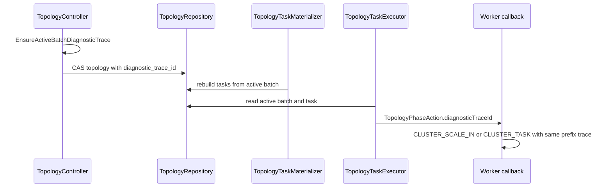

# Cluster Topology 诊断日志规范详细设计

- 文档状态：草案
- 作者：Codex
- 评审人：Topology Runtime owner、Worker Runtime owner、SRE/运维 owner、测试 owner
- 最后更新：2026-07-22
- 源码基线：`yrds/master`
- 关联概要设计：`docs/superpowers/designs/2026-07-21-cluster-topology-diagnostic-logging-overview-design.md`
- 关联执行计划：`docs/superpowers/plans/2026-07-21-cluster-topology-diagnostic-logging.md`
- 用户定位手册：`docs/source_zh_cn/appendix/cluster_log_diagnosis_guide.md`

本文按 `~/.codex/datasystem/template/feature_detailed_design_template.md` 的详细设计结构组织，目标是在不改变 cluster topology 行为的前提下补齐可检索、可串联、可交接给开发的诊断日志。

## 1. 背景与问题

缩容复现日志显示第二轮 scale-in 中能看到 `Node exiting, change primary copy failed`，但难以回答以下问题：

- 哪一轮缩容开始和结束；
- 哪些 worker 是本轮参与者；
- 失败发生在 controller、executor、callback 还是 backend；
- data drain 和 metadata handoff 分别耗时多少；
- 其他节点在当时看到的 topology membership 是什么；
- backend 降级、watch resync、restart、shutdown 是否干扰了同一时间窗口。

当前日志主要问题是字段分散、trace slot 为空或不跨组件传播、payload 冗余 prefix 信息、部分日志使用 `batch_type` 或数字 enum，且用户手册没有从日志平台检索视角组织。

## 2. 目标与非目标

目标：

- 过滤 `CLUSTER_` 可以看到 topology 相关历史事件。
- 高层 scale-out、scale-in、failure active batch 使用一个 `cluster;<uuid_suffix>` trace。
- 日志 message 不重复 `cluster=`、`severity=`、`trace_id=`。
- 低频控制面日志全量打印 `members=` / `participants=`。
- 高频 executor/callback 日志保留 `operation_prefix`、`task_prefix`、`reason`、原样 `status`。
- 运维和开发使用同一批 INFO/WARN/ERROR `CLUSTER_` 日志。

非目标：

- 不改变缩容 callback 顺序。当前 `OnScaleIn()` 源码仍先 `data_drain` 后 `metadata_handoff`，本 PR 只暴露该顺序。
- 不新增 failure missing/resolved 细粒度日志。
- 不新增 failure preempt/resume 独立日志。
- 不修改 master metadata manager 内部 primary handoff 日志。
- 不修改 task janitor stale cleanup 日志。
- 不新增日志平台、metrics 或统一 logging framework。

## 3. 源码事实

| 编号 | 源码事实 | 设计影响 |
|---|---|---|
| F1 | `TopologyController` 是 active batch 的创建、提交、final owner。 | controller 负责生成高层 trace、flow start/finish、participants、commit 证据。 |
| F2 | `ChangeBatchPb` 只有 type/epoch，executor/callback 只能从 active batch 获取上下文。 | 新增兼容字段 `diagnostic_trace_id = 3` 并传到 domain/action。 |
| F3 | `TopologyTaskMaterializer` 根据 active batch 生成 task 和 notify。 | materializer 输出 `task_created`、task/notify 计数。 |
| F4 | `TopologyTaskExecutor` 负责 notify、callback、progress、retry。 | executor 输出 notify/progress/recover，并把 trace 放入 `TopologyPhaseAction`。 |
| F5 | `WorkerTopologyPhaseCallbacks::OnScaleIn()` 当前先 drain data，再 migrate metadata。 | 手册示例按实际日志顺序展示 `data_drain -> metadata_handoff`。 |
| F6 | `TopologyEngine`/`TopologyObserver` 负责 worker/observer watch、topology reload、backend availability。 | backend 降级、恢复、runtime failure、watch resync 都进入 `CLUSTER_`。 |
| F7 | `DsCoordinationBackend` 和 `EtcdCoordinationBackend` 是 membership lease update wrapper。 | 在 lease 写入成功或失败后输出 `CLUSTER_MEMBERSHIP`。 |

## 4. 方案设计

### 4.1 diagnostics helper

新增 `src/datasystem/cluster/diagnostics/topology_diagnostic_log.{h,cpp}`，提供：

- `BuildClusterDiagnosticTraceId()`：生成 `cluster;<uuid_suffix>`，后缀长度 12，与现有 request trace 的短 UUID 语义一致；
- `EnsureClusterDiagnosticTraceId()`：active batch trace 缺失或非法时生成 fallback；
- `DiagnosticPrefix()`：输出短 id，用于 digest、operation、task；
- `ToLogString()`：输出 `MemberState`、`MemberLifecycleState`、`TopologyChangeType`、`TopologyCallbackPhase`、`ControlBackendState` 的可读名称；
- `FormatMemberList()`、`FormatMemberIdentities()`、`FormatMemberStateCounts()`：低频成员和参与者全量打印；
- `DurationMs()`；
- `ClusterTraceScope`：进入 scope 时设置 prefix trace，退出时恢复原 trace 上下文。

helper 无 backend IO、无 RPC、无共享可变状态。

### 4.2 trace 持久化与传播

`ChangeBatchPb` 新增：

```proto
string diagnostic_trace_id = 3;
```

domain 和 executor action 同步新增：

```cpp
struct ActiveBatch {
    TopologyChangeType type;
    uint64_t epoch;
    std::string diagnosticTraceId;
};

struct TopologyPhaseAction {
    std::string taskId;
    uint64_t topologyVersion;
    uint64_t batchEpoch;
    std::string diagnosticTraceId;
    ...
};
```

传播链路：



旧 topology 中缺少字段时 decode 为空；新代码在 controller 创建新 active batch 时补齐。旧代码读取新字段时由 proto3 跳过未知字段。

### 4.3 日志族

| 日志族 | 触发点 | 关键字段 |
|---|---|---|
| `CLUSTER_MEMBERSHIP` | coordination backend 写 lease。 | `flow action component role node state result reason status` |
| `CLUSTER_MEMBERSHIP_OBSERVED` | controller 写入 READY/EXITING membership fact。 | `flow action component topology_version member_count state_counts members result` |
| `CLUSTER_FLOW` | controller 高层 flow 起止、等待、重规划、bootstrap authority、restart reconciliation。 | `flow action component role epoch topology_version participant_count participants flow_duration_ms result reason status` |
| `CLUSTER_CHANGE` | topology CAS commit 后 read-back。 | `flow action expected_version committed_version active_flow active_epoch member_count state_counts members topology_revision digest_prefix cas_result result` |
| `CLUSTER_TASK` | materializer、executor notify/progress。 | `flow action component role epoch executor task_count notify_count pending_count task_prefix operation_prefix result reason retry status` |
| `CLUSTER_SCALE_IN` | worker scale-in callback。 | `flow action component role epoch source target executor operation_prefix task_prefix callback_phase phase_duration_ms result reason status` |
| `CLUSTER_FAILURE` | failure finalizing、failure best-effort callback。 | `flow action component role epoch executor failed participants operation_prefix task_prefix result reason status` |
| `CLUSTER_BACKEND` | backend unavailable/recovered。 | `flow action component role backend backend_state topology_version topology_revision digest_prefix result reason` |
| `CLUSTER_DEGRADED` | availability level 变化。 | `flow action component role previous_level level result reason` |
| `CLUSTER_RUNTIME_OPERATION_FAILED` | worker runtime 操作失败。 | `flow action component role result status` |
| `CLUSTER_WATCH` | watch registered/resync。 | `flow action component role watch_scope scope_count watch_revision result reason status` |
| `CLUSTER_RING` | topology publish VLOG。 | `flow action component role topology_version topology_revision digest_prefix result` |
| `CLUSTER_SHUTDOWN` | 全集群退出 finish。 | `flow action component role participant_count participants flow_duration_ms result` |

### 4.4 字段约束

- prefix 已有字段不进 message：不打印 payload `cluster=`、`severity=`、`trace_id=`。
- 用户入口使用可读 `flow`，不使用 `batch_type`、`type_name` 或数字 enum。
- `timeout_ms` 表示 `node_timeout_s * 1000`，`dead_ms` 表示 `node_dead_timeout_s * 1000`。本 PR 未新增这两个字段的 failure detect 日志。
- `status` 原样完整打印，不清洗、不截断。
- 非 `status` 字段不打印 object key、token range、raw protobuf、密钥、完整 UUID。
- `members=` 和 `participants=` 不做 sample 上限。

## 5. 关键流程

### 5.1 扩容

```text
CLUSTER_MEMBERSHIP state=READY
CLUSTER_MEMBERSHIP_OBSERVED members=[.../INITIAL]
CLUSTER_FLOW flow=scale_out action=start
CLUSTER_CHANGE flow=scale_out action=commit active_flow=scale_out
CLUSTER_TASK flow=scale_out action=task_created
CLUSTER_TASK flow=scale_out action=notify
CLUSTER_TASK flow=scale_out action=progress
CLUSTER_FLOW flow=scale_out action=finish flow_duration_ms=<ms>
```

### 5.2 缩容

```text
CLUSTER_MEMBERSHIP state=EXITING
CLUSTER_MEMBERSHIP_OBSERVED members=[.../PRE_LEAVING]
CLUSTER_FLOW flow=scale_in action=start
CLUSTER_TASK flow=scale_in action=task_created
CLUSTER_TASK flow=scale_in action=notify
CLUSTER_SCALE_IN flow=scale_in action=data_drain
CLUSTER_SCALE_IN flow=scale_in action=metadata_handoff
CLUSTER_FLOW flow=scale_in action=wait reason=external_termination
CLUSTER_FLOW flow=scale_in action=finish flow_duration_ms=<ms>
```

### 5.3 故障处理

```text
CLUSTER_FLOW flow=failure action=start reason=dead_timeout
CLUSTER_CHANGE flow=failure action=commit active_flow=failure
CLUSTER_TASK flow=failure action=task_created
CLUSTER_TASK flow=failure action=notify
CLUSTER_FAILURE flow=failure action=finalizing result=pending
CLUSTER_FLOW flow=failure action=finish flow_duration_ms=<ms>
```

`result=pending` 表示阶段已开始但不是终态，不能当成成功或失败。

### 5.4 backend 降级和恢复

```text
CLUSTER_BACKEND flow=backend action=access_failed backend=coordination backend_state=unavailable result=failed
CLUSTER_DEGRADED flow=backend action=state_change previous_level=NORMAL level=CONTROL_DEGRADED
CLUSTER_BACKEND flow=backend action=recovered backend=coordination backend_state=available
CLUSTER_DEGRADED flow=backend action=state_change previous_level=CONTROL_DEGRADED level=NORMAL
```

## 6. 文件修改

| 文件 | 修改 |
|---|---|
| `src/datasystem/cluster/diagnostics/topology_diagnostic_log.h` | 新增 helper 接口。 |
| `src/datasystem/cluster/diagnostics/topology_diagnostic_log.cpp` | 新增 helper 实现。 |
| `src/datasystem/protos/cluster_topology.proto` | 新增 `ChangeBatchPb.diagnostic_trace_id = 3`。 |
| `src/datasystem/cluster/model/topology_types.h` | active batch、execution fence 增加 trace 字段。 |
| `src/datasystem/cluster/repository/topology_repository_codec.cpp` | encode/decode trace 字段。 |
| `src/datasystem/cluster/control/topology_controller.cpp/.h` | 生成 active batch trace，输出 flow/change/membership/shutdown 日志和耗时。 |
| `src/datasystem/cluster/control/topology_task_materializer.cpp` | 输出 `CLUSTER_TASK action=task_created`。 |
| `src/datasystem/cluster/executor/topology_task_executor.cpp` | 继承 trace，规范 notify/progress/recover 日志。 |
| `src/datasystem/cluster/executor/topology_phase_callbacks.h` | callback action 携带 trace。 |
| `src/datasystem/worker/worker_topology_phase_callbacks.cpp/.h` | 规范 scale-in callback 和 failure callback_step 日志。 |
| `src/datasystem/cluster/runtime/topology_engine.cpp` | 规范 watch、ring、backend、degraded、runtime failure 日志。 |
| `src/datasystem/cluster/runtime/topology_observer.cpp` | 规范 observer watch/ring/lifecycle 日志。 |
| `src/datasystem/cluster/coordination_backend/ds_coordination_backend.cpp` | lease update 和 restart reconciliation 输出 `CLUSTER_MEMBERSHIP` / `CLUSTER_FLOW`。 |
| `src/datasystem/cluster/coordination_backend/etcd_coordination_backend.cpp/.h` | etcd adapter lease update 和 restart reconciliation 输出同类日志。 |
| `src/datasystem/cluster/CMakeLists.txt`、`src/datasystem/cluster/BUILD.bazel` | diagnostics helper 独立 target 并接入 topology。 |
| `src/datasystem/cluster/coordination_backend/CMakeLists.txt`、`BUILD.bazel` | coordination backend 链接 diagnostics helper。 |
| `tests/ut/cluster/*`、`tests/ut/CMakeLists.txt` | schema、codec、controller、executor、helper 覆盖。 |
| `docs/source_zh_cn/appendix/*`、`.repo_context/modules/infra/observability/*` | 用户手册和上下文入口。 |

## 7. 性能、并发、恢复与安全

性能：

- 新增全量成员列表只在 membership view、flow start/finish、change commit、shutdown 等低频控制面日志中输出。
- executor progress 和 callback 日志不打印完整成员列表。
- helper 只格式化已有内存态，不做 backend IO、RPC 或 object scan。

并发：

- `ClusterTraceScope` 操作线程本地 trace，不共享可变状态。
- controller `flowStartByEpoch_` 只在 controller reconcile 线程使用。
- `EtcdCoordinationBackend::keepAliveKey_` 在 `InitKeepAlive()` 写入，之后用于日志读，不参与状态推进。

恢复：

- active batch 已提交后，`diagnostic_trace_id` 随 topology value 持久化，controller/executor 重启后可继续复用同一 trace。
- active batch 提交前崩溃不会形成跨进程 trace，以后续成功 commit 的 trace 为准。

安全：

- 非 `status` 字段只包含地址、状态、版本、短 id、耗时、结果和原因。
- `status` 按要求原样打印，后续如果 Status 携带敏感 payload，需要在具体调用点单独治理。

## 8. 测试设计

| 测试 | 文件 | 覆盖 |
|---|---|---|
| helper trace 和成员格式 | `tests/ut/cluster/topology_diagnostic_log_test.cpp` | trace prefix、scope 恢复、成员全量、lifecycle state 字符串。 |
| proto schema | `tests/ut/cluster/cluster_topology_schema_test.cpp` | `diagnostic_trace_id` 字段号和字段数。 |
| codec round-trip | `tests/ut/cluster/topology_repository_codec_test.cpp` | trace encode/decode。 |
| controller active batch | `tests/ut/cluster/topology_controller_test.cpp` | scale-out/scale-in 新 batch trace 非空。 |
| executor propagation | `tests/ut/cluster/topology_task_executor_test.cpp` | callback action 获得 active batch trace。 |

建议验证命令：

```bash
cmake --build <build_dir> --target cluster_topology_contract_ut
<build_dir>/tests/ut/cluster_topology_contract_ut --gtest_filter='TopologyDiagnosticLogTest.*:ClusterTopologySchemaTest.*:TopologyRepositoryCodecTest.*:TopologyControllerTest.*:TopologyTaskExecutorTest.*'
rg -n "CLUSTER_.*(trace[_]id=|severity=|cluster=|type_name=|batch_type|CLUSTER_SCALE_IN_DRAIN)" src/datasystem/cluster src/datasystem/worker/worker_topology_phase_callbacks.cpp
```

## 9. 运维与开发定位手册

用户手册位于 `docs/source_zh_cn/appendix/cluster_log_diagnosis_guide.md`，采用 4 节点 `127.0.0.1:31501` 到 `127.0.0.4:31501` 示例，覆盖：

- 多 worker 扩容；
- 多 worker 缩容；
- 多 worker 故障；
- backend 降级/恢复；
- 过程中失败；
- bootstrap、restart、shutdown；
- 开发下钻交接模板。

用户先用 `<cluster_name> AND CLUSTER_ AND flow=<scene>` 找主线，再从 `CLUSTER_FLOW action=start` 复制 prefix trace。开发下钻使用 `component=controller|materializer|executor|callback|backend` 以及 `operation_prefix`、`task_prefix`、`digest_prefix`、`status`。
