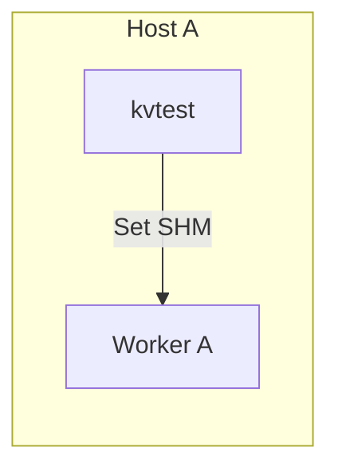
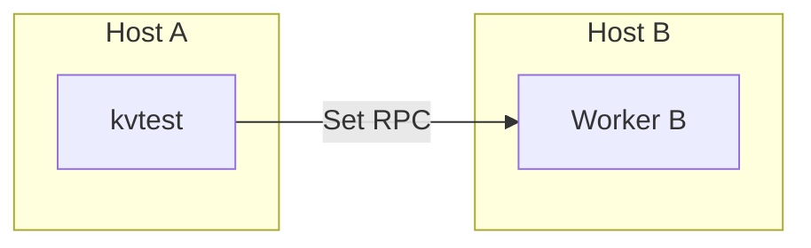
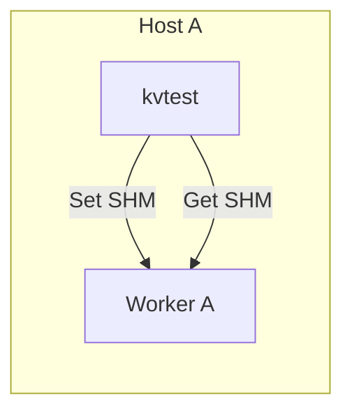
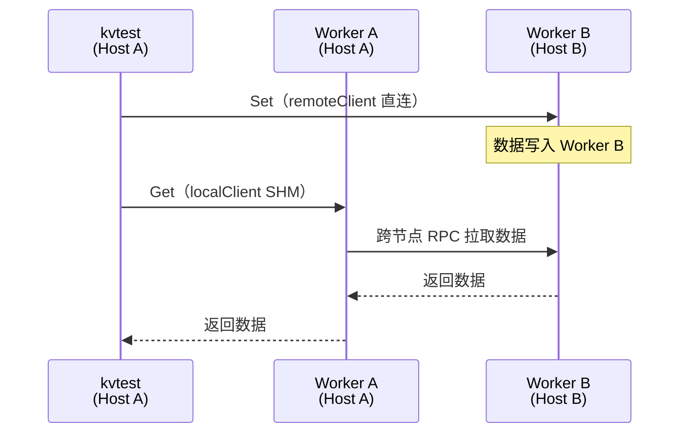
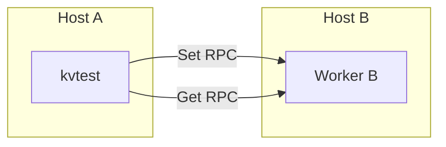
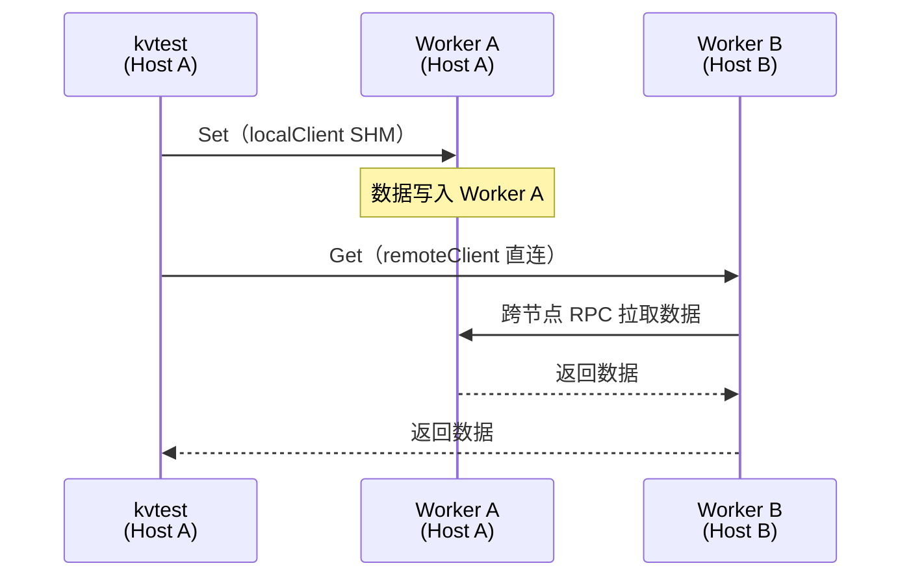

# kvtest Benchmark Set/Get 模式指南

> **相关文档：** [编译部署与通用配置](user-guide.md) | [Pipeline 模式](pipeline-guide.md) | [Cache 模式](cache-guide.md)

Benchmark 模式用于精确测量 KVClient Set/Get 操作的吞吐和延迟。与 Pipeline 模式（持续运行、Writer/Reader 角色、通知机制）不同，Benchmark 模式采用轮次执行（round-based），每轮包含 Set → Get → Del 三个阶段，逐阶段计时并输出 CSV。

**适用场景：**
- Worker 端 Set/Get 吞吐基线测量
- 不同线程数下的延迟分布对比（P50/P90/P99/Max）
- 跨节点 Get 性能测试（SHM 本地读 vs UB 远端读）
- `string_view` vs `create_buffer` 两种 Set API 路径对比
- Worker 共享内存压力测试

---

## 1. 测试模式详解

配置 `test_mode` 字段选择测试模式。6 种模式对应不同的客户端-Worker 拓扑。

kvtest 内部维护两个 KVClient：
- **localClient**：通过 ServiceDiscovery（etcd + `JD_HOST_IP`）发现本机 Worker，走 SHM 通道
- **remoteClient**：通过 `remote_worker.host:port` 直连远端 Worker，走 UB/RPC 网络

不同模式将 Set/Get 操作分配给不同的客户端。

### set_local — 本地 Set 吞吐



localClient → Worker A（SHM）。测量本地 Set 吞吐。

### set_remote — 远端 Set 吞吐



remoteClient → Worker B（RPC）。测量远端 Set 吞吐。

### get_local — 本地 Get 延迟



localClient → Worker A。先 Set 再 Get，测量本地端到端延迟。

### get_cross_node — 跨节点 Get（Worker A 拉取 Worker B 的数据）



Set 通过 remoteClient 写入 Worker B，Get 通过 localClient 从 Worker A 读取。Worker A 发现数据不在本地，向 Worker B 发起跨节点 RPC 拉取。测量 **Worker A → Worker B 跨节点 Get 延迟**。

**部署要求：** kvtest 部署在 Host A（与 Worker A 同机），`remote_worker` 指向 Worker B。

### get_remote_direct — 直连远端 Get



remoteClient → Worker B。Set 和 Get 都在同一远端 Worker 上完成，不触发跨节点传输。测量远端 Worker 本地的端到端延迟。

### get_remote_cross — 跨节点 Get（Worker B 拉取 Worker A 的数据）



Set 通过 localClient 写入 Worker A，Get 通过 remoteClient 从 Worker B 读取。Worker B 发现数据不在本地，向 Worker A 发起跨节点 RPC 拉取。测量 **Worker B → Worker A 跨节点 Get 延迟**。

**部署要求：** kvtest 部署在 Host A（与 Worker A 同机），`remote_worker` 指向 Worker B。

### 模式对比总览

| 模式 | Set 客户端 | Get 客户端 | 跨节点方向 | 部署位置 |
|------|-----------|-----------|-----------|---------|
| `set_local` | localClient (SHM) | — | 无 | Worker A 同机 |
| `set_remote` | remoteClient (RPC) | — | 无 | 任意 |
| `get_local` | localClient (SHM) | localClient (SHM) | 无 | Worker A 同机 |
| `get_cross_node` | remoteClient (RPC) | localClient (SHM) | A → B | Worker A 同机 |
| `get_remote_direct` | remoteClient (RPC) | remoteClient (RPC) | 无 | 任意 |
| `get_remote_cross` | localClient (SHM) | remoteClient (RPC) | B → A | Worker A 同机 |

---

## 2. 配置参数

### ServiceDiscovery 参数

Benchmark 模式通过 ServiceDiscovery 连接 etcd 发现 Worker。以下参数影响 Worker 发现行为：

| 参数 | 类型 | 默认值 | 说明 |
|------|------|--------|------|
| `cluster_name` | string | "" | 集群名称，必须与 etcd 中 Worker 注册前缀一致（如 etcd key 为 `/jingpai/datasystem/cluster/...` 则填 `"jingpai"`） |
| `host_id_env_name` | string | "JD_HOST_IP" | 本机 IP 环境变量名，SDK 从该环境变量读取本机 IP 匹配本地 Worker |

> **重要：** `set_local` / `get_local` / `get_cross_node` 模式需要 ServiceDiscovery 匹配本机 Worker（SHM 通道）。
> - 确保 `cluster_name` 与 etcd 中 Worker 注册前缀一致
> - 确保环境变量（默认 `$JD_HOST_IP`）的值与 etcd 中 Worker 的注册地址匹配
> - 可用 `etcdctl get "" --prefix` 查看 Worker 实际注册的地址和前缀

### Benchmark 专用参数

以下参数仅在 `test_mode` 非空时生效：

| 参数 | 类型 | 默认值 | 说明 |
|------|------|--------|------|
| `test_mode` | string | **必填** | 测试模式：`set_local` / `set_remote` / `get_local` / `get_cross_node` / `get_remote_direct` / `get_remote_cross` |
| `worker_memory_mb` | int | **必填** | Worker 共享内存上限（MB），用于计算每轮 key 数 |
| `num_threads` | int | 16 | 并发线程数（所有模式共用，Pipeline 模式亦使用此参数） |
| `duration_seconds` | int | 0 | 总运行时长（秒），0 = 不限时 |
| `total_rounds` | int | 0 | 总轮数，0 = 不限轮 |
| `set_api` | string | "string_view" | Set API 路径：`"string_view"` / `"create_buffer"` / `"create_buffer_raw"` |
| `cleanup_method` | string | "del" | 清理方式：`"del"`（每轮删除）或 `"ttl"`（TTL 过期） |
| `remote_worker.host` | string | "" | 远端 Worker 地址，见下方说明 |
| `remote_worker.port` | int | 31501 | 远端 Worker 端口 |

### remote_worker 说明

`remote_worker` 用于直连指定 Worker，**绕过 ServiceDiscovery**。kvtest 会用 `host:port` 直接创建 KVClient，不经过 etcd 发现。

**需要 remote_worker 的模式（4 种）：**

| 模式 | Set 执行方 | Get 执行方 | remote_worker 用途 |
|------|-----------|-----------|-------------------|
| `set_remote` | remoteClient（直连） | — | Set 写入远端 Worker |
| `get_cross_node` | remoteClient（直连） | localClient（SD） | Set 写入远端，Get 从本地 Worker 读（触发跨节点拉取） |
| `get_remote_direct` | remoteClient（直连） | remoteClient（直连） | Set+Get 都在远端 Worker 本地完成 |
| `get_remote_cross` | localClient（SD） | remoteClient（直连） | Set 写入本地，Get 从远端 Worker 读（触发跨节点拉取） |

**不需要 remote_worker 的模式：** `set_local`、`get_local`——只使用 localClient（通过 ServiceDiscovery 发现本机 Worker）。

**填写要求：** `host` 必须是 Worker 的实际监听地址（etcd 中注册的地址），不是宿主机外网 IP。可用 `etcdctl get "" --prefix` 查看：

```bash
# etcd 中 Worker 注册信息示例
/jingpai/datasystem/cluster/192.168.219.110:31402
                                            ^^^^^^^^^^^^
                                            用这个地址，不是后面的宿主机 IP
# → remote_worker.host = "192.168.219.110", remote_worker.port = 31402
```

### TTL 清理参数（`cleanup_method = "ttl"` 时）

| 参数 | 类型 | 默认值 | 说明 |
|------|------|--------|------|
| `set_param.ttl_second` | int | **必填** | TTL 秒数，必须 > 0 |

### ConnectOptions 覆盖

通过 `connect_options` 字段可以覆盖 SDK 连接参数：

```json
{
  "connect_options": {
    "connect_timeout_ms": 5000,
    "request_timeout_ms": 50,
    "enable_cross_node_connection": true,
    "fast_transport_mem_size": "1GB"
  }
}
```

| 参数 | 默认值 | 说明 |
|------|--------|------|
| `connect_timeout_ms` | 1000 | 连接超时（毫秒） |
| `request_timeout_ms` | 20 | 请求超时（毫秒） |
| `enable_cross_node_connection` | `true` | 允许跨节点 Get 拉取，**跨节点模式必须为 `true`** |
| `fast_transport_mem_size` | "512MB" | 快速传输内存大小 |

### Key 数量计算

每轮写入的 key 数量由 `worker_memory_mb` 和 `data_sizes[0]` 自动计算：

```
keys_per_round = floor(worker_memory_mb × 0.8 × 1024 × 1024 / data_size_bytes)
```

例如 `worker_memory_mb=4096`、`data_sizes=["1MB"]`，则每轮写入 `4096 × 0.8 × 1024 × 1024 / 1048576 = 3276` 个 key。

### 执行流程

每轮（round）执行三个阶段：

```
Round N:
  ① Set phase:  N 个线程并发写入（共享同一个 setClient），每个线程负责不同 key range，Barrier 同步
  ② Get phase:  N 个线程并发读取（共享同一个 getClient），Barrier 同步（仅 get_* 模式）
  ③ Cleanup:    每个线程清理各自的 key range
```

所有线程共享同一个 setClient/getClient 实例，通过 ThreadKeyRange 分配各自的 key 范围。线程间使用 Barrier 同步，确保所有线程完成当前阶段后统一进入下一阶段。

### 运行时长控制

Benchmark 模式**不使用 `target_qps` 限速**——每轮全速执行，测量的是最大吞吐和延迟。通过以下参数控制何时停止：

| 参数组合 | 行为 |
|---------|------|
| `total_rounds=5` | 运行 5 轮后停止 |
| `duration_seconds=60` | 运行 60 秒后停止（可能跑不满整轮） |
| `total_rounds=5, duration_seconds=120` | 任意条件先满足则停止 |
| `total_rounds=0, duration_seconds=0` | 无限运行，需 `Ctrl+C` 停止 |

---

## 3. 使用示例

### 场景 A：本地 Set 吞吐基线（8T）

**前置条件：** etcd + 1 个 Worker 运行中。

**配置 `config/bench_set_local.json`：**
```json
{
  "mode": "benchmark",
  "etcd_address": "127.0.0.1:2379",
  "cluster_name": "your_cluster",
  "listen_port": 9000,
  "test_mode": "set_local",
  "worker_memory_mb": 4096,
  "num_threads": 8,
  "total_rounds": 5,
  "data_sizes": ["1MB"],
  "set_api": "string_view",
  "cleanup_method": "del"
}
```

**运行：**
```bash
# 设置本机 IP（用于 ServiceDiscovery 匹配本地 Worker）
export JD_HOST_IP=$(hostname -I | awk '{print $1}')
LD_LIBRARY_PATH=./lib:$LD_LIBRARY_PATH ./kvtest config/bench_set_local.json
```

**预期输出：**
```
Benchmark config: keys_per_round=3276, threads=8, data_size=1048576, ...
Round 0 starting
Round 0 complete
...
Benchmark finished: rounds=5, set=16380, get=0, del=16380
```

### 场景 B：本地 Set + Get 延迟测量

**配置 `config/bench_get_local.json`：**
```json
{
  "mode": "benchmark",
  "etcd_address": "127.0.0.1:2379",
  "cluster_name": "your_cluster",
  "listen_port": 9000,
  "test_mode": "get_local",
  "worker_memory_mb": 4096,
  "num_threads": 8,
  "duration_seconds": 60,
  "data_sizes": ["1MB"],
  "set_api": "string_view",
  "cleanup_method": "del"
}
```

**运行：**
```bash
LD_LIBRARY_PATH=./lib:$LD_LIBRARY_PATH ./kvtest config/bench_get_local.json
```

Set 和 Get 操作均使用本地 Worker，测量本地路径的完整 Set + Get 延迟。

### 场景 C：跨节点 Get 性能（SHM vs UB 对比）

**前置条件：** etcd + 2 个 Worker 运行中（Worker A: 192.168.1.10:31402, Worker B: 192.168.1.11:31402）。

**配置 `config/bench_cross_node.json`：**
```json
{
  "mode": "benchmark",
  "etcd_address": "192.168.1.10:2379",
  "cluster_name": "your_cluster",
  "listen_port": 9000,
  "test_mode": "get_cross_node",
  "worker_memory_mb": 4096,
  "num_threads": 8,
  "total_rounds": 3,
  "data_sizes": ["1MB"],
  "set_api": "string_view",
  "cleanup_method": "del",
  "remote_worker": {
    "host": "192.168.1.11",
    "port": 31402
  }
}
```

**运行：**
```bash
export JD_HOST_IP=192.168.1.10
LD_LIBRARY_PATH=./lib:$LD_LIBRARY_PATH ./kvtest config/bench_cross_node.json
```

Set 阶段写入远端 Worker B（直连），Get 阶段从本地 Worker A 读取（SD 发现，触发 Worker A → Worker B 跨节点数据拉取）。适合对比本地 Get 延迟与跨节点 Get 延迟。

### 场景 D：远端 Set 吞吐（UB 写入）

**配置 `config/bench_set_remote.json`：**
```json
{
  "mode": "benchmark",
  "etcd_address": "127.0.0.1:2379",
  "cluster_name": "your_cluster",
  "listen_port": 9000,
  "test_mode": "set_remote",
  "worker_memory_mb": 4096,
  "num_threads": 4,
  "total_rounds": 5,
  "data_sizes": ["1MB"],
  "set_api": "string_view",
  "cleanup_method": "del",
  "remote_worker": {
    "host": "192.168.1.11",
    "port": 31501
  }
}
```

Client 直连远端 Worker 执行 Set（`remote_worker` 指定 Worker B 的注册地址），测量 UB 网络的 Set 吞吐。此模式不需要 JD_HOST_IP 和 ServiceDiscovery 匹配本地 Worker。

### 场景 E：TTL 清理模式

**配置 `config/bench_ttl.json`：**
```json
{
  "mode": "benchmark",
  "etcd_address": "127.0.0.1:2379",
  "cluster_name": "your_cluster",
  "listen_port": 9000,
  "test_mode": "set_local",
  "worker_memory_mb": 4096,
  "num_threads": 1,
  "total_rounds": 3,
  "data_sizes": ["1MB"],
  "set_api": "string_view",
  "cleanup_method": "ttl",
  "set_param": {
    "ttl_second": 10
  }
}
```

每轮 Set 后等待 10 秒 TTL 过期，不执行 Del。适用于不可手动删除的场景。

### 场景 F：create_buffer API 路径

**配置 `config/bench_create_buffer.json`：**
```json
{
  "mode": "benchmark",
  "etcd_address": "127.0.0.1:2379",
  "cluster_name": "your_cluster",
  "listen_port": 9000,
  "test_mode": "set_local",
  "worker_memory_mb": 4096,
  "num_threads": 4,
  "total_rounds": 5,
  "data_sizes": ["1MB"],
  "set_api": "create_buffer",
  "cleanup_method": "del"
}
```

使用 `Create → WLatch → MemoryCopy → UnWLatch → Set(buffer)` 路径写入，与 `string_view` 路径对比延迟。

### 场景 G：create_buffer_raw API 路径（无锁 memcpy）

**配置 `config/bench_create_buffer_raw.json`：**
```json
{
  "mode": "benchmark",
  "etcd_address": "127.0.0.1:2379",
  "cluster_name": "your_cluster",
  "listen_port": 9000,
  "test_mode": "set_local",
  "worker_memory_mb": 4096,
  "num_threads": 4,
  "total_rounds": 5,
  "data_sizes": ["1MB"],
  "set_api": "create_buffer_raw",
  "cleanup_method": "del"
}
```

使用 `Create → memcpy(MutableData) → Set(buffer)` 路径写入，跳过 WLatch/UnWLatch 和 MemoryCopy 封装，直接用 `memcpy` 写入 SHM Buffer。用于测量 latch 和 MemoryCopy 封装的开销。

---

## 4. Set API 路径说明

| 路径 | SDK 调用序列 | 特点 |
|------|-------------|------|
| `string_view` | `Set(key, StringView(data), param)` | 直接写入，API 简洁，延迟较低 |
| `create_buffer` | `Create(key, size, param, buf)` → `buf.WLatch()` → `buf.MemoryCopy(data, size)` → `buf.UnWLatch()` → `Set(buf)` | 显式 SHM Buffer 路径，含 latch 保护，可测量 Create + MemoryCopy 开销 |
| `create_buffer_raw` | `Create(key, size, param, buf)` → `memcpy(buf.MutableData(), data, size)` → `Set(buf)` | SHM Buffer 路径，跳过 latch 和 MemoryCopy 封装，直接 memcpy 写入 |

---

## 5. 清理方式说明

| 方式 | 行为 | 适用场景 |
|------|------|---------|
| `del` | 每轮 Set/Get 后调用 `Del(keys)` 立即释放 Worker 内存 | 通用场景，每轮内存占用归零 |
| `ttl` | Set 时设置 `ttl_second`，每轮结束后等待 TTL 过期 | 不可手动删除的场景，需要 Worker 自动过期 |

**注意：** `cleanup_method = "ttl"` 时必须同时配置 `set_param.ttl_second`，且值 > 0。

---

## 6. 指标输出

Benchmark 模式在输出目录下生成 `benchmark_phases.csv`：

```csv
round,phase,ops,avg_ms,p50_ms,p90_ms,p99_ms,max_ms,total_ms,qps
0,set,3276,1.234,1.100,1.315,2.078,3.500,4042.6,810.5
0,get,3276,0.567,0.500,0.612,0.890,1.200,1857.5,1763.7
0,del,3276,0.123,0.100,0.145,0.200,0.350,403.0,8127.2
1,set,3276,1.180,1.090,1.290,1.750,3.100,3865.7,847.4
```

**字段说明：**

| 字段 | 说明 |
|------|------|
| `round` | 轮次编号（从 0 开始） |
| `phase` | 阶段：`set` / `get` / `del` |
| `ops` | 成功操作数 |
| `avg_ms` | 平均延迟（单次请求平均） |
| `p50_ms` | P50 延迟（真实分位数） |
| `p90_ms` | P90 延迟（真实分位数） |
| `p99_ms` | P99 延迟（真实分位数） |
| `max_ms` | 单次请求最大延迟 |
| `total_ms` | 阶段所有成功请求延迟之和（毫秒） |
| `qps` | 阶段 QPS |

Set-only 模式（`set_local` / `set_remote`）没有 `get` 行。`cleanup_method = "ttl"` 没有 `del` 行。

---

## 7. 故障排查

| 错误信息 | 原因 | 解决方案 |
|---------|------|---------|
| `No available worker is detected` | ServiceDiscovery 找不到匹配的 Worker | 见下方详细排查步骤 |
| `worker_memory_mb required when test_mode is set` | 未配置 `worker_memory_mb` | 添加 `"worker_memory_mb": 4096` |
| `remote_worker required for test_mode` | 跨节点模式未配置远端 Worker | 添加 `"remote_worker": {"host": "...", "port": 31501}` |
| `set_param.ttl_second must be > 0 when cleanup_method=ttl` | TTL 模式未设置过期时间 | 添加 `"set_param": {"ttl_second": 10}` |
| `set_api must be 'string_view', 'create_buffer', or 'create_buffer_raw'` | set_api 值非法 | 使用 `"string_view"` / `"create_buffer"` / `"create_buffer_raw"` |
| Set 成功数 < keys_per_round | Worker 内存不足或请求超时 | 增大 `worker_memory_mb` 或检查 Worker 状态 |
| 跨节点 Get 全部失败 | Worker 间网络不通 | 检查 UB/网络连通性，确认 `enable_cross_node_connection` |

### `No available worker is detected` 排查步骤

**1. 检查 `cluster_name` 是否正确**

用 etcdctl 查看 Worker 注册前缀：
```bash
etcdctl --endpoints "http://<etcd_ip>:<etcd_port>" get "" --prefix | head -5
# 输出示例：
# /jingpai/datasystem/cluster/192.168.1.10:31501
```

前缀中第一段（如 `jingpai`）就是 `cluster_name`，必须在 config JSON 中配置：
```json
{"cluster_name": "jingpai"}
```

**2. 检查 `$JD_HOST_IP` 是否与 Worker 注册地址匹配**

SDK 通过 `JD_HOST_IP` 环境变量匹配本机 Worker。该值必须与 etcd 中 Worker 的注册地址（key 中的 IP 部分）一致：
```bash
# 查看本机环境变量
echo $JD_HOST_IP

# 对比 etcd 中的 Worker 地址
etcdctl --endpoints "http://<etcd_ip>:<etcd_port>" get "" --prefix | grep datasystem/cluster

# 如果是多网卡环境，JD_HOST_IP 应设为 Worker 注册的内网 IP
export JD_HOST_IP=192.168.x.x   # 与 etcd 中 key 的 IP 部分一致
```

**3. kvtest 和 Worker 不在同一台机器上**

`set_local` / `get_local` / `get_cross_node` 模式要求 kvtest 和 Worker 在同一台机器上（走 SHM 通道）。如果不在同一台机器，改用 `set_remote` / `get_remote_direct` 模式，通过 `remote_worker` 直连远端 Worker。
