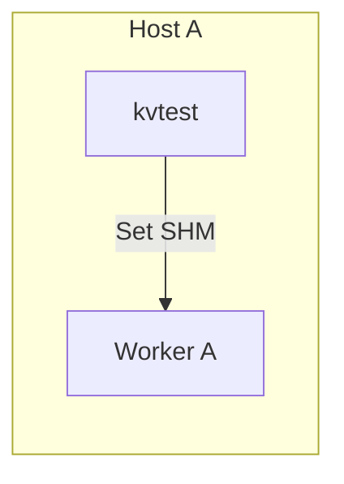
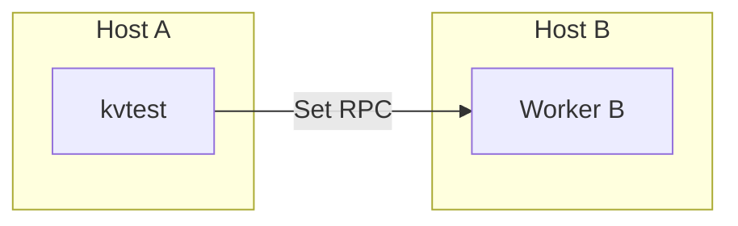
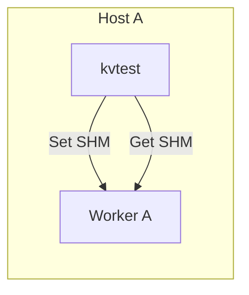
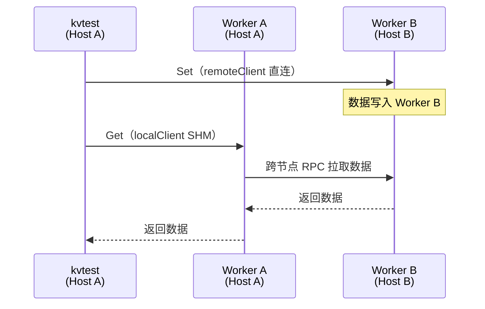
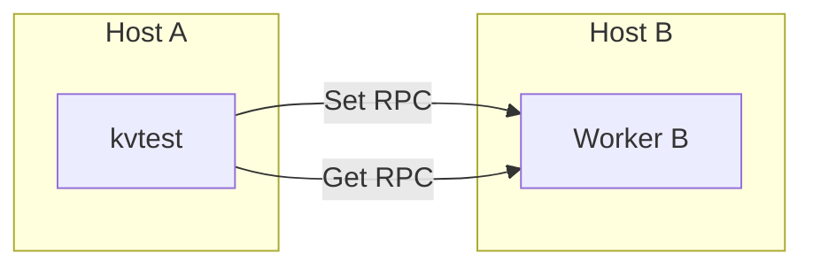
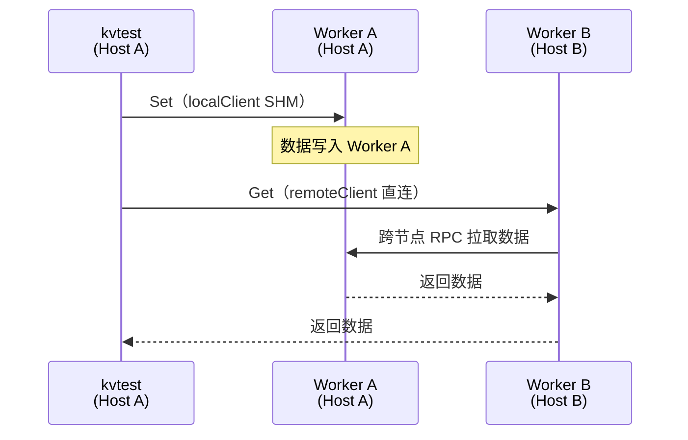

# kvtest Benchmark Set/Get 模式指南

> **相关文档：** [编译部署与通用配置](user-guide.md) | [Pipeline 模式](pipeline-guide.md) | [Cache 模式](cache-guide.md)

Benchmark 模式用于精确测量 KVClient Set/Get 操作的吞吐和延迟。`set_local`、`set_remote`、`get_local`、
`get_remote_direct` 使用单接口执行引擎：Set 模式循环执行 Set → Del，Get 模式只预置一次数据，然后在统一
窗口内持续 Get。其他模式保留原有轮次流程。

**适用场景：**
- Worker 端 Set/Get 吞吐基线测量
- 不同线程数下的延迟分布对比（P50/P90/P99/Max）
- 跨节点 Get 性能测试（SHM 本地读 vs UB 远端读）
- `string_view` vs `create_buffer` 两种 Set API 路径对比
- Worker 共享内存压力测试

---

## 1. 测试模式详解

配置 `test_mode` 字段选择测试模式。16 种模式对应不同的客户端-Worker 拓扑。

四个单接口模式创建 `num_clients` 个被测 KVClient，每个 Client 的 Set/Get 使用相同连接语义。其他模式仍按
角色创建 localClient 和 remoteClient：localClient 通过 ServiceDiscovery 发现本机 Worker，remoteClient 默认
通过 `remote_worker.host:port` 直连远端 Worker；`get_remote_direct` 未配置 `remote_worker.host` 时通过
ServiceDiscovery 选择 Worker。

### set_local — 本地 Set 吞吐


```mermaid
graph LR
    subgraph Host A
        K[kvtest] -->|Set SHM| WA[Worker A]
    end
```

localClient → Worker A（SHM）。测量本地 Set 吞吐。

### set_remote — 远端 Set 吞吐


```mermaid
graph LR
    subgraph Host A
        K[kvtest]
    end
    subgraph Host B
        WB[Worker B]
    end
    K -->|Set RPC| WB
```

remoteClient → Worker B（RPC）。测量远端 Set 吞吐。

### get_local — 本地 Get 延迟


```mermaid
graph LR
    subgraph Host A
        K[kvtest] -->|Set SHM| WA[Worker A]
        K -->|Get SHM| WA
    end
```

localClient → Worker A。数据只预置一次，正式窗口持续执行 Get，预置和清理不计入 Get 指标。

### get_cross_node — 跨节点 Get（Worker A 拉取 Worker B 的数据）


```mermaid
sequenceDiagram
    participant K as kvtest<br/>(Host A)
    participant WA as Worker A<br/>(Host A)
    participant WB as Worker B<br/>(Host B)
    K->>WB: Set（remoteClient 直连）
    Note over WB: 数据写入 Worker B
    K->>WA: Get（localClient SHM）
    WA->>WB: 跨节点 RPC 拉取数据
    WB-->>WA: 返回数据
    WA-->>K: 返回数据
```

Set 通过 remoteClient 写入 Worker B，Get 通过 localClient 从 Worker A 读取。Worker A 发现数据不在本地，向 Worker B 发起跨节点 RPC 拉取。测量 **Worker A → Worker B 跨节点 Get 延迟**。

**部署要求：** kvtest 部署在 Host A（与 Worker A 同机），`remote_worker` 指向 Worker B。

### get_remote_direct — 直连远端 Get


```mermaid
graph LR
    subgraph Host A
        K[kvtest]
    end
    subgraph Host B
        WB[Worker B]
    end
    K -->|Set RPC| WB
    K -->|Get RPC| WB
```

remoteClient → Worker B。预置和 Get 复用同一个 KVClient；正式窗口只执行 Get，不触发 Worker 间传输。
配置 `remote_worker.host` 时固定直连该 Worker；未配置时通过 ServiceDiscovery 选择 Worker。

### get_remote_cross — 跨节点 Get（Worker B 拉取 Worker A 的数据）


```mermaid
sequenceDiagram
    participant K as kvtest<br/>(Host A)
    participant WA as Worker A<br/>(Host A)
    participant WB as Worker B<br/>(Host B)
    K->>WA: Set（localClient SHM）
    Note over WA: 数据写入 Worker A
    K->>WB: Get（remoteClient 直连）
    WB->>WA: 跨节点 RPC 拉取数据
    WA-->>WB: 返回数据
    WB-->>K: 返回数据
```

Set 通过 localClient 写入 Worker A，Get 通过 remoteClient 从 Worker B 读取。Worker B 发现数据不在本地，向 Worker A 发起跨节点 RPC 拉取。测量 **Worker B → Worker A 跨节点 Get 延迟**。

**部署要求：** kvtest 部署在 Host A（与 Worker A 同机），`remote_worker` 指向 Worker B。

### 模式对比总览

| 模式 | Set 客户端 | Get 客户端 | 跨节点方向 | 部署位置 |
|------|-----------|-----------|-----------|---------|
| `set_local` | localClient (SHM) | — | 无 | Worker A 同机 |
| `set_remote` | remoteClient (RPC) | — | 无 | 任意 |
| `get_local` | localClient (SHM) | localClient (SHM) | 无 | Worker A 同机 |
| `get_cross_node` | remoteClient (RPC) | localClient (SHM) | A → B | Worker A 同机 |
| `get_remote_direct` | remoteClient (RPC/SD) | remoteClient (RPC/SD) | 无 | 任意 |
| `get_remote_cross` | localClient (SHM) | remoteClient (RPC) | B → A | Worker A 同机 |
| `mixed_local_set_get` | localClient (SD) | localClient (SD) | 无 | Worker A 同机 |
| `mixed_remote_set_get` | remoteClient (direct) | remoteClient (direct) | 无 | 任意 |
| `mixed_local_set_cross_get` | localClient (SD) | remoteClient (direct) | A → B | Worker A 同机 |
| `mixed_remote_set_remote_cross_get` | remoteClient (direct) | localClient (SD) | B → A | Worker A 同机 |
| `mset_local` | localClient (SD) | — | 无 | Worker A 同机 |
| `mset_remote` | remoteClient (RPC) | — | 无 | 任意 |
| `mget_local` | localClient (SD) | localClient (SD) | 无 | Worker A 同机 |
| `mget_cross_node` | remoteClient (RPC) | localClient (SD) | A → B | Worker A 同机 |
| `mget_remote_direct` | remoteClient (RPC) | remoteClient (RPC) | 无 | 任意 |
| `mget_remote_cross` | localClient (SD) | remoteClient (RPC) | B → A | Worker A 同机 |

### mixed_* — 混合读写模式

混合模式采用**双 child 进程**架构：父进程通过 fork + exec 启动独立的 setChild（执行 Set）和
getChild（执行 Get），各自持有独立 KVClient，通过 OS 级进程并发实现真正的 Set/Get 并行。exec
确保每个子进程重新初始化 SDK 日志运行时，避免继承父进程 PID 后将 SDK 运行日志降级到 stderr。

4 种模式覆盖不同的客户端-Worker 拓扑（本地/远端/跨节点），通过连接矩阵控制：

| 模式 | setChild | getChild | 数据流 |
|------|----------|----------|--------|
| `mixed_local_set_get` | SD → A | SD → A | 无 |
| `mixed_remote_set_get` | direct → B | direct → B | 无 |
| `mixed_local_set_cross_get` | SD → A | direct → B | A→B |
| `mixed_remote_set_remote_cross_get` | direct → B | SD → A | B→A |

**详细设计文档：** [mixed-modes-design.md](mixed-modes-design.md)

**配置示例：**
```json
{
  "mode": "benchmark",
  "etcd_address": "127.0.0.1:2379",
  "listen_port": 9000,
  "test_mode": "mixed_local_set_get",
  "worker_memory_mb": 4096,
  "num_threads": 16,
  "total_rounds": 10,
  "data_sizes": ["1MB"],
  "set_ratio": 0.5,
  "mixed_key_strategy": "read_prev",
  "cleanup_method": "del"
}
```

16 线程按 set_ratio 分配：0.5 时为 8 Set + 8 Get，在两个独立子进程中并行执行。

### 混合模式 Key 策略

| 策略 | Set 线程 Key | Get 线程 Key | 说明 |
|------|-------------|-------------|------|
| `same_keys` | `bench_<round>_*` | `bench_<round>_*` | 读写同一组 key，测试热点竞争 |
| `read_prev` | `bench_<round>_*` | `bench_<round-1>_*` | 读上一轮数据，round 0 跳过 Get。清理延后一轮：round N 完成后才删除 round N-1 的 key |
| `independent` | `bench_<round>_*` | `bench_0_*` | 读预填充数据（自动预填充 round 0），测试纯资源竞争。不支持 `cleanup_method=ttl`，benchmark 结束时自动清理预填充 key |

### mset_* — 批量 Set 模式

使用 `KVClient::MSet(keys, StringViews, ...)` 批量写入。**纯写模式**，不需要 getChild。

| 模式 | setChild | 说明 |
|------|----------|------|
| `mset_local` | localClient (SD) | 通过 SD 发现本地 Worker，批量写 |
| `mset_remote` | remoteClient (RPC) | 直连 remoteWorker，批量写 |

每轮将所有 key 按 `mset_batch_size` 分批，每批调用一次 MSet。例如 204 个 key，batchSize=8 → 26 次 MSet 调用。

### mget_* — 批量 Get 模式

使用 `KVClient::MSet(...)` 写入 + `KVClient::Get(keys, buffers)` 批量读取。**读写模式**，使用双 child 进程并发（setChild 执行 MSet，getChild 执行 MGet）。

每轮 setChild 按 `mset_batch_size` 分批 MSet，getChild 按 `mget_batch_size` 分批 Get。

**详细设计文档：** [mixed-modes-design.md](mixed-modes-design.md)

---

## 2. 配置参数

### ServiceDiscovery 参数

Benchmark 模式通过 ServiceDiscovery 连接 etcd 发现 Worker。以下参数影响 Worker 发现行为：

| 参数 | 类型 | 默认值 | 说明 |
|------|------|--------|------|
| `cluster_name` | string | "" | 集群名称，必须与 etcd 中 Worker 注册前缀一致（如 etcd key 为 `/jingpai/datasystem/cluster/...` 则填 `"jingpai"`） |
| `host_id_env_name` | string | "HOST_IP" | 本机 IP 环境变量名，SDK 从该环境变量读取本机 IP 匹配本地 Worker |

> **重要：** `set_local` / `get_local` / `get_cross_node` 模式需要 ServiceDiscovery 匹配本机 Worker（SHM 通道）。
> - 确保 `cluster_name` 与 etcd 中 Worker 注册前缀一致
> - 确保环境变量（默认 `$HOST_IP`）的值与 etcd 中 Worker 的注册地址匹配
> - 可用 `etcdctl get "" --prefix` 查看 Worker 实际注册的地址和前缀

### Benchmark 专用参数

以下参数仅在 `test_mode` 非空时生效：

| 参数 | 类型 | 默认值 | 说明 |
|------|------|--------|------|
| `test_mode` | string | **必填** | 测试模式：`set_local` / `set_remote` / `get_local` / `get_cross_node` / `get_remote_direct` / `get_remote_cross` / `mixed_local_set_get` / `mixed_remote_set_get` / `mixed_local_set_cross_get` / `mixed_remote_set_remote_cross_get` / `mset_local` / `mset_remote` / `mget_local` / `mget_cross_node` / `mget_remote_direct` / `mget_remote_cross` |
| `worker_memory_mb` | int | **必填** | 生成负载的数据预算（MB），用于计算全局数据集 key 数 |
| `num_clients` | int | 1 | 四个单接口模式的被测 KVClient 进程数；每个进程独占一个 KVClient |
| `num_threads` | int | 4 | 每个被测 KVClient 的调用线程数；总并发为 `num_clients × num_threads` |
| `duration_seconds` | int | 0 | Get 的纯测量窗口；Set 到时后不再启动下一 Set→Del 周期；0 = 不限时 |
| `total_rounds` | int | 0 | Get 的数据集遍历次数上限或 Set→Del 周期数；与 duration 同时配置时任一先到即停 |
| `round_cleanup_wait_ms` | int | 3000 | `del` 清理后、下一轮开始前的等待时间（毫秒），0 = 不等待；等待不超过剩余运行时长 |
| `set_api` | string | "string_view" | Set API 路径：`"string_view"` / `"create_buffer"` / `"create_buffer_raw"`（MSet/MGet 模式忽略） |
| `cleanup_method` | string | "del" | 清理方式：`"del"`（显式删除）或 `"ttl"`（等待 TTL 过期） |
| `remote_worker.host` | string | "" | 远端 Worker 地址；`get_remote_direct` 留空时使用 ServiceDiscovery |
| `remote_worker.port` | int | 31501 | 远端 Worker 端口 |
| `set_ratio` | float | 0.5 | Set 操作比例 (0.0, 1.0)，仅 mixed 模式。0.7 = 70% 线程做 Set。必须保证至少 1 个 Get 线程 |
| `mixed_key_strategy` | string | "same_keys" | Key 策略：`"same_keys"` / `"read_prev"` / `"independent"`，仅 mixed 模式。非法值会被拒绝 |
| `mset_batch_size` | int | 8 | 每批 MSet 操作的 key 数量，仅 mset_* / mget_* 模式 |
| `mget_batch_size` | int | 8 | 每批 MGet 操作的 key 数量，仅 mget_* 模式 |

> **批量模式延迟说明：** `mset_*` / `mget_*` 模式的延迟分位数（avg/p50/p99）是 **batch 粒度**（一次 MSet/MGet 调用处理多个 key 的耗时），而非单个 key 级别。QPS 计算正确（总 key 数 / 总时间），但延迟不可与单 key 模式（SET/GET）直接对比。

`num_total_threads` 仅用于 Pipeline，不参与 Benchmark。Benchmark 始终全速执行，`target_qps` 不限速。

### remote_worker 说明

`remote_worker` 用于直连指定 Worker，**绕过 ServiceDiscovery**。kvtest 会用 `host:port` 直接创建 KVClient，不经过 etcd 发现。
`get_remote_direct` 是例外：配置 `remote_worker.host` 时保持固定地址直连；省略时，Set 和 Get 复用通过
ServiceDiscovery 创建的 KVClient。ServiceDiscovery 的选址遵循 `host_id_env_name` 对应的 Host ID 和 SDK
默认亲和策略。

**需要 remote_worker 的模式（7 种）：**

| 模式 | Set 执行方 | Get 执行方 | remote_worker 用途 |
|------|-----------|-----------|-------------------|
| `set_remote` | remoteClient（直连） | — | Set 写入远端 Worker |
| `mset_remote` | remoteClient（直连） | — | MSet 批量写入远端 Worker |
| `get_cross_node` | remoteClient（直连） | localClient（SD） | Set 写入远端，Get 从本地 Worker 读（触发跨节点拉取） |
| `get_remote_cross` | localClient（SD） | remoteClient（直连） | Set 写入本地，Get 从远端 Worker 读（触发跨节点拉取） |
| `mget_cross_node` | remoteClient（直连） | localClient（SD） | MSet 写入远端，MGet 从本地 Worker 读（触发跨节点拉取） |
| `mget_remote_direct` | remoteClient（直连） | remoteClient（直连） | MSet+MGet 都在远端 Worker 本地完成 |
| `mget_remote_cross` | localClient（SD） | remoteClient（直连） | MSet 写入本地，MGet 从远端 Worker 读（触发跨节点拉取） |

**不需要 remote_worker 的模式：** `set_local`、`get_local` 只使用 localClient；`get_remote_direct` 可选择
省略 `remote_worker.host` 并使用 ServiceDiscovery。

**填写要求：** `host` 必须是 Worker 的实际监听地址（etcd 中注册的地址），不是宿主机外网 IP。可用 `etcdctl get "" --prefix` 查看：

```bash
# etcd 中 Worker 注册信息示例
/jingpai/datasystem/cluster/192.168.219.110:31402
                                            ^^^^^^^^^^^^
                                            用这个地址，不是后面的宿主机 IP
# → remote_worker.host = "192.168.219.110", remote_worker.port = 31402
```

### TTL 清理参数（`cleanup_method = "ttl"` 时）

| 参数 | 类型 | 默认值 | 说明 |
|------|------|--------|------|
| `set_param.ttl_second` | int | **必填** | TTL 秒数，必须 > 0 |

### ConnectOptions 覆盖

通过 `connect_options` 字段可以覆盖 SDK 连接参数：

```json
{
  "connect_options": {
    "connect_timeout_ms": 5000,
    "request_timeout_ms": 50,
    "enable_cross_node_connection": true,
    "enable_local_cache": true,
    "data_placement_policy": "PREFERRED_SAME_NODE",
    "fast_transport_mem_size": "1GB"
  }
}
```

| 参数 | 默认值 | 说明 |
|------|--------|------|
| `connect_timeout_ms` | 1000 | 连接超时（毫秒） |
| `request_timeout_ms` | 20 | 请求超时（毫秒） |
| `enable_cross_node_connection` | `true` | 允许跨节点 Get 拉取，**跨节点模式必须为 `true`** |
| `enable_local_cache` | `false` | Get/MGet 走绑定 Worker；设为 `false` 时按 metadata owner 走 Transport 层 |
| `data_placement_policy` | `PREFERRED_META_OWNER` | Set/MSet 数据放置策略 |
| `fast_transport_mem_size` | "512MB" | 快速传输内存大小 |

### KVClientConfig 覆盖

通过 `client_config` 设置进程级 SDK 参数：

```json
{
  "client_config": {
    "urma_send_lane_count_per_peer": 16
  }
}
```

`urma_send_lane_count_per_peer` 必须大于 0，控制每个 kvtest Client 进程向单个远端 peer 并发占用的
URMA send lane 上限，实际值不超过 SDK 的进程级 lane 池。未配置时不调用对应 Builder setter，保留 SDK
默认值 `8`。Worker 响应 QueryAndGet 时使用 Worker 自身的同名配置，两端取值无需一致。

### Key 数量计算

全局数据集的 key 数量由 `worker_memory_mb` 和 `data_sizes[0]` 自动计算：

```
keys_per_round = floor(worker_memory_mb × 0.8 × 1024 × 1024 / data_size_bytes)
```

例如 `worker_memory_mb=4096`、`data_sizes=["1MB"]`，则数据集包含
`4096 × 0.8 × 1024 × 1024 / 1048576 = 3276` 个 key。

### 执行流程

四个单接口模式的执行流程如下：

```
Get: 初始化 Client 组 → Set 全局数据集一次 → 对成功 Set 的 key 每线程预热一次
     → 所有 Client/线程统一起跑并持续 Get → 统一停止 → Cleanup 一次

Set: 所有 Client/线程统一起跑并 Set → 全部完成 → Cleanup → 下一周期
```

每个 Client 进程内的线程共享一个 KVClient。全局 key 数仍由 `worker_memory_mb` 计算，再按 Client 和线程分片，
不会因为增加 `num_clients` 而成倍扩大数据集。父进程等待所有工作线程 READY 后下发同一单调时钟启动点；
Client 初始化、线程创建、预置、预热和清理均不计入接口 QPS。

每个被测线程至少需要一个 key；若 `keys_per_dataset < num_clients × num_threads`，配置会在创建 Client 前被拒绝。
Get 预置不重试失败的 Set：只要至少一个 key 成功，预热、测量和清理就仅使用成功 key；全部失败才终止。
部分成功时实际活跃并发可能低于配置值，日志记录 `effective_concurrency`，预置结果写入 CSV 的 `setup` 行。
使用 `cleanup_method=del` 时，Set 模式使用同等数量的独立清理 Client；Get 模式在测量结束后，
由各被测子进程惰性创建独立清理 Client，精确清理成功 Set 的 key。

Get 配置 TTL 时，启动前会先校验配置，预置和预热完成后还会复核剩余 TTL 是否能覆盖整个测量窗口及
一次请求超时余量，否则拒绝启动测量。
仅配置 `total_rounds` 或无限运行时无法证明 TTL 足够，因此 Get 不允许非零 TTL。

### Benchmark 日志

父进程的 kvtest 日志写入 `<output_dir>/run.log`。四个单接口模式的被测 Client 写入
`<output_dir>/child_set.log`，独立清理 Client 写入 `child_del.log`；其他模式按角色使用 `child_set.log`、
`child_get.log` 和 `child_del.log`。SDK 运行日志、access 日志和 operation 日志仍写入
`DATASYSTEM_CLIENT_LOG_DIR`；每个 benchmark 子进程通过 exec 独立初始化 SDK，因此
`ds_client_<pid>.INFO.log` 会正常记录该子进程的 SDK 运行日志。

SLOG 行（`[INFO]/[WARN]/[ERROR]` 前缀）自带 `<YYYY-MM-DD HH:MM:SS.mmm>` 本地时间戳，
便于跨线程/跨节点对齐事件顺序。

### 运行时长控制

Benchmark 模式**不使用 `target_qps` 限速**——每轮全速执行，测量的是最大吞吐和延迟。通过以下参数控制何时停止：

| 参数组合 | 行为 |
|---------|------|
| `total_rounds=5` | Get 遍历数据集 5 次；Set 执行 5 个 Set→Del 周期 |
| `duration_seconds=60` | Get 连续测量 60 秒；Set 在 60 秒后不再启动下一周期 |
| `total_rounds=5, duration_seconds=120` | Get 最多遍历数据集 5 次且不超过 120 秒；Set 最多执行 5 个周期且不超过 120 秒 |
| `total_rounds=0, duration_seconds=0` | 无限运行，需 `Ctrl+C` 停止 |

Set 单轮中的接口失败和清理业务失败会计入最终结果，但不会提前结束后续周期；Benchmark 仍运行到上述轮数、
时长或主动停止条件。父子进程通信、同步等执行失败无法保证下一周期正确执行，因此仍会立即终止。
只要运行期间出现过 Set 失败，或者清理业务失败，进程最终仍返回非零退出码。

### CPU / NUMA 亲和性绑定

Benchmark 模式下，每个子进程（Set/Get/Del）在创建线程前独立应用亲和性策略：

- **`cpu_affinity`**：进程级 CPU 绑核，如 `"0-7"` 或 `"0,2,4,6"`，空 = 自动检测
- **`numa_node`**：NUMA 节点绑定（同时绑定 CPU + 本地内存），需 `libnuma`，`-1` = 禁用
- `numa_node` 优先级高于 `cpu_affinity`，NUMA 不可用时自动回退

```json
{"cpu_affinity": "0-7", "numa_node": 0}
```

---

## 3. 使用示例

### 场景 A：本地 Set 吞吐基线（8T）

**前置条件：** etcd + 1 个 Worker 运行中。

**配置 `config/bench_set_local.json`：**
```json
{
  "mode": "benchmark",
  "etcd_address": "127.0.0.1:2379",
  "cluster_name": "your_cluster",
  "listen_port": 9000,
  "test_mode": "set_local",
  "worker_memory_mb": 4096,
  "num_threads": 8,
  "total_rounds": 5,
  "data_sizes": ["1MB"],
  "set_api": "string_view",
  "cleanup_method": "del"
}
```

**运行：**
```bash
# 设置本机 IP（用于 ServiceDiscovery 匹配本地 Worker）
export HOST_IP=$(hostname -I | awk '{print $1}')
LD_LIBRARY_PATH=./lib:$LD_LIBRARY_PATH ./kvtest config/bench_set_local.json
```

**预期输出：**
```
Interface benchmark: clients=1, threads_per_client=8, total_concurrency=8, keys_per_dataset=3276
Set benchmark finished: rounds=5, success=16380, failures=0, active_elapsed_ms=...
```

### 场景 B：本地 Set + Get 延迟测量

**配置 `config/bench_get_local.json`：**
```json
{
  "mode": "benchmark",
  "etcd_address": "127.0.0.1:2379",
  "cluster_name": "your_cluster",
  "listen_port": 9000,
  "test_mode": "get_local",
  "worker_memory_mb": 4096,
  "num_clients": 1,
  "num_threads": 8,
  "duration_seconds": 60,
  "data_sizes": ["1MB"],
  "set_api": "string_view",
  "cleanup_method": "del"
}
```

**运行：**
```bash
LD_LIBRARY_PATH=./lib:$LD_LIBRARY_PATH ./kvtest config/bench_get_local.json
```

Set 只用于预置数据；主 CSV 测量本地 Worker 的纯 Get 吞吐和延迟。

### 场景 C：跨节点 Get 性能（SHM vs UB 对比）

**前置条件：** etcd + 2 个 Worker 运行中（Worker A: 192.168.1.10:31402, Worker B: 192.168.1.11:31402）。

**配置 `config/bench_cross_node.json`：**
```json
{
  "mode": "benchmark",
  "etcd_address": "192.168.1.10:2379",
  "cluster_name": "your_cluster",
  "listen_port": 9000,
  "test_mode": "get_cross_node",
  "worker_memory_mb": 4096,
  "num_threads": 8,
  "total_rounds": 3,
  "data_sizes": ["1MB"],
  "set_api": "string_view",
  "cleanup_method": "del",
  "remote_worker": {
    "host": "192.168.1.11",
    "port": 31402
  }
}
```

**运行：**
```bash
export HOST_IP=192.168.1.10
LD_LIBRARY_PATH=./lib:$LD_LIBRARY_PATH ./kvtest config/bench_cross_node.json
```

Set 阶段写入远端 Worker B（直连），Get 阶段从本地 Worker A 读取（SD 发现，触发 Worker A → Worker B 跨节点数据拉取）。适合对比本地 Get 延迟与跨节点 Get 延迟。

### 场景 D：远端 Set 吞吐（UB 写入）

**配置 `config/bench_set_remote.json`：**
```json
{
  "mode": "benchmark",
  "etcd_address": "127.0.0.1:2379",
  "cluster_name": "your_cluster",
  "listen_port": 9000,
  "test_mode": "set_remote",
  "worker_memory_mb": 4096,
  "num_threads": 4,
  "total_rounds": 5,
  "data_sizes": ["1MB"],
  "set_api": "string_view",
  "cleanup_method": "del",
  "remote_worker": {
    "host": "192.168.1.11",
    "port": 31501
  }
}
```

Client 直连远端 Worker 执行 Set（`remote_worker` 指定 Worker B 的注册地址），测量 UB 网络的 Set 吞吐。此模式不需要 HOST_IP 和 ServiceDiscovery 匹配本地 Worker。

### 场景 E：TTL 清理模式

**配置 `config/bench_ttl.json`：**
```json
{
  "mode": "benchmark",
  "etcd_address": "127.0.0.1:2379",
  "cluster_name": "your_cluster",
  "listen_port": 9000,
  "test_mode": "set_local",
  "worker_memory_mb": 4096,
  "num_threads": 1,
  "total_rounds": 3,
  "data_sizes": ["1MB"],
  "set_api": "string_view",
  "cleanup_method": "ttl",
  "set_param": {
    "ttl_second": 10
  }
}
```

每轮 Set 后等待 10 秒 TTL 过期，不执行 Del。适用于不可手动删除的场景。

### 场景 F：create_buffer API 路径

**配置 `config/bench_create_buffer.json`：**
```json
{
  "mode": "benchmark",
  "etcd_address": "127.0.0.1:2379",
  "cluster_name": "your_cluster",
  "listen_port": 9000,
  "test_mode": "set_local",
  "worker_memory_mb": 4096,
  "num_threads": 4,
  "total_rounds": 5,
  "data_sizes": ["1MB"],
  "set_api": "create_buffer",
  "cleanup_method": "del"
}
```

使用 `Create → WLatch → MemoryCopy → UnWLatch → Set(buffer)` 路径写入，与 `string_view` 路径对比延迟。

### 场景 G：create_buffer_raw API 路径（无锁 memcpy）

**配置 `config/bench_create_buffer_raw.json`：**
```json
{
  "mode": "benchmark",
  "etcd_address": "127.0.0.1:2379",
  "cluster_name": "your_cluster",
  "listen_port": 9000,
  "test_mode": "set_local",
  "worker_memory_mb": 4096,
  "num_threads": 4,
  "total_rounds": 5,
  "data_sizes": ["1MB"],
  "set_api": "create_buffer_raw",
  "cleanup_method": "del"
}
```

使用 `Create → memcpy(MutableData) → Set(buffer)` 路径写入，跳过 WLatch/UnWLatch 和 MemoryCopy 封装，直接用 `memcpy` 写入 SHM Buffer。用于测量 latch 和 MemoryCopy 封装的开销。

---

## 4. Set API 路径说明

| 路径 | SDK 调用序列 | 特点 |
|------|-------------|------|
| `string_view` | `Set(key, StringView(data), param)` | 直接写入，API 简洁，延迟较低 |
| `create_buffer` | `Create(key, size, param, buf)` → `buf.WLatch()` → `buf.MemoryCopy(data, size)` → `buf.UnWLatch()` → `Set(buf)` | 显式 SHM Buffer 路径，含 latch 保护，可测量 Create + MemoryCopy 开销 |
| `create_buffer_raw` | `Create(key, size, param, buf)` → `memcpy(buf.MutableData(), data, size)` → `Set(buf)` | SHM Buffer 路径，跳过 latch 和 MemoryCopy 封装，直接 memcpy 写入 |

---

## 5. 清理方式说明

| 方式 | 行为 | 适用场景 |
|------|------|---------|
| `del` | Set 每周期、Get 整个测量窗口结束后调用 `Del(keys)` | 通用场景，测量结束后释放内存 |
| `ttl` | Set 时设置 `ttl_second`，每轮结束后等待 TTL 过期 | 不可手动删除的场景，需要 Worker 自动过期 |

**注意：** `cleanup_method = "ttl"` 时必须同时配置 `set_param.ttl_second`，且值 > 0。

---

## 6. 指标输出

Benchmark 模式在输出目录下生成简洁的聚合结果 `benchmark_phases.csv`：

```csv
scope,round,operation,success,failures,elapsed_ms,qps,avg_ms,p50_ms,p99_ms,max_ms,throughput_mib_s,valid
round,0,set,3276,0,4038.210,811.250,1.234,1.100,2.078,3.500,811.250,true
total,-1,set,16380,0,20071.440,816.079,1.220,1.090,2.010,3.500,816.079,true
```

**字段说明：**

| 字段 | 说明 |
|------|------|
| `scope` | `round` 为单个 Set 周期；`total` 为全部有效测量阶段聚合 |
| `round` | Set 周期编号；总计或持续 Get 为 -1 |
| `operation` | 被测接口：`set` / `get` |
| `success` / `failures` | 成功数与失败数；只统计被测接口，失败存在或无成功样本时 `valid=false` |
| `elapsed_ms` | 所有被测 Client 最早请求开始到最晚请求结束的墙钟时间；Set 总计为各 Set 阶段时间之和 |
| `qps` | `success × 1000 / elapsed_ms`，不使用各请求延迟之和作分母 |
| `avg_ms` | 成功请求的平均延迟 |
| `p50_ms` | 所有 Client 延迟样本合并后的 P50；使用 TDigest 近似计算 |
| `p99_ms` | 所有 Client 延迟样本合并后的 P99；使用 TDigest 近似计算 |
| `max_ms` | 单次请求最大延迟 |
| `throughput_mib_s` | 成功数据量除以相同的 `elapsed_ms`，按 1024² bytes/MiB 换算 |

`benchmark_clients.csv` 使用相同口径输出各 Client 的精简结果和 `start_offset_us`，只用于定位 Client 偏斜；
全局 QPS/P99 必须以 `benchmark_phases.csv` 为准，不能平均各 Client 的 QPS/P99。预置、预热和 Del 不写入
主 CSV，只在日志中报告失败。

---

## 7. 故障排查

| 错误信息 | 原因 | 解决方案 |
|---------|------|---------|
| `No available worker is detected` | ServiceDiscovery 找不到匹配的 Worker | 见下方详细排查步骤 |
| `worker_memory_mb required when test_mode is set` | 未配置 `worker_memory_mb` | 添加 `"worker_memory_mb": 4096` |
| `remote_worker required for test_mode` | 跨节点模式未配置远端 Worker | 添加 `"remote_worker": {"host": "...", "port": 31501}` |
| `set_param.ttl_second must be > 0 when cleanup_method=ttl` | TTL 模式未设置过期时间 | 添加 `"set_param": {"ttl_second": 10}` |
| `set_api must be 'string_view', 'create_buffer', or 'create_buffer_raw'` | set_api 值非法 | 使用 `"string_view"` / `"create_buffer"` / `"create_buffer_raw"` |
| Set 成功数 < keys_per_round | Worker 内存不足或请求超时 | 增大 `worker_memory_mb` 或检查 Worker 状态 |
| 跨节点 Get 全部失败 | Worker 间网络不通 | 检查 UB/网络连通性，确认 `enable_cross_node_connection` |
| `set_ratio must be in (0.0, 1.0) for mixed mode` | set_ratio 值非法 | 使用 0.0 < set_ratio < 1.0 的值（必须保证至少 1 个 Get 线程） |
| `Unknown mixed_key_strategy` | mixed_key_strategy 值非法 | 使用 `"same_keys"` / `"read_prev"` / `"independent"` |
| `independent strategy is incompatible with cleanup_method=ttl` | independent+ttl 组合不支持 | 改用 `"cleanup_method": "del"` 或换用 `"same_keys"`/`"read_prev"` 策略 |

### `No available worker is detected` 排查步骤

**1. 检查 `cluster_name` 是否正确**

用 etcdctl 查看 Worker 注册前缀：
```bash
etcdctl --endpoints "http://<etcd_ip>:<etcd_port>" get "" --prefix | head -5
# 输出示例：
# /jingpai/datasystem/cluster/192.168.1.10:31501
```

前缀中第一段（如 `jingpai`）就是 `cluster_name`，必须在 config JSON 中配置：
```json
{"cluster_name": "jingpai"}
```

**2. 检查 `$HOST_IP` 是否与 Worker 注册地址匹配**

SDK 通过 `HOST_IP` 环境变量匹配本机 Worker。该值必须与 etcd 中 Worker 的注册地址（key 中的 IP 部分）一致：
```bash
# 查看本机环境变量
echo $HOST_IP

# 对比 etcd 中的 Worker 地址
etcdctl --endpoints "http://<etcd_ip>:<etcd_port>" get "" --prefix | grep datasystem/cluster

# 如果是多网卡环境，HOST_IP 应设为 Worker 注册的内网 IP
export HOST_IP=192.168.x.x   # 与 etcd 中 key 的 IP 部分一致
```

**3. kvtest 和 Worker 不在同一台机器上**

`set_local` / `get_local` / `get_cross_node` 模式要求 kvtest 和 Worker 在同一台机器上（走 SHM 通道）。如果不在
同一台机器，改用 `set_remote`，或使用 `get_remote_direct` 通过 `remote_worker` 直连或 ServiceDiscovery 选址。
