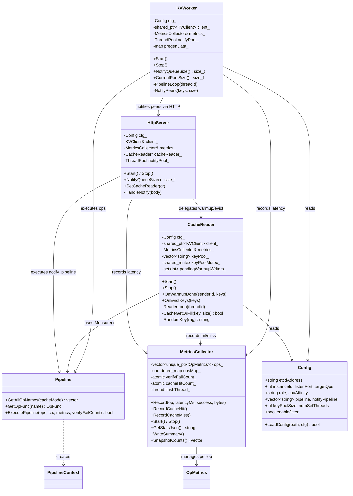
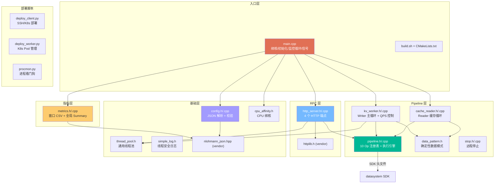
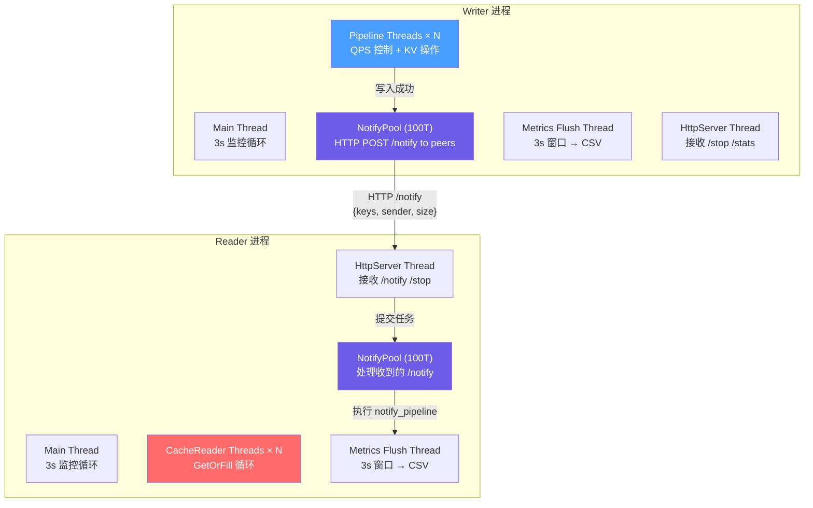
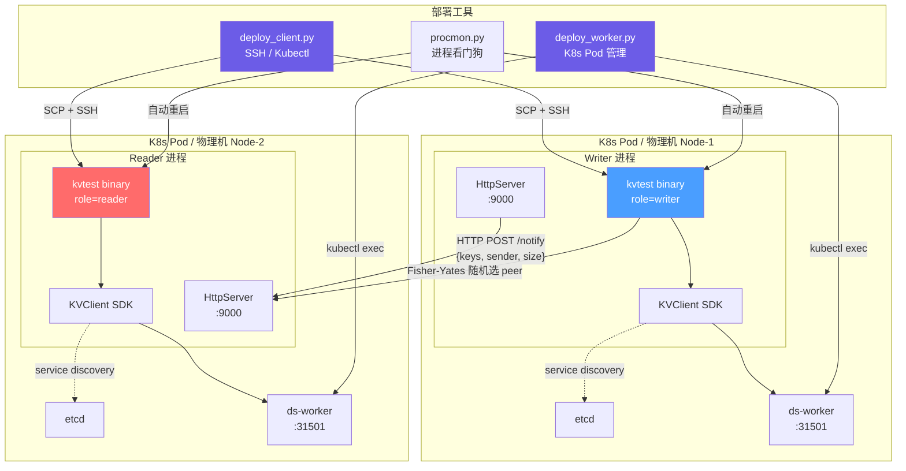
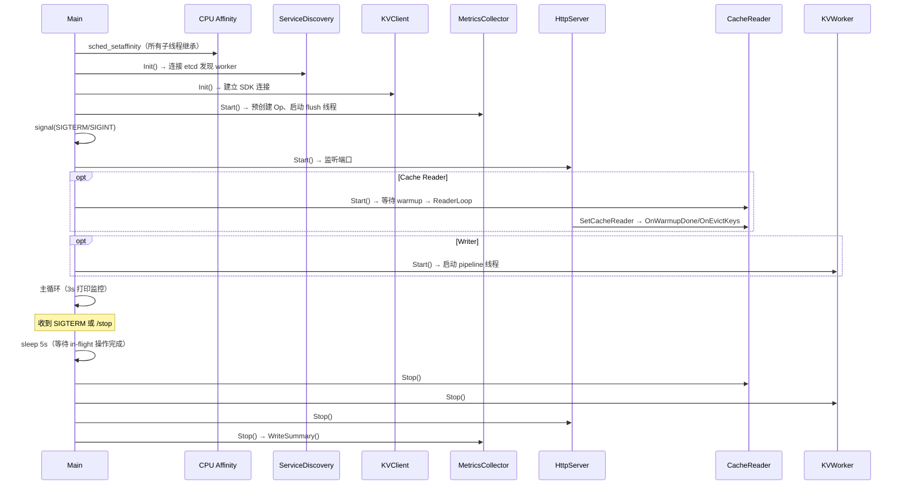
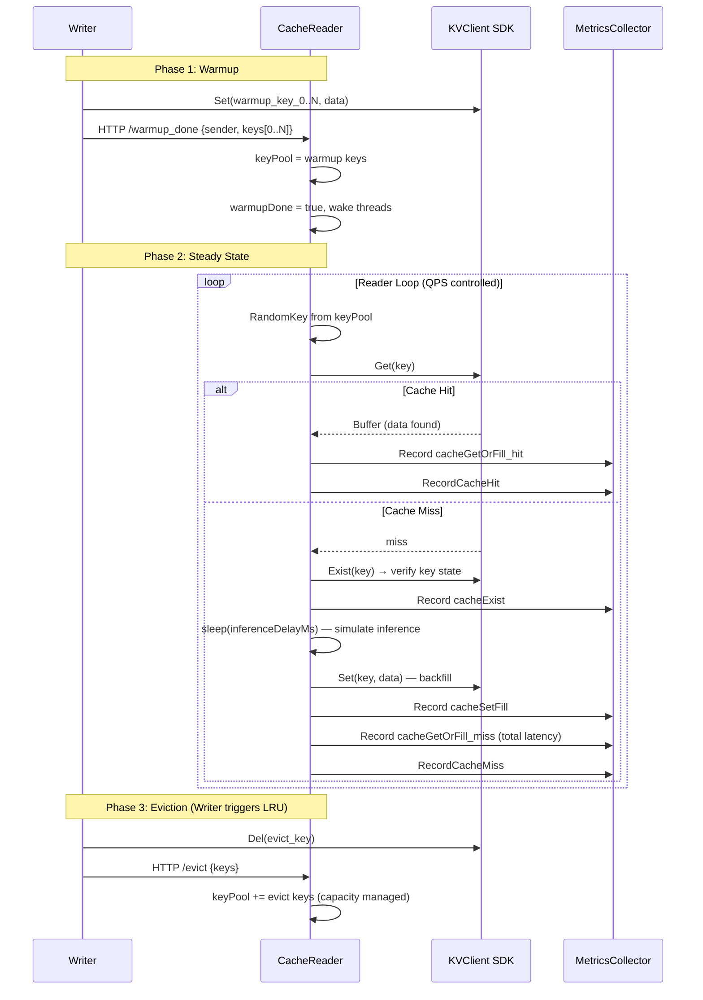
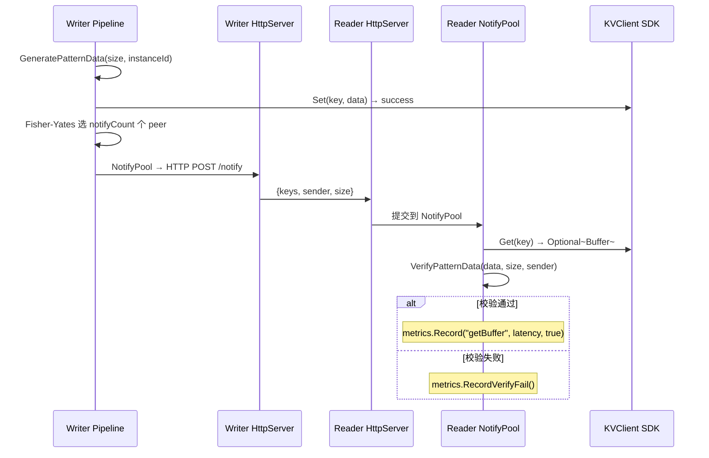
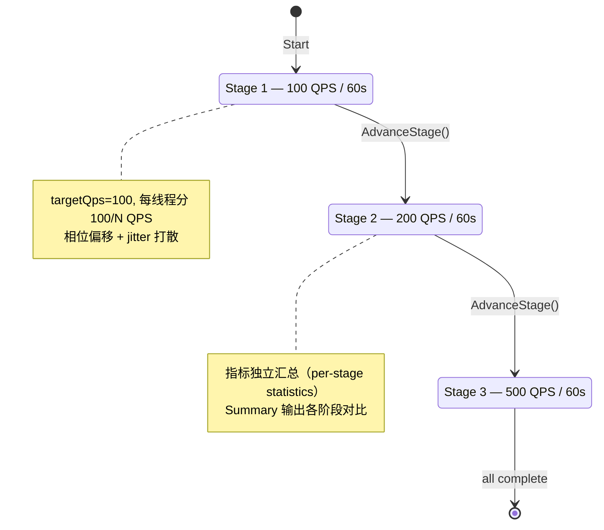

# kvtest 设计文档

> 版本: 6 | 最后更新: 2026-05-20

## 1. 概述

kvtest 是 datasystem KVClient 的独立性能压测工具，用于在真实集群环境中持续执行 KV 读写操作，收集性能指标（时延百分位、QPS、吞吐），验证系统在长时间运行下的稳定性和性能表现。

**核心能力**:

- **Pipeline 模式**：可组合 10 种 KV 操作形成测试流水线，支持单 key 和批量（MCreate/MSet/MGet）操作
- **Writer/Reader 角色**：Writer 持续写入数据并通过 HTTP 通知 Reader，Reader 接收通知后跨实例读取验证
- **QPS 精确控制**：按线程分配 QPS 配额 + 相位偏移 + jitter，避免请求同步突发
- **性能指标**：窗口指标（3s 粒度 CSV，P50/P90/P99/P99.9/P99.99）+ 全局汇总（环形缓冲区 100000 条样本）
- **进程级 CPU 绑核**：自动检测容器可用 CPU 或手动指定
- **远程部署**：deploy_client.py（SSH/Kubectl）和 deploy_worker.py（K8s Pod 管理）两种部署方式

## 2. 架构设计（4+1 视图）

### 2.1 Logical View — 核心抽象与关系



**关键抽象**:

| 抽象 | 职责 | 关键设计决策 |
|------|------|-------------|
| **KVWorker** | Writer 端主循环：QPS 控制 → 执行 Pipeline → 通知 Peer | 相位偏移 + jitter 避免请求同步突发 |
| **CacheReader** | Reader 端缓存循环：等待 warmup → GetOrFill → 命中/回填 | shared_mutex 保护 keyPool，miss 延迟排除 sleep |
| **Pipeline** | 10 种 KV Op 的注册表与执行引擎 | 失败立即中断，每个 Op 独立计时 |
| **MetricsCollector** | 两层指标：窗口 CSV + 全局环形缓冲区 Summary | swap 零拷贝切换，atomic 无锁计数 |
| **HttpServer** | 进程间通知（/notify）、控制（/stop）、观测（/stats） | ThreadPool 异步处理通知，thread_local 连接复用 |
| **Config** | JSON 配置解析与参数校验 | 启动时严格校验，拒绝非法配置 |

### 2.2 Development View — 代码组织与模块依赖



**模块依赖规则**:
- Pipeline 层依赖基础层（不含 RPC 层）
- RPC 层依赖 Pipeline 层（HandleNotify 触发 Pipeline）
- 指标层独立，仅依赖 json vendor
- 基础层无内部依赖，可独立测试
- SDK 依赖仅出现在 Pipeline 层（通过 `stubs/` 桩编译测试）

### 2.3 Process View — 线程模型与并发

#### 线程拓扑



#### 线程数量与职责

| 线程 | 数量 | 触发方式 | 职责 |
|------|------|----------|------|
| Pipeline Threads | `num_set_threads`（默认 16） | 循环 sleep_until | Writer：按 QPS 配额执行 KV 操作 |
| CacheReader Threads | `num_set_threads` | 循环 sleep_until | Reader：从 keyPool 随机 GetOrFill |
| NotifyPool | 100 | 任务队列 | Writer 端发送 / Reader 端接收处理 |
| HttpServer | 1 | epoll 事件 | 接收 /notify、/stop、/stats、/summary |
| Metrics Flush | 1 | 定时 3s | 窗口指标 swap + 写入 CSV |
| Main Loop | 1 | 定时 3s | 打印速率/队列深度，推进 QPS 阶段 |

#### QPS 控制机制（两层打散）

Writer 的 PipelineLoop 通过两层机制将请求均匀分散到时间轴上，避免所有线程同时发出请求（请求突发导致 Worker 压力尖峰）。

**第一层：相位偏移（Phase Offset）**

每个线程启动时，根据 threadId 计算一个初始偏移，将 N 个线程均匀分布在第一个 slot 内：

```
phaseUs = (threadId / numSetThreads) * intervalUs
nextSlot = now + phaseUs
```

**第二层：Jitter（槽内随机偏移）**

每次请求的触发时间在当前 slot 内再加一个随机偏移，进一步打散：

```
offsetDist = uniform(0, intervalUs)
fireTime = nextSlot + microseconds(offsetDist(rng))
sleep_until(fireTime)
```

每条线程有独立的 `mt19937` 随机引擎（种子 = threadId + instanceId * 1000），确保各线程偏移不相关。

**两者结合效果**：

```
时间轴 (100 QPS, 4 线程, intervalUs = 40ms):

    Thread 0:  *       *    *       *     ← 在 [0, 40ms) 内随机偏移
    Thread 1:    *        *    *      *   ← 在 [10, 50ms) 内随机偏移
    Thread 2:      *  *       *   *    *  ← 在 [20, 60ms) 内随机偏移
    Thread 3:         *    *    *    *    ← 在 [30, 70ms) 内随机偏移
              |--- slot 1 ---|--- slot 2 ---|
```

> 当 `enable_jitter=false` 时，随机偏移退化为 0，请求严格按 slot 边界触发（仅保留相位偏移，不加随机抖动）。

#### 线程安全设计

| 数据 | 保护方式 | 说明 |
|------|----------|------|
| totalCount/successCount/failCount/totalBytes | `atomic<uint64_t>` | 热路径无锁读写 |
| windowLatencies | `windowMutex` + swap | flush 时零拷贝切换 |
| globalRing | `globalMutex` | 写入加锁，flush 拷贝后释放锁 |
| keyPool (CacheReader) | `shared_mutex` | 读多写少，ReaderLoop 用 shared_lock |
| opsMap_ | `started_` 标志 | Start() 后只读，fast-path 无锁查找 |

### 2.4 Physical View — 部署拓扑



**网络通信模型**:

| 通道 | 协议 | 方向 | 数据 |
|------|------|------|------|
| kvtest → ds-worker | SDK RPC (ZMQ) | 客户端 → Worker | Set/Get/Exist 等 KV 操作 |
| kvtest → etcd | HTTP | 客户端 → etcd | ServiceDiscovery 查询 Worker 地址 |
| Writer → Reader | HTTP POST | 进程间 | `/notify` JSON: keys + sender + size |
| 部署工具 → 节点 | SSH / kubectl | 运维 → 远程 | SCP 二进制、启动/停止命令 |
| 用户 → kvtest | HTTP GET/POST | 运维 → 进程 | `/stats` 查看、`/stop` 停止、`/summary` 汇总 |

### 2.5 Scenarios — 关键使用场景

#### 进程生命周期



#### 场景 A: Cache 复用模拟（模拟 LLM 推理 KVCache prefix 缓存）



#### 场景 B: Writer/Reader 跨实例验证



#### 场景 C: 多阶段 QPS 压测



## 3. 核心模块设计

### 3.1 Pipeline 引擎

**文件**: `src/pipeline/pipeline.h` / `src/pipeline/pipeline.cpp`

Pipeline 是可组合的 KV 操作序列。每个操作独立计时，失败立即中断后续操作。

#### 支持的操作

| Op | SDK 调用 | 类型 | 说明 |
|----|----------|------|------|
| `setStringView` | `client->Set(key, StringView(data), param)` | 单 key | 最常用，直接写入字符串数据 |
| `getBuffer` | `client->Get(key, Optional<Buffer>&)` | 单 key | 读取并校验数据大小 |
| `exist` | `client->Exist({key}, exists)` | 单 key | 检查 key 是否存在 |
| `createBuffer` | `client->Create(key, size, param, buf)` | 单 key | 创建共享内存 Buffer |
| `memoryCopy` | `buffer->MemoryCopy(data, size)` | 单 key | 向 Buffer 写入数据 |
| `setBuffer` | `client->Set(buffer)` | 单 key | 提交 Buffer |
| `mCreate` | `client->MCreate(keys, sizes, param, buffers)` | 批量 | 批量创建 Buffer |
| `mSet` | `client->MSet(buffers)` | 批量 | 批量提交 Buffer |
| `mGet` | `client->Get(keys, results)` | 批量 | 批量读取并校验数据大小 |
| `cacheGetOrCreate` | Get→miss→Create+MemoryCopy+Set | 单 key | 缓存 Get-or-Create：命中直接返回，未命中则 Create+Copy+Set 回填 |

#### PipelineContext

```cpp
struct PipelineContext {
    std::string key;                                    // 单 key 操作用
    std::string data;                                   // 预生成的 pattern data
    uint64_t size;                                      // 数据大小（字节）
    int senderId;                                       // 发送者 ID（用于数据校验）
    SetParam param;                                     // 写入参数
    std::shared_ptr<KVClient> client;                   // SDK 客户端
    std::shared_ptr<Buffer> buffer;                     // createBuffer 产出
    std::vector<std::string> batchKeys;                 // 批量操作用
    std::vector<std::shared_ptr<Buffer>> batchBuffers;  // mCreate 产出
    std::vector<Optional<Buffer>> batchResults;         // mGet 产出
    std::atomic<uint64_t> *verifyFailCount;             // 校验失败计数
};
```

#### 执行流程

```
ExecutePipeline(ops, ctx, metrics, verifyFailCount)
  for each (name, fn) in ops:
    latencyMs = 0
    ok = fn(ctx, latencyMs)        ← Measure() 内计时
    metrics.Record(name, latencyMs, ok, ctx.size)
    if !ok: break                   ← 失败中断，不继续后续 Op
  return allOk
```

- **Writer Pipeline** 由 `config.pipeline` 配置（默认 `["setStringView"]`）
- **Reader Pipeline** 由 `config.notify_pipeline` 配置（默认 `["getBuffer"]`）

### 3.2 Writer 主循环 (KVWorker)

**文件**: `src/pipeline/kv_worker.h` / `src/pipeline/kv_worker.cpp`

```
PipelineLoop(threadId):
  计算 qpsPerThread = targetQps / numSetThreads
  intervalUs = 1000000 / qpsPerThread
  phaseUs = threadId / numThreads * intervalUs     ← 相位偏移
  nextSlot = now + phaseUs

  while running:
    if QPS 限速:
      fireTime = nextSlot + jitter(0, intervalUs)  ← 随机偏移
      sleep_until(fireTime)

    size = random_from(dataSizes)
    key = "kv_test_{instanceId}_{threadId}_{timestamp}_{batchIdx}"
    构造 PipelineContext
    执行 Pipeline

    if 成功:
      NotifyPeers(keys, size)     ← Fisher-Yates 随机选 peer

    nextSlot += intervalUs
```

#### QPS 分配策略

当 `target_qps` < `num_set_threads` 时，前 `target_qps % numThreads` 个线程各多分 1 QPS，其余线程休眠（intervalUs 设为极大值）。例如：

| target_qps | num_set_threads | 线程分配 |
|-----------|----------------|---------|
| 100 | 16 | 4 线程 × 7 QPS + 12 线程 × 6 QPS |
| 5 | 16 | 5 线程 × 1 QPS + 11 线程 × 0 QPS（休眠）|
| 0 | 16 | 全部线程不限速全速运行 |

#### QPS 限速与 Jitter 机制

详见 [2.3 Process View — QPS 控制机制](#23-process-view--线程模型与并发)。

#### 数据预生成

构造时按 `dataSizes` 预生成每种大小的 pattern data（`data_pattern.h`），运行时直接引用 `pregenData_[size]`，避免热循环中分配 8MB 内存。

```
GeneratePatternData(size, senderId):
  for i in [0, size):
    data[i] = (senderId + i) % 256
```

#### 通知机制 (NotifyPeers)

```
NotifyPeers(keys, size):
  1. Fisher-Yates 部分洗牌，随机选 notifyCount 个 peer
  2. 构造 JSON: {"keys":["...","..."], "sender":0, "size":8388608}
  3. 解析 peer URL → host:port
  4. 提交到 NotifyPool 异步发送:
     - notify_interval_us > 0: 顺序发送（线程池单任务，每条间隔 sleep）
     - notify_interval_us = 0: 并行发送（每条一个线程池任务）
  5. thread_local httplib::Client 缓存，复用 TCP 连接
```

### 3.3 HTTP 服务 (HttpServer)

**文件**: `src/rpc/http_server.h` / `src/rpc/http_server.cpp`

基于 cpp-httplib 的轻量 HTTP 服务，提供 4 个端点：

| 端点 | 方法 | 用途 | 响应 |
|------|------|------|------|
| `/notify` | POST | Reader 接收写入通知，触发 notify_pipeline | `"ok"` |
| `/stop` | POST | 优雅停止（设置 gRunning=false） | `"stopping"` |
| `/stats` | GET | 返回 JSON 格式当前计数 | JSON |
| `/summary` | POST | 触发 WriteSummary，不停止进程 | `"ok"` |

#### HandleNotify 流程

```
HandleNotify(body):
  解析 JSON: sender, size, keys[]（兼容单 key "key" 字段）
  提交到 NotifyPool 异步处理:
    构造 PipelineContext
    if notifyNeedsData_（pipeline 含 setStringView/memoryCopy）:
      按 "{size}_{sender}" 查缓存 → 未命中则 GeneratePatternData
    执行 notify_pipeline
```

`notifyNeedsData_` 标志：当 Reader pipeline 只含 getBuffer 时不需要生成数据（getBuffer 从远端读取），节省 CPU。当含 setStringView 或 memoryCopy 时需要生成数据。

#### /stats 响应示例

```json
{
  "instance_id": 0,
  "uptime_seconds": 3600,
  "setStringView_count": 360000,
  "setStringView_success": 359950,
  "setStringView_fail": 50,
  "getBuffer_count": 360000,
  "getBuffer_success": 359800,
  "getBuffer_fail": 200,
  "verify_fail": 5
}
```

### 3.4 指标收集 (MetricsCollector)

**文件**: `src/metrics/metrics.h` / `src/metrics/metrics.cpp`

两层指标架构：

#### 窗口指标（定时 Flush 到 CSV）

- 每 `metrics_interval_ms`（默认 3s）flush 一次
- 每个 Op 独立统计
- CSV 列：`timestamp, op, count, avg_ms, p90_ms, p99_ms, p99.9_ms, p99.99_ms, min_ms, max_ms, qps, throughput_MB_s`

#### 全局汇总（WriteSummary 输出到 summary_{id}_{timestamp}.txt）

- 环形缓冲区 `globalRing`（容量 100000 条）存储全量时延
- O(1) 写入（ring buffer head 指针推进），O(n log n) 读取百分位（排序后计算）
- QPS 从 `totalCount / uptime` 计算（不受环形缓冲区容量限制）
- 百分位时延从环形缓冲区最近 100000 条样本计算

#### 输出文件

| 文件 | 生成时机 | 内容 |
|------|----------|------|
| `metrics_{id}.csv` | 每 3s 追加 | 窗口指标：时间戳、Op、计数、百分位时延、QPS、吞吐 |
| `summary_{id}_{ts}.txt` | 停止时或 POST `/summary` | 全局汇总：uptime、每个 Op 的总计数/成功率/百分位时延/QPS/吞吐 |

#### 线程安全设计

| 数据 | 保护方式 | 说明 |
|------|----------|------|
| totalCount/successCount/failCount/totalBytes | atomic | 无锁读写 |
| windowLatencies/windowBytes | windowMutex + swap | swap 实现零拷贝切换 |
| globalRing/globalHead/globalCount | globalMutex | 写入时加锁，flush 时拷贝后释放锁 |
| opsMap_ | started_ 标志 | Start() 后不再加锁查找（fast-path） |

#### 启动流程

```
Start():
  ops_.reserve(N)                  ← 防止 reallocation 导致指针失效
  for each opName:
    GetOrCreateOp(opName)
    globalRing.resize(100000)      ← 预分配，避免运行时动态分配
  写 CSV header
  启动 flush 线程
  started_ = true                  ← 开启 fast-path
```

### 3.5 数据模式 (data_pattern)

**文件**: `src/pipeline/data_pattern.h`

确定性数据生成，用于跨实例校验：

```cpp
GeneratePatternData(size, senderId):
  data[i] = (senderId + i) % 256

VerifyPatternData(data, size, senderId):
  逐字节比对（不分配额外内存）
```

Writer 按 `instanceId` 生成 pattern data，Reader 收到通知后按 `sender` 生成相同的 pattern 进行比对。无需传递数据内容即可验证跨实例一致性。

### 3.6 CPU 绑核

**文件**: `src/common/cpu_affinity.h`

进程级绑核，在 main() 创建任何线程之前执行：

1. `config.cpuAffinity` 非空 → `ParseCpuList` 解析
2. 否则 → `sched_getaffinity` 自动检测容器可用 CPU
3. 调用 `sched_setaffinity` 设置进程亲和性
4. 后续所有子线程（Pipeline、NotifyPool、HttpServer）自动继承

**ParseCpuList** 支持格式：`"0-7"`、`"0,2,4,6"`、`"0-3,7,10-12"`

- 包含边界校验 [0, CPU_SETSIZE)
- 反转范围自动交换
- 非法输入跳过

### 3.7 线程池 (ThreadPool)

**文件**: `src/common/thread_pool.h`

通用线程池，用于 Writer NotifyPeers 和 Reader HandleNotify：

- 构造时创建固定数量 worker 线程
- `Submit(task)` 入队 + `cv_.notify_one` 唤醒
- `Stop()` 设置停止标志，等待所有任务完成后销毁
- `QueueSize()` 返回当前队列深度（主循环监控，>1000 时告警）

### 3.8 配置系统

**文件**: `src/common/config.h` / `src/common/config.cpp`

JSON 配置文件，使用 nlohmann/json 解析。

#### 完整配置参数

| 字段 | 类型 | 默认值 | 约束 | 说明 |
|------|------|--------|------|------|
| `instance_id` | int | 0 | ≥ 0 | 实例唯一标识 |
| `listen_port` | int | 9000 | (0, 65535] | HTTP 监听端口 |
| `etcd_address` | string | **必填** | 非空 | etcd 地址（host:port） |
| `cluster_name` | string | "" | - | 集群名称，本地测试留空 |
| `host_id_env_name` | string | "JD_HOST_IP" | - | 主机 IP 环境变量名 |
| `connect_timeout_ms` | int | 1000 | > 0 | SDK 连接超时 |
| `request_timeout_ms` | int | 20 | ≥ 0 | SDK 请求超时 |
| `fast_transport_mem_size` | string | "512MB" | > 0（支持单位） | 快速传输内存大小 |
| `data_sizes` | string[] | ["8MB"] | 每项 > 0 | 数据大小列表，支持 GB/MB/KB/B |
| `ttl_seconds` | uint32 | 5 | ≥ 0（0=不过期） | 数据 TTL |
| `target_qps` | int | 100 | ≥ 0（0=不限） | 目标 QPS |
| `num_set_threads` | int | 16 | > 0 | Writer Pipeline 线程数 |
| `batch_keys_count` | int | 1 | ≥ 1 | 批量操作的 key 数量 |
| `notify_count` | int | 10 | ≥ 0 | 每次写入通知几个 peer |
| `notify_interval_us` | int | 0 | ≥ 0（0=并行） | 通知间隔（微秒） |
| `enable_jitter` | bool | true | - | 启用随机偏移避免请求同步 |
| `enable_cross_node_connection` | bool | true | - | 允许跨节点 failover |
| `metrics_interval_ms` | int | 3000 | > 0 | 指标采集间隔 |
| `metrics_file` | string | "metrics_{instance_id}.csv" | - | CSV 输出文件名 |
| `role` | string | "writer" | "writer" / "reader" | 实例角色 |
| `pipeline` | string[] | ["setStringView"] | 合法 Op 名 | Writer Pipeline 操作序列 |
| `notify_pipeline` | string[] | ["getBuffer"] | 合法 Op 名 | Reader Pipeline 操作序列 |
| `cpu_affinity` | string | "" | - | CPU 绑核（空=自动检测） |
| `nodes` | array | [] | - | 节点列表（自动生成 peers） |
| `peers` | string[] | [] | - | 对端地址列表（覆盖 nodes） |

`peers` 自动生成规则：从 `nodes` 中排除 `instance_id == self` 的节点，生成 `http://{host}:{port}`。

`data_sizes` 单位解析示例：`"8MB"` → 8388608、`"512KB"` → 524288、`"1024"` → 1024。

#### 配置校验

LoadConfig 解析后执行以下校验，失败则拒绝启动：

- `etcd_address` 非空
- `listen_port` 在 (0, 65535]
- `num_set_threads` > 0
- `target_qps` >= 0
- `data_sizes` 每项 > 0
- `batch_keys_count` >= 1
- `connect_timeout_ms` > 0
- `request_timeout_ms` >= 0
- `metrics_interval_ms` > 0

### 3.9 日志系统

**文件**: `src/common/simple_log.h`

自定义日志宏（SLOG_INFO / SLOG_WARN / SLOG_ERROR），避免与 SDK 内部 spdlog 产生符号冲突。

- 使用 ostringstream 捕获当行内容，再加锁输出
- 全局 mutex 保证线程安全
- INFO 输出到 stdout，WARN/ERROR 输出到 stderr

### 3.10 远程停止 (StopMode)

**文件**: `src/pipeline/stop.h` / `src/pipeline/stop.cpp`

`--stop` 模式：并发向所有 peers 发送 HTTP POST `/stop`。

- 批量并发，每批最多 16 个
- 每个请求 5s 连接/读取超时
- 返回成功停止的节点数

## 4. 规格约束

### 4.1 性能约束

| 约束 | 值 | 说明 |
|------|-----|------|
| 指标环形缓冲区容量 | 100,000 条 | 保留最近 100000 条时延样本用于百分位计算 |
| NotifyPool 线程数 | 100 | Writer 发送 + Reader 接收共用 100 线程 |
| 队列积压告警阈值 | 1,000 | 超过时打印 WARN 日志 |
| 单次数据最大大小 | 无硬限制 | 受 SDK 共享内存上限约束 |
| HTTP 通知超时 | 连接 2s / 读取 2s | httplib::Client 设置 |

### 4.2 内存约束

| 组件 | 内存占用 | 说明 |
|------|----------|------|
| 预生成数据 | dataSizes 各占一份 | 8MB × sizes 数量 × 1（不按线程复制） |
| 环形缓冲区 | 每个 Op 100000 × sizeof(double) ≈ 780KB | 共 10 个 Op ≈ 7.5MB |
| 窗口时延 | 每 3s flush 后释放 | 峰值取决于窗口内请求数 |
| NotifyPool 任务队列 | 无硬限制 | 监控队列深度防积压 |

### 4.3 兼容性约束

| 约束 | 说明 |
|------|------|
| C++17 | 使用 std::optional、结构化绑定等 |
| 静态链接 libstdc++ / libgcc | `-static-libstdc++ -static-libgcc`，兼容低版本 GCC 目标系统 |
| 不使用 GNU 扩展 | `-std=c++17`（非 gnu++17），避免与 SDK spdlog 初始化冲突 |
| Linux only | 使用 `sched_setaffinity`、`localtime_r` 等 POSIX API |
| SDK 依赖 | 编译时需要 datasystem SDK（头文件 + .so） |

### 4.4 运行约束

| 约束 | 说明 |
|------|------|
| 需要 etcd | ServiceDiscovery 依赖 etcd 进行服务发现 |
| 每个 instance_id 唯一 | 同一集群内不能有重复 instance_id |
| peers 需可达 | Writer → Reader 的 HTTP 通知需网络可达 |
| CPU 绑核需要权限 | 容器环境需要 `CAP_SYS_NICE` 或不受 cgroup cpuset 限制 |

## 5. 部署运维

### 5.1 构建

```bash
# 从 datasystem 项目根目录编译
bazel build //bazel:datasystem_wheel --config=release

# 使用 build.sh 编译并打包
./build.sh -s /path/to/sdk -j 8
# 产物：output/kvtest + output/*.so + output/*.py

# 清理重建
./build.sh -c -j 8
```

构建系统通过 `VERSION` 文件嵌入版本号（`-DBUILD_VERSION`），二进制启动时打印。

### 5.2 部署架构

```
┌──────────────────┐     ┌──────────────────┐
│ deploy_client.py │     │ deploy_worker.py  │
│   (SSH / K8s)    │     │   (K8s only)      │
│                  │     │                    │
│ deploy: SCP+启动  │     │ install: whl 安装  │
│ stop: HTTP+kill  │     │ start: 配置+启动   │
│ collect: SCP回传  │     │ stop: kill -9     │
│ clean: rm -rf    │     │ check: pgrep      │
└──────────────────┘     └──────────────────┘
```

#### deploy_client.py（SSH / Kubectl 部署）

```bash
# 部署并启动
python3 deploy_client.py deploy deploy.json config.json

# 优雅停止
python3 deploy_client.py stop deploy.json

# 收集指标和 summary
python3 deploy_client.py collect deploy.json

# 清理远程目录
python3 deploy_client.py clean deploy.json

# 自动生成部署配置（K8s Pod 发现）
python3 deploy_client.py gen-config -p ds-worker -n datasystem -w 1
```

特性：
- SSH 和 Kubectl 两种传输方式
- 并行部署到多个节点
- `gen-config` 子命令自动从 K8s Pod 发现生成配置
- procmon.py 进程看门狗（自动重启）

#### deploy_worker.py（K8s Pod 管理）

```bash
# 安装 whl 到所有 Pod
python3 deploy_worker.py install -p my-worker -n default --whl /path/to/worker.whl

# 启动 worker
python3 deploy_worker.py start -p my-worker -c worker_config.json --port 31501

# 检查状态
python3 deploy_worker.py check -p my-worker

# 停止
python3 deploy_worker.py stop -p my-worker

# 执行命令
python3 deploy_worker.py exec -p my-worker -c "cat /tmp/metrics.csv"
```

特性：
- 基于 kubectl 的 Pod 管理
- 支持 `--set key=value` 覆盖配置
- 并行操作所有匹配 Pod
- 自动发现 output/ 下的 whl 文件

### 5.3 典型配置示例

#### 单节点本机测试

```json
{
  "instance_id": 0,
  "listen_port": 9000,
  "etcd_address": "127.0.0.1:2379",
  "data_sizes": ["1KB", "4KB"],
  "target_qps": 10,
  "num_set_threads": 1,
  "ttl_seconds": 30
}
```

#### 多节点 Writer + Reader（跨实例验证）

```json
{
  "instance_id": 0,
  "listen_port": 9000,
  "etcd_address": "192.168.0.223:2379",
  "data_sizes": ["8MB"],
  "target_qps": 100,
  "num_set_threads": 8,
  "notify_count": 2,
  "nodes": [
    {"host": "192.168.0.1", "port": 9000, "instance_id": 0},
    {"host": "192.168.0.2", "port": 9000, "instance_id": 1},
    {"host": "192.168.0.3", "port": 9000, "instance_id": 2}
  ]
}
```

#### Pipeline 组合示例

| 场景 | pipeline | notify_pipeline | 说明 |
|------|----------|-----------------|------|
| 纯写入 | `["setStringView"]` | `[]` | Writer 写入，Reader 不处理 |
| 写后读 | `["setStringView", "getBuffer"]` | `[]` | Writer 写入后立即读回验证 |
| Buffer 流水线 | `["createBuffer", "memoryCopy", "setBuffer"]` | `[]` | 使用共享内存 Buffer 写入 |
| 跨实例验证 | `["setStringView"]` | `["getBuffer"]` | Writer 写入后通知 Reader 读回 |
| 批量写入 | `["mCreate", "mSet"]` | `["mGet"]` | 批量创建+写入，Reader 批量读回 |

## 6. 关键设计决策

| 决策 | 原因 |
|------|------|
| 进程级绑核而非线程级 | 一次 `sched_setaffinity`，所有子线程自动继承，实现简单 |
| 环形缓冲区 100000 条 | 覆盖 ~27 分钟 @100 QPS 的百分位时延，内存可控（~7MB） |
| NotifyPool 100 线程 | Reader 需要并发处理大量通知（10 个 Writer × 100 QPS = 1000 通知/s） |
| thread_local httplib::Client | 复用 TCP 连接，避免每次通知创建新连接 |
| 数据预生成 | 避免 8MB 数据在热循环中反复分配 |
| Fisher-Yates 部分洗牌 | O(k) 随机选 k 个 peer，不拷贝 peers 列表 |
| QPS 从 totalCount/uptime 算 | 不受环形缓冲区容量限制，长时间运行统计准确 |
| 自定义 SLOG 日志 | SDK 内部初始化 spdlog，直接使用会导致符号冲突 |
| 静态链接 libstdc++ | 目标容器 GCC 版本可能低于编译环境 |
| C++ 标准 `-std=c++17` | 避免 GNU 扩展与 SDK spdlog 初始化冲突 |
| 窗口 swap 采集 | windowMutex + swap 零拷贝切换，flush 不阻塞写入线程 |
| 相位偏移 + jitter | 线程按 ID 均匀分布在第一个 slot 内，加随机偏移避免同步突发 |

## 7. 文件清单

| 文件 | 职责 |
|------|------|
| `src/main.cpp` | 入口：绑核、初始化、监控循环、信号处理、关闭 |
| `src/common/config.h/.cpp` | Config 结构体、JSON 解析、参数校验 |
| `src/common/simple_log.h` | 线程安全日志宏（避免 spdlog 符号冲突） |
| `src/common/thread_pool.h` | 通用线程池（Submit/Stop/QueueSize） |
| `src/common/cpu_affinity.h` | CPU 绑核工具函数（ParseCpuList/GetAvailableCpus/ApplyProcessAffinity） |
| `src/pipeline/kv_worker.h/.cpp` | KVWorker 类：Pipeline 主循环、QPS 控制、Peer 通知 |
| `src/pipeline/cache_reader.h/.cpp` | CacheReader 类：Reader 端缓存读取与回填 |
| `src/pipeline/pipeline.h/.cpp` | PipelineContext、10 种 Op 实现、Op 注册表、执行引擎 |
| `src/pipeline/data_pattern.h` | 确定性数据模式生成与校验 |
| `src/rpc/http_server.h/.cpp` | HttpServer 类：4 个 HTTP 端点、Notify 处理 |
| `src/pipeline/stop.h/.cpp` | 远程停止（批量并发 HTTP POST /stop） |
| `src/metrics/metrics.h/.cpp` | MetricsCollector：窗口 CSV + 全局汇总（P50~P99.99） |
| `src/vendor/httplib.h` | cpp-httplib 单文件 HTTP 库 |
| `src/vendor/nlohmann_json.hpp` | nlohmann/json 单文件 JSON 库 |
| `build.sh` | 构建脚本：cmake + make + 打包 |
| `CMakeLists.txt` | CMake 构建配置 |
| `Makefile` | 打包配置（copy-sdk、package） |
| `deploy_client.py` | 部署脚本（SSH / Kubectl），含 gen-config 子命令 |
| `deploy_worker.py` | K8s Pod 管理工具（install/start/stop/check/exec） |
| `tools/procmon.py` | 进程看门狗（自动重启） |
| `config/*.json` | 配置示例 |
| `docs/design.md` | 本设计文档 |
