# JF 服务发现模拟与独立部署测试（Worker/Coordinator 对接JF的测试基础设施）

| 属性 | 值 |
|---|---|
| 创建 | 2026-08-18（基于 DataWorker 支持用户独立集成部署 + 去除 ETCD 依赖对接JF系统方案） |
| 修改 | -- |
| 阶段 | P1 JF mock + 测试程序 / P2 deploy 脚本改造 / P3 多副本 + 端到端测试 |
| 前置 | DataWorker 公开头文件 `data_worker.h` / CoordinatorServer 公开头文件 `coordinator_server.h` / `ICoordinatorDiscovery` 公开接口 |

---

## §1 需求背景与目标

- **背景**：KVCache 需对接JF（JSF）服务发现系统替代 ETCD 依赖。Coordinator 组件启动时向JF注册自身地址，停止时反注册；Worker 和 SDK Client 通过JF发现 Coordinator 地址。当前缺乏测试基础设施来验证这一对接流程及故障场景。
- **现状**：`tests/kvtest` 已有 client 侧测试框架（kvtest 二进制 + deploy 脚本 + K8s 部署），但只覆盖 ETCD/直连模式，无 JF 服务发现模拟、无 Worker/Coordinator 独立部署测试程序、无多副本选举端到端验证。

**证据**：
- Worker 公开 API：`include/datasystem/data_worker.h:53`（`DataWorker` 类，`InitAndRun(options)` 阻塞至 SIGTERM）
- Coordinator 公开 API：`include/datasystem/coordinator_server.h:46`（`CoordinatorServer` 单例，`InitAndRun(options)` 阻塞至 SIGTERM）
- 服务发现抽象接口：`include/datasystem/utils/coordinator_discovery.h:24`（`ICoordinatorDiscovery::GetCoordinators`）
- Client 服务发现选项：`include/datasystem/utils/service_discovery.h:226`（`CoordinatorServiceDiscoveryOptions::coordinatorDiscovery`）
- kvtest 现有框架：`tests/kvtest/src/main.cpp:380`（`RunServerMode` 中 ETCD/直连分支）
- 现有 election UT：`tests/st/common/raft/coordinator_runtime_election_test.cpp:151`（`CoordinatorDiscoveryMock` 进程内 mock，含 register/unregister/discover）
- SDK 打包：`bazel/BUILD.bazel:60`（`datasystem_sdk_tree` 产出 `cpp/lib/` 含 KVCache `.so`）、`bazel/datasystem_sdk.bzl:44`（Bazel SDK 只拷贝 KVCache `.so`，第三方依赖由 Bazel 源码集成自动解析）

| # | 目标 | 验收 | 阶段 |
|---|---|---|---|
| 1 | JF mock 模拟JF的注册/反注册/发现/心跳/TTL 过期 | 5 个 HTTP 端点可用；后台 TTL 扫描线程在过期后自动摘除实例；`/events` 记录全量事件 | P1 |
| 2 | Worker 独立部署测试程序通过 JF 发现 Coordinator | `worker_test` 链接 `libdatasystem_worker.so`，通过 `UserCoordinatorDiscovery` 从 JF 获取 Coordinator 地址，health 文件出现 | P1 |
| 3 | Coordinator 独立部署测试程序支持 hooks + 心跳 + 多副本 | `coordinator_test` 支持 `--jf`/`--hooks`/`--ttl`/`--expected-member-count`，`onStart` 调注册、`onStop` 调反注册 | P1 |
| 4 | kvtest client 支持 JF 发现 | kvtest config 新增 `jf_address`/`jf_service`，`RunServerMode` 新增 JF 分支用 `CoordinatorServiceDiscovery` | P1 |
| 5 | deploy 脚本支持 standalone 模式 | `deploy_coordinator.py`/`deploy_worker.py` 新增 `--standalone` flag，install/stop/start 互斥（marker 文件） | P2 |
| 6 | 多副本 + 端到端测试 | TC6-TC9 覆盖 3 副本选举、leader 崩溃重选、新增副本、全链路 Set/Get | P3 |

## §2 需求边界

本模块为 `tests/kvtest` 下的**测试基础设施**，模拟JF服务发现并验证 KVCache Worker/Coordinator 独立部署对接流程。

- **关键概念定义**：

| 术语 | 含义 |
|---|---|
| **JF（JF/JSF）** | Java Service Framework，提供服务注册/发现/心跳的内部基础设施 |
| **JF mock** | 本模块用 Python 实现的 HTTP 服务，模拟JF的服务注册/发现/心跳/TTL 过期行为 |
| **JfClient** | C++ header-only 库，模拟 JF SDK 行为（含内部心跳线程），供测试程序调用 |
| **UserCoordinatorDiscovery** | 实现 `ICoordinatorDiscovery` 的 C++ 类，通过 `JfClient` 从 JF mock 获取 Coordinator 地址 |
| **standalone 模式** | 用 `coordinator_test`/`worker_test` 独立二进制部署（区别于 `dscli` 命令行模式），与 whl 包可共存 |

- **做什么**：

| 组件名 | 职责 |
|---|---|
| `mock_jf_server.py` | 模拟JF：register/heartbeat/unregister/discover + TTL 扫描 + 事件日志 |
| `jf_service_discovery.h` | C++ JF 客户端 + `UserCoordinatorDiscovery` 实现（header-only，复用 kvtest vendor 的 httplib.h/nlohmann_json） |
| `coordinator_main.cpp` | Coordinator 独立部署测试程序（hooks + 心跳 + 多副本） |
| `data_worker_main.cpp` | Worker 独立部署测试程序（主线程阻塞模式） |
| kvtest `main.cpp` 改动 | 新增 JF 发现分支 |
| deploy 脚本改动 | `deploy_coordinator.py`/`deploy_worker.py`/`deploy_client.py`/`deploy_common.py` 新增 standalone 模式 |
| `BUILD.bazel` 改动 | 新增 `coordinator_test`/`worker_test` Bazel 目标，源码集成依赖 worker/coordinator cc_library |

- **不做什么**：

| 事项 | 归属                                                                                                          |
|---|-------------------------------------------------------------------------------------------------------------|
| 对接真实JF SDK | JF业务封装，不在本模块范围                                                                                              |
| 修改 KVCache Worker/Coordinator 内部逻辑 | 属于产品代码变更，本模块只做测试                                                                                            |
| 修改 Raft 选举内部逻辑 | 属于 `coordinator_runtime_election_test.cpp` UT 范围                                                            |
| 修改 Bazel/CMake 构建文件 | `BUILD.bazel` 新增目标（不修改现有目标）；CMake 模式下 pod 内安装 whl 包后 lib 目录含全部 .so，kvtest 链接 SDK 即可 |
| 测试 Worker 自动重新 discover | Worker 代码层设计约束：`GetCoordinators` 只调一次缓存地址（`data_worker.cpp:522`），不自动刷新。本模块不验证 Worker 自动重发现 |

## §3 UseCase

### 部署拓扑总览

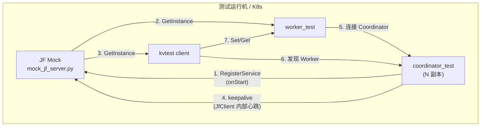

### A. 正常部署

#### UseCase1 -- Coordinator + JF hooks + 心跳

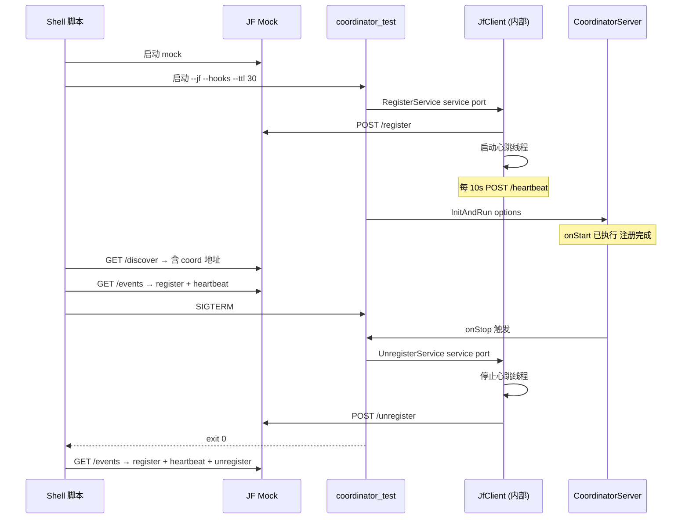

**场景**：Coordinator 启动时注册到 JF，周期心跳续租，停止时反注册。
**用户感知**：JF events 序列为 `register → heartbeat×N → unregister`。

### B. 故障场景

#### UseCase2 -- Coordinator 崩溃 + TTL 过期

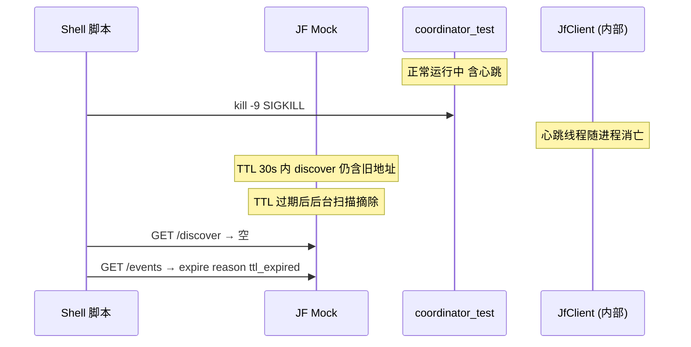

**场景**：Coordinator 被 kill -9 杀死，不触发 onStop。JF 在 TTL 过期后自动摘除。
**用户感知**：JF events 含 `expire` 事件（非 `unregister`）；`discover` 返回空。

#### UseCase3 -- Coordinator 重启恢复

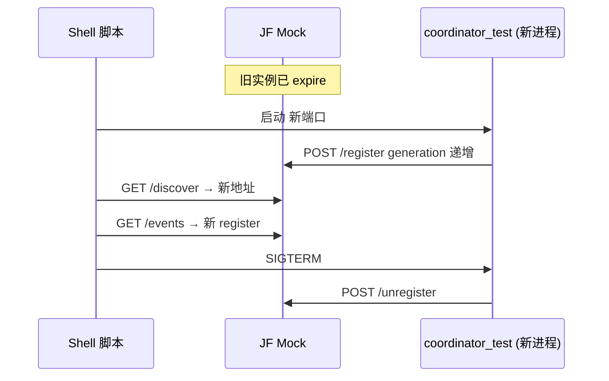

**场景**：旧 Coordinator 崩溃后，新 Coordinator 启动并注册到 JF。
**用户感知**：JF discover 返回新地址；events 含新的 register/unregister。

### C. 多副本场景

#### UseCase4 -- 3 副本 Coordinator 启动 + 选举

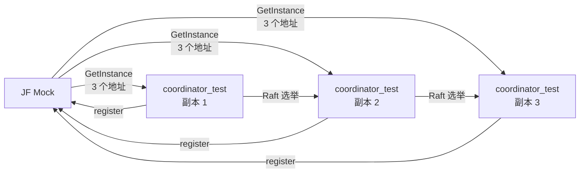

**场景**：3 个 Coordinator 实例各自注册到 JF，通过 JF 发现彼此，Raft 选主。
**用户感知**：JF discover 返回 3 个地址；日志显示 1 leader + 2 follower。

#### UseCase5 -- Leader 崩溃 + 重选 + TTL 过期

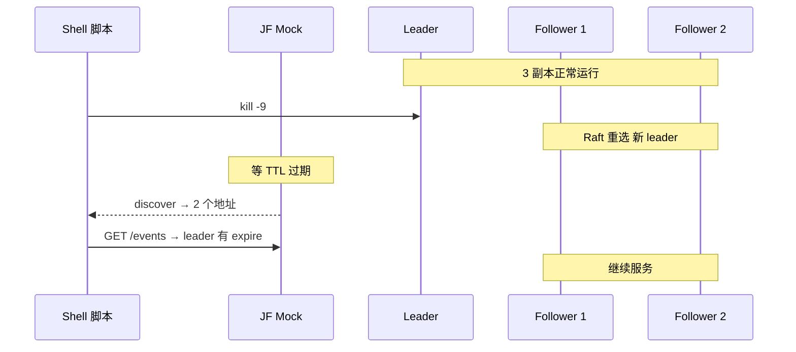

**场景**：Leader 被 kill -9，剩余副本重选新 leader，JF 在 TTL 后摘除旧 leader。
**用户感知**：新 leader 产生；JF discover 从 3 个变为 2 个；events 含旧 leader 的 expire。

#### UseCase6 -- 新增副本加入运行中集群

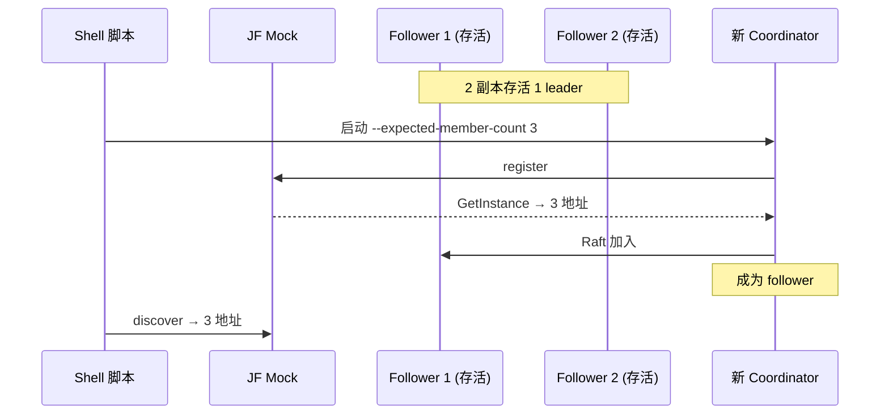

**场景**：集群运行中新增第 3 个副本，通过 JF 发现集群并加入。
**用户感知**：JF discover 从 2 个变为 3 个；新副本成为 follower。

### D. 端到端

#### UseCase7 -- Worker + 多副本 Coordinator + Client 全链路

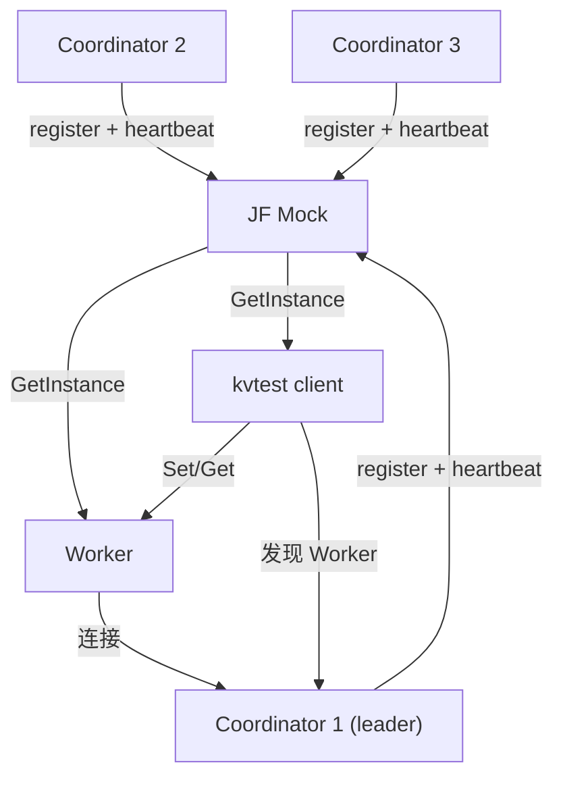

**场景**：3 副本 Coordinator + Worker + Client 全链路，含 leader 崩溃容灾验证。
**用户感知**：Set/Get 成功；leader 崩溃后 Set/Get 仍成功；恢复后 Set/Get 仍成功。

### UseCase 总表

| UseCase | 使用者 | 场景 | 需要什么 | 设计响应 | 验收 |
|---|---|---|---|---|---|
| UC1 | Shell 脚本 | Coordinator 注册+心跳+反注册 | JF mock + hooks | coordinator_test --jf --hooks | JF events 序列正确 |
| UC2 | Shell 脚本 | Coordinator 崩溃后 TTL 摘除 | JF mock + kill -9 | mock TTL 扫描线程 | discover 空 + expire 事件 |
| UC3 | Shell 脚本 | Coordinator 重启恢复 | JF mock + 新进程 | coordinator_test 新实例 | discover 返回新地址 |
| UC4 | Shell 脚本 | 3 副本启动+选举 | 3× coordinator_test + JF | --expected-member-count 3 | 1 leader + 2 follower |
| UC5 | Shell 脚本 | Leader 崩溃+重选+TTL | kill -9 leader | Raft 重选 + TTL 摘除 | 新 leader + discover 2 地址 |
| UC6 | Shell 脚本 | 新增副本加入集群 | 新 coordinator_test | JF discover + Raft 加入 | discover 3 地址 |
| UC7 | Shell 脚本 + kvtest | 全链路端到端 | 全部组件 | Set/Get 验证 + 容灾验证 | Set/Get 成功 + 崩溃后仍成功 |

---

## §4 方案设计

### 4.1 类图

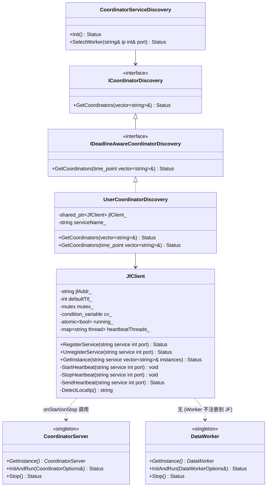

**类图说明**：
- `JfClient` 模拟 JF SDK 行为：应用层调 `RegisterService`/`UnregisterService`/`GetInstance`，内部自动管理心跳线程
- `UserCoordinatorDiscovery` 适配 `IDeadlineAwareCoordinatorDiscovery` 公开接口（含 deadline 重载），内部委托 `JfClient::GetInstance`
- `CoordinatorServer`/`DataWorker` 是 KVCache 公开 API（已存在），本模块不修改
- `CoordinatorServiceDiscovery`（已存在）通过 `coordinatorDiscovery` 字段注入 `UserCoordinatorDiscovery`

### 4.2 开发视图

```
tests/kvtest/
├── src/
│   ├── common/
│   │   └── jf_service_discovery.h     # [新建] JfClient + UserCoordinatorDiscovery (header-only)
│   ├── mock_jf_server.py               # [新建] JF 模拟服务 (Python)
│   ├── coordinator_main.cpp           # [新建] Coordinator 独立部署测试程序
│   ├── data_worker_main.cpp           # [新建] Worker 独立部署测试程序
│   ├── main.cpp                       # [修改] 新增 JF 发现分支
│   ├── common/config.h                # [修改] 新增 jfAddress/jfService 字段
│   ├── common/config.cpp              # [修改] 新增 JSON 解析
│   └── vendor/
│       ├── httplib.h                  # [复用] cpp-httplib 单头文件库
│       └── nlohmann_json.hpp          # [复用] JSON 解析
├── deploy_jf.py                        # [新建] JF mock pod 快速拉起/停止脚本
├── config/
│   └── (配置在 test_standalone_mode.sh 中内联生成)
├── tests/
│   └── test_standalone_mode.sh            # [新建] E2E shell 测试脚本
├── deploy_common.py                   # [修改] 新增 install_binary + standalone 启停 + marker
├── deploy_coordinator.py              # [修改] 新增 --standalone/--jf/--service/--ttl/--expected-member-count
├── deploy_worker.py                   # [修改] 新增 --standalone/--jf/--service
├── deploy_client.py                   # [修改] 新增 --jf/--service
├── CMakeLists.txt                     # [修改] 新增 coordinator_test/worker_test CMake 目标
├── BUILD.bazel                        # [修改] 新增 coordinator_test/worker_test Bazel 目标
├── build.sh                           # [修改] 新增 Bazel 编译命令
└── Makefile                           # [修改] package 包含新增产物
```

### 4.3 关键交互

#### 4.3.1 Coordinator 注册 + 心跳 + 反注册

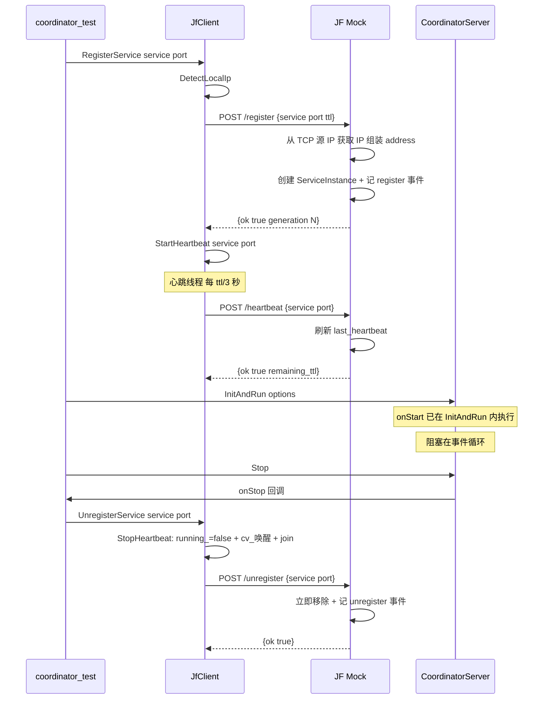

**错误码映射**：

| 场景 | JF mock 返回 | JfClient 行为 |
|---|---|---|
| 注册成功 | `{"ok":true,"generation":N}` | 返回 Status::OK() |
| 端口已被同 IP 注册 | `{"ok":false,"error":"port in use"}` | 返回 K_DUPLICATED |
| 心跳成功 | `{"ok":true,"ttl":30,"remaining_ttl":30}` | 返回 Status::OK() |
| 心跳时实例已过期 | `{"ok":false,"error":"not found or expired"}` | 打 warning 日志 继续重试 |
| 反注册成功 | `{"ok":true}` | 返回 Status::OK() |
| 反注册时实例不存在 | `{"ok":false,"error":"not found"}` | 返回 Status::OK()（幂等） |

#### 4.3.2 Coordinator 崩溃 + TTL 过期

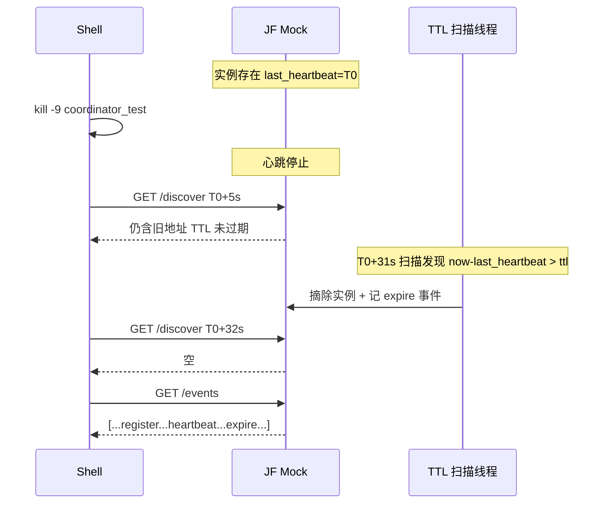

#### 4.3.3 Worker 从 JF 发现 Coordinator

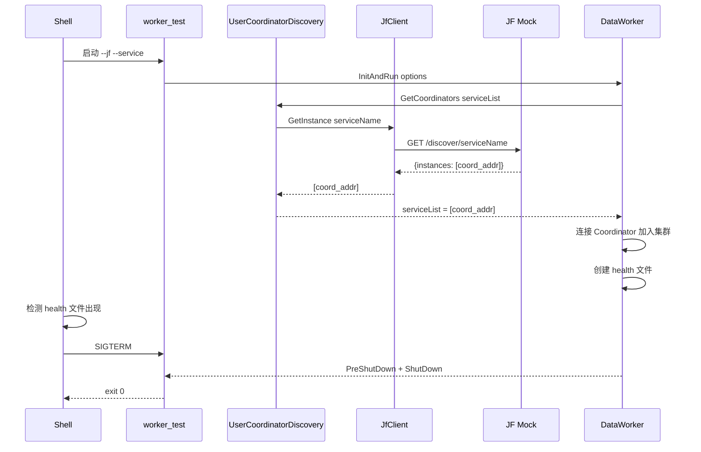

#### 4.3.4 多副本选举

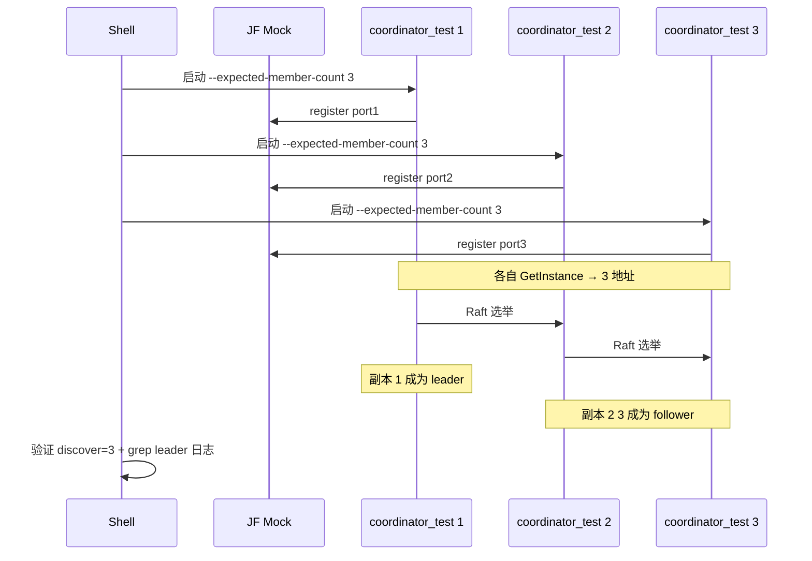

### 4.4 模块依赖图

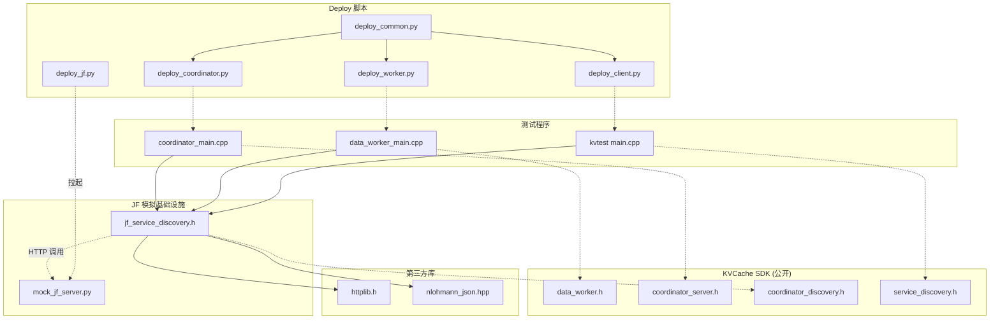

### 4.5 关键数据结构

#### 4.5.1 mock_jf_server.py 数据模型

```python
@dataclass
class ServiceInstance:
    ip: str               # 从 TCP 源 IP 获取
    port: int             # 从请求体获取
    ttl_seconds: float    # 30 (默认)
    last_heartbeat: float # time.time()
    generation: int       # 同 IP+port 重启递增

    @property
    def address(self) -> str:
        return f"{self.ip}:{self.port}"

@dataclass
class JfEvent:
    service: str
    address: str
    action: str            # register | heartbeat | unregister | expire
    ts: float
    reason: str            # "" | "ttl_expired(30s)" | ...

class JFRegistry:
    _services: dict[str, list[ServiceInstance]]
    _events: list[JfEvent]
    _lock: threading.Lock
    _ttl_sweeper: threading.Thread    # 后台扫描 每 1s
```

**并发安全**：`_lock` 保护所有读写操作。TTL 扫描线程在锁内执行摘除。

#### 4.5.2 JfClient 内部状态

```cpp
class JfClient {
    std::string jfAddr_;                        // "127.0.0.1:9999"
    int defaultTtl_;                             // 30
    std::mutex mutex_;
    std::condition_variable cv_;                // 心跳线程唤醒
    std::atomic<bool> running_{true};
    // key: "service:ip:port" → 心跳线程
    std::map<std::string, std::thread> heartbeatThreads_;
};
```

**并发安全**：`mutex_` + `cv_` 管理心跳线程生命周期。`UnregisterService` 设置 `running_ = false` 并用 `cv_` 唤醒心跳线程立即退出（不等 sleep 超时）。

### 4.6 组件接口设计

#### 4.6.1 JfClient 公开 API

| 方法 | 签名 | 行为 |
|---|---|---|
| `RegisterService` | `Status RegisterService(const string &service, int port)` | POST /register，启动心跳线程 |
| `UnregisterService` | `Status UnregisterService(const string &service, int port)` | 停止心跳线程，POST /unregister |
| `GetInstance` | `Status GetInstance(const string &service, vector<string> &instances)` | GET /discover/:name |
| 构造 | `JfClient(const string &jfAddr, int defaultTtl = 30)` | -- |
| 析构 | `~JfClient()` | 停止所有心跳线程 |

#### 4.6.2 mock_jf_server.py HTTP API

| 方法 | 路径 | 请求体 | 响应 |
|---|---|---|---|
| POST | `/register` | `{"service":"...","port":31501,"ttl":30}` | `{"ok":true,"generation":1}` |
| POST | `/heartbeat` | `{"service":"...","port":31501}` | `{"ok":true,"ttl":30,"remaining_ttl":30}` |
| POST | `/unregister` | `{"service":"...","port":31501}` | `{"ok":true}` |
| GET | `/discover/:name` | -- | `{"instances":["10.0.0.1:31501"]}` |
| GET | `/events` | -- | `[{"service":"...","address":"...","action":"register","ts":...,"reason":""}]` |

#### 4.6.3 deploy 脚本新增参数

| 脚本 | 新增参数 | 说明 |
|---|---|---|
| `deploy_coordinator.py` | `--standalone` | 切换 standalone 模式 |
| | `--jf ADDR` | JF mock 地址 |
| | `--service NAME` | JF 服务名 (默认 `kvcache_coordinator`) |
| | `--ttl SECONDS` | 心跳 TTL (默认 30) |
| | `--expected-member-count N` | Raft 成员数 (默认 1) |
| `deploy_worker.py` | `--standalone` | 切换 standalone 模式 |
| | `--jf ADDR` | JF mock 地址 |
| | `--service NAME` | JF 服务名 |
| `deploy_client.py` | `--jf-address ADDR` | JF mock 地址 (无 `--standalone`，`--jf-address` 即 JF 模式) |
| | `--jf-service NAME` | JF 服务名 |

#### 4.6.4 coordinator_test 命令行

```
coordinator_test --config <path> --coordinator <host:port> \
  [--jf <addr>] [--service <name>] [--hooks] [--ttl <sec>] [--expected-member-count <N>]
```

> **standalone 模式多副本 peers 注入**：`deploy_coordinator.py --standalone start` 在多 pod 场景下自动调用 `_inject_raft_initial_peers` 注入 `coordinator_raft_initial_peers`（与 dscli 模式行为一致），使多副本 Coordinator 能运行静态 peers Raft 选举。

#### 4.6.5 worker_test 命令行

```
worker_test --config <path> [--jf <addr>] [--service <name>]
```

> **注意**：`worker_test` 在调用 `InitAndRun(options)` 前必须先调 `SetVersionString(DATASYSTEM_VERSION)` + `ParseCommandLineFlags`（用 `argv[0]` 初始化 `programName`），否则 Worker 日志初始化会 CHECK 失败（`programName` 为 "UNKNOWN"）。这是 `InitAndRun(options)` 路径的已知约束----`InitAndRun(argc, argv)` 路径内部调了 `ParseCommandLineFlags`，但 `options` 路径没有。

#### 4.6.6 JF mock pod 部署接口

JF mock 运行在独立 pod 中，需在所有 Coordinator/Worker/Client 启动前拉起，全部停止后销毁。`deploy_jf.py` 提供快速拉起/停止/检查接口：

```python
# deploy_jf.py -- JF mock pod 生命周期管理
# 复用 deploy_common.py 的 kubectl 传输层
```

| 命令 | 参数 | 行为 | 返回 |
|---|---|---|---|
| `start` | `--port 9999` `--ttl-default 30` `--namespace default` `--prefix jf-pod` | 创建/复用 pod，拷贝 `mock_jf_server.py`，`--background --log` 启动（端口先绑定后 fork，父进程打印 PID 退出） | JF 地址 `pod_ip:9999` |
| `stop` | `--namespace` `--prefix` | `pkill -f mock_jf_server`，等待退出 | exit code |
| `check` | `--namespace` `--prefix` | `pgrep -f mock_jf_server` | 存活/不存活 |
| `clean` | `--namespace` `--prefix` `--remote-dir /tmp/jf_mock` | kill + `rm -rf {remote_dir}` | -- |
| `collect` | `--namespace` `--prefix` `--remote-dir /tmp/jf_mock` `-o collected_jf_logs` | `ls -d {remote_dir}` 存在性门控 → `ls *.log *.txt` → `base64` 每个文件到 `{output}/{pod}/`；目录不存在静默跳过 | exit code |

> **jf_mock 日志可定位性**：`mock_jf_server.py` 在每个接口调用（register/heartbeat/unregister/discover/events/health/404）和 TTL 过期时通过 `_log` 写一行 `[ISO8601] <msg>` 到 stdout；`--background` 模式下 `_daemonize` 把 stdout 重定向到 `--log` 指定的 `jf_mock.log`，所以 `collect` 能把每次请求的审计行拉回本地排查。日志在 registry 锁外打印（`_remove_expired_locked` 返回过期列表，调用方在锁外 `_log`），保证 locked section 紧凑。

**快速拉起流程**：

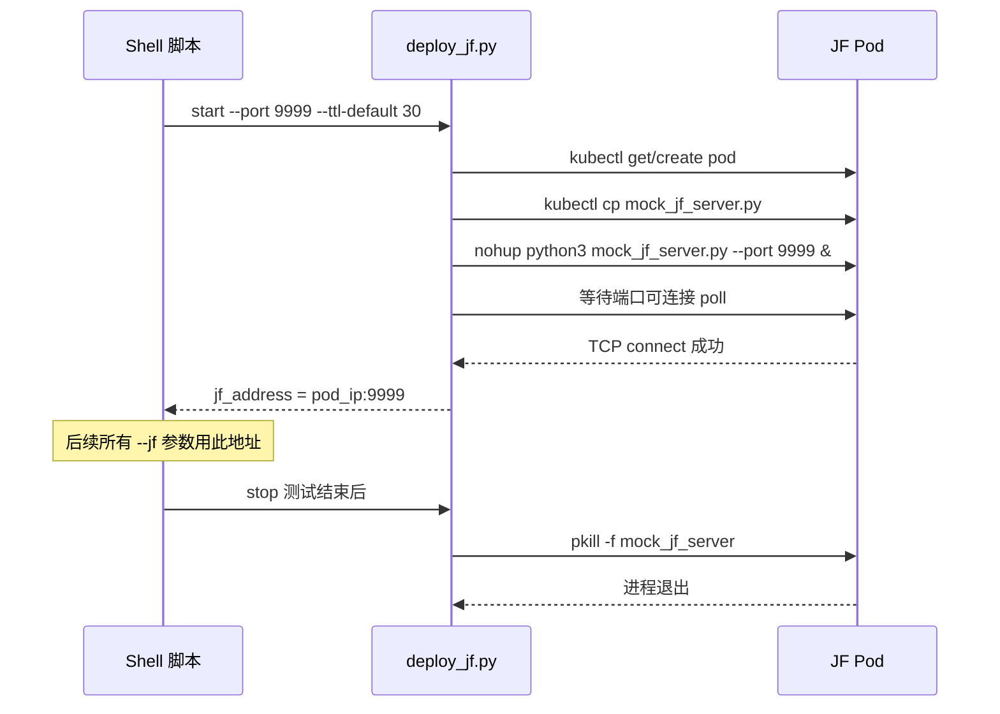

**设计要点**：
- 复用 `deploy_common.py` 的 kubectl 传输、pod 查找逻辑，不重复实现
- `start` 命令内部做就绪检测（poll TCP 连接），返回时保证 JF mock 已可服务
- `--port` 默认 9999，`--ttl-default` 默认 30（与 coordinator_test `--ttl` 默认值一致）
- pod 内 `mock_jf_server.py` 以 `nohup` 运行，stdout/stderr 重定向到 pod 内日志文件

## §5 对外接口

### 5.1 测试程序接口

| 接口 | 调用方 | 频率 | 说明 |
|---|---|---|---|
| `coordinator_test --config ...` | Shell/deploy 脚本 | 每次测试 | 阻塞至 SIGTERM |
| `worker_test --config ...` | Shell/deploy 脚本 | 每次测试 | 阻塞至 SIGTERM |
| `mock_jf_server.py --port ...` | deploy_jf.py | 每次测试 | JF 模拟服务 |
| `deploy_jf.py start --port ...` | Shell 脚本 | 每次测试 | 返回 JF 地址 |
| `GET /discover/:name` | JfClient | Worker/Client 启动时 | 返回在线实例 |
| `GET /events` | Shell 脚本 | 验证阶段 | 事件日志 |

### 5.2 部署参数

| 参数名 | 类型 | 默认值 | 说明 |
|---|---|---|---|
| `--standalone` | flag | false | deploy 脚本切换 standalone 模式 |
| `--jf` | string | "" | JF mock 地址 |
| `--service` | string | `kvcache_coordinator` | JF 服务名 |
| `--ttl` | int | 30 | 心跳 TTL 秒数 (仅 coordinator) |
| `--expected-member-count` | int | 1 | Raft 成员数 (仅 coordinator) |

### 5.3 环境变量

| 变量 | 默认值 | 说明 |
|---|---|---|
| `POD_IP` | -- | K8s pod IP，`JfClient::DetectLocalIp` 优先读取 |
| `HOST_IP` | -- | 备选 IP 环境变量 |
| `LD_LIBRARY_PATH` | -- | 运行时需包含 `cpp/lib/` |

### 5.4 kvtest config 新增字段

| 字段 | 类型 | 说明 |
|---|---|---|
| `jf_address` | string | JF mock 地址 (`"127.0.0.1:9999"`) |
| `jf_service` | string | JF 服务名 (`"kvcache_coordinator"`) |

---

## §6 约束 + 风险

### 约束

| # | 约束 | 违规后果 |
|---|---|---|
| 1 | `JfClient` 心跳线程必须在 `UnregisterService` 时用 `condition_variable` 唤醒退出，不能靠 `sleep_for` 超时 | 测试清理阶段每次多等 10s，CI 时间浪费 |
| 2 | mock server 的 `register`/`unregister`/`heartbeat` 用 TCP 源 IP 匹配实例，不能用请求体中的 IP | 与真实 JF SDK 行为不一致，K8s 多 pod 场景 IP 混乱 |
| 3 | whl 包和独立二进制可共存，无需互斥 | 无约束 |
| 4 | 测试程序支持 Bazel 源码集成和 CMake SDK 两种编译方式。Bazel 模式直接依赖 cc_library；CMake 模式 pod 内安装 whl 包后 lib 目录含全部 .so（KVCache + 三方件静态链入），kvtest 链接 SDK 即可 | -- |
| 5 | Worker 的 `GetCoordinators` 只在启动时调一次，不自动刷新（代码层设计约束） | Coordinator 崩溃后 Worker 不会自动重新 discover，需重启 Worker 才能恢复 |
| 6 | `CoordinatorServer::GetInstance()` 是进程级单例，同进程只能启动一次 | TC4/TC7 的"重启"是新进程，不是同进程重试 |
| 7 | mock TTL 扫描线程每 1s 扫一次，`discover` 调用时也做即时过期检查 | 不满足此约束则过期实例可能在 discover 结果中残留 |

### 风险

| # | 风险 | 缓解 |
|---|---|---|
| 1 | TTL=30s 导致 TC4/TC7 每次 32s 等待，CI 慢 | 可接受：用户要求 `--ttl 30` 更接近生产；后续可用 `--ttl` 参数调短 |
| 2 | `DetectLocalIp` 在复杂网络环境获取错误 IP | 优先级 `POD_IP` > `HOST_IP` > `hostname` 解析 > `127.0.0.1`；K8s 中 `POD_IP` 由 deploy 脚本注入 |
| 3 | kvtest vendor 的 `httplib.h` 版本不支持某些 HTTP 特性 | httplib.h 已在 kvtest 中验证可用；mock server 只用简单 POST/GET |
| 4 | deploy 脚本 `--standalone` 模式和 dscli 模式参数混淆 | standalone 专属参数（`--jf`/`--ttl`/`--expected-member-count`）在非 standalone 模式下忽略并 warning |
| 5 | 多副本选举超时不可控（Raft 内部时序） | shell 脚本 poll 超时设 30s，足够覆盖 `kElectionTimeoutMs=300` × 多轮 |

---

## §7 落地步骤

| PR | 内容 | 阶段 |
|---|---|---|
| 1 | `tests/kvtest/src/common/jf_service_discovery.h`：JfClient + UserCoordinatorDiscovery | P1 |
| 2 | `tests/kvtest/src/mock_jf_server.py`：JF 模拟服务 | P1 |
| 3 | `tests/kvtest/src/coordinator_main.cpp`：Coordinator 测试程序 | P1 |
| 4 | `tests/kvtest/src/data_worker_main.cpp`：Worker 测试程序 | P1 |
| 5 | `tests/kvtest/BUILD.bazel` + `build.sh` + `Makefile`：新增 Bazel 构建目标 | P1 |
| 6 | `tests/kvtest/src/main.cpp` + `config.h/cpp`：kvtest JF 发现分支 | P1 |
| 7 | `tests/kvtest/tests/test_standalone_mode.sh`：TC1-TC8 shell 脚本（含内联配置生成） | P1 |
| 8 | `tests/kvtest/deploy_jf.py`：JF mock pod 快速拉起/停止 | P1 |
| 9 | `tests/kvtest/deploy_common.py`：install_binary + standalone 启停 + marker | P2 |
| 10 | `tests/kvtest/deploy_coordinator.py`：`--standalone` 等参数 | P2 |
| 11 | `tests/kvtest/deploy_worker.py`：`--standalone` 等参数 | P2 |
| 12 | `tests/kvtest/deploy_client.py`：`--jf`/`--service` 参数 | P2 |
| 13 | `test_standalone_mode.sh` 维护：TC5-TC8 多副本 + 端到端场景 | P3 |

---

## §8 测试方案

### 8.1 E2E 测试用例

| TC | 对应 UseCase | 场景 | 断言 |
|---|---|---|---|
| TC1 | UC1 | Coordinator + JF hooks + 心跳 | JF events: register→heartbeat×N→unregister；exit=0 |
| TC2 | UC1 | Worker 从 JF 发现 Coordinator | health 文件出现；exit=0 after SIGTERM |
| TC3 | UC2 | Coordinator 崩溃 + TTL 过期 | discover→空 after 32s；events 含 expire（非 unregister） |
| TC4 | UC3 | Coordinator 重启恢复 | discover 返回新地址；events 含新 register+unregister |
| TC5 | UC4 | 3 副本启动 + 选举 | discover=3 地址；grep "become leader" 匹配 1 个；exit=0×3 |
| TC6 | UC5 | Leader 崩溃 + 重选 + TTL | 剩余副本 grep 新 leader；discover→2 地址 after TTL；events 含 expire |
| TC7 | UC6 | 新增副本加入集群 | discover→3 地址；新副本 grep "follower"；exit=0×3 |
| TC8 | UC7 | 全链路端到端 | Set/Get 成功；leader 崩溃后 Set/Get 仍成功；恢复后仍成功 |

### 8.2 验证点矩阵

| 验证项 | 方法 | 适用 TC |
|---|---|---|
| 进程正常退出 | `wait $PID; echo $?` | TC1-TC8 |
| Coordinator 端口可连接 | `python3 -c "socket.connect()"` | TC1-TC8 |
| Worker health 文件 | `[ -f $HEALTH_PATH ]` | TC2, TC8 |
| JF 注册验证 | `curl /discover` 包含地址 | TC1-TC8 |
| JF 事件序列验证 | `curl /events` 按序匹配 | TC1, TC3-TC6 |
| JF TTL 过期验证 | `curl /discover` 返回空 after TTL | TC3, TC6 |
| Leader 选举验证 | pod 内 `grep "become leader"` | TC5-TC8 |
| Follower 加入验证 | pod 内 `grep "follower"` 或 `grep "join"` | TC7 |
| Set/Get 反向验证 | kvtest client Set+Get 成功 | TC8 |
| 容灾验证 | leader 崩溃后 Set/Get 仍成功 | TC8 |
