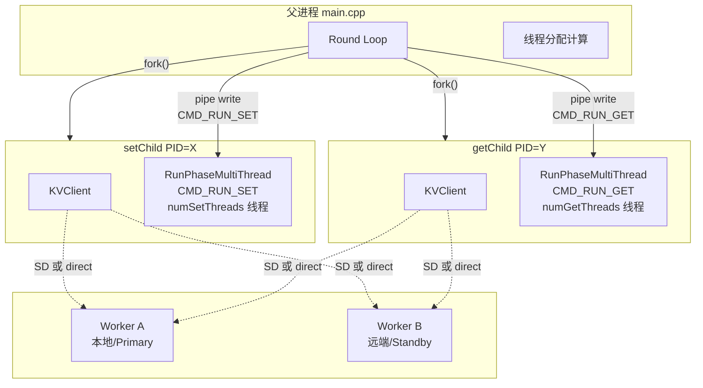
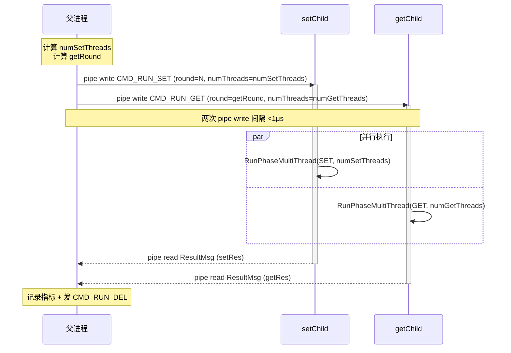
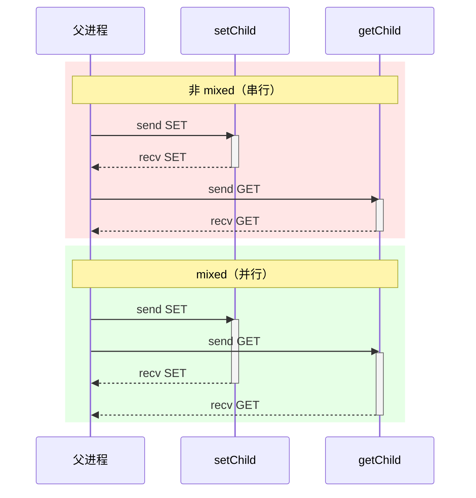
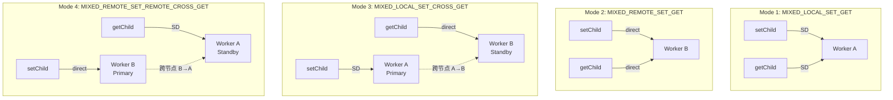
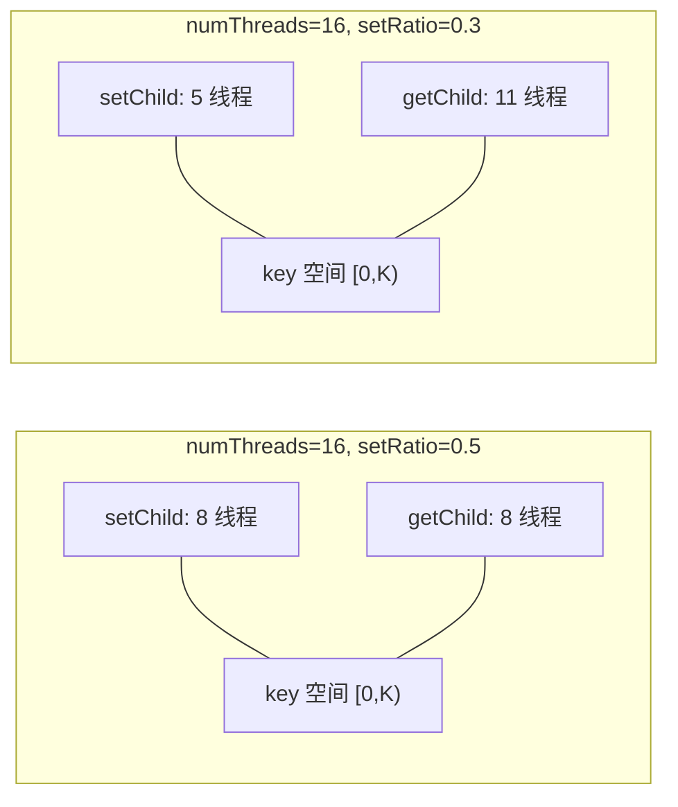
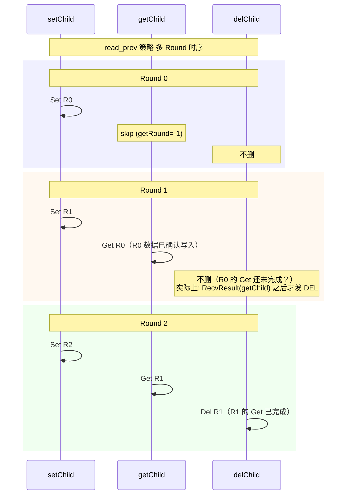
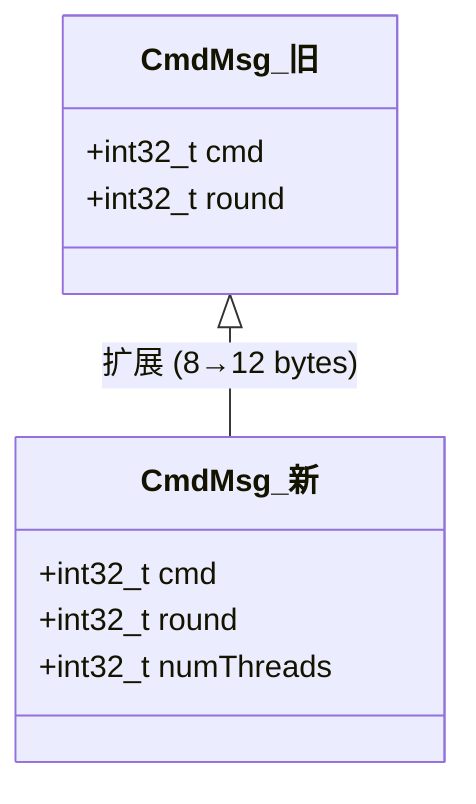
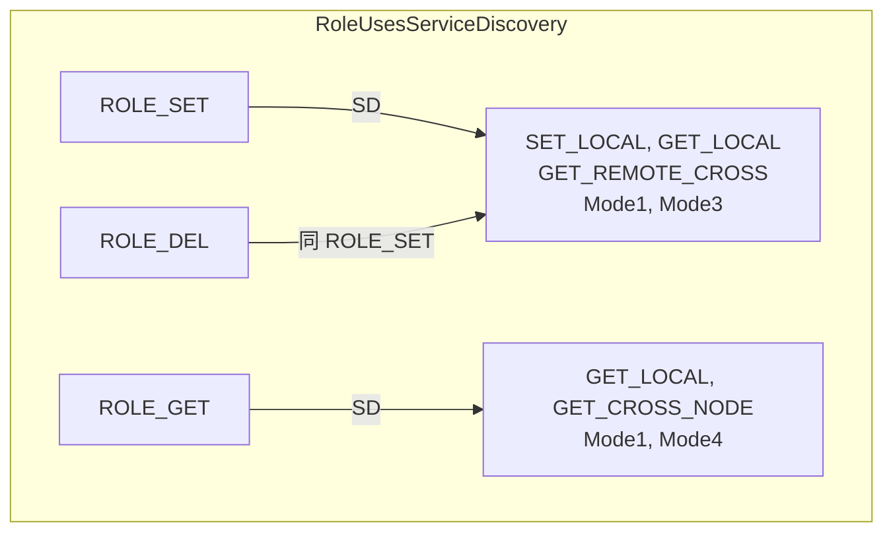
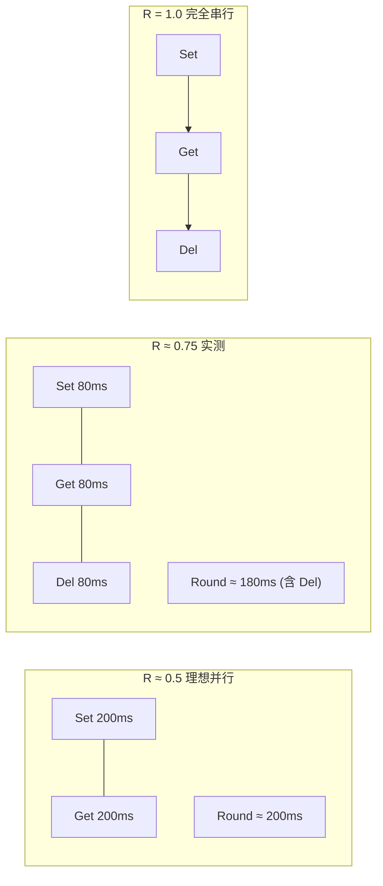

# Mixed Modes 混合读写 Benchmark 设计

> 关联：[benchmark-guide.md](benchmark-guide.md) | PR #1090

Mixed 模式用于在 benchmark 中同时执行 Set 和 Get 操作，测量并发读写场景下的吞吐与延迟。4 种模式覆盖不同的客户端-Worker 拓扑。

## 1. 架构：双子进程并发模型

Mixed 模式采用 **双 child 进程** 架构——fork 出独立的 setChild 和 getChild，各自持有独立的 KVClient，通过 OS 级进程并发实现真正的 Set/Get 并行。



**单 Round 父进程调度时序：**



**与非 mixed 模式的对比：**



## 2. 四种模式

| 序号 | 枚举 | 字符串 | 含义 |
|------|------|--------|------|
| 1 | `MIXED_LOCAL_SET_GET` | `mixed_local_set_get` | 本地读写，均通过 SD |
| 2 | `MIXED_REMOTE_SET_GET` | `mixed_remote_set_get` | 远端读写，均直连 remoteWorker |
| 3 | `MIXED_LOCAL_SET_CROSS_GET` | `mixed_local_set_cross_get` | 本地写 + 跨节点读 |
| 4 | `MIXED_REMOTE_SET_REMOTE_CROSS_GET` | `mixed_remote_set_remote_cross_get` | 远端写 + 远端跨节点读 |

### 连接矩阵



| 模式 | setChild 连接 | getChild 连接 | 数据流 | 等同现有模式 |
|------|-------------|-------------|--------|------------|
| Mode 1 | SD → Worker A | SD → Worker A | 无 | （新） |
| Mode 2 | direct → Worker B | direct → Worker B | 无 | （新） |
| Mode 3 | SD → Worker A | direct → Worker B | A→B | `GET_REMOTE_CROSS` |
| Mode 4 | direct → Worker B | SD → Worker A | B→A | `GET_CROSS_NODE` |

**「cross」的本质** = set 和 get 打到不同 Worker，自然触发跨节点数据流。不需要新增配置项，复用现有 `remoteWorker` + `etcdAddress`。

## 3. 读写比例与线程分配

```cpp
numSetThreads = max(1, round(setRatio * numThreads));
numGetThreads = numThreads - numSetThreads;
```

- `set_ratio` ∈ (0.0, 1.0) 开区间，端点拒绝（避免退化为纯 set/get）
- **比例是线程分配比例，不是 QPS 比例**——实际 QPS 受 Set/Get 单次延迟影响



| setRatio | numSetThreads | numGetThreads | 特征 |
|----------|:---:|:---:|------|
| 0.3 | 5 | 11 | Get 线程多，Get 完成更快 |
| 0.5 | 8 | 8 | 对称并行 |
| 0.7 | 11 | 5 | Set 线程多，Set 完成更快 |

两个子进程各自通过 `ThreadKeyRange(keysPerRound, numThreads, threadId)` 分区 key 空间 [0, keysPerRound-1]。线程数不同时 key 分区粒度不同，但覆盖范围始终一致。

## 4. 三种 Key 策略

| 策略 | 配置值 | setChild round | getChild round | 行为 |
|------|--------|:---:|:---:|------|
| `same_keys` | `"same_keys"` | N | N | 同轮读写，存在 race |
| `read_prev` | `"read_prev"` | N | N-1 | get 读上一轮已确认数据（N=0 时 skip） |
| `independent` | `"independent"` | N (N≥1) | 0 | get 始终读预填充数据，读写互不干扰 |

**默认值：** `same_keys`（`config.h:91`）。



父进程先 `RecvResult(setChild)` 和 `RecvResult(getChild)`，等两个 child 都完成后才发 `CMD_RUN_DEL`，保证无竞争。

`independent` 策略不兼容 `cleanup_method=ttl`，因为预填充数据可能在 benchmark 运行期间过期。

## 5. IPC 协议变更



`numThreads` 语义：0 表示使用 `cfg.numThreads`（非 mixed 模式向后兼容），mixed 模式分别传 `numSetThreads`/`numGetThreads`。

**删除项：** `CMD_RUN_MIXED`、`MixedParams`、`SendMixedCommand()`、`ChildProcessMain` 中 `CMD_RUN_MIXED` 分支、`MixedPhaseResult`、`RunMixedPhase()`。

**保留项：** `GetRoundForGet()` — 上移到 main.cpp 父进程调用。

## 6. 连接路由



Mode 2 的 ROLE_SET 和 ROLE_GET 都不在 SD 列表中 → 两者都用 direct。Mode 3 的 ROLE_GET 不在 SD 列表 → getChild 用 direct。

```cpp
bool NeedsSeparateGetChild(TestMode mode) {
    return mode == GET_CROSS_NODE || mode == GET_REMOTE_CROSS || IsMixedMode(mode);
}

bool NeedsRemoteWorker(TestMode mode) {
    // 新增: MIXED_REMOTE_SET_GET, MIXED_LOCAL_SET_CROSS_GET,
    //       MIXED_REMOTE_SET_REMOTE_CROSS_GET
    // 排除: MIXED_LOCAL_SET_GET (两个 child 都用 SD)
}
```

## 7. 并发比 R 验证

定义 `R = T_round / (T_set_only + T_get_only)`。



- R ≈ 0.5：完全对称并行（setTime ≈ getTime）
- 0.5 < R < 0.8：非对称并行（一方线程多、完成快）
- R ≥ 0.9：无显著并行效果

实测（ARM aarch64，setRatio=0.5）：R ≈ 0.75。R 未达理论 0.5 是因为 round 时间还包含串行执行的 Del 阶段，纯 Set/Get 重叠部分的并发比接近 0.5。

## 8. 配置示例

```json
{
    "test_mode": "mixed_local_set_get",
    "set_ratio": 0.5,
    "mixed_key_strategy": "read_prev",
    "num_threads": 16,
    "worker_memory_mb": 512,
    "data_sizes": ["1MB"],
    "duration_seconds": 30,
    "remote_worker": { "host": "192.168.1.100", "port": 31501 }
}
```
